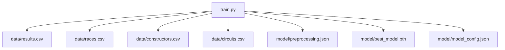
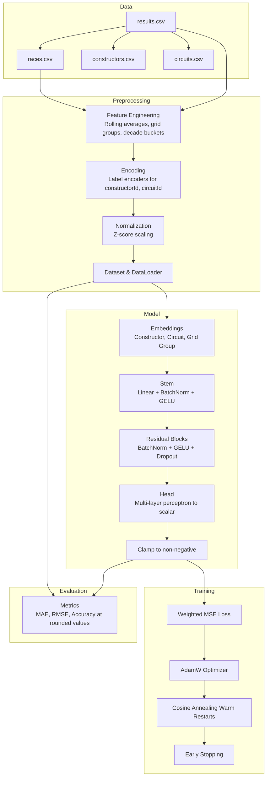
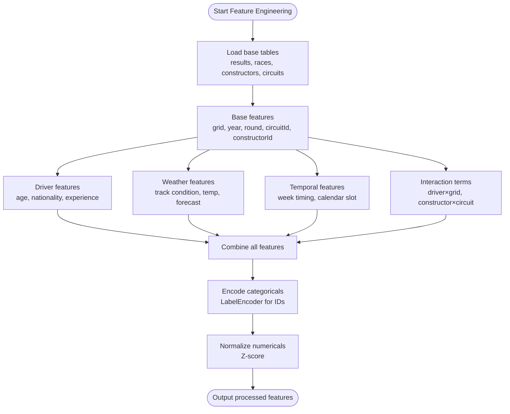
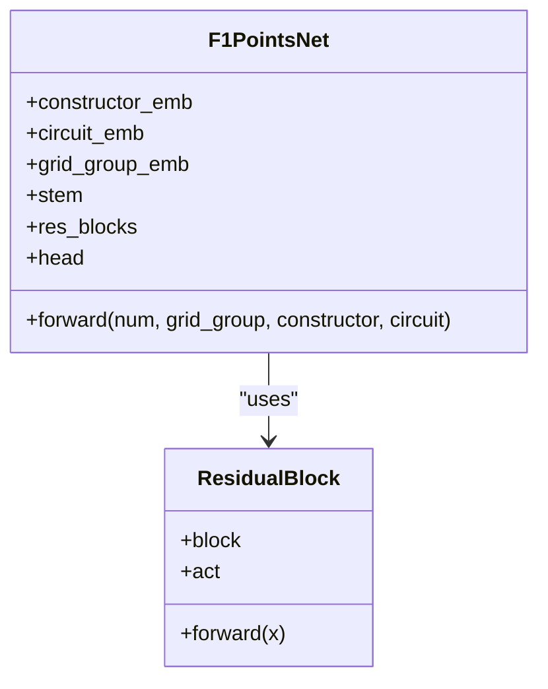
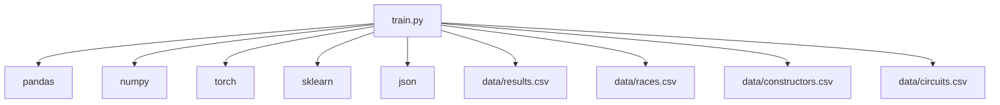

# Advanced Topics

<cite>
**Referenced Files in This Document**
- [train.py](file://train.py)
- [preprocessing.json](file://model/preprocessing.json)
- [results.csv](file://data/results.csv)
- [qualifying.csv](file://data/qualifying.csv)
- [drivers.csv](file://data/drivers.csv)
- [pit_stops.csv](file://data/pit_stops.csv)
- [races.csv](file://data/races.csv)
</cite>

## Table of Contents
1. [Introduction](#introduction)
2. [Project Structure](#project-structure)
3. [Core Components](#core-components)
4. [Architecture Overview](#architecture-overview)
5. [Detailed Component Analysis](#detailed-component-analysis)
6. [Dependency Analysis](#dependency-analysis)
7. [Performance Considerations](#performance-considerations)
8. [Troubleshooting Guide](#troubleshooting-guide)
9. [Conclusion](#conclusion)
10. [Appendices](#appendices)

## Introduction
This document presents advanced topics for F1 points prediction, building on the existing training pipeline. It focuses on enhancement opportunities for feature engineering, model architecture, training strategies, evaluation, and operational deployment. The goal is to guide practitioners toward improved accuracy, robustness, and scalability while maintaining interpretability and practical applicability.

## Project Structure
The repository centers around a single training script that loads, transforms, and trains a neural network model, along with a small set of F1 data tables. The training script encapsulates:
- Data loading and merging
- Feature engineering and encoding
- Dataset construction and batching
- Model definition and training loop
- Evaluation and artifact saving

**Diagram sources**
- [train.py:19-22](file://train.py#L19-L22)
- [train.py:118-119](file://train.py#L118-L119)
- [train.py:304](file://train.py#L304)
- [train.py:387-388](file://train.py#L387-L388)

**Section sources**
- [train.py:19-22](file://train.py#L19-L22)
- [train.py:118-119](file://train.py#L118-L119)
- [train.py:304](file://train.py#L304)
- [train.py:387-388](file://train.py#L387-L388)

## Core Components
- Data ingestion and merging: Results are merged with race metadata to obtain year, round, and circuit identifiers.
- Feature engineering: Rolling averages per constructor and per circuit, grid grouping, and decade bucketing.
- Encoding and normalization: Label encoders for categorical IDs and z-score normalization for numerical features.
- Dataset and dataloader: A custom dataset aggregates numerical, categorical, and group features with per-sample weights.
- Model: An embedding-based feedforward network with residual blocks and a head for regression.
- Training: Weighted loss, cosine annealing with warm restarts, and early stopping.
- Evaluation: Metrics on raw predictions and rounded predictions to nearest valid F1 point values.

Key implementation references:
- Data load and merge: [train.py:19-25](file://train.py#L19-L25)
- Feature engineering: [train.py:48-84](file://train.py#L48-L84)
- Encoding and normalization: [train.py:89-107](file://train.py#L89-L107)
- Dataset and loader: [train.py:127-158](file://train.py#L127-L158)
- Model definition: [train.py:180-225](file://train.py#L180-L225)
- Training loop: [train.py:254-313](file://train.py#L254-L313)
- Evaluation: [train.py:322-378](file://train.py#L322-L378)

**Section sources**
- [train.py:19-25](file://train.py#L19-L25)
- [train.py:48-84](file://train.py#L48-L84)
- [train.py:89-107](file://train.py#L89-L107)
- [train.py:127-158](file://train.py#L127-L158)
- [train.py:180-225](file://train.py#L180-L225)
- [train.py:254-313](file://train.py#L254-L313)
- [train.py:322-378](file://train.py#L322-L378)

## Architecture Overview
The end-to-end pipeline integrates data preparation, model training, and evaluation. The model consumes normalized numerical features, categorical embeddings, and a grid group embedding, then predicts points with clamping to non-negative values.

**Diagram sources**
- [train.py:19-25](file://train.py#L19-L25)
- [train.py:48-84](file://train.py#L48-L84)
- [train.py:89-107](file://train.py#L89-L107)
- [train.py:127-158](file://train.py#L127-L158)
- [train.py:180-225](file://train.py#L180-L225)
- [train.py:238-242](file://train.py#L238-L242)
- [train.py:254-313](file://train.py#L254-L313)
- [train.py:322-378](file://train.py#L322-L378)

## Detailed Component Analysis

### Feature Engineering Enhancements
Current features include constructor and circuit rolling averages, grid position grouping, and a decade bucket. Recommended additions:
- Driver-level features: Driver age, nationality, experience, recent form, and qualifying position.
- Weather-related features: Track condition (dry/wet), temperature, and forecast proxies if available.
- Temporal features: Race week timing, calendar slot (opening/closing), and season trends.
- Interaction terms: Constructor×circuit, driver×grid, and grid×circuit combinations.
- Dynamic features: Recent head-to-head performance, team mate effect, and tire strategy indicators.

Implementation anchors:
- Rolling averages and grouping: [train.py:48-84](file://train.py#L48-L84)
- Driver candidate data: [drivers.csv:1-200](file://data/drivers.csv#L1-L200)
- Qualifying data for grid quality: [qualifying.csv:1-200](file://data/qualifying.csv#L1-L200)

**Diagram sources**
- [train.py:48-84](file://train.py#L48-L84)
- [drivers.csv:1-200](file://data/drivers.csv#L1-L200)
- [qualifying.csv:1-200](file://data/qualifying.csv#L1-L200)

**Section sources**
- [train.py:48-84](file://train.py#L48-L84)
- [drivers.csv:1-200](file://data/drivers.csv#L1-L200)
- [qualifying.csv:1-200](file://data/qualifying.csv#L1-L200)

### Model Architecture Modifications
Current model uses embeddings for constructor, circuit, and grid group, concatenated with normalized numerical features, passed through residual blocks and a head. Enhancement ideas:
- Alternative architectures: Transformer-style attention over driver-team-circuit interactions, Graph Neural Networks leveraging team and car hierarchies, or temporal models for multi-race sequences.
- Deeper residual stacks or wider stems for increased capacity.
- Multi-task heads: Predict finishing position and points simultaneously.
- Quantization-aware heads for discrete point outcomes aligned with F1 scoring.

**Diagram sources**
- [train.py:180-225](file://train.py#L180-L225)
- [train.py:163-177](file://train.py#L163-L177)

**Section sources**
- [train.py:180-225](file://train.py#L180-L225)
- [train.py:163-177](file://train.py#L163-L177)

### Ensemble Methods
Combine multiple models trained with different seeds, data splits, or architectures:
- Voting: Average predictions from several runs.
- Stacking: Train a meta-learner on out-of-fold predictions.
- Uncertainty-aware ensembles: Use dropout sampling or Bayesian layers to estimate predictive uncertainty.

[No sources needed since this section provides general guidance]

### Hyperparameter Tuning Strategies
- Search space: Learning rate, embedding dimension, stem width, residual depth, dropout rates, batch size, and optimizer weight decay.
- Methods: Random search, Bayesian optimization, or population-based training.
- Metrics: Validation MAE/RMSE with early stopping; consider quantized metrics (rounded predictions) for point accuracy.

[No sources needed since this section provides general guidance]

### Cross-Validation Approaches
- Time-aware CV: Split by year or season to avoid leakage.
- Group CV: Stratified by constructor or circuit to assess generalization.
- Roll-forward validation: Sequential races to emulate online learning.

[No sources needed since this section provides general guidance]

### Advanced Optimization Techniques
- Gradient clipping and norm-based stabilization.
- Mixed precision training to reduce memory footprint.
- Gradient accumulation for larger effective batch sizes.
- Warmup schedules and restarts for stable convergence.

**Section sources**
- [train.py:270](file://train.py#L270)
- [train.py:241-242](file://train.py#L241-L242)

### Real-Time Prediction Scenarios
- Online inference: Serve the trained model with preprocessed inputs (normalized numericals, encoded categories).
- Streaming updates: Periodically re-score recent races with new results to refine estimates.
- Edge-friendly deployments: Quantize or prune the model for latency-sensitive environments.

Operational anchors:
- Preprocessing artifacts: [preprocessing.json:1-1](file://model/preprocessing.json#L1-L1)
- Saved model: [train.py:304](file://train.py#L304)

**Section sources**
- [preprocessing.json:1-1](file://model/preprocessing.json#L1-L1)
- [train.py:304](file://train.py#L304)

### Online Learning Possibilities
- Incremental fine-tuning: Retrain on recent batches with higher learning rates.
- Sliding window: Maintain a fixed-size dataset window and periodically retrain.
- Concept drift detection: Monitor prediction drift and trigger retraining.

[No sources needed since this section provides general guidance]

### Model Interpretability Methods
- SHAP/LIME: Explain individual predictions for key features.
- Permutation importance: Measure impact of grid, constructor, and circuit features.
- Partial dependence plots: Visualize relationships between numerical features and predicted points.

[No sources needed since this section provides general guidance]

### Research Directions and Experimental Features
- Incorporate weather forecasts and track condition sensors if available.
- Add driver fatigue or stint-based features from pit stops and race timelines.
- Explore counterfactual explanations for grid advantage and strategy impacts.
- Investigate domain adaptation across eras or regulations.

[No sources needed since this section provides general guidance]

## Dependency Analysis
The training script depends on pandas, numpy, PyTorch, scikit-learn, and JSON for artifacts. Data dependencies include results, races, constructors, and circuits.

**Diagram sources**
- [train.py:1-11](file://train.py#L1-L11)
- [train.py:19-22](file://train.py#L19-L22)

**Section sources**
- [train.py:1-11](file://train.py#L1-L11)
- [train.py:19-22](file://train.py#L19-L22)

## Performance Considerations
- Memory: Reduce batch size or enable gradient checkpointing for larger models.
- Throughput: Use mixed precision and efficient dataloaders.
- Convergence: Adjust learning rate scheduling and weight decay based on validation curves.
- Regularization: Increase dropout or L2 for overfitting; consider label smoothing for regression.

[No sources needed since this section provides general guidance]

## Troubleshooting Guide
- Shape mismatches: Verify embedding indices and numerical column counts align with model inputs.
- Class imbalance: Confirm weighted loss and sampling strategies address zero-point dominance.
- Numerical instability: Check normalization statistics and clamp outputs to non-negative values.
- Overfitting: Inspect early stopping checkpoints and consider stronger regularization.

**Section sources**
- [train.py:127-148](file://train.py#L127-L148)
- [train.py:238-242](file://train.py#L238-L242)
- [train.py:224](file://train.py#L224)
- [train.py:299-309](file://train.py#L299-L309)

## Conclusion
By extending feature engineering with driver and weather signals, experimenting with richer architectures, and adopting robust training and evaluation practices, the model can achieve stronger performance and reliability. Operationalizing inference, enabling online learning, and applying interpretability techniques will further enhance practical utility.

[No sources needed since this section summarizes without analyzing specific files]

## Appendices

### Appendix A: Data Dictionary
- results.csv: Race results with grid, position, points, and driver/constructor associations.
- races.csv: Race metadata including year, round, and circuitId.
- drivers.csv: Driver demographics and identifiers.
- qualifying.csv: Qualifying positions and session times.
- pit_stops.csv: Pit stop timing and duration for race dynamics.

**Section sources**
- [results.csv:1-200](file://data/results.csv#L1-L200)
- [races.csv:1-200](file://data/races.csv#L1-L200)
- [drivers.csv:1-200](file://data/drivers.csv#L1-L200)
- [qualifying.csv:1-200](file://data/qualifying.csv#L1-L200)
- [pit_stops.csv:1-200](file://data/pit_stops.csv#L1-L200)