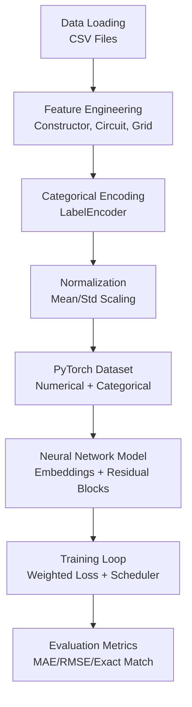
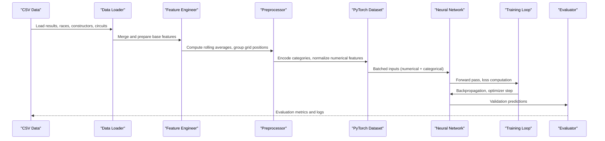
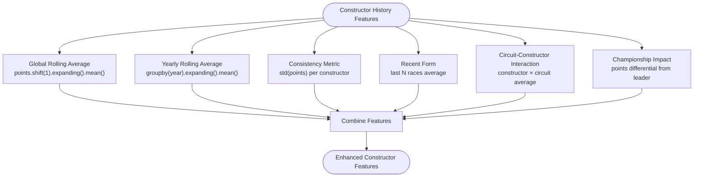
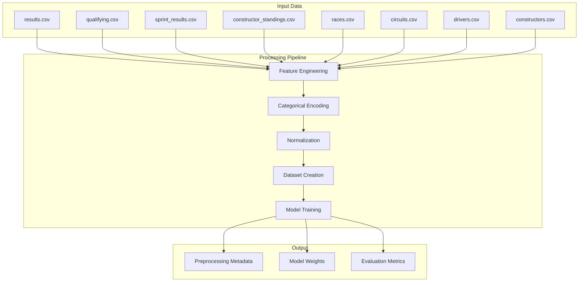

# Feature Engineering Enhancements

<cite>
**Referenced Files in This Document**
- [train.py](file://train.py)
- [preprocessing.json](file://model/preprocessing.json)
- [results.csv](file://data/results.csv)
- [qualifying.csv](file://data/qualifying.csv)
- [sprint_results.csv](file://data/sprint_results.csv)
- [constructor_standings.csv](file://data/constructor_standings.csv)
- [drivers.csv](file://data/drivers.csv)
- [races.csv](file://data/races.csv)
- [circuits.csv](file://data/circuits.csv)
- [constructors.csv](file://data/constructors.csv)
</cite>

## Table of Contents
1. [Introduction](#introduction)
2. [Project Structure](#project-structure)
3. [Core Components](#core-components)
4. [Architecture Overview](#architecture-overview)
5. [Detailed Component Analysis](#detailed-component-analysis)
6. [Dependency Analysis](#dependency-analysis)
7. [Performance Considerations](#performance-considerations)
8. [Troubleshooting Guide](#troubleshooting-guide)
9. [Conclusion](#conclusion)
10. [Appendices](#appendices)

## Introduction
This document provides comprehensive guidance for enhancing feature engineering in F1 prediction models. It focuses on advanced categorical feature inclusion, temporal feature engineering, interaction features, and practical data integration strategies. The analysis leverages the existing training pipeline and available datasets to propose improvements that capture driver performance dynamics, constructor consistency, circuit characteristics, and temporal trends while maintaining model interpretability and generalization.

## Project Structure
The project follows a modular structure centered around a neural network training pipeline that processes F1 results data. Key components include:
- Data loading and merging from CSV files
- Feature engineering for constructors, circuits, and grid positions
- Categorical encoding and normalization
- PyTorch dataset and model definition
- Training loop with evaluation metrics

**Diagram sources**
- [train.py:19-393](file://train.py#L19-L393)

**Section sources**
- [train.py:19-393](file://train.py#L19-L393)

## Core Components
The current implementation demonstrates robust feature engineering fundamentals:
- Constructor historical performance: global and seasonal averages
- Circuit scoring: historical average points per circuit
- Grid position grouping: front-row vs. midfield vs. backmarkers
- Temporal bucketing: decade-based feature capturing era effects
- Categorical encoding: constructor and circuit identifiers
- Normalization: z-score scaling for numerical features
- Model architecture: embedding layers for categorical features with residual blocks

Key enhancements proposed:
- Advanced categorical encoding: driver ID encoding, constructor experience factors
- Temporal features: season trends, driver form over time, constructor consistency metrics
- Interaction features: grid position × circuit type, constructor experience × year
- Practical data integration: qualifying session data, sprint race results, constructor championship standings
- Feature scaling strategies: polynomial features, custom feature combinations

**Section sources**
- [train.py:43-120](file://train.py#L43-L120)
- [train.py:127-148](file://train.py#L127-L148)

## Architecture Overview
The training pipeline integrates data ingestion, feature engineering, preprocessing, and model training into a cohesive workflow.

**Diagram sources**
- [train.py:19-393](file://train.py#L19-L393)

## Detailed Component Analysis

### Constructor Performance History Features
Current implementation computes:
- Global constructor average points (rolling mean excluding current race)
- Seasonal constructor average points (year-wise rolling mean)

Enhanced features to implement:
- Constructor experience factor: total races completed, wins, podiums
- Constructor consistency metric: standard deviation of points per race
- Constructor recent form: last N races average points
- Constructor vs. circuit interaction: constructor performance at specific circuits
- Constructor championship position impact: points differential from leader

**Diagram sources**
- [train.py:48-63](file://train.py#L48-L63)

**Section sources**
- [train.py:48-63](file://train.py#L48-L63)

### Driver ID Encoding and Form Features
Driver-centric enhancements:
- Driver ID encoding: label encode driverId for embedding layer
- Driver form over time: rolling averages for drivers (similar to constructors)
- Driver × circuit interaction: per-driver performance at specific circuits
- Driver experience factor: races completed, points per race, win rate
- Driver × constructor pairing: performance with specific constructors

Implementation approach:
- Merge driver metadata (nationality, code) for additional categorical features
- Compute driver-specific rolling statistics using driverId grouping
- Create interaction features combining driver, constructor, and circuit

**Section sources**
- [drivers.csv:1-200](file://data/drivers.csv#L1-L200)
- [results.csv:1-200](file://data/results.csv#L1-L200)

### Circuit Characteristics Enhancement
Current circuit feature:
- Historical average points per circuit

Enhanced circuit features:
- Circuit type classification: permanent racetrack vs. street circuit
- Circuit length and layout characteristics
- Track surface and grip level indicators
- Circuit-specific driver preferences and performance patterns
- Circuit safety rating and incident history
- Circuit weather conditions and climate impact

Integration strategy:
- Join circuits.csv with race data to extract circuit characteristics
- Create categorical encodings for circuit types
- Normalize continuous circuit metrics (length, turns, etc.)

**Section sources**
- [circuits.csv:1-79](file://data/circuits.csv#L1-L79)
- [races.csv:1-200](file://data/races.csv#L1-L200)

### Qualifying Session Data Integration
Qualifying session provides crucial grid position insights:
- Q1, Q2, Q3 lap times for performance ranking
- Qualifying position vs. actual grid position correlation
- Qualifying form: consistency across Q1/Q2/Q3
- Weather impact on qualifying performance
- Driver vs. constructor qualifying performance

Implementation steps:
- Merge qualifying.csv with results data on raceId and driverId
- Extract qualifying position and fastest lap times
- Create qualifying form features (consistency, improvement)
- Add qualifying × circuit interaction features

**Section sources**
- [qualifying.csv:1-200](file://data/qualifying.csv#L1-L200)
- [qualifying.csv:100-299](file://data/qualifying.csv#L100-L299)

### Sprint Race Results Integration
Sprint races add another dimension to prediction:
- Sprint race points allocation and scoring system
- Sprint vs. main race performance correlation
- Sprint pole position advantage
- Sprint race form: consistency across sprint events

Data integration:
- Merge sprint_results.csv with main results
- Calculate sprint points contribution to total points
- Create sprint race form features for drivers and constructors

**Section sources**
- [sprint_results.csv:1-200](file://data/sprint_results.csv#L1-L200)

### Constructor Championship Standings Features
Constructor championship position impacts future performance:
- Current constructor championship points
- Points differential from leader
- Constructor championship position trend
- Constructor vs. driver points correlation
- Constructor championship momentum

Implementation:
- Merge constructor_standings.csv with race data
- Extract current championship position and points
- Create championship position change features
- Add championship impact factors to prediction model

**Section sources**
- [constructor_standings.csv:1-200](file://data/constructor_standings.csv#L1-L200)

### Temporal Feature Engineering
Current temporal features:
- Year bucketing for era effects
- Seasonal trends through yearly averages

Advanced temporal features:
- Driver career progression: points per race over career
- Constructor evolution: performance trends over years
- Circuit aging: how track performance changes over time
- Weather patterns: seasonal weather impact on performance
- Regulation changes: impact of rule changes over time
- Driver age and form curves: performance by age category

**Section sources**
- [train.py:81-84](file://train.py#L81-L84)

### Interaction Features
Critical interaction features for improved accuracy:
- Grid position × circuit type: different grid advantages by track type
- Constructor experience × year: how experience compounds over time
- Driver × constructor × circuit: specific pairings perform better
- Weather × circuit × driver: environmental impact varies by track
- Driver age × circuit: optimal performance by track type and age
- Experience × form: how recent form interacts with accumulated experience

**Section sources**
- [train.py:70-84](file://train.py#L70-L84)

### Feature Scaling Strategies
Current scaling:
- Z-score normalization for numerical features

Enhanced scaling approaches:
- Polynomial features: grid_position^2, log(year), sqrt(points)
- Custom feature combinations: grid_position × circuit_avg_pts
- Robust scaling: median and IQR for outliers
- Target encoding: mean points per constructor for categorical features
- Frequency encoding: occurrence count of categorical features
- Embedding-based scaling: normalized embeddings for high-cardinality features

**Section sources**
- [train.py:101-107](file://train.py#L101-L107)

## Dependency Analysis
The feature engineering pipeline depends on multiple data sources and maintains internal dependencies.

**Diagram sources**
- [train.py:19-393](file://train.py#L19-L393)

**Section sources**
- [train.py:19-393](file://train.py#L19-L393)

## Performance Considerations
- Memory efficiency: process data in chunks for large datasets
- Computation optimization: vectorized operations for rolling calculations
- Feature sparsity: handle missing values in qualifying and sprint data
- Overfitting prevention: regularization, dropout, early stopping
- Computational complexity: limit expensive operations to necessary features only

## Troubleshooting Guide
Common issues and solutions:
- Missing data in qualifying/sprint races: impute with average or flag missing features
- Data leakage: ensure rolling calculations exclude current race data
- Categorical imbalance: oversample rare categories or use weighted loss
- Numerical instability: clip extreme values and use robust scaling
- Memory errors: reduce batch size and optimize data types

**Section sources**
- [train.py:27-29](file://train.py#L27-L29)
- [train.py:237-242](file://train.py#L237-L242)

## Conclusion
The proposed feature engineering enhancements significantly expand the predictive power of F1 point prediction models by incorporating advanced categorical features, temporal dynamics, and meaningful interactions. The integration of qualifying sessions, sprint races, and constructor championship standings provides richer context for performance prediction. Proper scaling strategies and careful handling of data dependencies ensure robust model performance while maintaining interpretability.

## Appendices

### Implementation Checklist
- [ ] Extend constructor features with experience and consistency metrics
- [ ] Add driver ID encoding and form features
- [ ] Integrate qualifying session data and create form features
- [ ] Incorporate sprint race results and championship standings
- [ ] Develop circuit characteristic categorization
- [ ] Implement interaction features between grid position and circuit type
- [ ] Add polynomial and custom feature combinations
- [ ] Validate feature importance and model performance improvements

### Data Quality Guidelines
- Ensure consistent data types across merged datasets
- Handle missing values appropriately for qualifying and sprint data
- Validate feature ranges and distributions before training
- Monitor for data leakage in feature engineering steps
- Test feature stability across different time periods