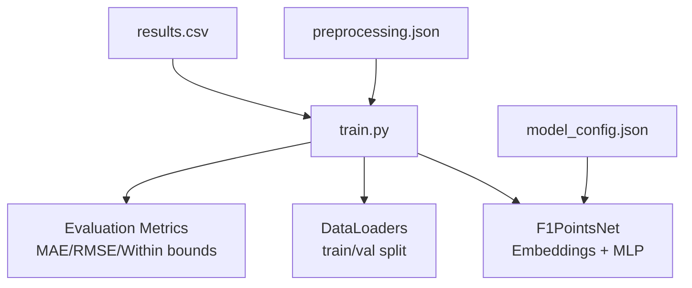
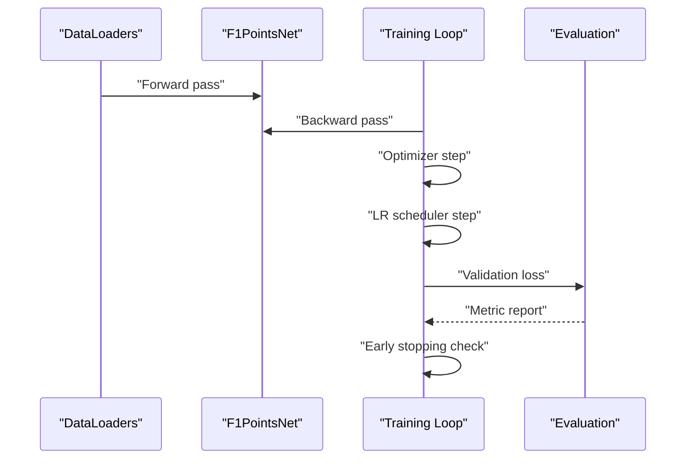
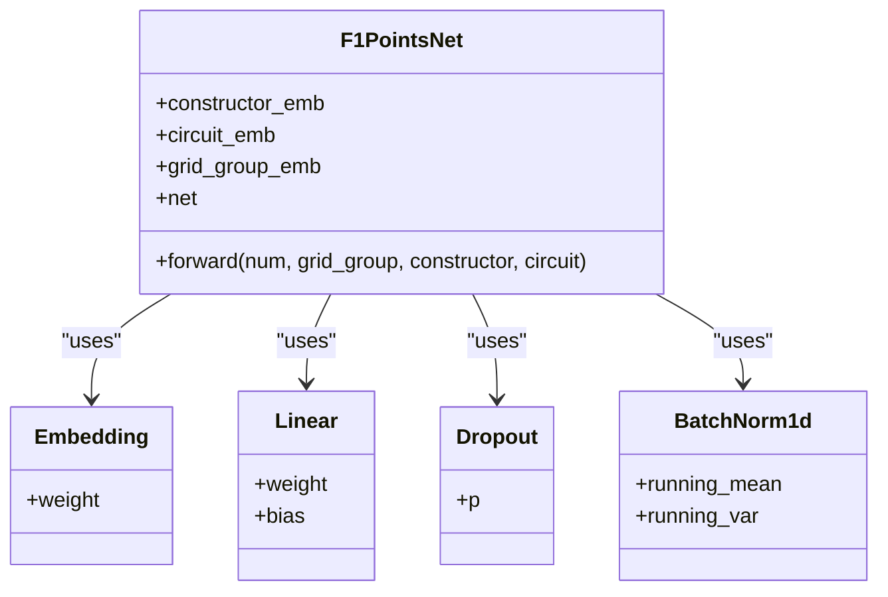
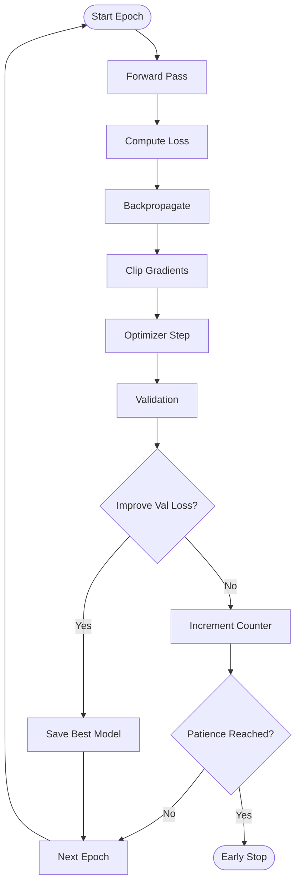
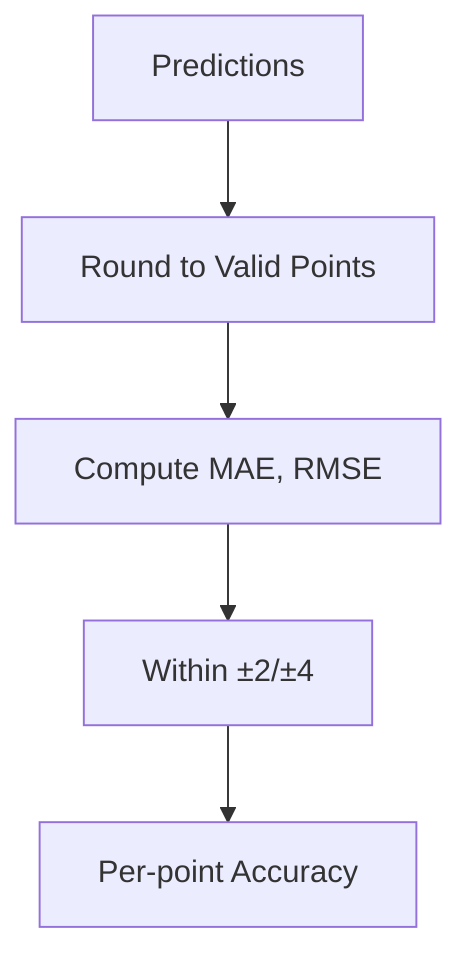
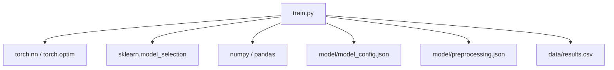

# Hyperparameter Tuning Strategies

<cite>
**Referenced Files in This Document**
- [train.py](file://train.py)
- [model_config.json](file://model/model_config.json)
- [preprocessing.json](file://model/preprocessing.json)
- [results.csv](file://data/results.csv)
</cite>

## Table of Contents
1. [Introduction](#introduction)
2. [Project Structure](#project-structure)
3. [Core Components](#core-components)
4. [Architecture Overview](#architecture-overview)
5. [Detailed Component Analysis](#detailed-component-analysis)
6. [Dependency Analysis](#dependency-analysis)
7. [Performance Considerations](#performance-considerations)
8. [Troubleshooting Guide](#troubleshooting-guide)
9. [Conclusion](#conclusion)
10. [Appendices](#appendices)

## Introduction
This document presents a comprehensive guide to hyperparameter optimization for neural networks predicting Formula 1 points. It covers grid search, random search, and Bayesian optimization strategies for learning rate, embedding dimension, and network depth. It also details time-series-aware cross-validation techniques, automated tuning with Optuna/Hyperopt-style workflows, and practical guidance to prevent overfitting and improve computational efficiency.

## Project Structure
The repository contains:
- Training script that builds a neural network model, prepares features, and evaluates performance
- Saved artifacts for preprocessing and model configuration
- Historical F1 datasets for training and evaluation

**Diagram sources**
- [train.py:141-172](file://train.py#L141-L172)
- [train.py:135-136](file://train.py#L135-L136)
- [train.py:244-296](file://train.py#L244-L296)
- [model_config.json:1-1](file://model/model_config.json#L1-L1)
- [preprocessing.json:1-1](file://model/preprocessing.json#L1-L1)
- [results.csv:1-200](file://data/results.csv#L1-L200)

**Section sources**
- [train.py:1-312](file://train.py#L1-L312)
- [model_config.json:1-1](file://model/model_config.json#L1-L1)
- [preprocessing.json:1-1](file://model/preprocessing.json#L1-L1)
- [results.csv:1-200](file://data/results.csv#L1-L200)

## Core Components
Key components relevant to hyperparameter tuning:
- Neural network architecture with configurable embedding dimension and hidden layer sizes
- Optimizer and scheduler settings suitable for stable convergence
- Early stopping mechanism to prevent overfitting
- Evaluation metrics suitable for regression tasks with discrete target values

Practical implications for tuning:
- Learning rate: AdamW with scheduled decay and gradient clipping
- Embedding dimension: affects representational capacity for categorical features
- Hidden layer sizes: controls model capacity and risk of overfitting
- Batch size and patience: influence stability and computational cost

**Section sources**
- [train.py:141-172](file://train.py#L141-L172)
- [train.py:183-185](file://train.py#L183-L185)
- [train.py:187-239](file://train.py#L187-L239)
- [train.py:244-296](file://train.py#L244-L296)

## Architecture Overview
The training pipeline integrates data preparation, model definition, training loop, and evaluation. For hyperparameter tuning, we focus on the model’s configurable parameters and training dynamics.

**Diagram sources**
- [train.py:135-136](file://train.py#L135-L136)
- [train.py:141-172](file://train.py#L141-L172)
- [train.py:197-239](file://train.py#L197-L239)
- [train.py:244-296](file://train.py#L244-L296)

## Detailed Component Analysis

### Neural Network Architecture
The model combines embeddings for categorical features with numerical inputs and a small MLP head. Configurable parameters:
- Embedding dimension for constructors and circuits
- Hidden layer sizes in the MLP
- Dropout and normalization layers

These parameters directly impact model capacity and generalization.

**Diagram sources**
- [train.py:141-172](file://train.py#L141-L172)

**Section sources**
- [train.py:141-172](file://train.py#L141-L172)
- [model_config.json:1-1](file://model/model_config.json#L1-L1)

### Training and Regularization
- Optimizer: AdamW with weight decay
- Scheduler: ReduceLROnPlateau with patience and factor
- Gradient clipping: Prevents exploding gradients
- Early stopping: Stops training when validation loss does not improve

These mechanisms stabilize training and reduce overfitting risk.

**Diagram sources**
- [train.py:197-239](file://train.py#L197-L239)

**Section sources**
- [train.py:183-185](file://train.py#L183-L185)
- [train.py:197-239](file://train.py#L197-L239)

### Evaluation Metrics
The evaluation computes MAE, RMSE, and accuracy within thresholds. These metrics inform tuning objectives and selection criteria.

**Diagram sources**
- [train.py:244-296](file://train.py#L244-L296)

**Section sources**
- [train.py:244-296](file://train.py#L244-L296)

## Dependency Analysis
The training script depends on PyTorch modules for neural networks and optimization, scikit-learn for data splitting, and NumPy/Pandas for data manipulation. The model configuration and preprocessing artifacts are persisted for reproducibility.

**Diagram sources**
- [train.py:1-11](file://train.py#L1-L11)
- [model_config.json:1-1](file://model/model_config.json#L1-L1)
- [preprocessing.json:1-1](file://model/preprocessing.json#L1-L1)
- [results.csv:1-200](file://data/results.csv#L1-L200)

**Section sources**
- [train.py:1-11](file://train.py#L1-L11)
- [model_config.json:1-1](file://model/model_config.json#L1-L1)
- [preprocessing.json:1-1](file://model/preprocessing.json#L1-L1)
- [results.csv:1-200](file://data/results.csv#L1-L200)

## Performance Considerations
- Computational efficiency: Use GPU acceleration when available; adjust batch size to fit memory
- Convergence speed: Tune learning rate and scheduler patience; monitor gradient norms
- Generalization: Employ early stopping, dropout, and batch normalization; avoid overly deep architectures for limited data
- Metric alignment: Use RMSE or MAE aligned with the target distribution; consider snapping predictions to valid point values

[No sources needed since this section provides general guidance]

## Troubleshooting Guide
Common issues and remedies:
- Overfitting: Increase dropout, reduce model capacity, enable early stopping, and use smaller learning rates
- Poor convergence: Lower learning rate, increase patience, apply gradient clipping, and normalize inputs
- Memory errors: Reduce batch size or simplify the network architecture

**Section sources**
- [train.py:183-185](file://train.py#L183-L185)
- [train.py:197-239](file://train.py#L197-L239)
- [train.py:244-296](file://train.py#L244-L296)

## Conclusion
Effective hyperparameter tuning for F1 point prediction requires balancing model capacity with regularization, careful validation strategies, and robust evaluation metrics. The provided training pipeline offers a strong baseline for automated tuning using grid/random/Bayesian methods while preserving time-series integrity and preventing overfitting.

[No sources needed since this section summarizes without analyzing specific files]

## Appendices

### A. Hyperparameter Optimization Methodologies

#### Grid Search
- Define a parameter grid for learning rate, embedding dimension, and hidden layer sizes
- Perform exhaustive cross-validation over combinations
- Select best configuration by validation loss or a chosen metric

Practical tips:
- Use coarse-to-fine grids; start wide, then refine around promising regions
- Fix batch size and patience to keep comparisons fair

**Section sources**
- [train.py:141-172](file://train.py#L141-L172)
- [train.py:183-185](file://train.py#L183-L185)
- [train.py:197-239](file://train.py#L197-L239)

#### Random Search
- Sample uniformly from parameter ranges for learning rate, embedding dimension, and hidden sizes
- Run a fixed number of trials; rank by validation performance
- Often more efficient than grid search for high-dimensional spaces

**Section sources**
- [train.py:141-172](file://train.py#L141-L172)
- [train.py:183-185](file://train.py#L183-L185)
- [train.py:197-239](file://train.py#L197-L239)

#### Bayesian Optimization
- Use probabilistic models to select promising configurations
- Iteratively update based on validation outcomes
- Efficient for expensive evaluations; integrates well with early stopping

Recommended framework integration:
- Optuna: Define search space, objective function, and pruning callback
- Hyperopt: Define objective, search space, and algorithm (Tree-Parzen Estimators)

**Section sources**
- [train.py:141-172](file://train.py#L141-L172)
- [train.py:183-185](file://train.py#L183-L185)
- [train.py:197-239](file://train.py#L197-L239)

### B. Cross-Validation for Time-Series F1 Data

Temporal validation splits:
- Use chronological order to avoid leakage; train on earlier years, validate on later years
- Stratify by year to ensure representative samples across seasons

Rolling window approaches:
- Slide training windows forward by fixed intervals (e.g., yearly)
- Evaluate on subsequent windows to assess generalization over time

Guidelines:
- Preserve temporal order in data splits
- Avoid shuffling across time
- Consider season-wise splits to reflect evolving racing conditions

[No sources needed since this section provides general guidance]

### C. Automated Hyperparameter Tuning Workflow

Objective definition:
- Minimize validation RMSE or MAE
- Optionally maximize proportion within ±2 or ±4 points

Convergence criteria:
- Early stopping patience threshold
- Maximum number of trials or wall-clock time limit
- Minimum improvement threshold for successive iterations

Parameter ranges (examples):
- Learning rate: [1e-4, 1e-3] for AdamW
- Embedding dimension: [16, 32, 48, 64]
- Hidden layer sizes: [64, 128, 256]
- Dropout rates: [0.15, 0.25, 0.35]

Preventing overfitting during search:
- Use separate validation sets per trial
- Apply early stopping per fold/trial
- Enforce gradient clipping and weight decay
- Snap predictions to valid point values for evaluation

Computational efficiency:
- Parallelize trials across CPU cores or GPUs
- Warm-start models when possible
- Reduce search space dimensionality initially

**Section sources**
- [train.py:141-172](file://train.py#L141-L172)
- [train.py:183-185](file://train.py#L183-L185)
- [train.py:197-239](file://train.py#L197-L239)
- [train.py:244-296](file://train.py#L244-L296)