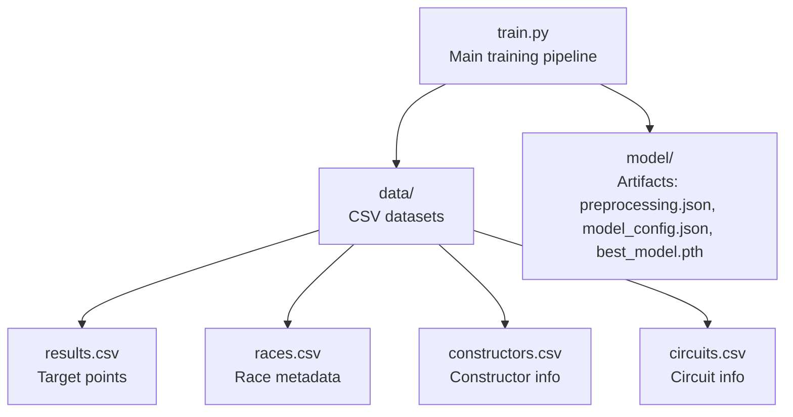
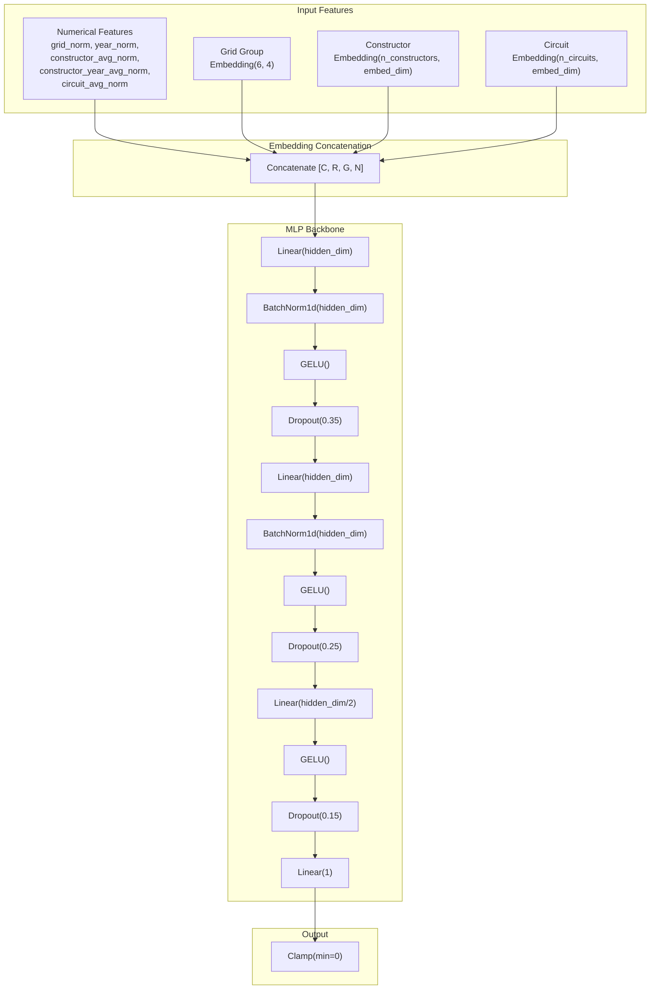
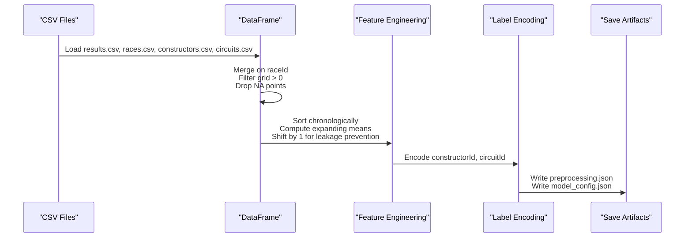
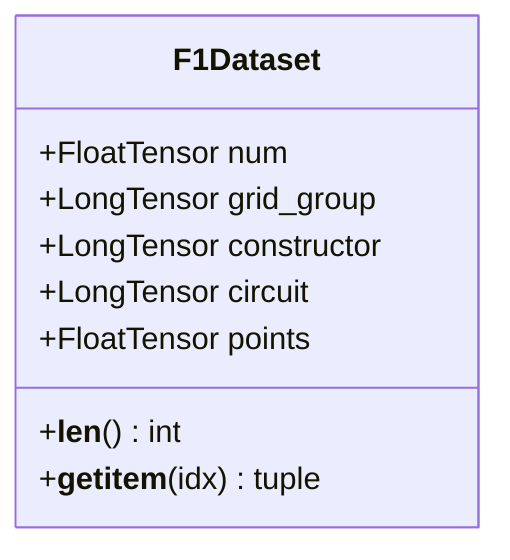
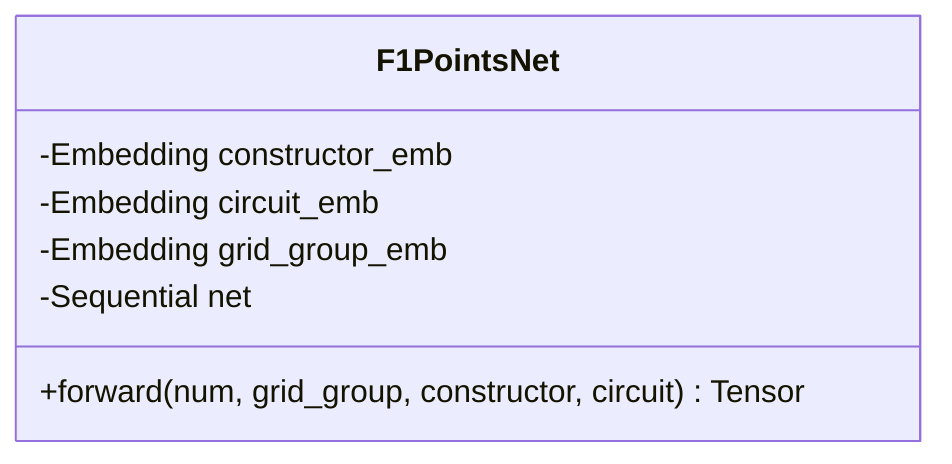
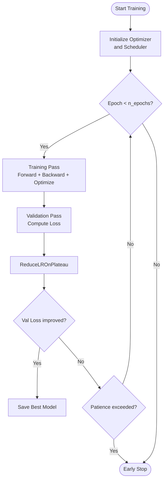
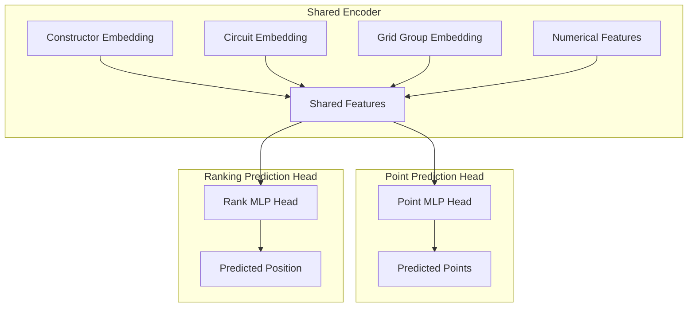
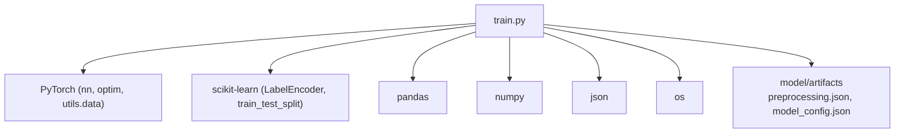

# Model Architecture Modifications

<cite>
**Referenced Files in This Document**
- [train.py](file://train.py)
- [preprocessing.json](file://model/preprocessing.json)
- [model_config.json](file://model/model_config.json)
- [results.csv](file://data/results.csv)
</cite>

## Table of Contents
1. [Introduction](#introduction)
2. [Project Structure](#project-structure)
3. [Core Components](#core-components)
4. [Architecture Overview](#architecture-overview)
5. [Detailed Component Analysis](#detailed-component-analysis)
6. [Advanced Architectural Variants](#advanced-architectural-variants)
7. [Ensemble Methods](#ensemble-methods)
8. [Multi-Task Learning Extensions](#multi-task-learning-extensions)
9. [Custom Layer Implementations](#custom-layer-implementations)
10. [Regularization and Architectural Innovations](#regularization-and-architectural-innovations)
11. [Performance Comparison Framework](#performance-comparison-framework)
12. [Dependency Analysis](#dependency-analysis)
13. [Performance Considerations](#performance-considerations)
14. [Troubleshooting Guide](#troubleshooting-guide)
15. [Conclusion](#conclusion)

## Introduction
This document provides comprehensive guidance for advanced neural network architecture modifications tailored to Formula 1 point prediction. It builds upon the existing baseline implementation to explore deeper networks, residual connections, attention mechanisms, ensemble methods, hierarchical feature processing, and multi-task learning extensions. The focus is on practical modifications that maintain training stability while improving predictive accuracy for the discrete point scoring system in F1 racing.

## Project Structure
The repository follows a clean separation of concerns with data loading, preprocessing, model definition, training, and evaluation in a single script, alongside saved artifacts for preprocessing and model configuration.

**Diagram sources**
- [train.py:19-34](file://train.py#L19-L34)
- [preprocessing.json:1-1](file://model/preprocessing.json#L1-L1)
- [model_config.json:1-1](file://model/model_config.json#L1-L1)

**Section sources**
- [train.py:19-34](file://train.py#L19-L34)
- [preprocessing.json:1-1](file://model/preprocessing.json#L1-L1)
- [model_config.json:1-1](file://model/model_config.json#L1-L1)

## Core Components
The baseline architecture consists of:
- Embedding layers for categorical features (constructor, circuit, grid group)
- Normalized numerical features (grid position, year, historical averages)
- A feedforward network with batch normalization, GELU activation, and dropout
- Clamped output to ensure non-negative point predictions

Key implementation elements:
- Feature engineering with expanding means to prevent leakage
- Label encoding for categorical variables
- Normalization statistics persisted for inference
- Early stopping and learning rate scheduling

**Section sources**
- [train.py:116-136](file://train.py#L116-L136)
- [train.py:141-172](file://train.py#L141-L172)
- [train.py:183-242](file://train.py#L183-L242)
- [train.py:251-296](file://train.py#L251-L296)

## Architecture Overview
The current model architecture combines embedded categorical features with normalized numerical inputs through a multi-layer perceptron, producing a continuous point prediction clamped to non-negative values.

**Diagram sources**
- [train.py:141-172](file://train.py#L141-L172)

## Detailed Component Analysis

### Data Loading and Preprocessing Pipeline
The preprocessing pipeline merges race results with race metadata, filters invalid grid positions, and constructs historical averages per constructor and circuit. Rolling/expanding means are shifted to ensure no future information leaks into past predictions.

**Diagram sources**
- [train.py:19-34](file://train.py#L19-L34)
- [train.py:44-61](file://train.py#L44-L61)
- [train.py:78-108](file://train.py#L78-L108)

**Section sources**
- [train.py:19-34](file://train.py#L19-L34)
- [train.py:44-61](file://train.py#L44-L61)
- [train.py:78-108](file://train.py#L78-L108)

### Dataset and DataLoader
The custom dataset class exposes numerical features, categorical indices, and targets. The DataLoader handles batching and shuffling for training and evaluation.

**Diagram sources**
- [train.py:116-130](file://train.py#L116-L130)

**Section sources**
- [train.py:116-136](file://train.py#L116-L136)

### Neural Network Architecture
The baseline network uses embedding layers for categorical variables and a feedforward stack with batch normalization, GELU activations, and dropout. The output is clamped to ensure non-negative predictions.

**Diagram sources**
- [train.py:141-172](file://train.py#L141-L172)

**Section sources**
- [train.py:141-172](file://train.py#L141-L172)

### Training and Evaluation Loop
The training loop implements gradient clipping, early stopping, and learning rate reduction on plateau. Evaluation computes MAE, RMSE, and accuracy metrics with snapping to valid F1 point values.

**Diagram sources**
- [train.py:197-242](file://train.py#L197-L242)

**Section sources**
- [train.py:197-242](file://train.py#L197-L242)
- [train.py:251-296](file://train.py#L251-L296)

## Advanced Architectural Variants

### Deeper Network Topologies
To improve representational capacity while maintaining stability:
- Increase hidden_dim and add symmetric depth (e.g., three or four hidden layers)
- Use residual connections between layers to mitigate vanishing gradients
- Apply stochastic depth or drop-path for regularization during training

Implementation considerations:
- Adjust dropout rates progressively (e.g., 0.3 → 0.4) for deeper layers
- Maintain batch normalization after each linear layer
- Clamp outputs to ensure non-negative predictions

### Residual Connections
Residual blocks can be integrated into the MLP backbone:
- Insert skip connections from earlier layers to later layers
- Use pre-activation residual blocks (normalize → activate → compute residual)
- Combine with attention mechanisms for long-range dependencies

### Attention Mechanisms
Attention can enhance modeling of temporal and categorical relationships:
- Self-attention over constructors and circuits to capture latent similarities
- Cross-attention between grid group and constructor features
- Multi-head attention with linear projections for parallel processing

### Hierarchical Feature Processing
Extend the baseline to process features hierarchically:
- Separate embeddings for constructor and circuit with attention fusion
- Temporal aggregation using gated recurrent units or transformers
- Multi-resolution feature extraction combining fine-grained and coarse-grained signals

### Custom Layer Implementations
Examples of custom layers suitable for F1 prediction:
- Gated Linear Units (GLU) for better feature gating
- Swish or Mish activations for improved gradient flow
- Layer normalization variants (rmsnorm, groupnorm) for stable training
- Scaled dot-product attention with causal masking for temporal sequences

## Ensemble Methods

### Bagging Strategies
Combine multiple independently trained models:
- Train separate networks with different random seeds
- Average predictions or use median for robustness
- Weight by validation performance for weighted averaging

### Stacking Approaches
Stack multiple models with a meta-learner:
- Use base learners: shallow MLP, deeper MLP, attention-enhanced MLP
- Train meta-learner (e.g., another MLP) on out-of-fold predictions
- Regularize meta-learner to prevent overfitting

### Model-Agnostic Ensembling
- Bootstrap aggregating (bagging) with different subsets of data
- Cross-validation folds as diverse training sets
- Mix of architectures (CNN-like temporal kernels, transformer encoders)

## Multi-Task Learning Extensions

### Concurrent Point and Ranking Prediction
Extend the model to predict both points and final position:
- Shared backbone embedding constructor and circuit features
- Task-specific heads: point prediction (regression) and position prediction (ordinal classification)
- Joint loss with weighted combination (e.g., MSE for points + cross-entropy for position)

### Auxiliary Tasks
- Predict qualifying position to leverage grid advantage
- Estimate fastest lap probability for strategic insights
- Forecast points contribution per stint for race simulation

### Hierarchical Multi-Task Architecture

**Diagram sources**
- [train.py:141-172](file://train.py#L141-L172)

## Custom Layer Implementations

### Advanced Activation Functions
- Swish: x * sigmoid(beta * x) for smooth non-linearity
- Mish: x * tanh(softplus(x)) for self-gated activation
- GELU variants: fast approximation for speed

### Normalization Techniques
- RMSNorm: Root Mean Square normalization for stable gradients
- GroupNorm: Divide channels into groups for consistent normalization
- LayerNorm: Normalize across feature dimension for sequence inputs

### Attention Layers
- Multi-Head Attention: Parallel attention heads with projection matrices
- Relative Positional Encoding: Incorporate positional relationships
- Sparse Attention: Reduce computational cost for long sequences

## Regularization and Architectural Innovations

### Dropout Variants
- Standard dropout for feature selection
- DropPath for stochastic depth in residual networks
- Feature dropout for categorical embeddings

### Weight Decay and Optimizers
- AdamW with decoupled weight decay for stable convergence
- Lookahead optimizer for improved generalization
- LARS/LAMB for large batch training

### Gradient Management
- Gradient clipping by norm to prevent exploding gradients
- Mixed precision training for memory efficiency
- Gradient accumulation for larger effective batch sizes

### Architectural Innovations
- Squeeze-and-Excitation blocks for attention within channels
- Convolutional layers for local feature extraction
- Transformer encoders for sequence modeling of historical data

## Performance Comparison Framework

### Benchmark Setup
- Baseline MLP: Current implementation
- Deeper MLP: Increased depth and width
- Residual MLP: With residual connections
- Attention MLP: With self-attention heads
- Multi-task: Points + position prediction

### Metrics
- Regression metrics: MAE, RMSE, R²
- Classification metrics: Accuracy within ±2/±4 points
- Calibration: Reliability diagrams and ECE
- Computational: Throughput, memory usage, training time

### Validation Strategy
- Time-series split preserving chronological order
- Stratified sampling by points value for regression stability
- Cross-validation with rolling window for temporal data

## Dependency Analysis
The training script depends on PyTorch for neural networks, scikit-learn for preprocessing, and pandas/numpy for data manipulation. Artifacts are persisted for reproducible inference.

**Diagram sources**
- [train.py:1-10](file://train.py#L1-L10)
- [preprocessing.json:1-1](file://model/preprocessing.json#L1-L1)
- [model_config.json:1-1](file://model/model_config.json#L1-L1)

**Section sources**
- [train.py:1-10](file://train.py#L1-L10)
- [preprocessing.json:1-1](file://model/preprocessing.json#L1-L1)
- [model_config.json:1-1](file://model/model_config.json#L1-L1)

## Performance Considerations
- Batch size tuning for memory vs throughput trade-offs
- Mixed precision training for faster convergence
- Distributed training for large-scale datasets
- Pruning and quantization for deployment efficiency

## Troubleshooting Guide
Common issues and solutions:
- Overfitting: Increase dropout, reduce model capacity, apply stronger regularization
- Underfitting: Increase model depth/width, adjust learning rate, extend training
- Poor calibration: Add temperature scaling, train with focal loss for imbalanced points
- Numerical instability: Use gradient clipping, normalize inputs carefully, check for NaNs

**Section sources**
- [train.py:183-242](file://train.py#L183-L242)
- [train.py:265-296](file://train.py#L265-L296)

## Conclusion
This document outlined advanced modifications to the F1 point prediction architecture, covering deeper networks, residual connections, attention mechanisms, ensemble strategies, and multi-task learning extensions. By systematically applying these techniques while preserving the established preprocessing and evaluation framework, practitioners can achieve significant improvements in prediction accuracy and robustness for the discrete point scoring system in Formula 1 racing.