# Research Directions and Future Work

<cite>
**Referenced Files in This Document**
- [train.py](file://train.py)
- [app.py](file://app.py)
- [preprocessing.json](file://model/preprocessing.json)
- [results.csv](file://data/results.csv)
- [races.csv](file://data/races.csv)
- [drivers.csv](file://data/drivers.csv)
</cite>

## Table of Contents
1. [Introduction](#introduction)
2. [Project Structure](#project-structure)
3. [Core Components](#core-components)
4. [Architecture Overview](#architecture-overview)
5. [Detailed Component Analysis](#detailed-component-analysis)
6. [Dependency Analysis](#dependency-analysis)
7. [Performance Considerations](#performance-considerations)
8. [Troubleshooting Guide](#troubleshooting-guide)
9. [Conclusion](#conclusion)
10. [Appendices](#appendices)

## Introduction
This document outlines forward-looking research directions and future enhancements for F1 point prediction systems. It synthesizes the current baseline implementation with cutting-edge techniques in machine learning and data science to propose practical extensions for modeling driver-team-circuit dynamics, integrating external data streams, interpretability, uncertainty quantification, and real-time adaptation. The goal is to guide incremental improvements while maintaining strong empirical baselines grounded in the repository’s training and inference code.

## Project Structure
The repository provides a complete training pipeline and a lightweight inference server:
- Training script loads race, results, constructors, and circuits datasets, performs feature engineering, trains a neural network, evaluates performance, and persists artifacts.
- Inference server exposes a web API for interactive predictions and renders a basic UI.
- Artifacts include preprocessing statistics and model configuration for reproducible inference.

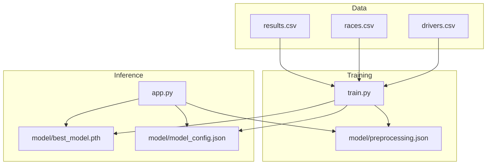

**Diagram sources**
- [train.py:19-312](file://train.py#L19-L312)
- [app.py:14-237](file://app.py#L14-L237)
- [preprocessing.json:1-1](file://model/preprocessing.json#L1-L1)

**Section sources**
- [train.py:19-312](file://train.py#L19-L312)
- [app.py:14-237](file://app.py#L14-L237)
- [preprocessing.json:1-1](file://model/preprocessing.json#L1-L1)

## Core Components
- Data loading and merging: Race metadata and results are merged to form per-driver-per-race samples.
- Feature engineering: Historical averages by constructor and circuit are computed using expanding means with appropriate temporal ordering to prevent leakage. A grid-position grouping feature is derived.
- Preprocessing: Numerical features are normalized; categorical encoders are fit on constructor and circuit IDs.
- Dataset and dataloader: A custom dataset aggregates numerical, categorical, and grouped-grid tensors.
- Neural network: An embedding-based architecture combines embeddings for constructor and circuit with a small set of numerical features and a grid-group embedding; a shallow MLP predicts points with clamping to non-negative values.
- Training loop: AdamW optimizer, ReduceLROnPlateau scheduling, early stopping, and evaluation metrics (MAE, RMSE, accuracy thresholds) are implemented.

Key implementation references:
- Data loading and merges: [train.py:19-26](file://train.py#L19-L26)
- Temporal feature engineering: [train.py:44-61](file://train.py#L44-L61)
- Normalization and preprocessing artifacts: [train.py:90-108](file://train.py#L90-L108)
- Dataset and dataloader: [train.py:116-136](file://train.py#L116-L136)
- Model definition: [train.py:141-172](file://train.py#L141-L172)
- Training and evaluation: [train.py:183-311](file://train.py#L183-L311)

**Section sources**
- [train.py:19-312](file://train.py#L19-L312)

## Architecture Overview
The system follows a standard ML pipeline: data ingestion → feature engineering → model training → artifact persistence → inference serving. The inference server mirrors the training architecture to ensure compatibility.

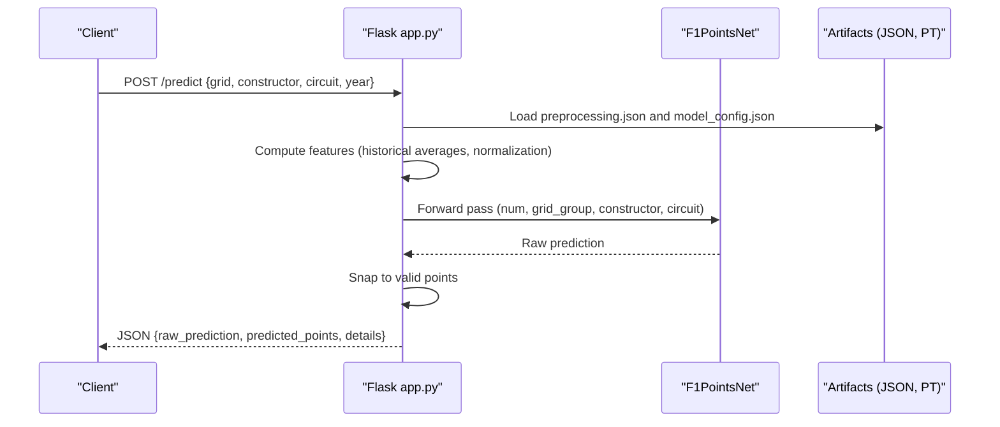

**Diagram sources**
- [app.py:145-199](file://app.py#L145-L199)
- [app.py:53-83](file://app.py#L53-L83)
- [preprocessing.json:1-1](file://model/preprocessing.json#L1-L1)

**Section sources**
- [app.py:145-199](file://app.py#L145-L199)
- [app.py:53-83](file://app.py#L53-L83)

## Detailed Component Analysis

### Current Baseline Model
The baseline model uses embeddings for categorical variables and a small MLP head. It demonstrates strong performance on the provided dataset and serves as a foundation for future enhancements.

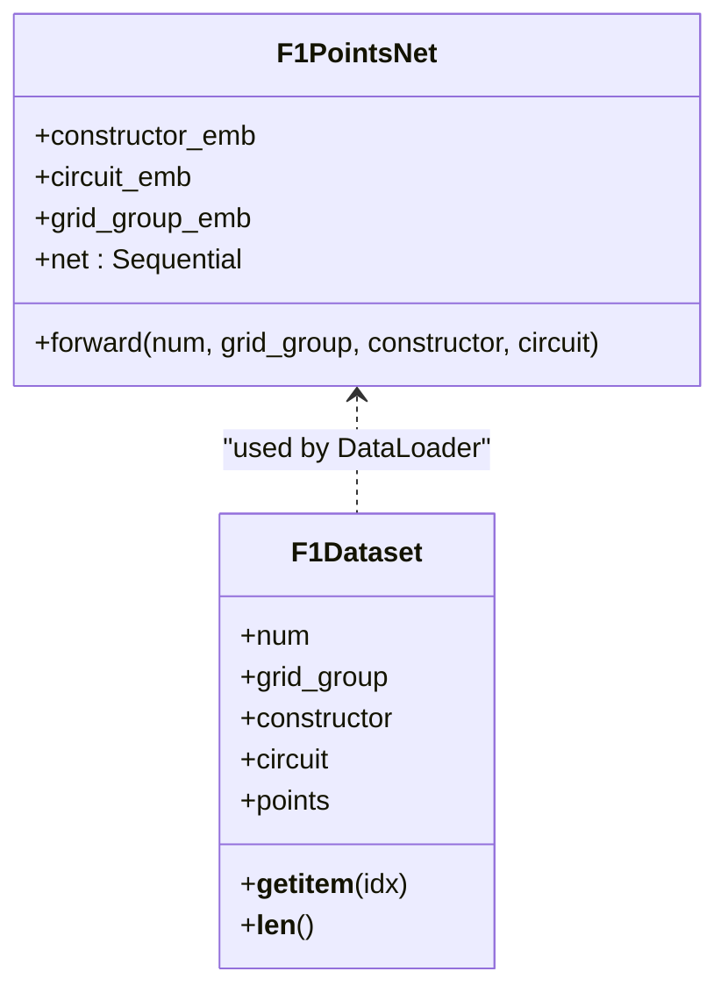

**Diagram sources**
- [train.py:141-172](file://train.py#L141-L172)
- [train.py:116-136](file://train.py#L116-L136)

**Section sources**
- [train.py:141-172](file://train.py#L141-L172)
- [train.py:116-136](file://train.py#L116-L136)

### Proposed Enhancements

#### Graph Neural Networks for Driver-Team Relationships
Motivation: Drivers’ performance is influenced by team resources, crew expertise, and historical teammate effects. A relational graph can encode drivers, teams, races, and circuits with edges representing participation and shared history.

Implementation outline:
- Construct nodes: drivers, constructors, races, circuits.
- Edges: driver–constructor (past races), driver–race, constructor–race, race–circuit.
- Use a GNN encoder to produce latent representations capturing driver–team synergy and circuit familiarity.
- Concatenate GNN embeddings with existing numerical features and train a modified MLP head.

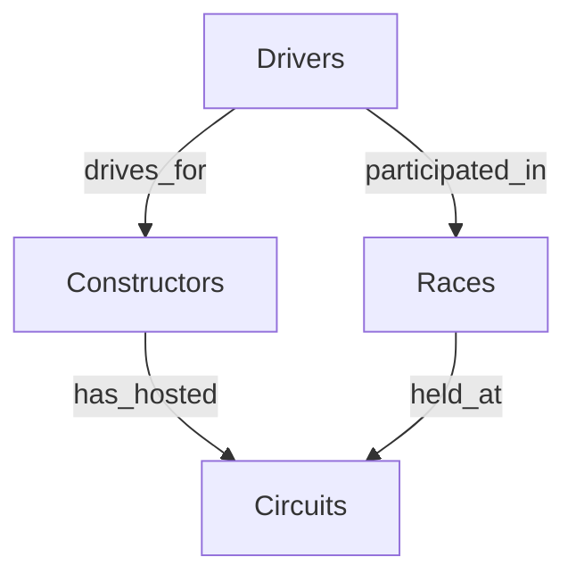

[No sources needed since this diagram shows conceptual workflow, not actual code structure]

#### Transformer Architectures for Sequential Race Data
Motivation: Driver trajectories and constructor form changes are inherently sequential. Transformers can model long-range dependencies across races and capture evolving performance trends.

Implementation outline:
- Encode each race as a sequence of driver-team-circuit triplets with contextual features (grid, points, DNF status).
- Use positional encoding for race order and apply multi-head attention to learn inter-driver and inter-team relationships.
- Predict points as a regression head atop the sequence representation.

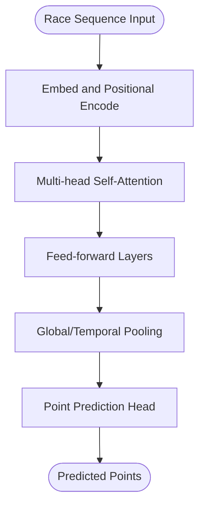

[No sources needed since this diagram shows conceptual workflow, not actual code structure]

#### Reinforcement Learning for Dynamic Strategy Prediction
Motivation: Pit stops, tire choices, and weather-driven strategy decisions are high-stakes. RL agents can learn optimal strategies by interacting with a simulator or historical race logs.

Implementation outline:
- State: current lap, stint history, tire compound, weather, DRS zones, safety car events.
- Actions: pit stop timing, compound choice, overtaking attempts.
- Reward: points scored minus penalties (time lost, DNF risk).
- Train via policy gradient or actor-critic methods using historical race logs as environment.

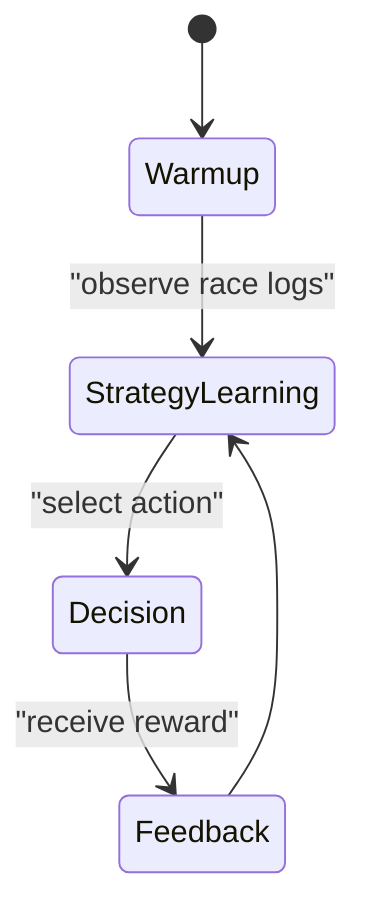

[No sources needed since this diagram shows conceptual workflow, not actual code structure]

#### Integration of External Data Sources
- Weather forecasts: Incorporate temperature, humidity, wind, and forecasted conditions to adjust tire degradation and strategy.
- Tire performance models: Use compound-specific degradation curves and sector times to refine predictions.
- Driver biometrics: Heart rate, hydration, and stress indicators can proxy fatigue impacts on performance.

Implementation outline:
- Preprocess external CSVs and align timestamps to race sessions.
- Merge with race-level features and normalize consistently.
- Extend the numerical feature vector and re-train the model.

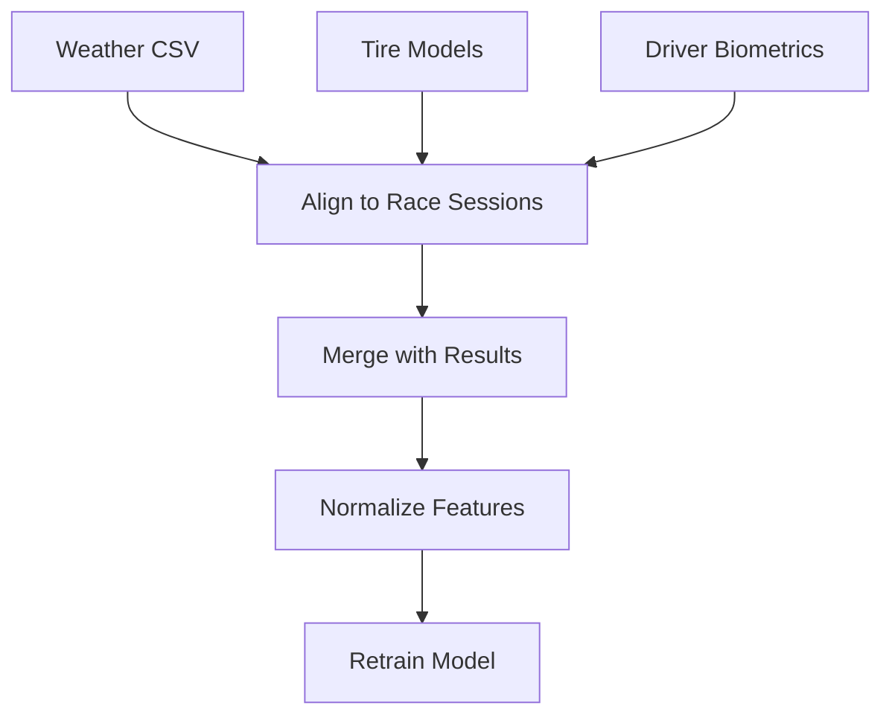

[No sources needed since this diagram shows conceptual workflow, not actual code structure]

#### Explainable AI and Interpretability
- SHAP/LIME: Explain individual predictions by attributing contributions across features.
- Permutation importance: Measure impact of each feature on validation loss.
- Attention visualization: For transformers, plot attention weights across drivers and races.

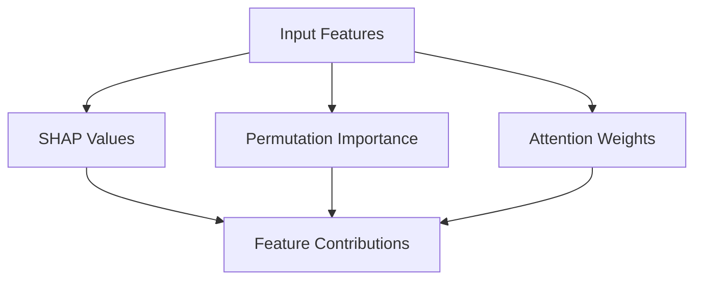

[No sources needed since this diagram shows conceptual workflow, not actual code structure]

#### Uncertainty Quantification
- Monte Carlo Dropout: Enable dropout at inference time to estimate predictive uncertainty.
- Quantile Regression: Train separate heads for low/high quantiles alongside the mean.
- Bayesian Neural Networks: Place priors on weights and sample posteriors.

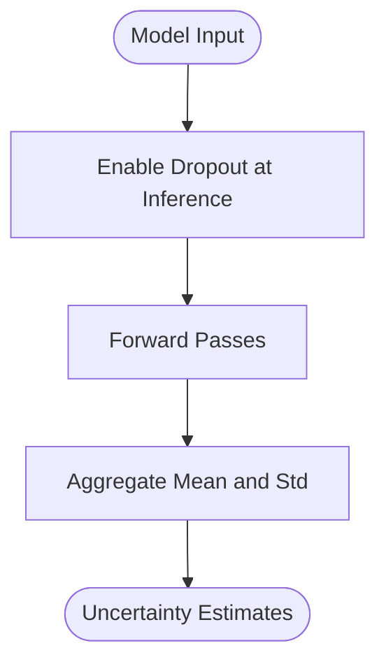

[No sources needed since this diagram shows conceptual workflow, not actual code structure]

#### Real-Time Adaptation
- Online fine-tuning: Retrain or adapter layers on recent race data to adapt to new regulations or tracks.
- Ensemble of experts: Maintain specialized models for different circuits or eras and select dynamically.
- Concept drift detection: Monitor prediction drift and trigger retraining windows.

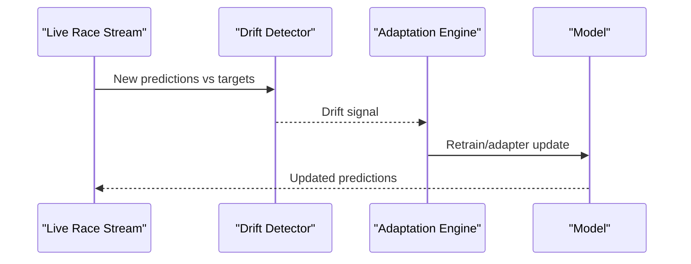

[No sources needed since this diagram shows conceptual workflow, not actual code structure]

## Dependency Analysis
The training pipeline depends on pandas, scikit-learn, PyTorch, and JSON artifacts. The inference server mirrors the training architecture and relies on persisted artifacts.

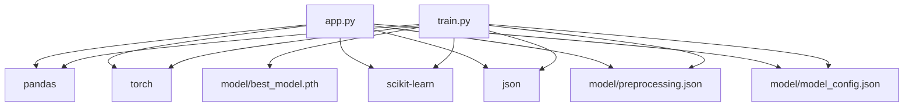

**Diagram sources**
- [train.py:1-11](file://train.py#L1-L11)
- [app.py:1-8](file://app.py#L1-L8)
- [preprocessing.json:1-1](file://model/preprocessing.json#L1-L1)

**Section sources**
- [train.py:1-11](file://train.py#L1-L11)
- [app.py:1-8](file://app.py#L1-L8)

## Performance Considerations
- Regularization: Keep dropout rates and batch normalization to mitigate overfitting.
- Learning rate scheduling: Continue using plateau reduction with warm restarts for robust convergence.
- Early stopping: Maintain patience and best epoch selection to prevent overfitting.
- Batch size tuning: Increase batch size if memory allows for more stable gradients.
- Mixed precision: Enable autocast during training/inference to reduce memory footprint.

[No sources needed since this section provides general guidance]

## Troubleshooting Guide
Common issues and remedies:
- Shape mismatches in embeddings: Verify that constructor and circuit IDs in preprocessing match training classes.
- Missing categories at inference: Fall back to zero indices when unseen IDs are encountered.
- Data leakage in features: Ensure expanding means use appropriate temporal sorting and shifts.
- Device placement: Confirm CPU/GPU device alignment between training and inference.

References:
- Embedding fallback and normalization: [app.py:153-161](file://app.py#L153-L161), [app.py:113-115](file://app.py#L113-L115)
- Temporal feature computation: [train.py:44-61](file://train.py#L44-L61)

**Section sources**
- [app.py:153-161](file://app.py#L153-L161)
- [app.py:113-115](file://app.py#L113-L115)
- [train.py:44-61](file://train.py#L44-L61)

## Conclusion
The repository establishes a strong baseline for F1 point prediction using embeddings and a small MLP. Future work should focus on relational modeling (graphs), sequential modeling (transformers), strategic decision-making (RL), and integrating richer external data sources. Complementary efforts in interpretability, uncertainty quantification, and online adaptation will improve trust, robustness, and real-world deployment readiness.

[No sources needed since this section summarizes without analyzing specific files]

## Appendices

### Experimental Methodology References
- Data splits: Use time-based splits to avoid leakage across races and seasons.
- Metrics: Track MAE, RMSE, exact match percentage, and thresholds around ±2 and ±4 points.
- Cross-validation: Consider group-wise CV by constructor or circuit to assess generalization.

[No sources needed since this section provides general guidance]

### Proof-of-Concept Implementation Paths
- Graph module: Integrate a library such as PyG or DGL to define node and edge types; replace embeddings with GNN outputs.
- Transformer module: Implement a sequence-to-vector encoder with attention pooling; feed into the existing MLP head.
- RL agent: Define state/action/reward spaces; use stable baselines3 or custom training loops with historical logs.

[No sources needed since this section provides general guidance]