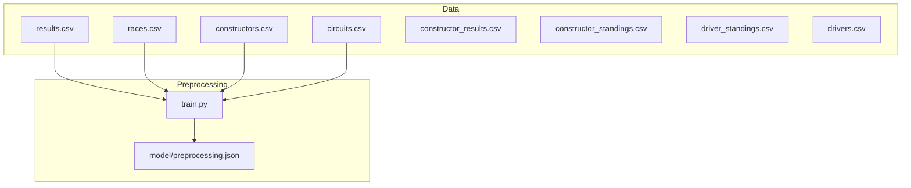
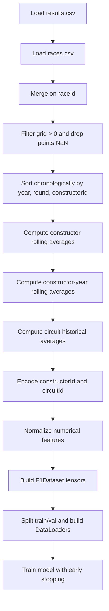
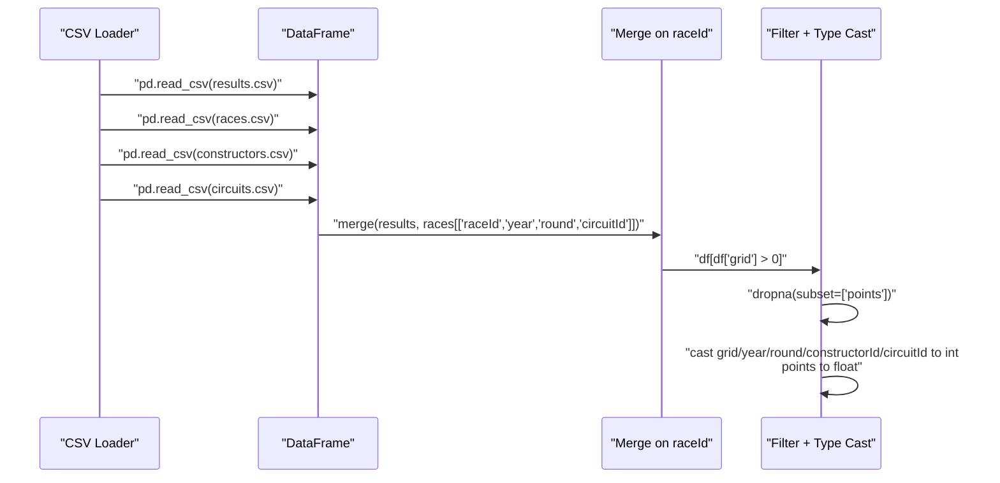
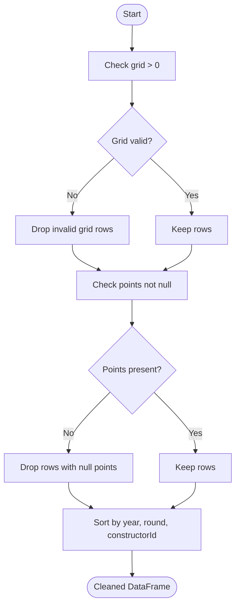
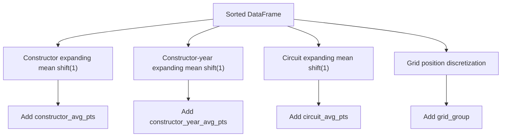
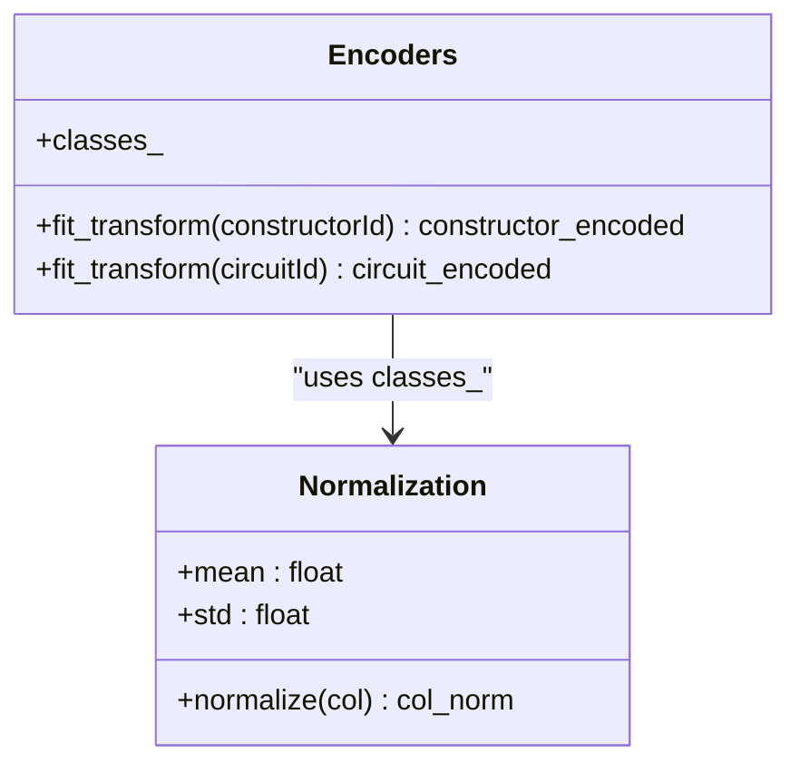
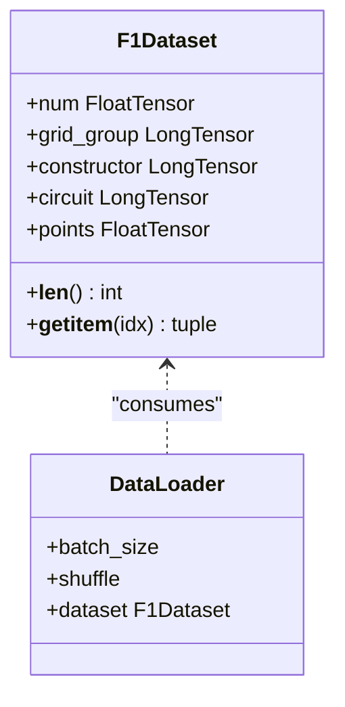
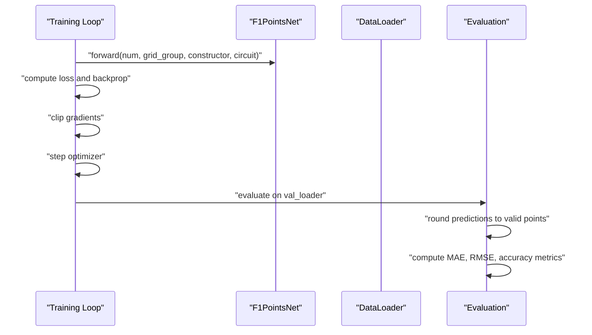
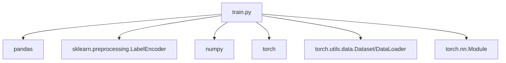

# Data Loading and Preprocessing Pipeline

<cite>
**Referenced Files in This Document**
- [train.py](file://train.py)
- [preprocessing.json](file://model/preprocessing.json)
- [results.csv](file://data/results.csv)
- [races.csv](file://data/races.csv)
- [constructors.csv](file://data/constructors.csv)
- [circuits.csv](file://data/circuits.csv)
- [constructor_results.csv](file://data/constructor_results.csv)
- [constructor_standings.csv](file://data/constructor_standings.csv)
- [driver_standings.csv](file://data/driver_standings.csv)
- [drivers.csv](file://data/drivers.csv)
</cite>

## Table of Contents
1. [Introduction](#introduction)
2. [Project Structure](#project-structure)
3. [Core Components](#core-components)
4. [Architecture Overview](#architecture-overview)
5. [Detailed Component Analysis](#detailed-component-analysis)
6. [Dependency Analysis](#dependency-analysis)
7. [Performance Considerations](#performance-considerations)
8. [Troubleshooting Guide](#troubleshooting-guide)
9. [Conclusion](#conclusion)

## Introduction
This document explains the complete data loading and preprocessing workflow used to prepare Formula 1 race results for training a neural network that predicts points. It covers the sequential steps from CSV loading through data cleaning, merging, feature engineering, encoding, normalization, and conversion into PyTorch tensors. It also documents validation procedures, error handling, transformation logic, memory management strategies, and troubleshooting guidance for common data loading issues.

## Project Structure
The training pipeline is implemented in a single script that orchestrates data loading, preprocessing, dataset creation, and model training. Supporting artifacts are saved under the model directory for reuse during inference.

**Diagram sources**
- [train.py:19-31](file://train.py#L19-L31)
- [preprocessing.json:1-1](file://model/preprocessing.json#L1-L1)

**Section sources**
- [train.py:19-31](file://train.py#L19-L31)
- [preprocessing.json:1-1](file://model/preprocessing.json#L1-L1)

## Core Components
- Data loading and merging: Load results, races, constructors, and circuits; merge to create a unified dataset keyed by race.
- Data cleaning: Filter invalid rows, drop missing target values, and cast types appropriately.
- Feature engineering: Compute historical averages per constructor and circuit, and derive categorical groups from grid positions.
- Encoding and normalization: Encode categorical IDs and normalize numerical features; persist statistics for inference.
- Dataset construction: Build a PyTorch Dataset and DataLoader for training and validation splits.
- Model training: Train a neural network with early stopping and learning rate scheduling.

**Section sources**
- [train.py:19-31](file://train.py#L19-L31)
- [train.py:39-73](file://train.py#L39-L73)
- [train.py:78-108](file://train.py#L78-L108)
- [train.py:116-136](file://train.py#L116-L136)
- [train.py:175-242](file://train.py#L175-L242)

## Architecture Overview
The pipeline follows a linear workflow: load CSV files, merge and clean, engineer features, encode and normalize, construct tensors, split into train/validation, and train the model.

**Diagram sources**
- [train.py:19-31](file://train.py#L19-L31)
- [train.py:41-61](file://train.py#L41-L61)
- [train.py:78-108](file://train.py#L78-L108)
- [train.py:116-136](file://train.py#L116-L136)
- [train.py:175-242](file://train.py#L175-L242)

## Detailed Component Analysis

### Data Loading and Merging
- Load results, races, constructors, and circuits from CSV files.
- Merge results with selected columns from races to attach year, round, and circuitId.
- Filter out rows where grid is not positive and points are missing.
- Cast numeric columns to int/float types to ensure consistent dtypes.

**Diagram sources**
- [train.py:19-31](file://train.py#L19-L31)

**Section sources**
- [train.py:19-31](file://train.py#L19-L31)

### Data Cleaning and Validation
- Remove rows where grid is not positive to exclude non-starters.
- Drop rows where points are null to ensure a valid target variable.
- Validate that categorical IDs exist in the respective encoders later in preprocessing.
- Ensure chronological sorting to prevent data leakage during rolling average computation.

**Diagram sources**
- [train.py:24-31](file://train.py#L24-L31)
- [train.py:41-42](file://train.py#L41-L42)

**Section sources**
- [train.py:24-31](file://train.py#L24-L31)
- [train.py:41-42](file://train.py#L41-L42)

### Feature Engineering
- Constructor rolling average points (expanding mean with shift(1)) to avoid leakage.
- Constructor-year rolling average points to capture seasonal trends.
- Circuit historical average points to incorporate track characteristics.
- Discretize grid positions into groups to reduce cardinality and improve generalization.

**Diagram sources**
- [train.py:44-61](file://train.py#L44-L61)
- [train.py:63-72](file://train.py#L63-L72)

**Section sources**
- [train.py:44-61](file://train.py#L44-L61)
- [train.py:63-72](file://train.py#L63-L72)

### Categorical Encoding and Numerical Normalization
- Fit LabelEncoders on constructorId and circuitId to transform them into dense integer indices.
- Persist encoder classes and normalization statistics for inference-time reconstruction.
- Normalize numerical features using mean and standard deviation; handle zero variance by falling back to a small epsilon.

**Diagram sources**
- [train.py:78-96](file://train.py#L78-L96)
- [train.py:98-108](file://train.py#L98-L108)

**Section sources**
- [train.py:78-96](file://train.py#L78-L96)
- [train.py:98-108](file://train.py#L98-L108)

### Dataset Construction and Tensor Conversion
- Define a custom Dataset that stacks normalized numerical features, categorical embeddings, and targets.
- Split into train and validation sets, then wrap with DataLoader for batching and shuffling.

**Diagram sources**
- [train.py:116-136](file://train.py#L116-L136)

**Section sources**
- [train.py:116-136](file://train.py#L116-L136)

### Model Training and Evaluation
- Train a neural network with embedding layers for categorical features and dense layers for numerical features.
- Use early stopping and ReduceLROnPlateau to prevent overfitting.
- Evaluate on validation set and compute metrics with rounded predictions snapped to valid point values.

**Diagram sources**
- [train.py:141-172](file://train.py#L141-L172)
- [train.py:183-242](file://train.py#L183-L242)
- [train.py:265-296](file://train.py#L265-L296)

**Section sources**
- [train.py:141-172](file://train.py#L141-L172)
- [train.py:183-242](file://train.py#L183-L242)
- [train.py:265-296](file://train.py#L265-L296)

## Dependency Analysis
The preprocessing pipeline depends on:
- CSV files containing race results, races, constructors, and circuits.
- Pandas for data manipulation and transformations.
- Scikit-learn’s LabelEncoder for categorical encoding.
- NumPy for numerical operations and tensor conversion.
- PyTorch for dataset construction, model definition, and training.

**Diagram sources**
- [train.py:1-11](file://train.py#L1-L11)

**Section sources**
- [train.py:1-11](file://train.py#L1-L11)

## Performance Considerations
- Memory management:
  - Use column selection during merge to minimize memory footprint.
  - Convert types early to reduce memory usage (int/float).
  - Avoid copying data unnecessarily; use .copy() only when required.
- Large dataset handling:
  - The pipeline loads all data into memory; for larger datasets, consider chunking or Dask-style partitioning.
  - Use categorical dtype where applicable to reduce memory consumption.
- Normalization stability:
  - The pipeline falls back to a small epsilon when standard deviation is near zero to avoid division by zero.
- Training efficiency:
  - Adjust DataLoader batch sizes to balance memory and throughput.
  - Use GPU acceleration if available; the model currently runs on CPU.

[No sources needed since this section provides general guidance]

## Troubleshooting Guide
Common issues and resolutions:
- Missing or invalid grid values:
  - Ensure grid > 0 before proceeding; rows with invalid grid are dropped.
- Null points:
  - Drop rows with null points to avoid undefined targets.
- Encoder mismatch:
  - Verify that constructorId and circuitId values in the dataset are covered by the saved encoder classes.
- Zero variance in normalization:
  - The pipeline handles near-zero std by using a fallback; confirm that normalization stats were saved and loaded correctly.
- Data leakage prevention:
  - Confirm that the dataset is sorted chronologically before computing rolling averages.
- Inference alignment:
  - Reuse the saved preprocessing.json to reconstruct encoders and normalization parameters during inference.

**Section sources**
- [train.py:24-31](file://train.py#L24-L31)
- [train.py:78-96](file://train.py#L78-L96)
- [train.py:98-108](file://train.py#L98-L108)
- [train.py:41-42](file://train.py#L41-L42)

## Conclusion
The pipeline provides a robust, reproducible workflow for preparing Formula 1 race data into training-ready tensors. It emphasizes careful data cleaning, leak-free feature engineering, stable normalization, and consistent encoding for inference. By following the documented steps and troubleshooting tips, users can reliably reproduce the preprocessing and train the model with minimal friction.