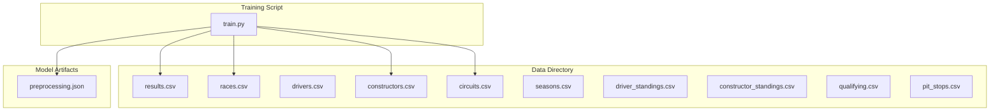
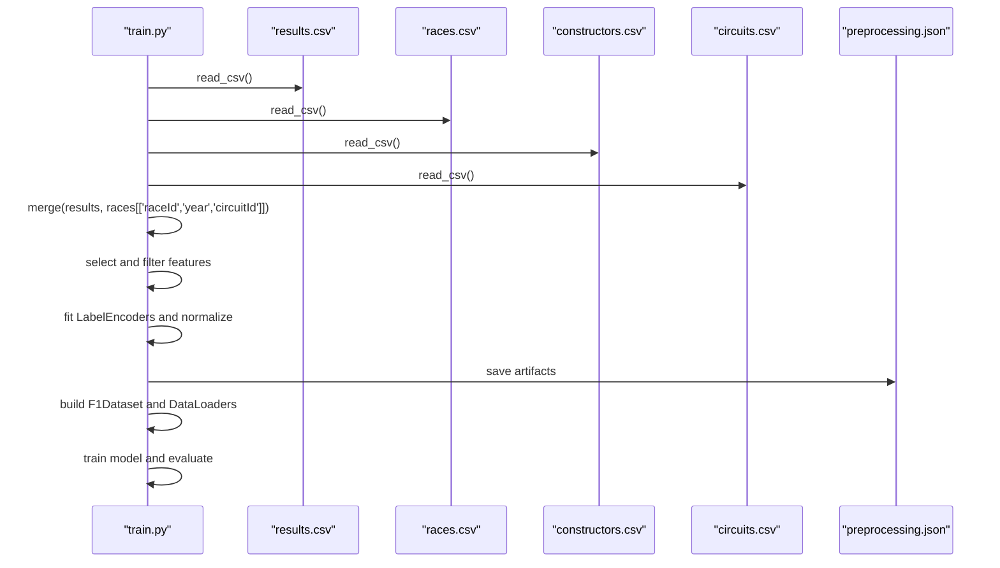
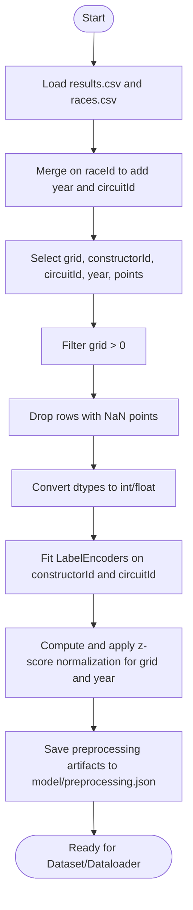
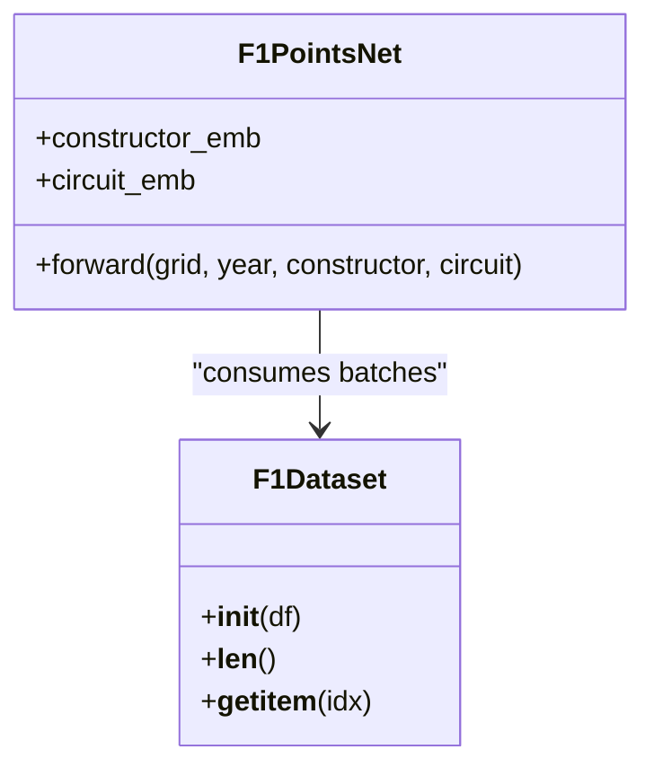
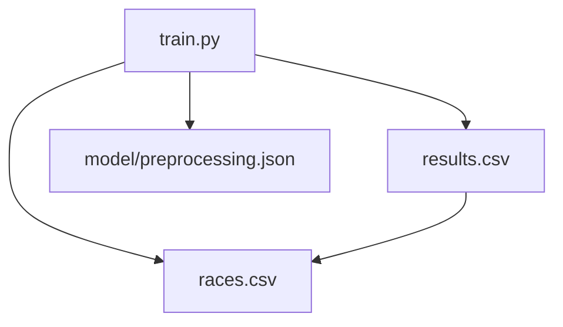

# Data Management

<cite>
**Referenced Files in This Document**
- [train.py](file://train.py)
- [preprocessing.json](file://model/preprocessing.json)
- [results.csv](file://data/results.csv)
- [races.csv](file://data/races.csv)
- [drivers.csv](file://data/drivers.csv)
- [constructors.csv](file://data/constructors.csv)
- [circuits.csv](file://data/circuits.csv)
- [seasons.csv](file://data/seasons.csv)
- [driver_standings.csv](file://data/driver_standings.csv)
- [constructor_standings.csv](file://data/constructor_standings.csv)
- [qualifying.csv](file://data/qualifying.csv)
- [pit_stops.csv](file://data/pit_stops.csv)
</cite>

## Table of Contents
1. [Introduction](#introduction)
2. [Project Structure](#project-structure)
3. [Core Components](#core-components)
4. [Architecture Overview](#architecture-overview)
5. [Detailed Component Analysis](#detailed-component-analysis)
6. [Dependency Analysis](#dependency-analysis)
7. [Performance Considerations](#performance-considerations)
8. [Troubleshooting Guide](#troubleshooting-guide)
9. [Conclusion](#conclusion)
10. [Appendices](#appendices)

## Introduction
This document describes the data management strategy for the F1 prediction project, focusing on the schema of the 12 core CSV datasets, relationships among them, and the end-to-end preprocessing pipeline that transforms raw race data into training features. It also covers data validation, quality assurance, and operational procedures for versioning and updates.

## Project Structure
The repository organizes F1 data under the data/ directory and training/inference assets under model/. The training script orchestrates loading, merging, cleaning, encoding, normalization, and model training.

**Diagram sources**
- [train.py:19-22](file://train.py#L19-L22)
- [preprocessing.json:1-1](file://model/preprocessing.json#L1-L1)

**Section sources**
- [train.py:19-22](file://train.py#L19-L22)
- [preprocessing.json:1-1](file://model/preprocessing.json#L1-L1)

## Core Components
- Data loading and merging: Loads results, races, constructors, and circuits; merges to attach year and circuitId to each result row.
- Feature engineering: Selects grid, constructorId, circuitId, year; filters invalid grid positions and missing points; normalizes numeric features.
- Encoding: Applies label encoding to constructorId and circuitId to produce contiguous indices for embedding layers.
- Dataset and dataloader: Wraps normalized features into a PyTorch Dataset and DataLoader for batching.
- Model: A neural net with embedding layers for categorical features and dense layers for regression.
- Evaluation: Computes MAE, RMSE, and exact match after rounding predictions to valid F1 points.

**Section sources**
- [train.py:19-46](file://train.py#L19-L46)
- [train.py:48-86](file://train.py#L48-L86)
- [train.py:87-120](file://train.py#L87-L120)
- [train.py:121-167](file://train.py#L121-L167)
- [train.py:169-240](file://train.py#L169-L240)
- [train.py:241-306](file://train.py#L241-L306)

## Architecture Overview
The preprocessing pipeline follows a deterministic flow: load → merge → filter → encode → normalize → build dataset → train model → evaluate.

**Diagram sources**
- [train.py:19-86](file://train.py#L19-L86)
- [train.py:87-120](file://train.py#L87-L120)
- [train.py:169-240](file://train.py#L169-L240)
- [preprocessing.json:1-1](file://model/preprocessing.json#L1-L1)

## Detailed Component Analysis

### Schema and Relationships

#### races.csv
- Purpose: Seasonal calendar and scheduling metadata.
- Key fields: raceId (PK), year, circuitId (FK), date/time fields for practice/qualifying/sprint.
- Relationships: linked to results via raceId; linked to circuits via circuitId.

**Section sources**
- [races.csv:1-10](file://data/races.csv#L1-L10)

#### drivers.csv
- Purpose: Driver identities and biographical info.
- Key fields: driverId (PK), driverRef, number, code, forename, surname, dob, nationality, url.
- Usage: Not directly used in the training pipeline; included for completeness.

**Section sources**
- [drivers.csv:1-10](file://data/drivers.csv#L1-L10)

#### constructors.csv
- Purpose: Constructor identities and nationalities.
- Key fields: constructorId (PK), constructorRef, name, nationality, url.
- Usage: Not directly used in the training pipeline; included for completeness.

**Section sources**
- [constructors.csv:1-10](file://data/constructors.csv#L1-L10)

#### circuits.csv
- Purpose: Circuit locations and geographic info.
- Key fields: circuitId (PK), circuitRef, name, location, country, lat, lng, alt, url.
- Usage: Not directly used in the training pipeline; included for completeness.

**Section sources**
- [circuits.csv:1-10](file://data/circuits.csv#L1-L10)

#### seasons.csv
- Purpose: Season URLs for historical context.
- Key fields: year (PK), url.
- Usage: Not directly used in the training pipeline; included for completeness.

**Section sources**
- [seasons.csv:1-10](file://data/seasons.csv#L1-L10)

#### results.csv
- Purpose: Race result records including finishing positions, points, laps, times, fastest lap, and status.
- Key fields: resultId (PK), raceId (FK), driverId (FK), constructorId (FK), grid, position, positionText, positionOrder, points, laps, time, milliseconds, fastestLap, rank, fastestLapTime, fastestLapSpeed, statusId.
- Usage: Central dataset for supervised learning; merged with races to obtain year and circuitId.

**Section sources**
- [results.csv:1-20](file://data/results.csv#L1-L20)

#### driver_standings.csv
- Purpose: Driver championship standings per race.
- Key fields: driverStandingsId (PK), raceId (FK), driverId (FK), points, position, positionText, wins.
- Usage: Not directly used in the training pipeline; included for completeness.

**Section sources**
- [driver_standings.csv:1-20](file://data/driver_standings.csv#L1-L20)

#### constructor_standings.csv
- Purpose: Constructor championship standings per race.
- Key fields: constructorStandingsId (PK), raceId (FK), constructorId (FK), points, position, positionText, wins.
- Usage: Not directly used in the training pipeline; included for completeness.

**Section sources**
- [constructor_standings.csv:1-20](file://data/constructor_standings.csv#L1-L20)

#### qualifying.csv
- Purpose: Qualifying session results (q1, q2, q3).
- Key fields: qualifyId (PK), raceId (FK), driverId (FK), constructorId (FK), number, position, q1, q2, q3.
- Usage: Not directly used in the training pipeline; included for completeness.

**Section sources**
- [qualifying.csv:1-20](file://data/qualifying.csv#L1-L20)

#### pit_stops.csv
- Purpose: Pit stop timing data.
- Key fields: raceId (FK), driverId (FK), stop, lap, time, duration, milliseconds.
- Usage: Not directly used in the training pipeline; included for completeness.

**Section sources**
- [pit_stops.csv:1-20](file://data/pit_stops.csv#L1-L20)

### Data Loading, Cleaning, and Merging Strategy
- Load results and races; merge on raceId to attach year and circuitId.
- Select relevant features: grid, constructorId, circuitId, year, points.
- Quality checks:
  - Remove rows where grid <= 0 (DNQ/did not start).
  - Drop rows where points are null.
- Type conversions: ensure integer/float dtypes for numeric features.
- Normalization: compute mean/std for grid and year; apply z-score normalization.
- Encoding: fit LabelEncoders on constructorId and circuitId to produce contiguous indices for embedding layers.

**Diagram sources**
- [train.py:19-46](file://train.py#L19-L46)
- [train.py:48-86](file://train.py#L48-L86)

**Section sources**
- [train.py:19-46](file://train.py#L19-L46)
- [train.py:48-86](file://train.py#L48-L86)

### Data Validation and Quality Assurance
- Missing data: points must not be null; rows with null points are dropped.
- Invalid grid: grid <= 0 indicates did-not-start; these rows are filtered out.
- Data types: explicit casting ensures numeric features are stored as int/float.
- Encoding coverage: preprocessing artifacts capture encoder classes to ensure consistent mapping during inference.

**Section sources**
- [train.py:30-39](file://train.py#L30-L39)
- [train.py:71-86](file://train.py#L71-L86)
- [preprocessing.json:1-1](file://model/preprocessing.json#L1-L1)

### Feature Engineering and Training Features
- Inputs:
  - Numerical: grid (normalized), year (normalized)
  - Categorical: constructorId (encoded), circuitId (encoded)
- Target: points (continuous)
- Post-processing: predictions are rounded to nearest valid F1 points value (0,1,2,4,6,8,10,12,15,18,25).

**Diagram sources**
- [train.py:90-108](file://train.py#L90-L108)
- [train.py:124-161](file://train.py#L124-L161)

**Section sources**
- [train.py:90-108](file://train.py#L90-L108)
- [train.py:124-161](file://train.py#L124-L161)
- [train.py:266-274](file://train.py#L266-L274)

### Data Versioning, Updates, and Maintenance
- Versioning: seasons.csv provides per-year URLs for historical context; new seasons are appended to this file.
- Data updates:
  - Add new race results to results.csv; ensure raceId exists in races.csv.
  - Append new races to races.csv with matching circuitId.
  - Retrain the model after updating data; preprocessing artifacts must be regenerated.
- Maintenance:
  - Keep preprocessing.json synchronized with encoder classes and normalization stats.
  - Validate that constructorId and circuitId values in results.csv align with constructors.csv and circuits.csv respectively.

**Section sources**
- [seasons.csv:1-20](file://data/seasons.csv#L1-L20)
- [train.py:71-86](file://train.py#L71-L86)

## Dependency Analysis
The training script depends on the following relationships:
- results.csv depends on races.csv (raceId).
- results.csv depends on constructors.csv and circuits.csv indirectly via IDs.
- preprocessing.json captures encoder classes and normalization parameters for inference consistency.

**Diagram sources**
- [train.py:19-22](file://train.py#L19-L22)
- [train.py:71-86](file://train.py#L71-L86)

**Section sources**
- [train.py:19-22](file://train.py#L19-L22)
- [train.py:71-86](file://train.py#L71-L86)

## Performance Considerations
- Memory efficiency: Only selected columns are loaded and retained.
- Normalization: Using mean/std reduces scale differences between grid and year.
- Embedding dimensionality: Embedding size of 16 balances representational capacity and computational cost.
- Early stopping and LR scheduling: Prevent overfitting and improve convergence stability.

[No sources needed since this section provides general guidance]

## Troubleshooting Guide
- Missing points after filtering: Ensure results.csv contains non-null points for the selected rows.
- LabelEncoder mismatch: If constructorId or circuitId values change, re-run preprocessing to update preprocessing.json.
- Shape mismatches: Verify that encoded indices are within the range of embedding matrices.
- Inference drift: Regenerate preprocessing.json when adding new constructors or circuits.

**Section sources**
- [train.py:30-39](file://train.py#L30-L39)
- [train.py:71-86](file://train.py#L71-L86)

## Conclusion
The project’s data management strategy centers on a clean, reproducible pipeline that loads results, enriches them with race metadata, normalizes features, encodes categories, and trains a neural network to predict points. Robust preprocessing artifacts and validation steps ensure reliable training and inference, while explicit relationships among datasets guide future updates and maintenance.

[No sources needed since this section summarizes without analyzing specific files]

## Appendices

### Appendix A: Feature and Target Definitions
- Inputs:
  - grid: starting grid position (normalized)
  - year: race year (normalized)
  - constructorId: constructor identifier (encoded)
  - circuitId: circuit identifier (encoded)
- Target:
  - points: race points (continuous)

**Section sources**
- [train.py:27-46](file://train.py#L27-L46)