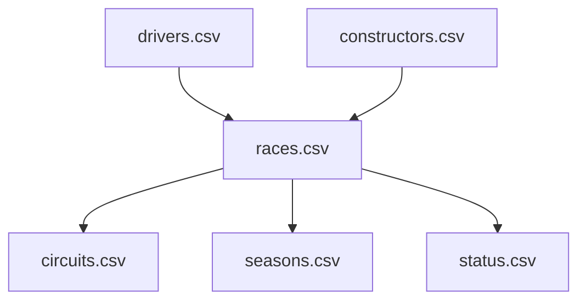
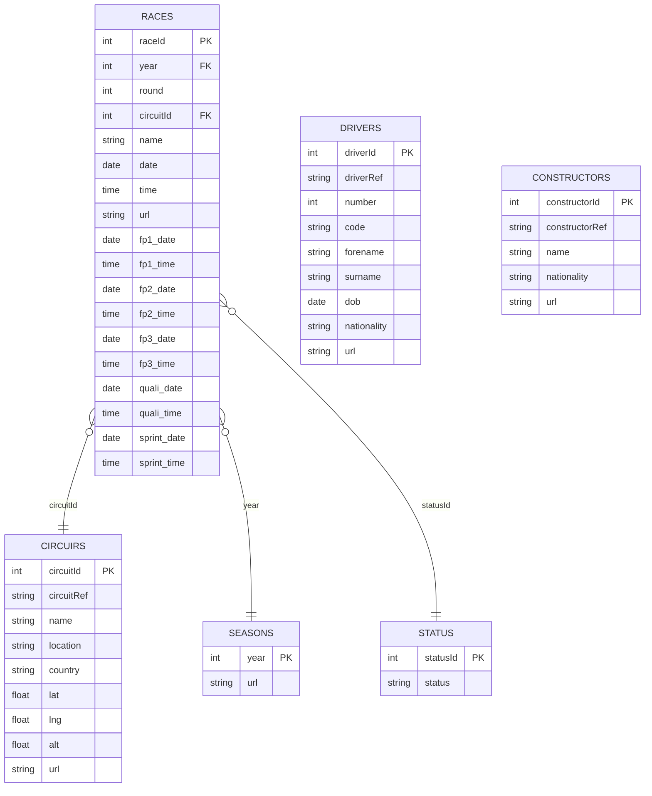
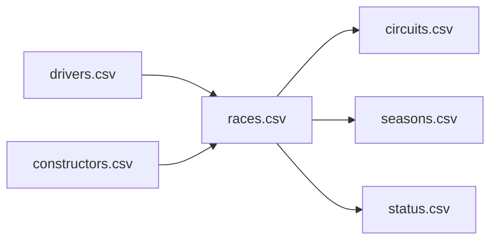

# Dataset Schema and Structure

<cite>
**Referenced Files in This Document**
- [races.csv](file://data/races.csv)
- [drivers.csv](file://data/drivers.csv)
- [constructors.csv](file://data/constructors.csv)
- [circuits.csv](file://data/circuits.csv)
- [seasons.csv](file://data/seasons.csv)
- [status.csv](file://data/status.csv)
</cite>

## Table of Contents
1. [Introduction](#introduction)
2. [Project Structure](#project-structure)
3. [Core Components](#core-components)
4. [Architecture Overview](#architecture-overview)
5. [Detailed Component Analysis](#detailed-component-analysis)
6. [Dependency Analysis](#dependency-analysis)
7. [Performance Considerations](#performance-considerations)
8. [Troubleshooting Guide](#troubleshooting-guide)
9. [Conclusion](#conclusion)

## Introduction
This document describes the F1 dataset schema with emphasis on the six core tables: races, drivers, constructors, circuits, seasons, and status. It explains table structures, field definitions, data types, primary keys, and foreign key relationships. Practical examples illustrate typical data entries, and we discuss data completeness, null handling, and quality indicators. Finally, we explain how each table contributes to F1 points prediction modeling.

## Project Structure
The dataset is organized as a set of CSV files, each representing a normalized relational table. The core tables referenced here are:
- races: race metadata and scheduling
- drivers: driver identities and biographical details
- constructors: team identities and nationalities
- circuits: track information and locations
- seasons: year-to-year season metadata
- status: status identifiers for race outcomes

**Diagram sources**
- [races.csv](file://data/races.csv)
- [drivers.csv](file://data/drivers.csv)
- [constructors.csv](file://data/constructors.csv)
- [circuits.csv](file://data/circuits.csv)
- [seasons.csv](file://data/seasons.csv)
- [status.csv](file://data/status.csv)

**Section sources**
- [races.csv](file://data/races.csv)
- [drivers.csv](file://data/drivers.csv)
- [constructors.csv](file://data/constructors.csv)
- [circuits.csv](file://data/circuits.csv)
- [seasons.csv](file://data/seasons.csv)
- [status.csv](file://data/status.csv)

## Core Components
This section summarizes the six core tables, their roles, and how they relate to each other.

- races
  - Purpose: Holds race-level information including year, round, circuit, date/time, and URLs.
  - Primary key: raceId
  - Foreign keys: circuitId → circuits, year → seasons (conceptual join), statusId → status (conceptual join)
  - Typical fields: year, round, circuitId, name, date, time, url, fp1_* to sprint_time

- drivers
  - Purpose: Driver identity and profile (names, nationality, date of birth, reference).
  - Primary key: driverId
  - Typical fields: driverRef, number, code, forename, surname, dob, nationality, url

- constructors
  - Purpose: Team identity and nationality.
  - Primary key: constructorId
  - Typical fields: constructorRef, name, nationality, url

- circuits
  - Purpose: Circuit/tracks metadata (location, country, locality, lat/long).
  - Primary key: circuitId
  - Typical fields: circuitRef, name, location, country, lat, lng, alt, url

- seasons
  - Purpose: Season/year metadata.
  - Primary key: year
  - Typical fields: year, url

- status
  - Purpose: Status identifiers for race outcomes (e.g., finished, retired, crashed).
  - Primary key: statusId
  - Typical fields: statusId, status

Notes on nulls and completeness:
- Some date/time fields in races may be null for practice/qualifying sessions depending on the year.
- Drivers may have missing number/code in historical datasets.

**Section sources**
- [races.csv](file://data/races.csv)
- [drivers.csv](file://data/drivers.csv)
- [constructors.csv](file://data/constructors.csv)
- [circuits.csv](file://data/circuits.csv)
- [seasons.csv](file://data/seasons.csv)
- [status.csv](file://data/status.csv)

## Architecture Overview
The core tables form a star-like schema centered around races. Races link to circuits (location), seasons (year), and status (outcome classification). Drivers and constructors are associated with races via result tables (not covered here), but the core schema is defined by these six tables.

**Diagram sources**
- [races.csv](file://data/races.csv)
- [circuits.csv](file://data/circuits.csv)
- [seasons.csv](file://data/seasons.csv)
- [status.csv](file://data/status.csv)
- [drivers.csv](file://data/drivers.csv)
- [constructors.csv](file://data/constructors.csv)

## Detailed Component Analysis

### races
- Purpose: Central table for race events, including scheduling and session timestamps.
- Primary key: raceId
- Foreign keys: circuitId → circuits, year → seasons (conceptual), statusId → status (conceptual)
- Typical fields and meanings:
  - raceId: Unique identifier per race edition
  - year: Season year
  - round: Race number within the season
  - circuitId: Track identifier
  - name: Race name
  - date/time: Race day and scheduled start time
  - url: Wikipedia link
  - fp1_date/time, fp2_date/time, fp3_date/time: Free practice session dates/times
  - quali_date/time: Qualifying session date/time
  - sprint_date/time: Sprint shootout date/time (introduced in recent seasons)
- Sample record (typical):
  - year=2009, round=1, circuitId=1, name="Australian Grand Prix", date="2009-03-29", time="06:00:00"
- Data completeness and nulls:
  - Session timestamps may be null for early years or non-standard calendars.
- Quality indicators:
  - Consistent date/time formatting; url links to official pages.

**Section sources**
- [races.csv](file://data/races.csv)

### drivers
- Purpose: Driver identity and profile.
- Primary key: driverId
- Typical fields and meanings:
  - driverId: Unique driver identifier
  - driverRef: Stable reference string
  - number: Driver’s racing number
  - code: Three-letter code (e.g., "HAM")
  - forename/surname: Names
  - dob: Date of birth
  - nationality: Country/nationality
  - url: Wikipedia link
- Sample record (typical):
  - driverRef="hamilton", code="HAM", forename="Lewis", surname="Hamilton", dob="1985-01-07", nationality="British"
- Data completeness and nulls:
  - Historical drivers sometimes lack number/code.
- Quality indicators:
  - Stable driverRef enables joins across years.

**Section sources**
- [drivers.csv](file://data/drivers.csv)

### constructors
- Purpose: Constructor/team identity and nationality.
- Primary key: constructorId
- Typical fields and meanings:
  - constructorId: Unique constructor identifier
  - constructorRef: Stable reference string
  - name: Team name
  - nationality: Country/nationality
  - url: Wikipedia link
- Sample record (typical):
  - constructorRef="mclaren", name="McLaren", nationality="British"
- Data completeness and nulls:
  - No nulls observed in the header row; check rows for missing values.
- Quality indicators:
  - Stable constructorRef supports long-term joins.

**Section sources**
- [constructors.csv](file://data/constructors.csv)

### circuits
- Purpose: Circuit/tracks metadata.
- Primary key: circuitId
- Typical fields and meanings:
  - circuitId: Unique circuit identifier
  - circuitRef: Stable reference string
  - name: Circuit/tracks name
  - location: City/locality
  - country: Country
  - lat/lng: Coordinates
  - alt: Altitude
  - url: Wikipedia link
- Sample record (typical):
  - circuitRef="albert_park", name="Albert Park Grand Prix Circuit", location="Melbourne", country="Australia"
- Data completeness and nulls:
  - Coordinates and altitude may vary by dataset version.
- Quality indicators:
  - Geolocation fields enable spatial analytics.

**Section sources**
- [circuits.csv](file://data/circuits.csv)

### seasons
- Purpose: Season/year metadata.
- Primary key: year
- Typical fields and meanings:
  - year: Season year
  - url: Wikipedia link
- Sample record (typical):
  - year=2009, url="http://en.wikipedia.org/wiki/2009_Formula_One_season"
- Data completeness and nulls:
  - Year is the primary key; no duplicates expected.
- Quality indicators:
  - Year-based grouping for temporal analytics.

**Section sources**
- [seasons.csv](file://data/seasons.csv)

### status
- Purpose: Status identifiers for race outcomes (e.g., finished, retired, crashed).
- Primary key: statusId
- Typical fields and meanings:
  - statusId: Unique status identifier
  - status: Description of outcome category
- Sample record (typical):
  - statusId=1, status="Finished"
- Data completeness and nulls:
  - statusId is the primary key; ensure referential integrity when linking races to status.
- Quality indicators:
  - Standardized categories improve consistency in result interpretation.

**Section sources**
- [status.csv](file://data/status.csv)

## Dependency Analysis
The core tables are linked as follows:
- races.circuitId → circuits.circuitId
- races.year → seasons.year
- races.statusId → status.statusId
- drivers and constructors are indirectly related to races via results tables (not part of this schema)

**Diagram sources**
- [races.csv](file://data/races.csv)
- [drivers.csv](file://data/drivers.csv)
- [constructors.csv](file://data/constructors.csv)
- [circuits.csv](file://data/circuits.csv)
- [seasons.csv](file://data/seasons.csv)
- [status.csv](file://data/status.csv)

**Section sources**
- [races.csv](file://data/races.csv)
- [drivers.csv](file://data/drivers.csv)
- [constructors.csv](file://data/constructors.csv)
- [circuits.csv](file://data/circuits.csv)
- [seasons.csv](file://data/seasons.csv)
- [status.csv](file://data/status.csv)

## Performance Considerations
- Indexing: Use raceId, driverId, constructorId, circuitId, and year as keys for efficient joins.
- Filtering: Prefer filtering by year and round to reduce scans on races.
- Null handling: Account for missing session timestamps in races when computing time-based features.
- Storage: Keep url fields for provenance; avoid storing redundant copies of shared metadata.

## Troubleshooting Guide
Common issues and resolutions:
- Missing session timestamps in races: Expected for early seasons; handle with null checks in queries.
- Historical driver numbers/codes: Not all drivers have numbers/codes; plan fallbacks (e.g., name-based matching).
- Circuit coordinates: Verify presence of lat/lng/alt; otherwise, disable geospatial features.
- Status linkage: Ensure statusId exists in status table before joining races to status.

## Conclusion
The six-table schema provides a solid foundation for F1 analytics and points prediction modeling. races anchors the temporal and geographic context; drivers and constructors supply identity and team affiliation; circuits and seasons define venue and timing; status categorizes outcomes. Proper indexing, null handling, and referential integrity are essential for robust modeling pipelines.