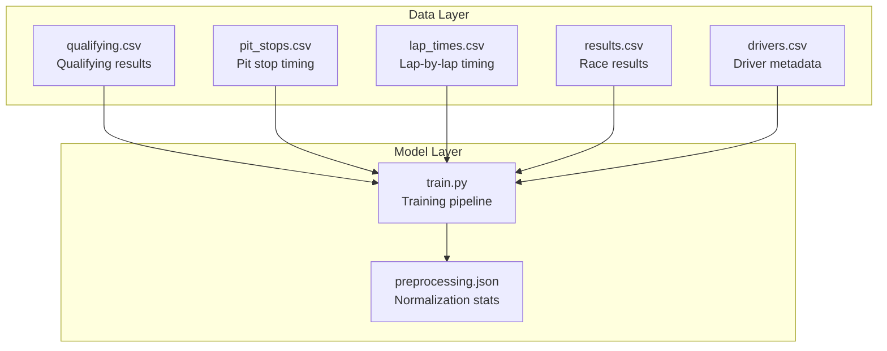
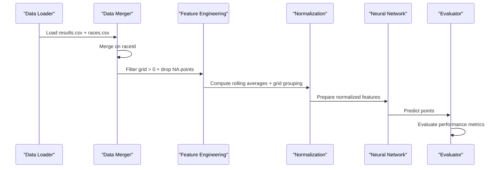
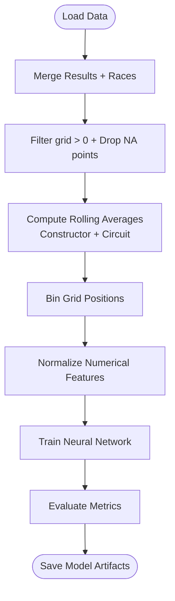
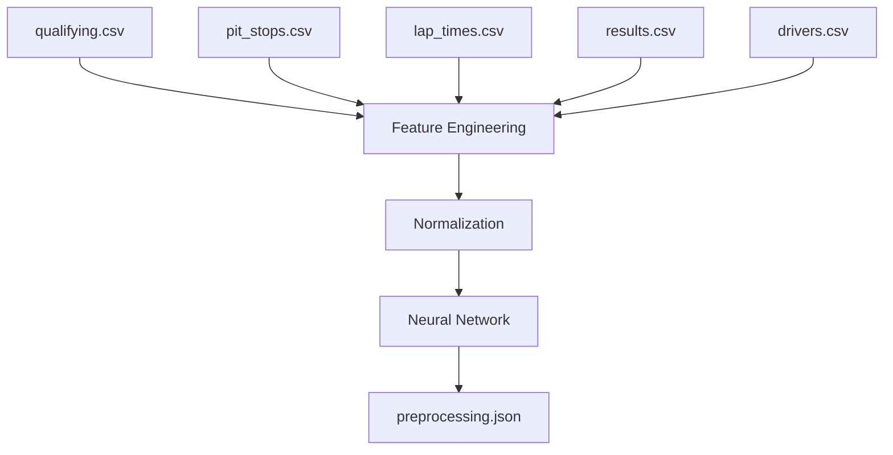

# Qualifying and Pit Stop Data

<cite>
**Referenced Files in This Document**
- [qualifying.csv](file://data/qualifying.csv)
- [pit_stops.csv](file://data/pit_stops.csv)
- [lap_times.csv](file://data/lap_times.csv)
- [results.csv](file://data/results.csv)
- [drivers.csv](file://data/drivers.csv)
- [train.py](file://train.py)
- [preprocessing.json](file://model/preprocessing.json)
</cite>

## Table of Contents
1. [Introduction](#introduction)
2. [Project Structure](#project-structure)
3. [Core Components](#core-components)
4. [Architecture Overview](#architecture-overview)
5. [Detailed Component Analysis](#detailed-component-analysis)
6. [Dependency Analysis](#dependency-analysis)
7. [Performance Considerations](#performance-considerations)
8. [Troubleshooting Guide](#troubleshooting-guide)
9. [Conclusion](#conclusion)

## Introduction
This document provides comprehensive documentation for qualifying and pit stop data tables within the F1 prediction project. It explains how qualifying positions, lap times, and grid placement information contribute to predictive modeling, details pit stop timing and strategy implications, and demonstrates how these datasets integrate into the broader machine learning pipeline. The documentation covers data collection methods, timing precision, consistency across seasons, and practical examples of how qualifying data and pit stop patterns influence driver performance predictions. It also addresses data quality issues specific to timing measurements and strategy documentation.

## Project Structure
The project organizes F1 data across CSV files and a training script that builds a neural network model. The qualifying and pit stop datasets are central to understanding race strategy and performance prediction.

**Diagram sources**
- [qualifying.csv](file://data/qualifying.csv)
- [pit_stops.csv](file://data/pit_stops.csv)
- [lap_times.csv](file://data/lap_times.csv)
- [results.csv](file://data/results.csv)
- [drivers.csv](file://data/drivers.csv)
- [train.py](file://train.py)
- [preprocessing.json](file://model/preprocessing.json)

**Section sources**
- [train.py:19-31](file://train.py#L19-L31)
- [preprocessing.json:1-1](file://model/preprocessing.json#L1-L1)

## Core Components
This section outlines the key datasets and their roles in predictive modeling.

- Qualifying dataset (`data/qualifying.csv`)
  - Contains driver performance during qualifying sessions, including position and session times (q1, q2, q3).
  - Used to derive grid placement and initial performance metrics for predictive features.

- Pit stops dataset (`data/pit_stops.csv`)
  - Records timing and duration of pit stops for each driver in each race.
  - Provides insights into race strategy timing and potential strategic advantages or penalties.

- Lap times dataset (`data/lap_times.csv`)
  - Captures per-lap timing and position changes, enabling analysis of pace variations and overtaking opportunities.
  - Supports construction of driver performance trends and race dynamics.

- Race results dataset (`data/results.csv`)
  - Contains final race outcomes, including finishing positions, points, and race duration.
  - Serves as the target variable for predictive modeling.

- Driver metadata (`data/drivers.csv`)
  - Provides driver identifiers and attributes used for encoding and analysis.

These datasets collectively enable modeling of how qualifying performance translates into race outcomes and how pit stop strategies influence competitive advantage.

**Section sources**
- [qualifying.csv:1-20](file://data/qualifying.csv#L1-L20)
- [pit_stops.csv:1-20](file://data/pit_stops.csv#L1-L20)
- [lap_times.csv:1-20](file://data/lap_times.csv#L1-L20)
- [results.csv:1-20](file://data/results.csv#L1-L20)
- [drivers.csv:1-20](file://data/drivers.csv#L1-L20)

## Architecture Overview
The training pipeline integrates qualifying and pit stop data with race results to build a neural network model. The process involves loading datasets, merging on race identifiers, engineering features (including grid-based groups and historical averages), normalizing numerical features, and training a model to predict points scored by drivers.

**Diagram sources**
- [train.py:19-31](file://train.py#L19-L31)
- [train.py:41-73](file://train.py#L41-L73)
- [train.py:90-108](file://train.py#L90-L108)
- [train.py:197-242](file://train.py#L197-L242)

**Section sources**
- [train.py:19-31](file://train.py#L19-L31)
- [train.py:41-73](file://train.py#L41-L73)
- [train.py:90-108](file://train.py#L90-L108)
- [train.py:197-242](file://train.py#L197-L242)

## Detailed Component Analysis

### Qualifying Data Analysis
Qualifying data captures driver performance during elimination sessions and determines grid positions for races. The dataset includes:
- Session times (q1, q2, q3) and final position for each driver in each race.
- Position indicates grid order, which is a strong predictor of race outcome.

Key considerations:
- Timing precision: Session times are recorded in minutes and seconds with millisecond precision.
- Missing data: Some drivers may not participate in all sessions, indicated by null values in later sessions.
- Season consistency: Data spans multiple seasons, enabling cross-season trend analysis.

Predictive applications:
- Grid position group: Binning grid positions into groups improves model generalization.
- Historical performance: Combining qualifying performance with historical averages helps capture driver and team form.

**Section sources**
- [qualifying.csv:1-20](file://data/qualifying.csv#L1-L20)
- [train.py:62-71](file://train.py#L62-L71)

### Pit Stop Data Analysis
Pit stop timing records the precise moments when drivers enter the pits and the duration of their stops. This dataset enables:
- Strategy timing analysis: Identifying optimal stop windows and deviations from standard strategies.
- Duration variability: Understanding how stop durations vary across races and drivers.
- Impact on race outcome: Correlating pit stop timing with position changes and final standings.

Data characteristics:
- Timestamp precision: Pit stop entries include timestamps and durations in milliseconds.
- Stop frequency: Drivers may make multiple stops per race, tracked by the stop column.
- Consistency: Pit stop data is consistently recorded across races, enabling longitudinal analysis.

**Section sources**
- [pit_stops.csv:1-20](file://data/pit_stops.csv#L1-L20)
- [lap_times.csv:1-20](file://data/lap_times.csv#L1-L20)

### Lap Times Data Analysis
Lap times provide granular insights into driver performance during races:
- Per-lap timing reveals pace variations, tire degradation effects, and overtaking opportunities.
- Position changes per lap highlight strategic moves and incidents.

Integration with other datasets:
- Lap times can be merged with results to correlate performance with final outcomes.
- Combined with qualifying data, lap times help explain how early performance influences race strategy.

**Section sources**
- [lap_times.csv:1-20](file://data/lap_times.csv#L1-L20)
- [results.csv:1-20](file://data/results.csv#L1-L20)

### Feature Engineering and Modeling Pipeline
The training script demonstrates how qualifying and pit stop data are integrated into the modeling pipeline:
- Data loading and merging: Results and races datasets are combined on race identifiers.
- Filtering: Ensures grid positions are valid and removes missing point values.
- Feature engineering: Creates rolling averages for constructors and circuits, and bins grid positions into groups.
- Normalization: Numerical features are normalized using mean and standard deviation statistics.
- Model training: A neural network predicts points scored by drivers, with evaluation metrics reporting accuracy and error rates.

**Diagram sources**
- [train.py:19-31](file://train.py#L19-L31)
- [train.py:41-73](file://train.py#L41-L73)
- [train.py:90-108](file://train.py#L90-L108)
- [train.py:197-242](file://train.py#L197-L242)

**Section sources**
- [train.py:19-31](file://train.py#L19-L31)
- [train.py:41-73](file://train.py#L41-L73)
- [train.py:90-108](file://train.py#L90-L108)
- [train.py:197-242](file://train.py#L197-L242)

## Dependency Analysis
The training pipeline depends on multiple datasets and artifacts. Dependencies include:
- Qualifying and pit stop datasets feed into feature engineering and normalization steps.
- Race results serve as the target variable for model training.
- Preprocessing artifacts (normalization statistics and encoders) are persisted for inference.

**Diagram sources**
- [train.py:19-31](file://train.py#L19-L31)
- [train.py:41-73](file://train.py#L41-L73)
- [train.py:90-108](file://train.py#L90-L108)
- [preprocessing.json:1-1](file://model/preprocessing.json#L1-L1)

**Section sources**
- [train.py:19-31](file://train.py#L19-L31)
- [train.py:41-73](file://train.py#L41-L73)
- [train.py:90-108](file://train.py#L90-L108)
- [preprocessing.json:1-1](file://model/preprocessing.json#L1-L1)

## Performance Considerations
- Data volume: The datasets are substantial (e.g., lap times contains hundreds of thousands of rows), requiring efficient loading and processing.
- Temporal sorting: Chronological ordering prevents data leakage during feature engineering.
- Normalization stability: Using stored normalization statistics ensures consistent preprocessing across training and inference.
- Early stopping and learning rate scheduling: Prevent overfitting and improve convergence during training.

[No sources needed since this section provides general guidance]

## Troubleshooting Guide
Common data quality issues and remedies:
- Missing timing values: Some drivers may not complete all qualifying sessions, resulting in null values. These should be handled during preprocessing to avoid bias.
- Inconsistent timestamps: Ensure timestamps are parsed consistently across datasets to prevent misalignment in merges.
- Outliers in pit stop durations: Investigate extreme values that may indicate data errors or exceptional circumstances.
- Grid position anomalies: Verify grid > 0 filtering aligns with intended modeling scope.

Validation steps:
- Confirm raceId and driverId joins are correct across datasets.
- Check normalization statistics are applied consistently.
- Validate feature engineering logic does not introduce leakage.

**Section sources**
- [train.py:24-31](file://train.py#L24-L31)
- [train.py:41-47](file://train.py#L41-L47)
- [train.py:90-97](file://train.py#L90-L97)

## Conclusion
Qualifying and pit stop data are integral to predictive modeling in Formula 1 racing. Qualifying performance establishes baseline expectations and grid positioning, while pit stop timing and strategy reveal tactical decisions that can significantly impact race outcomes. By integrating these datasets into a robust training pipeline—complete with careful feature engineering, normalization, and evaluation—the model can effectively learn patterns linking qualifying performance and pit strategy to driver points. Addressing data quality issues and maintaining temporal consistency ensures reliable predictions across seasons.