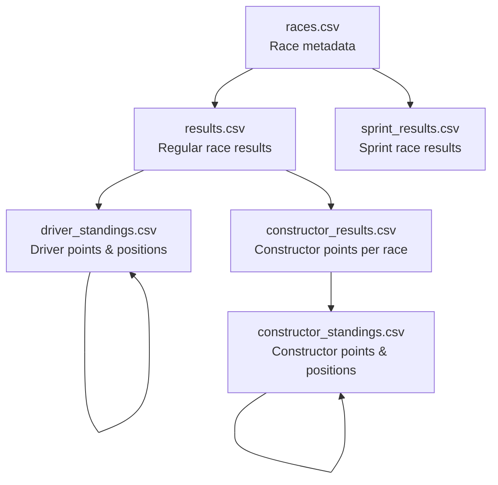
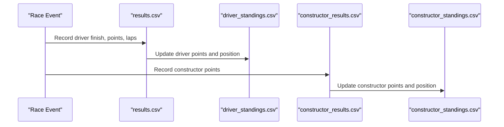
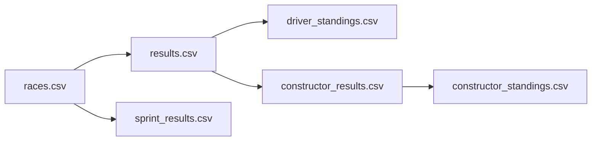

# Results and Standings Data

<cite>
**Referenced Files in This Document**
- [results.csv](file://data/results.csv)
- [driver_standings.csv](file://data/driver_standings.csv)
- [constructor_standings.csv](file://data/constructor_standings.csv)
- [constructor_results.csv](file://data/constructor_results.csv)
- [sprint_results.csv](file://data/sprint_results.csv)
- [races.csv](file://data/races.csv)
</cite>

## Table of Contents
1. [Introduction](#introduction)
2. [Project Structure](#project-structure)
3. [Core Components](#core-components)
4. [Architecture Overview](#architecture-overview)
5. [Detailed Component Analysis](#detailed-component-analysis)
6. [Dependency Analysis](#dependency-analysis)
7. [Performance Considerations](#performance-considerations)
8. [Troubleshooting Guide](#troubleshooting-guide)
9. [Conclusion](#conclusion)

## Introduction
This document explains the results and standings data tables that power F1 championship calculations and predictions. It focuses on how race outcomes are recorded in results tables, how driver and constructor standings are computed and updated, and how constructor performance is captured via dedicated results. It also covers special cases such as sprint races and how data flows from raw race results to championship tallies.

## Project Structure
The dataset is organized as discrete CSV files representing races, drivers, constructors, and their outcomes and standings. The primary tables are:
- Race-level results: results.csv (regular races) and sprint_results.csv (sprint races)
- Driver standings: driver_standings.csv
- Constructor standings: constructor_standings.csv
- Constructor-specific race performance: constructor_results.csv
- Race metadata: races.csv

**Diagram sources**
- [results.csv](file://data/results.csv)
- [driver_standings.csv](file://data/driver_standings.csv)
- [constructor_results.csv](file://data/constructor_results.csv)
- [constructor_standings.csv](file://data/constructor_standings.csv)
- [sprint_results.csv](file://data/sprint_results.csv)
- [races.csv](file://data/races.csv)

**Section sources**
- [results.csv](file://data/results.csv)
- [driver_standings.csv](file://data/driver_standings.csv)
- [constructor_standings.csv](file://data/constructor_standings.csv)
- [constructor_results.csv](file://data/constructor_results.csv)
- [sprint_results.csv](file://data/sprint_results.csv)
- [races.csv](file://data/races.csv)

## Core Components
- results.csv: Records per-driver race outcomes, including finishing position, laps completed, fastest lap, and points awarded for each race.
- driver_standings.csv: Tracks cumulative driver points and positions after each race.
- constructor_results.csv: Records constructor points per race.
- constructor_standings.csv: Tracks cumulative constructor points and positions after each race.
- sprint_results.csv: Records sprint race outcomes separately from regular races, enabling distinct point allocations and standings updates for sprint events.
- races.csv: Provides race metadata (date, time, and scheduling), including sprint date/time when applicable.

Key relationships:
- Regular race results feed driver_standings.csv and constructor_results.csv, which in turn update constructor_standings.csv.
- Sprint race results are stored separately in sprint_results.csv and do not contribute to regular standings until explicitly integrated.

**Section sources**
- [results.csv](file://data/results.csv)
- [driver_standings.csv](file://data/driver_standings.csv)
- [constructor_results.csv](file://data/constructor_results.csv)
- [constructor_standings.csv](file://data/constructor_standings.csv)
- [sprint_results.csv](file://data/sprint_results.csv)
- [races.csv](file://data/races.csv)

## Architecture Overview
The data pipeline transforms raw race results into championship standings:

**Diagram sources**
- [results.csv](file://data/results.csv)
- [driver_standings.csv](file://data/driver_standings.csv)
- [constructor_results.csv](file://data/constructor_results.csv)
- [constructor_standings.csv](file://data/constructor_standings.csv)

## Detailed Component Analysis

### Results Table (results.csv)
Purpose:
- Captures per-driver race outcomes, including grid position, final position, laps completed, fastest lap, fastest lap time, and points.

Point allocation:
- Points are stored per result row in the points column. These reflect the official scoring system used for the season/year indicated by the race record.

Ranking mechanism:
- Drivers are ranked by finishing position; ties are resolved by fastest lap time (when applicable) and other criteria encoded in positionText and positionOrder.

Data flow:
- After each race, results are appended to results.csv. Driver standings are recalculated based on these results.

Special cases:
- DNF/DNF-like statuses are represented by statusId and positionText values indicating retirement or non-running.

**Section sources**
- [results.csv](file://data/results.csv)

### Driver Standings Table (driver_standings.csv)
Purpose:
- Maintains cumulative driver points and positions after each race.

Structure highlights:
- Contains driverStandingsId, raceId, driverId, points, position, positionText, and wins.

Calculation process:
- For each race, points from results.csv are summed per driver and applied to driver_standings.csv. Position is determined by total points, with tiebreakers handled by positionText.

Historical influence:
- Each row reflects the standings after a specific race, enabling time-series analysis and model training on historical standings.

**Section sources**
- [driver_standings.csv](file://data/driver_standings.csv)

### Constructor Results Table (constructor_results.csv)
Purpose:
- Stores constructor points per race.

Structure highlights:
- Contains constructorResultsId, raceId, constructorId, points, and status.

Role in standings:
- Used to compute constructor_standings.csv by summing points per constructor across races.

Status field:
- Indicates whether a constructor’s score was affected by disqualification or other status conditions.

**Section sources**
- [constructor_results.csv](file://data/constructor_results.csv)

### Constructor Standings Table (constructor_standings.csv)
Purpose:
- Maintains cumulative constructor points and positions after each race.

Structure highlights:
- Contains constructorStandingsId, raceId, constructorId, points, position, positionText, and wins.

Calculation process:
- Points from constructor_results.csv are aggregated per constructor and applied to constructor_standings.csv, with position derived from total points.

Historical influence:
- Enables historical analysis of constructor performance trends and model training on evolving constructor rankings.

**Section sources**
- [constructor_standings.csv](file://data/constructor_standings.csv)

### Sprint Results Table (sprint_results.csv)
Purpose:
- Captures outcomes of sprint races, separate from regular race results.

Structure highlights:
- Mirrors results.csv with raceId, driverId, constructorId, position, points, laps, and statusId.

Impact on standings:
- Sprint results are stored independently. They do not automatically update regular driver or constructor standings unless explicitly integrated into the calculation pipeline.

Historical influence:
- Supports training models that distinguish sprint performance from traditional race performance.

**Section sources**
- [sprint_results.csv](file://data/sprint_results.csv)

### Race Metadata (races.csv)
Purpose:
- Provides race-level metadata including dates/times and scheduling details.

Sprint support:
- Includes sprint_date and sprint_time fields to indicate when sprint sessions are scheduled.

**Section sources**
- [races.csv](file://data/races.csv)

## Dependency Analysis
The following diagram shows how tables depend on each other:

**Diagram sources**
- [races.csv](file://data/races.csv)
- [results.csv](file://data/results.csv)
- [sprint_results.csv](file://data/sprint_results.csv)
- [driver_standings.csv](file://data/driver_standings.csv)
- [constructor_results.csv](file://data/constructor_results.csv)
- [constructor_standings.csv](file://data/constructor_standings.csv)

**Section sources**
- [races.csv](file://data/races.csv)
- [results.csv](file://data/results.csv)
- [sprint_results.csv](file://data/sprint_results.csv)
- [driver_standings.csv](file://data/driver_standings.csv)
- [constructor_results.csv](file://data/constructor_results.csv)
- [constructor_standings.csv](file://data/constructor_standings.csv)

## Performance Considerations
- Data volume: The tables are large (tens of thousands of rows). Efficient queries should filter by raceId or year to minimize scans.
- Aggregation cost: Standings updates require per-race aggregation of points; batch updates reduce overhead.
- Indexing: Using raceId as a primary filter reduces lookup costs across results and standings tables.
- Separate sprint storage: Keeping sprint results separate avoids unnecessary joins for regular race analyses.

## Troubleshooting Guide
Common issues and resolutions:
- Missing points in standings: Verify that results.csv contains non-zero points for each driver and that constructor_results.csv entries are present for the relevant raceId.
- Incorrect positions: Confirm that position ordering and tiebreaker logic (positionText, positionOrder) are respected during aggregation.
- Sprint race discrepancies: Ensure that sprint_results.csv is considered separately from results.csv when computing sprint-only metrics.
- Disqualified constructors: Check constructor_results.status for non-null values indicating penalties or disqualifications.
- Historical gaps: Confirm that driver_standings.csv and constructor_standings.csv include entries for all races up to the target season.

**Section sources**
- [results.csv](file://data/results.csv)
- [driver_standings.csv](file://data/driver_standings.csv)
- [constructor_results.csv](file://data/constructor_results.csv)
- [constructor_standings.csv](file://data/constructor_standings.csv)
- [sprint_results.csv](file://data/sprint_results.csv)

## Conclusion
The results and standings tables form a robust foundation for F1 analytics and predictions. Regular race results drive driver and constructor standings, while sprint results offer a specialized view of performance. Understanding the relationships and data flows enables accurate modeling and reliable championship calculations.