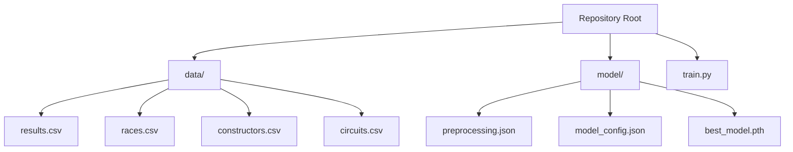
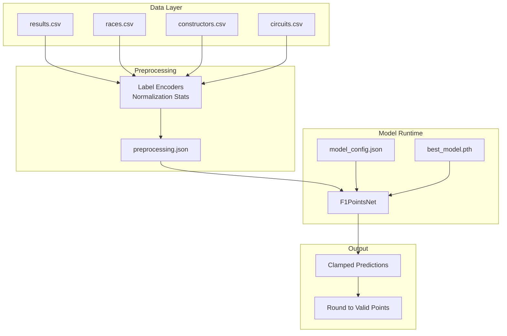
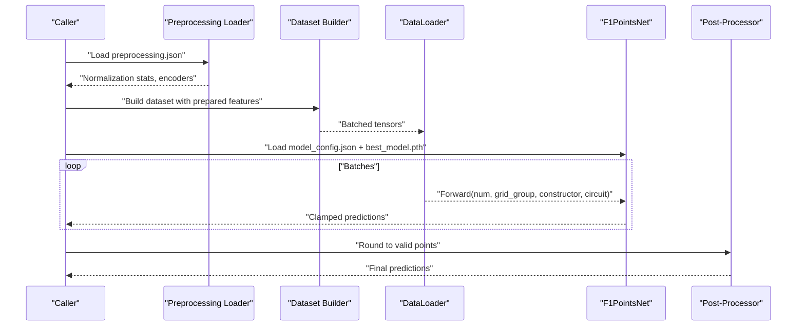
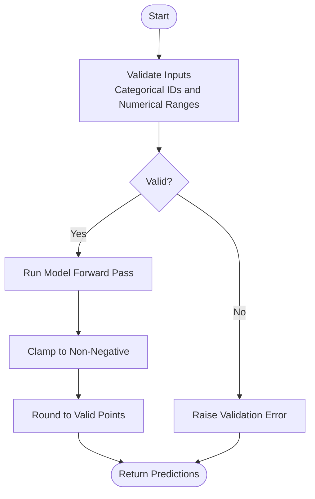
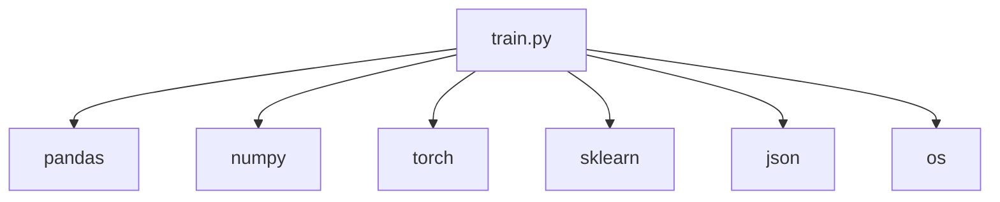

# Deployment and Inference

<cite>
**Referenced Files in This Document**
- [train.py](file://train.py)
- [preprocessing.json](file://model/preprocessing.json)
- [model_config.json](file://model/model_config.json)
- [best_model.pth](file://model/best_model.pth)
- [results.csv](file://data/results.csv)
- [races.csv](file://data/races.csv)
- [constructors.csv](file://data/constructors.csv)
- [circuits.csv](file://data/circuits.csv)
</cite>

## Table of Contents
1. [Introduction](#introduction)
2. [Project Structure](#project-structure)
3. [Core Components](#core-components)
4. [Architecture Overview](#architecture-overview)
5. [Detailed Component Analysis](#detailed-component-analysis)
6. [Dependency Analysis](#dependency-analysis)
7. [Performance Considerations](#performance-considerations)
8. [Troubleshooting Guide](#troubleshooting-guide)
9. [Conclusion](#conclusion)
10. [Appendices](#appendices)

## Introduction
This document provides comprehensive deployment and production usage guidance for the F1 Points Prediction model. It covers model artifact management, preprocessing configuration, inference pipeline implementation, input validation, prediction processing, deployment options (local inference, API endpoints, and batch processing), performance optimization, memory usage considerations, scalability strategies, model versioning, A/B testing, monitoring, and integration guidelines.

## Project Structure
The repository organizes training and inference assets as follows:
- Training and evaluation script: [train.py](file://train.py)
- Model artifacts:
  - Preprocessing metadata: [preprocessing.json](file://model/preprocessing.json)
  - Model configuration: [model_config.json](file://model/model_config.json)
  - Saved weights: [best_model.pth](file://model/best_model.pth)
- Training datasets: [results.csv](file://data/results.csv), [races.csv](file://data/races.csv), [constructors.csv](file://data/constructors.csv), [circuits.csv](file://data/circuits.csv)

**Diagram sources**
- [train.py](file://train.py)
- [preprocessing.json](file://model/preprocessing.json)
- [model_config.json](file://model/model_config.json)
- [best_model.pth](file://model/best_model.pth)
- [results.csv](file://data/results.csv)
- [races.csv](file://data/races.csv)
- [constructors.csv](file://data/constructors.csv)
- [circuits.csv](file://data/circuits.csv)

**Section sources**
- [train.py](file://train.py)
- [preprocessing.json](file://model/preprocessing.json)
- [model_config.json](file://model/model_config.json)
- [best_model.pth](file://model/best_model.pth)
- [results.csv](file://data/results.csv)
- [races.csv](file://data/races.csv)
- [constructors.csv](file://data/constructors.csv)
- [circuits.csv](file://data/circuits.csv)

## Core Components
- Model architecture: A neural network with embedding layers for categorical features and dense layers for numerical features. The model clamps outputs to non-negative values to align with scoring semantics.
- Dataset and dataloader: A custom dataset aggregates normalized numerical features, categorical encodings, and derived categorical groupings.
- Preprocessing artifacts: JSON-encoded normalization statistics and label encoders for reproducible inference.
- Saved weights: PyTorch state dictionary containing trained parameters.
- Evaluation utilities: Functions to round predictions to valid F1 point values and compute metrics.

Key implementation references:
- Model definition and forward pass: [train.py](file://train.py)
- Dataset construction and batching: [train.py](file://train.py)
- Preprocessing artifacts and normalization stats: [train.py](file://train.py)
- Saved model artifacts: [preprocessing.json](file://model/preprocessing.json), [model_config.json](file://model/model_config.json), [best_model.pth](file://model/best_model.pth)

**Section sources**
- [train.py](file://train.py)
- [preprocessing.json](file://model/preprocessing.json)
- [model_config.json](file://model/model_config.json)
- [best_model.pth](file://model/best_model.pth)

## Architecture Overview
The end-to-end inference pipeline comprises:
- Data ingestion and feature engineering (mirrored from training)
- Preprocessing using stored normalization statistics and label encoders
- Model loading and device placement
- Batched inference with clamped outputs
- Post-processing to valid F1 point values

**Diagram sources**
- [train.py](file://train.py)
- [preprocessing.json](file://model/preprocessing.json)
- [model_config.json](file://model/model_config.json)
- [best_model.pth](file://model/best_model.pth)

## Detailed Component Analysis

### Model Artifact Management
- Preprocessing metadata:
  - Stores label encoder classes for constructors and circuits, normalization means and standard deviations, and counts for embedding dimensions.
  - Ensures consistent encoding and scaling during inference.
- Model configuration:
  - Captures embedding dimensions, hidden layer sizes, and number of numerical features.
- Saved weights:
  - PyTorch state dictionary for the trained model.

Operational guidance:
- Version preprocessing.json and model_config.json alongside best_model.pth to maintain reproducibility.
- Store artifacts under versioned directories (e.g., model/v1/, model/v2/) to support A/B testing and rollback.

**Section sources**
- [train.py](file://train.py)
- [preprocessing.json](file://model/preprocessing.json)
- [model_config.json](file://model/model_config.json)
- [best_model.pth](file://model/best_model.pth)

### Inference Pipeline Implementation
- Feature preparation:
  - Recreate label encoders and normalization statistics from preprocessing.json.
  - Compute normalized numerical features and categorical encodings.
  - Derive categorical grouping for grid positions.
- Model loading:
  - Initialize model with parameters from model_config.json.
  - Load best_model.pth state dictionary.
  - Place model on CPU or GPU depending on runtime.
- Inference:
  - Use DataLoader for batching.
  - Forward pass returns clamped predictions.
- Post-processing:
  - Round predictions to nearest valid F1 point value.

**Diagram sources**
- [train.py](file://train.py)
- [preprocessing.json](file://model/preprocessing.json)
- [model_config.json](file://model/model_config.json)
- [best_model.pth](file://model/best_model.pth)

**Section sources**
- [train.py](file://train.py)
- [preprocessing.json](file://model/preprocessing.json)
- [model_config.json](file://model/model_config.json)
- [best_model.pth](file://model/best_model.pth)

### Input Validation and Prediction Processing
- Input validation:
  - Ensure categorical IDs exist within stored encoder classes.
  - Validate numerical features are within expected ranges after normalization.
- Prediction processing:
  - Clamp outputs to non-negative values.
  - Round to nearest valid F1 point value.

**Diagram sources**
- [train.py](file://train.py)
- [preprocessing.json](file://model/preprocessing.json)

**Section sources**
- [train.py](file://train.py)
- [preprocessing.json](file://model/preprocessing.json)

### Deployment Options
- Local inference:
  - Load preprocessing.json, model_config.json, and best_model.pth.
  - Prepare features from CSV or DataFrame inputs.
  - Run batched inference and post-process results.
- API endpoints:
  - Wrap inference in a lightweight service (e.g., Flask/FastAPI).
  - Accept structured requests, validate inputs, and return predictions.
- Batch processing:
  - Use DataLoader with appropriate batch size.
  - Persist predictions to CSV or database.

[No sources needed since this section provides general guidance]

### Performance Optimization Techniques
- Device placement:
  - Prefer GPU if available; otherwise CPU.
- Mixed precision:
  - Enable autocast for reduced memory and improved throughput on supported hardware.
- Gradient clipping:
  - Already applied during training; beneficial for stability.
- Optimized dataloaders:
  - Increase num_workers and set pin_memory for CPU-bound workloads.
- Model pruning and quantization:
  - Reduce model size and latency for edge deployments.

[No sources needed since this section provides general guidance]

### Memory Usage Considerations
- Minimize per-batch memory by tuning DataLoader batch_size.
- Use half-precision where safe.
- Dispose of intermediate tensors promptly and avoid retaining gradients during inference.

[No sources needed since this section provides general guidance]

### Scalability Strategies
- Horizontal scaling:
  - Deploy multiple inference instances behind a load balancer.
- Asynchronous processing:
  - Queue predictions and process in batches.
- Caching:
  - Cache frequent feature computations and static embeddings.

[No sources needed since this section provides general guidance]

### Model Versioning, A/B Testing, and Monitoring
- Versioning:
  - Store artifacts under versioned directories and tag releases.
- A/B testing:
  - Route subsets of traffic to new model versions; compare metrics.
- Monitoring:
  - Track latency, throughput, error rates, and prediction distributions.
  - Alert on performance degradation or data drift.

[No sources needed since this section provides general guidance]

### Integration Guidelines
- Existing systems:
  - Provide a wrapper that loads artifacts, validates inputs, runs inference, and returns standardized outputs.
- Applications:
  - Expose a simple HTTP endpoint or gRPC service for real-time predictions.
  - Support batch endpoints for offline processing.

[No sources needed since this section provides general guidance]

## Dependency Analysis
The training script depends on:
- Pandas, NumPy, PyTorch, scikit-learn for data manipulation, modeling, and training.
- Standard libraries for JSON and OS operations.

**Diagram sources**
- [train.py](file://train.py)

**Section sources**
- [train.py](file://train.py)

## Performance Considerations
- Use appropriate batch sizes to balance throughput and memory.
- Profile forward passes to identify bottlenecks.
- Consider ONNX/TensorRT for production acceleration.
- Monitor GPU/CPU utilization and adjust autoscaling policies accordingly.

[No sources needed since this section provides general guidance]

## Troubleshooting Guide
Common issues and resolutions:
- Shape mismatches:
  - Verify embedding dimensions and numerical feature counts match model_config.json.
- Unknown categories:
  - Ensure categorical IDs are within stored encoder classes; re-train encoders if new categories appear.
- Slow inference:
  - Check DataLoader configuration, device placement, and enable mixed precision.
- Incorrect outputs:
  - Confirm preprocessing normalization stats and label encoders are applied consistently.

**Section sources**
- [train.py](file://train.py)
- [preprocessing.json](file://model/preprocessing.json)
- [model_config.json](file://model/model_config.json)
- [best_model.pth](file://model/best_model.pth)

## Conclusion
This guide outlines a robust deployment strategy for the F1 Points Prediction model, emphasizing artifact management, reproducible preprocessing, efficient inference, and production readiness. By following the outlined practices—versioning, validation, optimization, and monitoring—you can reliably operate the model in production environments and evolve it iteratively.

## Appendices
- Artifact locations:
  - Preprocessing: [preprocessing.json](file://model/preprocessing.json)
  - Configuration: [model_config.json](file://model/model_config.json)
  - Weights: [best_model.pth](file://model/best_model.pth)
- Datasets:
  - [results.csv](file://data/results.csv)
  - [races.csv](file://data/races.csv)
  - [constructors.csv](file://data/constructors.csv)
  - [circuits.csv](file://data/circuits.csv)