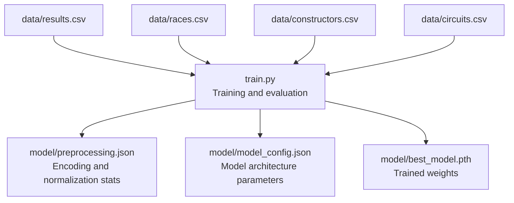
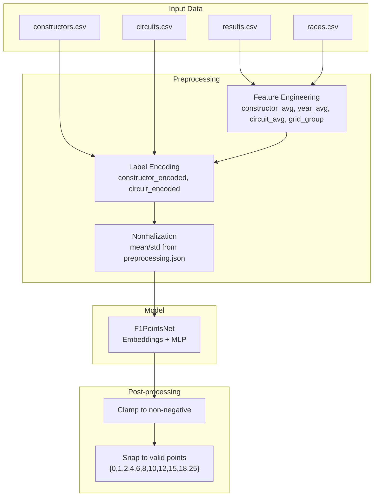
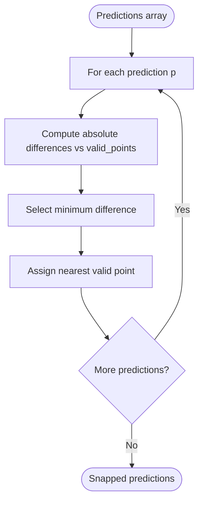
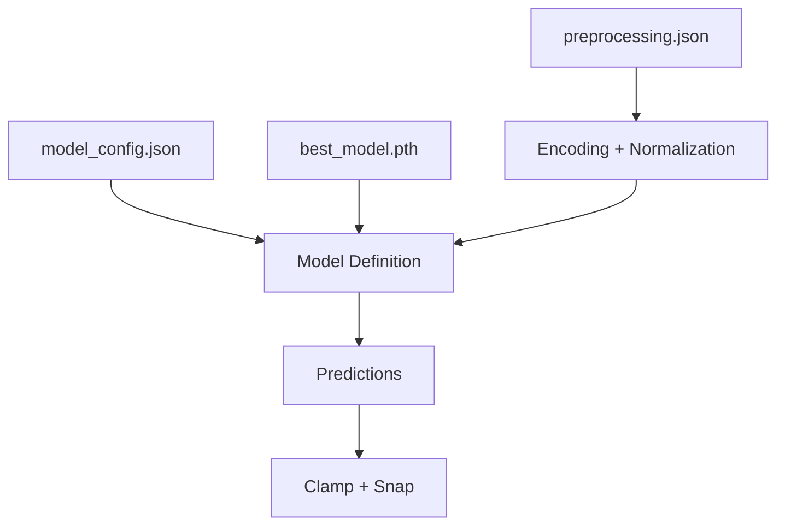
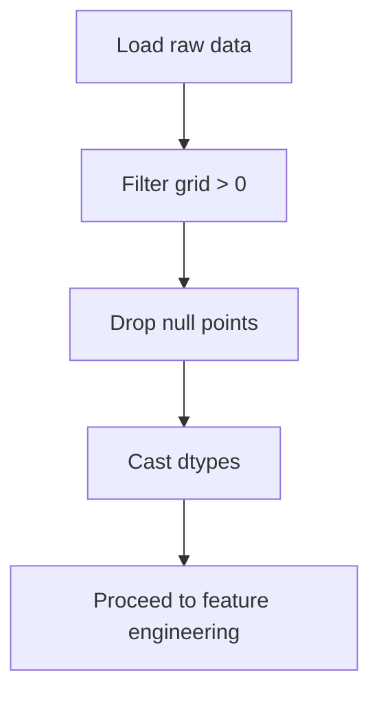
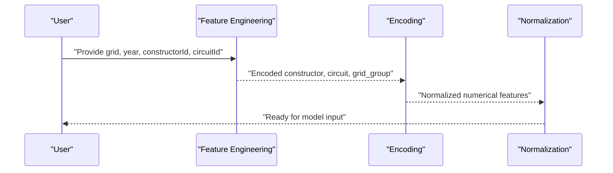
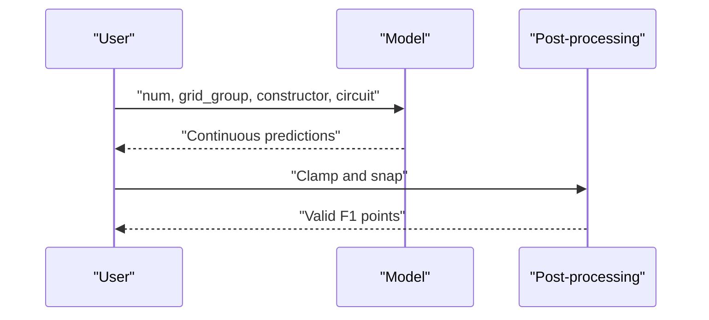

# Inference Pipeline Implementation

<cite>
**Referenced Files in This Document**
- [train.py](file://train.py)
- [preprocessing.json](file://model/preprocessing.json)
- [model_config.json](file://model/model_config.json)
- [results.csv](file://data/results.csv)
- [races.csv](file://data/races.csv)
- [constructors.csv](file://data/constructors.csv)
- [circuits.csv](file://data/circuits.csv)
</cite>

## Table of Contents
1. [Introduction](#introduction)
2. [Project Structure](#project-structure)
3. [Core Components](#core-components)
4. [Architecture Overview](#architecture-overview)
5. [Detailed Component Analysis](#detailed-component-analysis)
6. [Dependency Analysis](#dependency-analysis)
7. [Performance Considerations](#performance-considerations)
8. [Troubleshooting Guide](#troubleshooting-guide)
9. [Conclusion](#conclusion)
10. [Appendices](#appendices)

## Introduction
This document describes the complete inference pipeline for F1 points prediction. It explains how raw input data is transformed into validated F1-compliant predictions, covering input validation, preprocessing steps that mirror the training phase, neural network model usage, and post-processing to round predictions to valid F1 point values. It also provides practical guidance for implementing inference in single predictions, batch processing, and real-time applications, along with error handling and edge case management.

## Project Structure
The repository contains:
- Training script that builds features, trains the model, and evaluates it
- Saved artifacts for preprocessing and model configuration
- Historical datasets used during training

**Diagram sources**
- [train.py:19-311](file://train.py#L19-L311)
- [preprocessing.json:1-1](file://model/preprocessing.json#L1-L1)
- [model_config.json:1-1](file://model/model_config.json#L1-L1)

**Section sources**
- [train.py:19-311](file://train.py#L19-L311)

## Core Components
- Data loading and merging: Load race results, races, constructors, and circuits; filter invalid grid positions and missing points.
- Feature engineering: Compute constructor and circuit historical averages, seasonal averages, and grid position grouping; sort chronologically to prevent leakage.
- Preprocessing: Encode categorical features (constructorId, circuitId) and normalize numerical features using mean/std statistics saved to preprocessing.json.
- Dataset and dataloader: Build tensors for numerical features, grid group, encoded categories, and target points.
- Neural network: Embeddings for constructors and circuits, plus a grid group embedding; feed-forward network with batch normalization and dropout; clamp outputs to non-negative values.
- Evaluation and rounding: Round continuous predictions to nearest valid F1 point value using a snapping function.

Key implementation references:
- Data loading and filtering: [train.py:19-30](file://train.py#L19-L30)
- Feature engineering: [train.py:42-71](file://train.py#L42-L71)
- Encoding and normalization: [train.py:78-108](file://train.py#L78-L108)
- Dataset construction: [train.py:116-130](file://train.py#L116-L130)
- Model definition: [train.py:141-172](file://train.py#L141-L172)
- Evaluation and rounding: [train.py:251-270](file://train.py#L251-L270)

**Section sources**
- [train.py:19-311](file://train.py#L19-L311)
- [preprocessing.json:1-1](file://model/preprocessing.json#L1-L1)
- [model_config.json:1-1](file://model/model_config.json#L1-L1)

## Architecture Overview
The inference pipeline mirrors the training preprocessing and uses the trained model to produce continuous predictions, which are then snapped to valid F1 point values.

**Diagram sources**
- [train.py:42-71](file://train.py#L42-L71)
- [train.py:78-108](file://train.py#L78-L108)
- [train.py:141-172](file://train.py#L141-L172)
- [train.py:267-268](file://train.py#L267-L268)

## Detailed Component Analysis

### Data Loading and Validation
- Load results, races, constructors, and circuits.
- Filter rows where grid > 0 and points are present.
- Cast numeric columns to appropriate dtypes.

Implementation reference:
- [train.py:19-30](file://train.py#L19-L30)

Validation outcomes:
- Removes invalid grid entries and missing point targets.
- Ensures downstream computations operate on clean, typed data.

**Section sources**
- [train.py:19-30](file://train.py#L19-L30)

### Feature Engineering
- Chronological sorting prevents data leakage.
- Constructor historical average and seasonal average computed using expanding means with shift(1).
- Circuit historical average computed similarly.
- Grid position grouped into discrete buckets.

Implementation reference:
- [train.py:42-71](file://train.py#L42-L71)

Feature set:
- constructor_avg_pts
- constructor_year_avg_pts
- circuit_avg_pts
- grid_group

**Section sources**
- [train.py:42-71](file://train.py#L42-L71)

### Categorical Encoding and Normalization
- LabelEncoder transforms constructorId and circuitId into integer indices.
- Normalization statistics (mean/std) saved to preprocessing.json for numerical features:
  - grid
  - year
  - constructor_avg_pts
  - constructor_year_avg_pts
  - circuit_avg_pts

Implementation reference:
- [train.py:78-108](file://train.py#L78-L108)
- [preprocessing.json:1-1](file://model/preprocessing.json#L1-L1)

Notes:
- The encoder classes and normalization stats are persisted for reproducible inference.

**Section sources**
- [train.py:78-108](file://train.py#L78-L108)
- [preprocessing.json:1-1](file://model/preprocessing.json#L1-L1)

### Dataset Construction for Inference
- Numerical tensor: stack normalized features.
- Categorical tensors: grid_group (Long), constructor (Long), circuit (Long).
- Target tensor: points (Float), reshaped to column vector.

Implementation reference:
- [train.py:116-130](file://train.py#L116-L130)

For inference, construct similar tensors from new data using the saved preprocessing.json and model_config.json.

**Section sources**
- [train.py:116-130](file://train.py#L116-L130)

### Neural Network Model
- Embedding dimensions and counts loaded from model_config.json.
- Forward pass concatenates embeddings for constructor and circuit, grid_group embedding, and numerical features.
- Output is passed through a multi-layer perceptron and clamped to non-negative values.

Implementation reference:
- [train.py:141-172](file://train.py#L141-L172)
- [model_config.json:1-1](file://model/model_config.json#L1-L1)

Forward pass highlights:
- Embeddings: constructor_emb, circuit_emb, grid_group_emb
- Concatenation: embeddings + numerical features
- MLP: linear layers with batch norm, GELU, dropout
- Clamp: ensures non-negative predictions

**Section sources**
- [train.py:141-172](file://train.py#L141-L172)
- [model_config.json:1-1](file://model/model_config.json#L1-L1)

### Output Post-processing: Snap to Valid Points
- Continuous predictions are rounded to the nearest valid F1 point value using a snapping function.
- Valid points: {0, 1, 2, 4, 6, 8, 10, 12, 15, 18, 25}.

Implementation reference:
- [train.py:267-268](file://train.py#L267-L268)

**Diagram sources**
- [train.py:267-268](file://train.py#L267-L268)

**Section sources**
- [train.py:267-268](file://train.py#L267-L268)

### Inference Implementation Scenarios

#### Single Prediction
Steps:
1. Prepare a single row with grid, year, constructorId, circuitId.
2. Apply feature engineering (same logic as training).
3. Encode constructorId and circuitId using saved classes.
4. Normalize numerical features using saved mean/std.
5. Construct tensors: num (normalized features), grid_group, constructor, circuit.
6. Load model weights and run forward pass.
7. Clamp negative outputs to zero.
8. Snap to nearest valid point.

References:
- [train.py:42-71](file://train.py#L42-L71)
- [train.py:78-108](file://train.py#L78-L108)
- [train.py:141-172](file://train.py#L141-L172)
- [train.py:267-268](file://train.py#L267-L268)
- [preprocessing.json:1-1](file://model/preprocessing.json#L1-L1)
- [model_config.json:1-1](file://model/model_config.json#L1-L1)

#### Batch Processing
Steps:
1. Vectorize feature engineering across the dataset.
2. Encode and normalize using saved artifacts.
3. Build tensors for the entire batch.
4. Run model in batch mode.
5. Clamp and snap per sample.

References:
- [train.py:116-130](file://train.py#L116-L130)
- [train.py:251-260](file://train.py#L251-L260)

#### Real-time Application
- Persist preprocessing.json and model_config.json alongside model weights.
- On each request, apply identical transformations and run inference.
- Clamp and snap outputs before returning results.

References:
- [train.py:141-172](file://train.py#L141-L172)
- [train.py:267-268](file://train.py#L267-L268)

### Error Handling and Edge Cases
- Missing points: Handled by dropping rows with null points during training data preparation.
- Invalid grid positions: Filtered where grid <= 0.
- Unknown categories: During inference, unknown constructorId or circuitId should be handled by either rejecting the sample or mapping to an out-of-vocabulary category.
- Non-positive predictions: Clamping ensures non-negative outputs.
- Numerical stability: Normalization uses small fallback std to avoid division by zero.

References:
- [train.py:25-30](file://train.py#L25-L30)
- [train.py:94-96](file://train.py#L94-L96)
- [train.py:172](file://train.py#L172)

**Section sources**
- [train.py:25-30](file://train.py#L25-L30)
- [train.py:94-96](file://train.py#L94-L96)
- [train.py:172](file://train.py#L172)

## Dependency Analysis
The inference pipeline depends on:
- Saved preprocessing artifacts for encoding and normalization
- Model configuration for embedding sizes and input dimensions
- Trained model weights

**Diagram sources**
- [preprocessing.json:1-1](file://model/preprocessing.json#L1-L1)
- [model_config.json:1-1](file://model/model_config.json#L1-L1)
- [train.py:141-172](file://train.py#L141-L172)

**Section sources**
- [preprocessing.json:1-1](file://model/preprocessing.json#L1-L1)
- [model_config.json:1-1](file://model/model_config.json#L1-L1)
- [train.py:141-172](file://train.py#L141-L172)

## Performance Considerations
- Prefer vectorized operations for feature engineering and normalization.
- Use batched inference for throughput improvements.
- Clamp and snap operations are O(n) per batch; keep arrays contiguous for efficient NumPy operations.
- Consider device placement (CPU/GPU) consistently with training.

## Troubleshooting Guide
Common issues and resolutions:
- Shape mismatches: Ensure numerical tensor shape equals n_num from model_config.json and that all tensors are Long/Float as required.
- Encoding mismatches: Verify constructor and circuit classes match preprocessing.json.
- Unexpected negative outputs: Confirm clamp is applied after model forward pass.
- Slow inference: Use batching and ensure preprocessing is vectorized.

References:
- [train.py:141-172](file://train.py#L141-L172)
- [train.py:251-260](file://train.py#L251-L260)
- [model_config.json:1-1](file://model/model_config.json#L1-L1)

**Section sources**
- [train.py:141-172](file://train.py#L141-L172)
- [train.py:251-260](file://train.py#L251-L260)
- [model_config.json:1-1](file://model/model_config.json#L1-L1)

## Conclusion
The inference pipeline follows a strict recipe: load and validate data, compute and encode features identically to training, normalize using stored statistics, run the model, clamp outputs, and snap to valid F1 point values. By persisting preprocessing.json and model_config.json, and by applying the same transformations, the pipeline ensures reproducible and compliant predictions suitable for single, batch, and real-time scenarios.

## Appendices

### Input Validation Flow

**Diagram sources**
- [train.py:25-30](file://train.py#L25-L30)

### Preprocessing Sequence

**Diagram sources**
- [train.py:42-71](file://train.py#L42-L71)
- [train.py:78-108](file://train.py#L78-L108)

### Prediction Generation Flow

**Diagram sources**
- [train.py:141-172](file://train.py#L141-L172)
- [train.py:267-268](file://train.py#L267-L268)