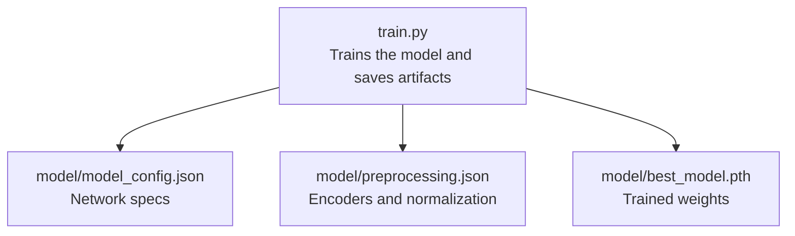
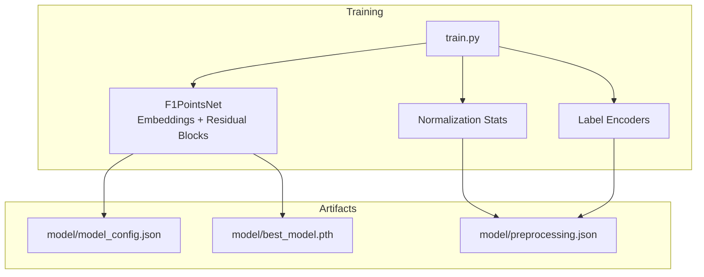
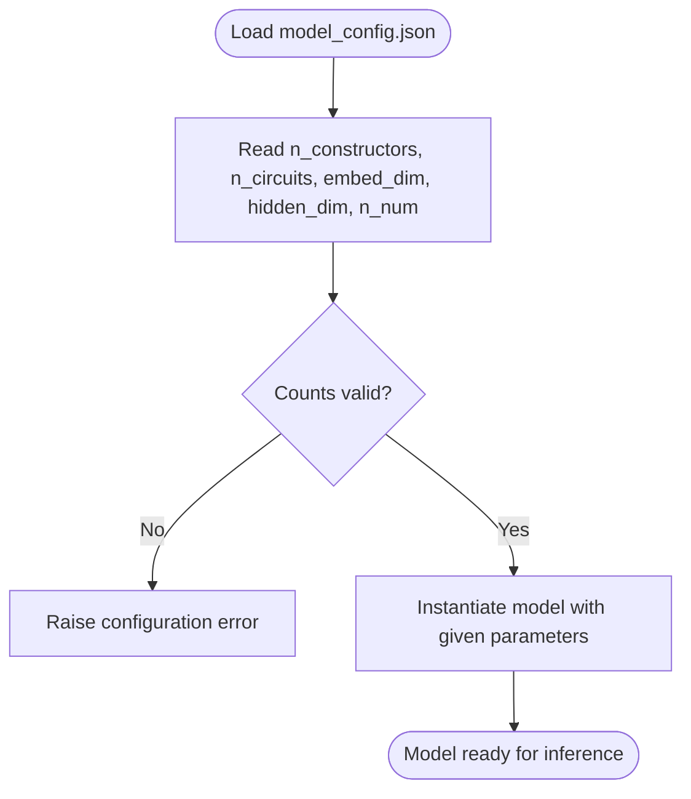
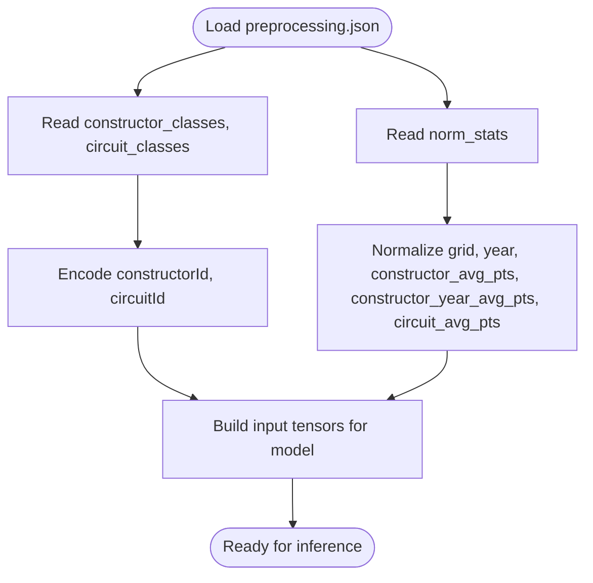
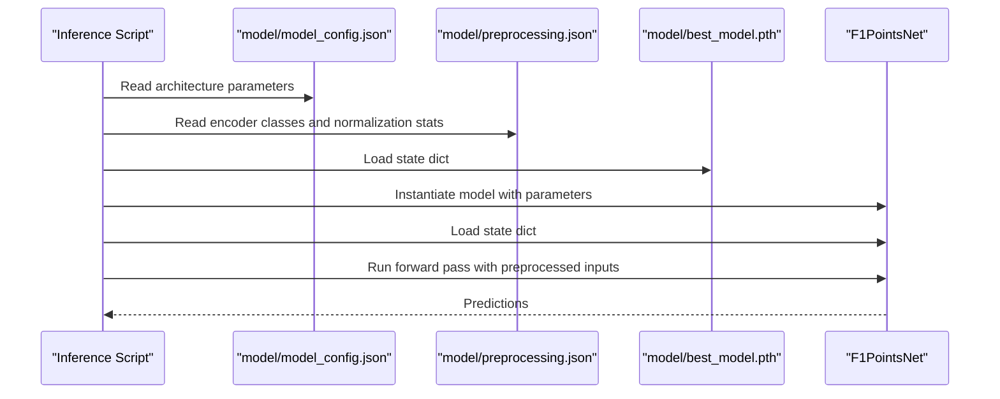
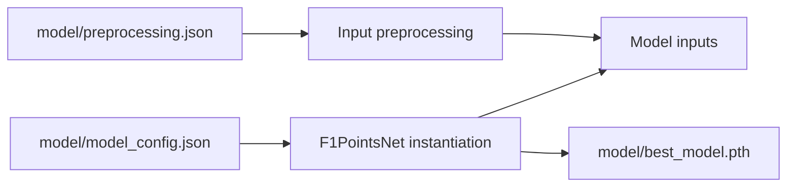
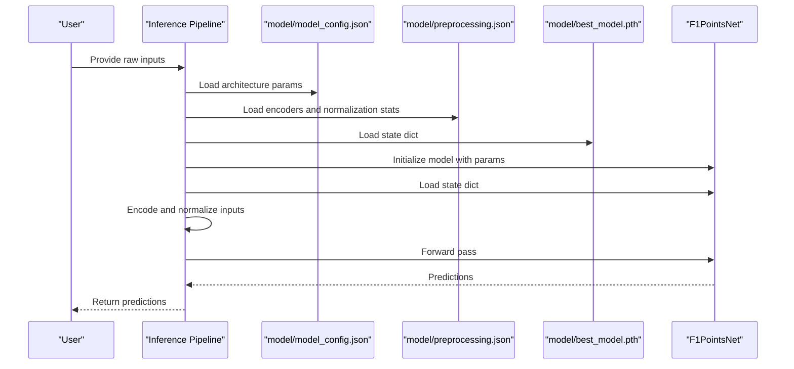

# Model Artifacts and Configuration

<cite>
**Referenced Files in This Document**
- [train.py](file://train.py)
- [model_config.json](file://model/model_config.json)
- [preprocessing.json](file://model/preprocessing.json)
- [best_model.pth](file://model/best_model.pth)
</cite>

## Table of Contents
1. [Introduction](#introduction)
2. [Project Structure](#project-structure)
3. [Core Components](#core-components)
4. [Architecture Overview](#architecture-overview)
5. [Detailed Component Analysis](#detailed-component-analysis)
6. [Dependency Analysis](#dependency-analysis)
7. [Performance Considerations](#performance-considerations)
8. [Troubleshooting Guide](#troubleshooting-guide)
9. [Conclusion](#conclusion)
10. [Appendices](#appendices)

## Introduction
This document explains the model artifacts and configuration files used by the F1 Points Prediction neural network. It covers:
- The structure and contents of model_config.json (network architecture parameters)
- The contents of preprocessing.json (label encoder classes, normalization parameters, and feature scaling)
- The best_model.pth file (trained weights and state dictionary)
- Artifact versioning strategies, file organization best practices, and dependency management between configuration files
- Practical examples for loading and validating each artifact type during inference

## Project Structure
The model artifacts are organized under the model/ directory and are produced by the training script. The training script generates:
- model/model_config.json: model architecture and sizing parameters
- model/preprocessing.json: preprocessing metadata (label encoders, normalization statistics)
- model/best_model.pth: the best model weights captured during training

**Diagram sources**
- [train.py:117-119](file://train.py#L117-L119)
- [train.py:303-304](file://train.py#L303-L304)
- [train.py:386-388](file://train.py#L386-L388)

**Section sources**
- [train.py:117-119](file://train.py#L117-L119)
- [train.py:303-304](file://train.py#L303-L304)
- [train.py:386-388](file://train.py#L386-L388)

## Core Components
This section documents each artifact’s role, structure, and how it is used during training and inference.

- model/model_config.json
  - Purpose: Stores model architecture parameters used to reconstruct the model during inference.
  - Key fields:
    - n_constructors: Number of distinct constructors in the dataset.
    - n_circuits: Number of distinct circuits in the dataset.
    - embed_dim: Embedding dimension for categorical features.
    - hidden_dim: Hidden dimension for the stem and residual blocks.
    - n_num: Number of numerical features used as input.
  - Produced by: The training script writes this JSON file after computing the number of constructors and circuits and defining the model architecture.

- model/preprocessing.json
  - Purpose: Contains preprocessing metadata required to transform new inputs consistently with training.
  - Key fields:
    - constructor_classes: List of constructor identifiers used by the constructor label encoder.
    - circuit_classes: List of circuit identifiers used by the circuit label encoder.
    - norm_stats: Dictionary of mean and standard deviation for numerical features used to normalize inputs.
    - n_constructors: Count of constructor classes.
    - n_circuits: Count of circuit classes.
  - Produced by: The training script computes normalization statistics and saves encoder classes alongside them.

- model/best_model.pth
  - Purpose: The best model weights captured during training (state dictionary).
  - Produced by: The training script periodically saves the best weights to disk when validation loss improves.
  - Consumed by: The training script loads the best weights at the end of training.

**Section sources**
- [train.py:109-115](file://train.py#L109-L115)
- [train.py:180-225](file://train.py#L180-L225)
- [train.py:303-304](file://train.py#L303-L304)
- [train.py:380-386](file://train.py#L380-L386)

## Architecture Overview
The training pipeline produces artifacts consumed by inference. The model architecture depends on the counts of constructors and circuits and the embedding dimension, while preprocessing ensures consistent normalization and encoding of inputs.

**Diagram sources**
- [train.py:180-225](file://train.py#L180-L225)
- [train.py:101-107](file://train.py#L101-L107)
- [train.py:109-115](file://train.py#L109-L115)
- [train.py:380-386](file://train.py#L380-L386)
- [train.py:303-304](file://train.py#L303-L304)

## Detailed Component Analysis

### model/model_config.json
- Structure and contents
  - Fields: n_constructors, n_circuits, embed_dim, hidden_dim, n_num.
  - These values define the model’s categorical embedding sizes and the input vector size for numerical features.
- How it is produced
  - Computed from dataset cardinalities and model definition, then written to JSON.
- How it is used during inference
  - Reconstruct the model with the same architecture and embedding sizes.
  - Ensure the numerical input vector length matches n_num.

**Diagram sources**
- [train.py:380-386](file://train.py#L380-L386)
- [model_config.json:1-1](file://model/model_config.json#L1-L1)

**Section sources**
- [train.py:380-386](file://train.py#L380-L386)
- [model_config.json:1-1](file://model/model_config.json#L1-L1)

### model/preprocessing.json
- Structure and contents
  - constructor_classes: Encoder classes for constructors.
  - circuit_classes: Encoder classes for circuits.
  - norm_stats: Normalization statistics (mean, std) for numerical features.
  - n_constructors, n_circuits: Counts used to initialize embeddings.
- How it is produced
  - Normalization statistics computed from training data and encoder classes saved alongside.
- How it is used during inference
  - Encode categorical inputs using the saved encoder classes.
  - Normalize numerical features using stored means and standard deviations.
  - Ensure the number of numerical features equals n_num.

**Diagram sources**
- [train.py:109-115](file://train.py#L109-L115)
- [train.py:101-107](file://train.py#L101-L107)
- [preprocessing.json:1-1](file://model/preprocessing.json#L1-L1)

**Section sources**
- [train.py:109-115](file://train.py#L109-L115)
- [train.py:101-107](file://train.py#L101-L107)
- [preprocessing.json:1-1](file://model/preprocessing.json#L1-L1)

### model/best_model.pth
- Structure and contents
  - Torch state dictionary containing the best model weights captured during training.
- How it is produced
  - Saved when validation loss improves, replacing the previous best weights.
- How it is used during inference
  - Loaded into the reconstructed model to enable predictions.

**Diagram sources**
- [train.py:303-304](file://train.py#L303-L304)
- [train.py:311-312](file://train.py#L311-L312)
- [model_config.json:1-1](file://model/model_config.json#L1-L1)
- [preprocessing.json:1-1](file://model/preprocessing.json#L1-L1)

**Section sources**
- [train.py:303-304](file://train.py#L303-L304)
- [train.py:311-312](file://train.py#L311-L312)

## Dependency Analysis
The artifacts depend on each other as follows:
- model/model_config.json depends on the model architecture and dataset cardinalities.
- model/preprocessing.json depends on the label encoders and normalization computed during training.
- model/best_model.pth depends on the model architecture and the preprocessing pipeline.

**Diagram sources**
- [train.py:180-225](file://train.py#L180-L225)
- [train.py:109-115](file://train.py#L109-L115)
- [train.py:303-304](file://train.py#L303-L304)

**Section sources**
- [train.py:180-225](file://train.py#L180-L225)
- [train.py:109-115](file://train.py#L109-L115)
- [train.py:303-304](file://train.py#L303-L304)

## Performance Considerations
- Embedding dimensionality: Smaller embed_dim reduces memory footprint but may limit expressiveness; larger embed_dim increases capacity but also computational cost.
- Numerical normalization: Using stored means and standard deviations ensures stable inference and avoids data leakage.
- Early stopping and saving best weights: Helps prevent overfitting and ensures the best performing weights are used for inference.

## Troubleshooting Guide
Common issues and resolutions:
- Mismatched embedding sizes
  - Symptom: Runtime errors when instantiating the model or loading weights.
  - Cause: n_constructors or n_circuits differ from training.
  - Resolution: Recompute preprocessing and re-run training to regenerate artifacts.
- Incorrect normalization
  - Symptom: Poor inference performance or unexpected outputs.
  - Cause: Using different normalization statistics than training.
  - Resolution: Ensure norm_stats from preprocessing.json are applied consistently.
- Missing encoder classes
  - Symptom: Encoding failures for unseen categories.
  - Cause: New categories not present in constructor_classes or circuit_classes.
  - Resolution: Extend preprocessing to handle unknown categories or re-train with broader datasets.
- Weights not loading
  - Symptom: Model runs but predictions are not as expected.
  - Cause: Weights-only loading mismatch or corrupted weights file.
  - Resolution: Verify best_model.pth exists and is readable; confirm state dict keys match model architecture.

**Section sources**
- [train.py:303-304](file://train.py#L303-L304)
- [train.py:311-312](file://train.py#L311-L312)
- [train.py:101-107](file://train.py#L101-L107)
- [train.py:109-115](file://train.py#L109-L115)

## Conclusion
The model artifacts and configuration files encapsulate everything needed to reproduce the trained model and preprocess inputs consistently. By adhering to the structure and dependencies described here, you can reliably load and validate each artifact during inference.

## Appendices

### Example Inference Workflow
- Load model configuration
  - Read model/model_config.json to obtain n_constructors, n_circuits, embed_dim, hidden_dim, n_num.
- Load preprocessing metadata
  - Read model/preprocessing.json to obtain constructor_classes, circuit_classes, norm_stats, n_constructors, n_circuits.
- Load best weights
  - Load model/best_model.pth into the reconstructed model.
- Preprocess inputs
  - Encode categorical features using saved encoder classes.
  - Normalize numerical features using stored means and standard deviations.
- Run inference
  - Pass preprocessed inputs through the model to obtain predictions.

**Diagram sources**
- [train.py:380-386](file://train.py#L380-L386)
- [train.py:109-115](file://train.py#L109-L115)
- [train.py:303-304](file://train.py#L303-L304)
- [model_config.json:1-1](file://model/model_config.json#L1-L1)
- [preprocessing.json:1-1](file://model/preprocessing.json#L1-L1)