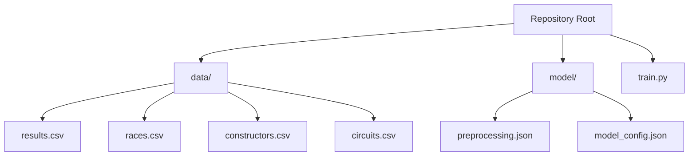
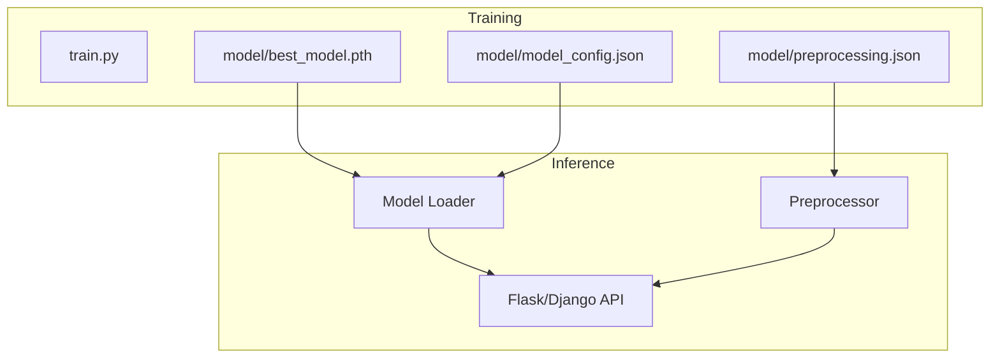
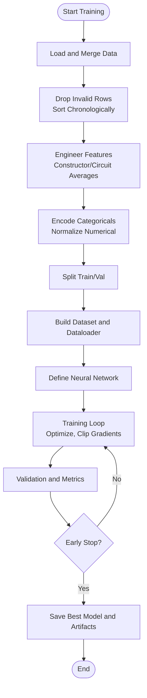
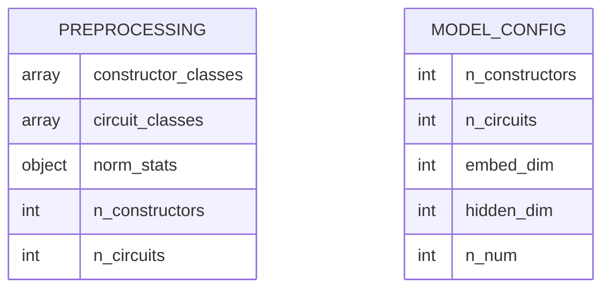

# Production Deployment Strategies

<cite>
**Referenced Files in This Document**
- [train.py](file://train.py)
- [preprocessing.json](file://model/preprocessing.json)
- [model_config.json](file://model/model_config.json)
</cite>

## Table of Contents
1. [Introduction](#introduction)
2. [Project Structure](#project-structure)
3. [Core Components](#core-components)
4. [Architecture Overview](#architecture-overview)
5. [Detailed Component Analysis](#detailed-component-analysis)
6. [Deployment Scenarios](#deployment-scenarios)
7. [Containerized Deployment with Docker](#containerized-deployment-with-docker)
8. [Cloud Platform Deployment Options](#cloud-platform-deployment-options)
9. [Serverless Function Implementations](#serverless-function-implementations)
10. [API Endpoint Development](#api-endpoint-development)
11. [Performance Optimization Techniques](#performance-optimization-techniques)
12. [Monitoring and Logging](#monitoring-and-logging)
13. [A/B Testing Frameworks](#ab-testing-frameworks)
14. [Rollback Procedures](#rollback-procedures)
15. [Deployment Automation and CI/CD](#deployment-automation-and-cicd)
16. [Infrastructure Requirements](#infrastructure-requirements)
17. [Troubleshooting Guide](#troubleshooting-guide)
18. [Conclusion](#conclusion)

## Introduction
This document provides production-grade deployment strategies for a machine learning model that predicts Formula 1 race points. It covers containerized deployment with Docker, cloud platform options, serverless implementations, API development patterns, performance optimization, observability, A/B testing, rollback procedures, automation, and infrastructure requirements. The repository includes a training script that builds and evaluates a neural network model and saves preprocessing artifacts and model configuration for inference.

## Project Structure
The repository consists of:
- Training and evaluation script that constructs features, trains a neural network, and evaluates performance
- Saved model artifacts under the model directory:
  - Preprocessing metadata for categorical encoders and normalization statistics
  - Model configuration parameters
- Data assets under the data directory for training and evaluation

**Diagram sources**
- [train.py:19-311](file://train.py#L19-L311)
- [preprocessing.json:1-1](file://model/preprocessing.json#L1-L1)
- [model_config.json](file://model/model_config.json)

**Section sources**
- [train.py:19-311](file://train.py#L19-L311)
- [preprocessing.json:1-1](file://model/preprocessing.json#L1-L1)
- [model_config.json](file://model/model_config.json)

## Core Components
- Training pipeline: Loads datasets, merges and cleans data, performs feature engineering, normalizes numerical features, encodes categoricals, defines a neural network, trains with early stopping, and evaluates metrics
- Saved artifacts:
  - preprocessing.json: encoder classes and normalization statistics
  - model_config.json: model architecture parameters

Key implementation references:
- Data loading and merging: [train.py:19-26](file://train.py#L19-L26)
- Feature engineering: [train.py:44-73](file://train.py#L44-L73)
- Normalization and preprocessing artifacts: [train.py:90-108](file://train.py#L90-L108)
- Dataset and dataloader: [train.py:116-136](file://train.py#L116-L136)
- Neural network definition: [train.py:141-172](file://train.py#L141-L172)
- Training loop and early stopping: [train.py:197-239](file://train.py#L197-L239)
- Evaluation and metrics: [train.py:247-296](file://train.py#L247-L296)
- Saved artifacts: [train.py:106-108](file://train.py#L106-L108), [train.py:306-307](file://train.py#L306-L307)

**Section sources**
- [train.py:19-311](file://train.py#L19-L311)
- [preprocessing.json:1-1](file://model/preprocessing.json#L1-L1)
- [model_config.json](file://model/model_config.json)

## Architecture Overview
The system follows a training-to-inference pipeline:
- Training script produces a trained model checkpoint and artifacts
- Inference service loads preprocessing metadata and model configuration, initializes the model, and serves predictions via an API

**Diagram sources**
- [train.py:234](file://train.py#L234)
- [train.py:106-108](file://train.py#L106-L108)
- [train.py:306-307](file://train.py#L306-L307)

## Detailed Component Analysis

### Training Pipeline
The training pipeline performs:
- Data ingestion and merging from CSV files
- Chronological sorting to prevent leakage
- Rolling average features for constructors and circuits
- Categorical encoding and normalization
- Neural network construction with embeddings and dense layers
- Training with AdamW optimizer, ReduceLROnPlateau scheduling, and gradient clipping
- Early stopping with patience and best epoch tracking
- Evaluation with MAE, RMSE, and rounded accuracy metrics

**Diagram sources**
- [train.py:19-311](file://train.py#L19-L311)

**Section sources**
- [train.py:19-311](file://train.py#L19-L311)

### Model Artifacts
Saved artifacts enable inference:
- preprocessing.json: encoder classes and normalization stats
- model_config.json: model architecture parameters

**Diagram sources**
- [preprocessing.json:1-1](file://model/preprocessing.json#L1-L1)
- [model_config.json](file://model/model_config.json)

**Section sources**
- [preprocessing.json:1-1](file://model/preprocessing.json#L1-L1)
- [model_config.json](file://model/model_config.json)

## Deployment Scenarios
This section outlines production deployment strategies aligned with the repository’s training and artifact outputs.

### Containerized Deployment with Docker
- Base image: Use a Python runtime with PyTorch
- Install dependencies: Add required packages for model loading and serving
- Copy artifacts: Place model checkpoints, preprocessing.json, and model_config.json into the container
- Expose port: Define a port for the API server
- Health checks: Implement readiness/liveness probes
- Resource limits: Configure CPU/memory requests/limits
- Multi-stage builds: Separate build and runtime stages to reduce image size

### Cloud Platform Deployment Options
- AWS: Deploy behind Application Load Balancer with ECS/EKS or Lambda for serverless
- Azure: Use Azure Container Instances or AKS with Helm charts
- GCP: Deploy on Cloud Run or GKE with managed load balancing
- Platform features: Enable auto-scaling, secrets management, and observability integrations

### Serverless Function Implementations
- Handler pattern: Initialize model and preprocessor once per container, handle prediction requests
- Cold start mitigation: Keep warm instances or use provisioned concurrency
- Payload size: Limit request payload and response sizes; stream large outputs if needed
- Throttling: Configure concurrency and timeout settings appropriately

## API Endpoint Development
Recommended patterns for Flask/Django integration:
- Flask blueprint or Django views for prediction endpoints
- Request validation and rate limiting
- Asynchronous processing for heavy workloads
- Structured responses with metadata and confidence scores
- CORS configuration for web clients

## Performance Optimization Techniques
- Model quantization: Convert to INT8 or mixed precision to reduce memory and latency
- Batch processing: Aggregate requests and process in batches to improve throughput
- Memory management: Clear GPU/CPU caches, reuse tensors, and avoid unnecessary copies
- Embedding optimization: Tune embedding dimensions and pooling strategies
- Feature caching: Cache preprocessed features for repeated queries

## Monitoring and Logging
- Metrics: Track latency, error rates, throughput, and model-specific metrics
- Logs: Standardize structured logs with correlation IDs and request contexts
- Tracing: Integrate distributed tracing for end-to-end visibility
- Alerts: Set up SLOs and alerting for latency, errors, and resource saturation

## A/B Testing Frameworks
- Canary releases: Route small percentage of traffic to new model versions
- Shadow traffic: Send copies of requests to candidate models for offline evaluation
- Metric-driven decisions: Compare MAE/RMSE and business KPIs across variants
- Rollout controls: Gradually increase traffic and monitor regressions

## Rollback Procedures
- Version pinning: Tag model artifacts and deployable images
- Blue/green deployments: Switch traffic after validation
- Automated rollback: Trigger rollback on health check failures or metric thresholds
- Data consistency: Ensure preprocessing artifacts remain compatible across versions

## Deployment Automation and CI/CD
- Pipelines: Automate training, evaluation, packaging, and deployment
- Artifact storage: Store model checkpoints and preprocessing configs in secure storage
- Security: Scan images, enforce policy gates, and manage secrets
- Infrastructure as code: Provision and update environments consistently

## Infrastructure Requirements
- Compute: CPU/GPU instances sized for inference latency targets
- Storage: Persistent volumes for model artifacts and logs
- Networking: Load balancers, DNS, and firewall rules
- Observability: Metrics, logs, and tracing backends
- Scalability: Horizontal pod autoscaling or target tracking policies

## Troubleshooting Guide
Common issues and resolutions:
- Model not loading: Verify artifact paths and compatibility of model_config.json with the loaded checkpoint
- Incorrect predictions: Confirm preprocessing.json normalization stats align with training
- Performance degradation: Profile memory and CPU usage; adjust batch sizes and quantization
- Out-of-memory errors: Reduce batch size, enable mixed precision, or offload to CPU

**Section sources**
- [train.py:234](file://train.py#L234)
- [train.py:106-108](file://train.py#L106-L108)
- [train.py:306-307](file://train.py#L306-L307)

## Conclusion
This repository demonstrates a complete training-to-artifact pipeline suitable for production deployment. By leveraging containerization, cloud platforms, serverless options, robust API patterns, and strong operational practices—combined with performance optimization, monitoring, A/B testing, and automated CI/CD—you can achieve scalable, reliable, and observable model serving for F1 point predictions.