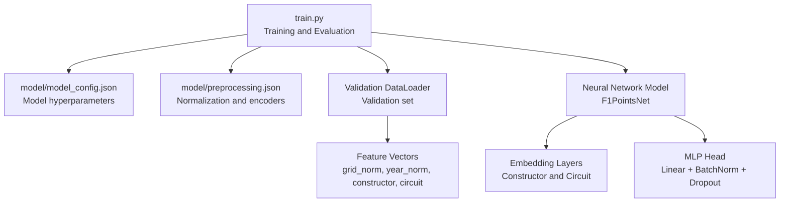
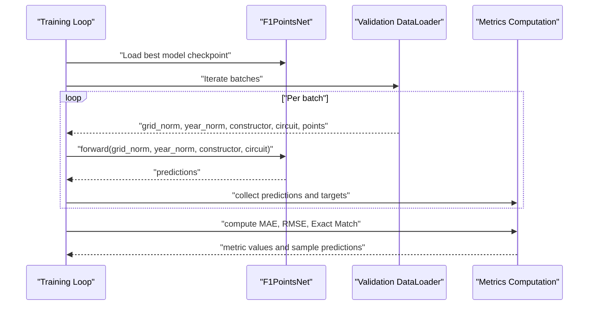
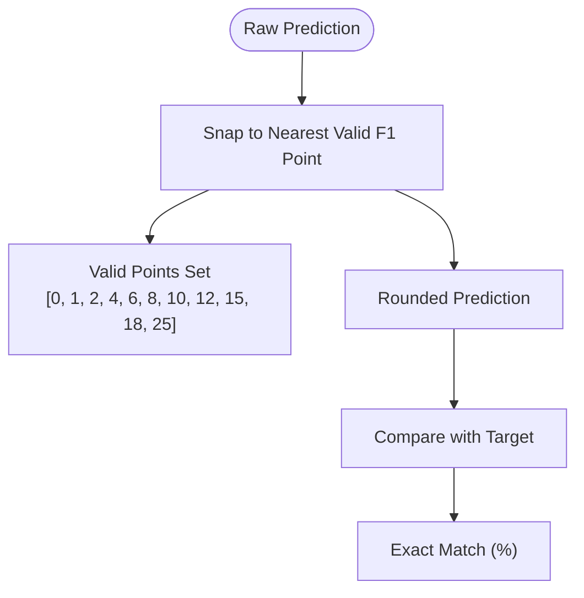
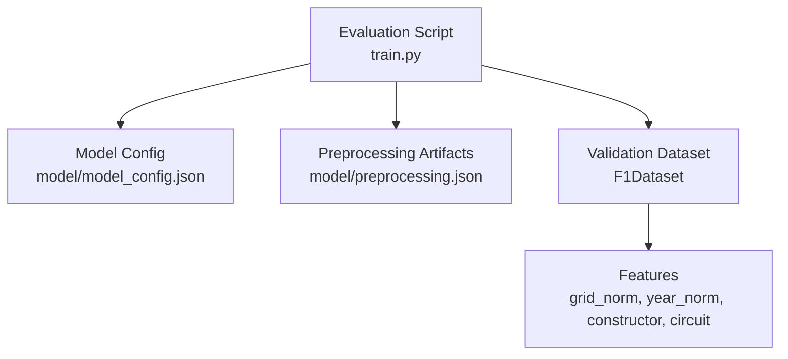

# Evaluation and Metrics

<cite>
**Referenced Files in This Document**
- [train.py](file://train.py)
- [model/model_config.json](file://model/model_config.json)
- [model/preprocessing.json](file://model/preprocessing.json)
</cite>

## Table of Contents
1. [Introduction](#introduction)
2. [Project Structure](#project-structure)
3. [Core Components](#core-components)
4. [Architecture Overview](#architecture-overview)
5. [Detailed Component Analysis](#detailed-component-analysis)
6. [Dependency Analysis](#dependency-analysis)
7. [Performance Considerations](#performance-considerations)
8. [Troubleshooting Guide](#troubleshooting-guide)
9. [Conclusion](#conclusion)

## Introduction
This document describes the evaluation and metrics framework used to assess model performance for the F1 points prediction task. It focuses on the implemented metrics (Mean Absolute Error, Root Mean Square Error, and exact match accuracy), the rounding process to valid F1 point values, and the evaluation methodology performed during training. It also provides guidance for interpreting performance, error analysis, and model comparison strategies grounded in the repository’s code.

## Project Structure
The evaluation pipeline is embedded within the training script and relies on saved model artifacts for inference and evaluation. The key files involved in evaluation are:
- Training and evaluation logic: [train.py](file://train.py)
- Model configuration: [model/model_config.json](file://model/model_config.json)
- Preprocessing artifacts: [model/preprocessing.json](file://model/preprocessing.json)

**Diagram sources**
- [train.py:111-119](file://train.py#L111-L119)
- [train.py:124-161](file://train.py#L124-L161)
- [train.py:248-291](file://train.py#L248-L291)
- [model/model_config.json:1-1](file://model/model_config.json#L1-L1)
- [model/preprocessing.json:1-1](file://model/preprocessing.json#L1-L1)

**Section sources**
- [train.py:111-119](file://train.py#L111-L119)
- [train.py:124-161](file://train.py#L124-L161)
- [train.py:248-291](file://train.py#L248-L291)
- [model/model_config.json:1-1](file://model/model_config.json#L1-L1)
- [model/preprocessing.json:1-1](file://model/preprocessing.json#L1-L1)

## Core Components
- Dataset and DataLoader: The validation dataset is constructed from normalized numerical features and encoded categorical features, then loaded via a DataLoader for evaluation.
- Model: A neural network with embedding layers for categorical features and an MLP head for regression, clamped to non-negative outputs.
- Evaluation loop: The model is evaluated on the validation set to collect predictions and targets, then metrics are computed.

Key implementation references:
- Validation dataset construction and loader: [train.py:111-119](file://train.py#L111-L119)
- Model definition and forward pass: [train.py:124-161](file://train.py#L124-L161)
- Evaluation loop and metric computation: [train.py:248-291](file://train.py#L248-L291)

**Section sources**
- [train.py:111-119](file://train.py#L111-L119)
- [train.py:124-161](file://train.py#L124-L161)
- [train.py:248-291](file://train.py#L248-L291)

## Architecture Overview
The evaluation architecture follows a standard train/evaluate cycle:
- The model is trained with early stopping and learning rate scheduling.
- At the end of training, the best model checkpoint is loaded.
- The model evaluates on the validation set to compute metrics and display sample predictions.

**Diagram sources**
- [train.py:238-239](file://train.py#L238-L239)
- [train.py:248-291](file://train.py#L248-L291)

## Detailed Component Analysis

### Metrics Computation
The evaluation computes three metrics on the validation set:
- Mean Absolute Error (MAE): Average absolute difference between raw predictions and targets.
- Root Mean Square Error (RMSE): Square root of average squared differences between raw predictions and targets.
- Exact Match Accuracy (rounded): Percentage of rounded predictions that match the target values, where predictions are snapped to the nearest valid F1 point value.

Implementation references:
- Metric definitions and computation: [train.py:276-278](file://train.py#L276-L278)
- Rounded predictions and snapping function: [train.py:269-274](file://train.py#L269-L274)
- Valid F1 point values: [train.py:266-267](file://train.py#L266-L267)

Interpretation guidelines:
- Lower MAE and RMSE indicate smaller average errors; RMSE penalizes larger errors more heavily.
- Higher exact match percentage indicates more frequent agreement with valid point outcomes.

**Section sources**
- [train.py:266-278](file://train.py#L266-L278)
- [train.py:269-274](file://train.py#L269-L274)

### Point Value Validation Process
Predictions are rounded to the nearest valid F1 point value before computing exact match accuracy. The valid set of point values is defined explicitly and used to snap each prediction.

Implementation references:
- Valid points set: [train.py:266-267](file://train.py#L266-L267)
- Snapping function: [train.py:269-271](file://train.py#L269-L271)
- Rounded predictions: [train.py:274](file://train.py#L274)

**Diagram sources**
- [train.py:266-274](file://train.py#L266-L274)

**Section sources**
- [train.py:266-274](file://train.py#L266-L274)

### Evaluation Methodology
- Data split: The dataset is split into training and validation sets with a fixed random seed for reproducibility.
- Feature preparation: Numerical features are normalized using mean and standard deviation; categorical features are label-encoded to contiguous indices.
- Model evaluation: The best model checkpoint is loaded and evaluated on the validation set to collect predictions and targets.
- Metrics reporting: MAE, RMSE, and exact match accuracy are printed along with a small sample of predictions.

Implementation references:
- Train/validation split: [train.py:111-113](file://train.py#L111-L113)
- Normalization and encoding: [train.py:64-69](file://train.py#L64-L69), [train.py:51-56](file://train.py#L51-L56)
- Best model loading: [train.py:238-239](file://train.py#L238-L239)
- Evaluation loop: [train.py:248-264](file://train.py#L248-L264)
- Metrics printing: [train.py:276-282](file://train.py#L276-L282), [train.py:284-291](file://train.py#L284-L291)

**Section sources**
- [train.py:111-113](file://train.py#L111-L113)
- [train.py:51-56](file://train.py#L51-L56)
- [train.py:64-69](file://train.py#L64-L69)
- [train.py:238-239](file://train.py#L238-L239)
- [train.py:248-291](file://train.py#L248-L291)

### Comparison with Baseline Models
Baseline models commonly used for regression tasks include:
- Constant predictor: Predict the mean of the training targets.
- Simple heuristics: For example, predict zero or the median of targets.
- Linear regression: A linear model on the same features.

To compare with baselines:
- Compute the same metrics (MAE, RMSE, exact match) on the validation set for each baseline.
- Report improvements in error metrics and exact match percentage relative to baselines.

[No sources needed since this section provides general guidance]

### Statistical Significance Testing
To assess whether observed differences in metrics between models are statistically significant:
- Use paired tests (e.g., paired t-test or Wilcoxon signed-rank test) on the residuals or per-sample errors.
- Control for multiple comparisons if evaluating several models.
- Consider stratification by race or driver characteristics if needed.

[No sources needed since this section provides general guidance]

### Performance Interpretation Guidelines
- MAE: Robust to outliers; lower is better.
- RMSE: Sensitive to large errors; lower is better.
- Exact match (rounded): Reflects alignment with discrete F1 scoring; higher is better.

[No sources needed since this section provides general guidance]

### Error Analysis Techniques
- Residual analysis: Plot residuals against predicted values to detect heteroscedasticity or systematic bias.
- Distribution of errors: Examine skewness and kurtosis of residuals.
- Feature-wise error breakdown: Analyze errors by categorical groups (constructor, circuit) or numerical ranges (grid, year).
- Outlier identification: Investigate extreme residuals and their contexts.

[No sources needed since this section provides general guidance]

### Model Comparison Strategies
- Cross-validation: Use k-fold CV to estimate performance variance and select the best model.
- Hold-out validation: Use a separate test set unseen during training for final evaluation.
- Hyperparameter tuning: Grid/random search with validation metrics to optimize model capacity and regularization.

[No sources needed since this section provides general guidance]

### Overfitting Detection
- Monitor training and validation loss curves; if validation loss stops improving while training loss continues to decrease, overfitting may be occurring.
- Use early stopping and dropout to mitigate overfitting.
- Reduce model capacity or increase regularization if overfitting persists.

[No sources needed since this section provides general guidance]

### Bias-Variance Trade-offs
- High bias manifests as poor performance on both training and validation sets; consider increasing model capacity or adding features.
- High variance manifests as good training performance but poor validation performance; consider regularization, dropout, or more data.

[No sources needed since this section provides general guidance]

### Model Selection Criteria
- Choose the model with the lowest validation loss and favorable metrics.
- Consider computational cost and interpretability alongside performance.
- Validate on held-out test data to confirm generalization.

[No sources needed since this section provides general guidance]

## Dependency Analysis
The evaluation depends on:
- Model configuration and preprocessing artifacts for consistent inference.
- Validation dataset construction and normalization parameters.

**Diagram sources**
- [train.py:248-291](file://train.py#L248-L291)
- [model/model_config.json:1-1](file://model/model_config.json#L1-L1)
- [model/preprocessing.json:1-1](file://model/preprocessing.json#L1-L1)

**Section sources**
- [train.py:248-291](file://train.py#L248-L291)
- [model/model_config.json:1-1](file://model/model_config.json#L1-L1)
- [model/preprocessing.json:1-1](file://model/preprocessing.json#L1-L1)

## Performance Considerations
- The model clamps outputs to non-negative values to align with F1 point semantics.
- Normalization of numerical features improves training stability.
- Early stopping prevents overfitting and selects a robust checkpoint.

**Section sources**
- [train.py:160-161](file://train.py#L160-L161)
- [train.py:64-69](file://train.py#L64-L69)
- [train.py:227-236](file://train.py#L227-L236)

## Troubleshooting Guide
- If predictions are negative, ensure the model’s output clamping is active.
- If metrics appear inconsistent, verify that the best model checkpoint is loaded before evaluation.
- If exact match is unexpectedly low, inspect the snapping function and the valid points set.

**Section sources**
- [train.py:160-161](file://train.py#L160-L161)
- [train.py:238-239](file://train.py#L238-L239)
- [train.py:266-274](file://train.py#L266-L274)

## Conclusion
The evaluation framework in the training script provides a straightforward yet effective assessment of the model’s predictive performance on the F1 points task. It reports MAE, RMSE, and exact match accuracy after rounding predictions to valid F1 point values. The pipeline leverages a held-out validation set, best-model checkpoint loading, and consistent preprocessing to ensure reliable and reproducible results. For broader model selection and significance testing, consider extending the framework with cross-validation and statistical tests as outlined in the guidance sections.