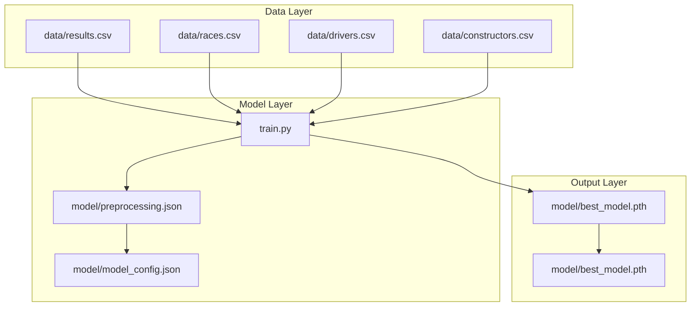
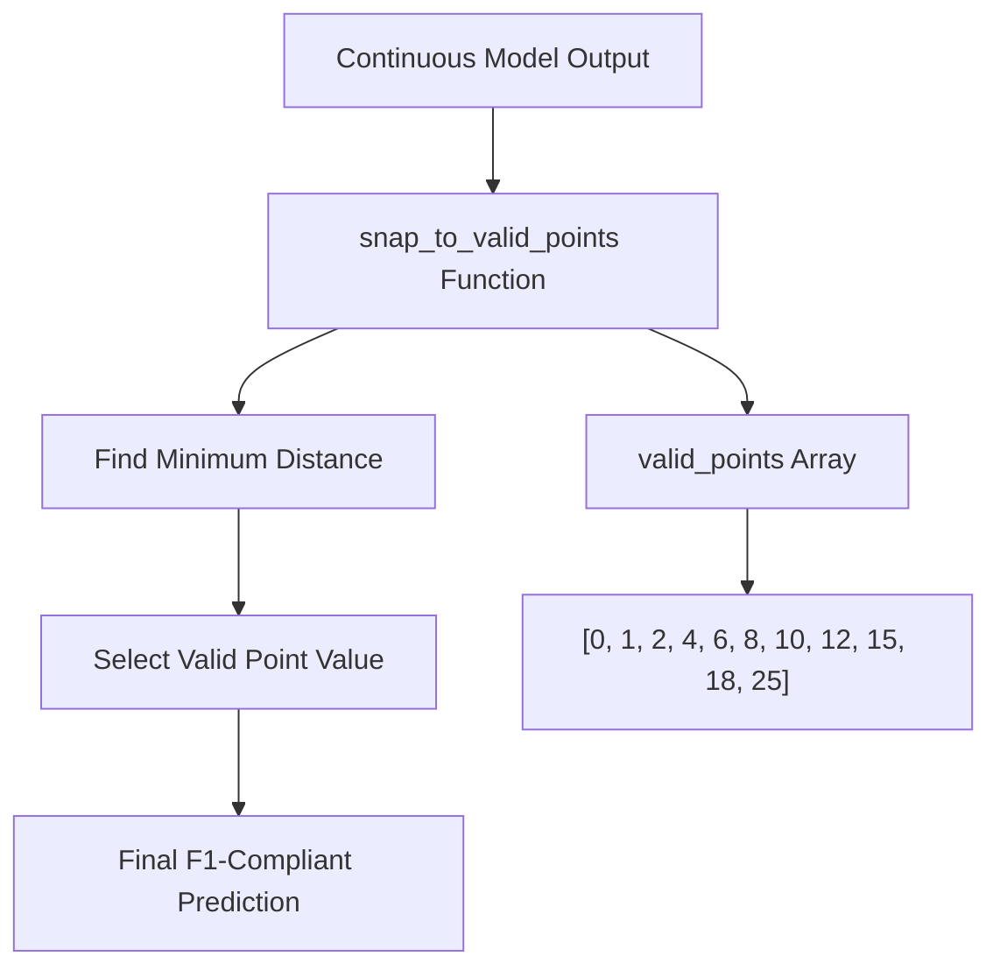
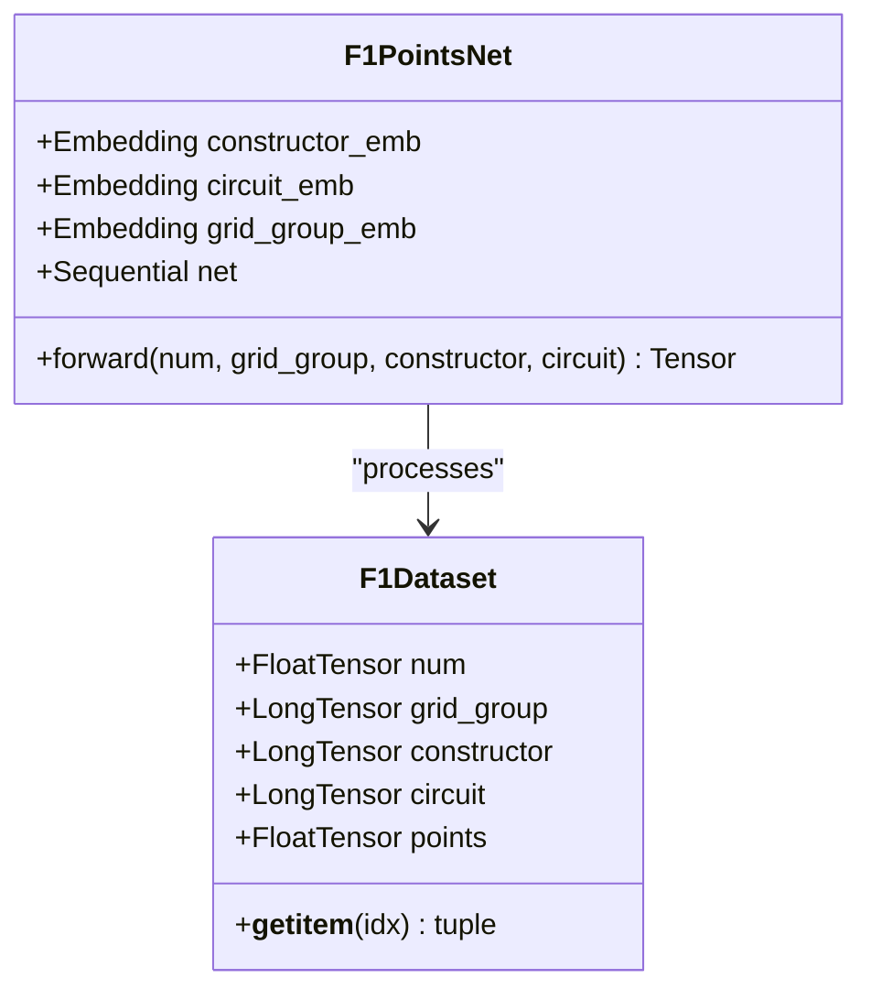
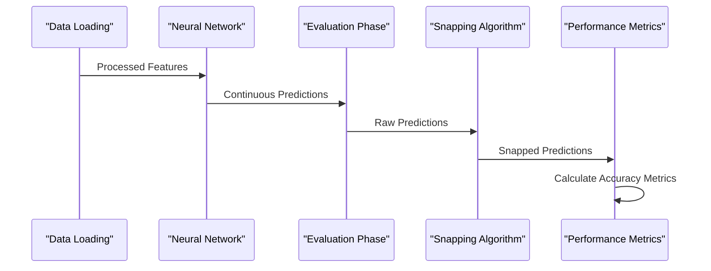
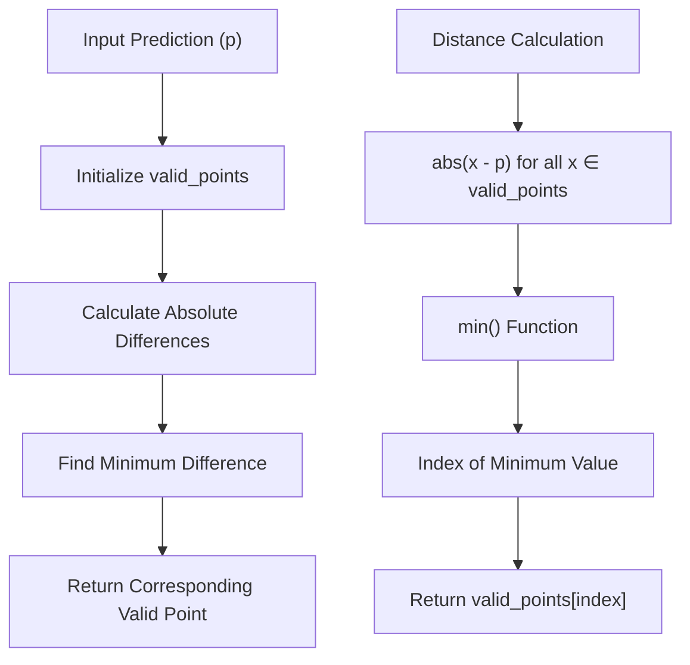
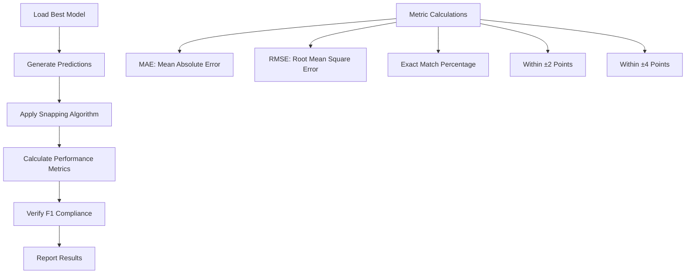
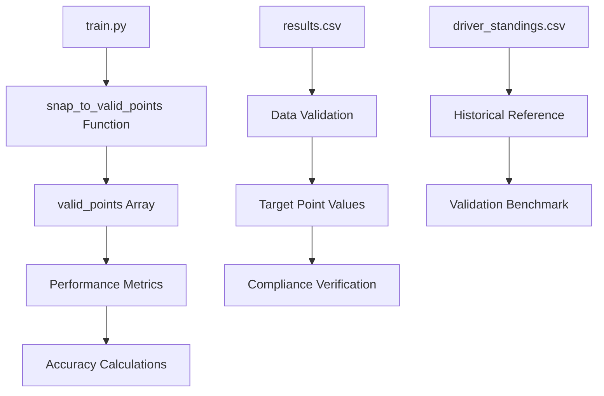

# F1 Scoring System Compliance

<cite>
**Referenced Files in This Document**
- [train.py](file://train.py)
- [results.csv](file://data/results.csv)
- [driver_standings.csv](file://data/driver_standings.csv)
- [constructor_results.csv](file://data/constructor_results.csv)
- [preprocessing.json](file://model/preprocessing.json)
</cite>

## Table of Contents
1. [Introduction](#introduction)
2. [Project Structure](#project-structure)
3. [Core Components](#core-components)
4. [Architecture Overview](#architecture-overview)
5. [Detailed Component Analysis](#detailed-component-analysis)
6. [Dependency Analysis](#dependency-analysis)
7. [Performance Considerations](#performance-considerations)
8. [Troubleshooting Guide](#troubleshooting-guide)
9. [Conclusion](#conclusion)

## Introduction

This document provides comprehensive documentation for the F1 scoring system compliance in model predictions. The project implements a neural network that predicts Formula 1 racing points while strictly adhering to the official F1 point allocation system. The model ensures that all predictions are snapped to valid F1 point values (0, 1, 2, 4, 6, 8, 10, 12, 15, 18, 25) using a sophisticated snapping algorithm.

The F1 scoring system follows the current regulations where points are awarded only to the top 10 finishers, with the specific point values distributed as outlined above. This constraint necessitates a specialized post-processing step that rounds continuous model outputs to the nearest valid F1 point value.

## Project Structure

The project follows a clean separation of concerns with distinct modules for data processing, model training, and evaluation:

**Diagram sources**
- [train.py:19-22](file://train.py#L19-L22)
- [preprocessing.json:1](file://model/preprocessing.json#L1)

**Section sources**
- [train.py:19-35](file://train.py#L19-L35)

## Core Components

### F1 Point Validation System

The heart of the F1 scoring system compliance lies in the validation and snapping mechanism implemented in the evaluation phase:

**Diagram sources**
- [train.py:265-270](file://train.py#L265-L270)

The validation system consists of two primary components:

1. **Valid Points Array**: Defines the complete set of acceptable F1 point values
2. **Snapping Algorithm**: Implements the mathematical function to map continuous values to discrete F1 points

**Section sources**
- [train.py:265-270](file://train.py#L265-L270)

### Neural Network Architecture

The model employs a hybrid embedding architecture designed to handle both categorical and numerical features:

**Diagram sources**
- [train.py:141-172](file://train.py#L141-L172)
- [train.py:116-130](file://train.py#L116-L130)

**Section sources**
- [train.py:141-172](file://train.py#L141-L172)

## Architecture Overview

The F1 scoring system compliance is integrated throughout the entire pipeline:

**Diagram sources**
- [train.py:251-296](file://train.py#L251-L296)

The architecture ensures that all predictions undergo the F1 compliance validation before any performance metrics are calculated.

## Detailed Component Analysis

### Snap-to-Valid Points Implementation

The snapping algorithm is implemented as a pure Python function that performs mathematical distance calculations:

**Diagram sources**
- [train.py:267-268](file://train.py#L267-L268)

The algorithm operates with O(n) time complexity where n equals the number of valid F1 point values (currently 11). This efficient approach ensures minimal computational overhead during evaluation.

**Section sources**
- [train.py:267-268](file://train.py#L267-L268)

### Edge Case Handling

The snapping algorithm handles several edge cases through mathematical precision:

1. **Midpoint Ambiguity**: When a prediction falls exactly between two valid points, the algorithm selects the minimum value among ties
2. **Boundary Conditions**: Values below the minimum (0) are automatically snapped to 0
3. **Upper Bound Handling**: Values above the maximum (25) are snapped to 25

These edge cases are managed implicitly through the `min()` function's behavior when multiple minimum values exist.

**Section sources**
- [train.py:267-268](file://train.py#L267-L268)

### Validation Checks and Compliance Verification

The evaluation process implements comprehensive validation checks:

**Diagram sources**
- [train.py:272-282](file://train.py#L272-L282)

The compliance verification process includes:

- **Exact Match Rate**: Percentage of predictions that match target values exactly
- **Within Range Metrics**: Accuracy within ±2 and ±4 points
- **Point-Specific Accuracy**: Per-point value accuracy breakdown

**Section sources**
- [train.py:272-290](file://train.py#L272-L290)

### Example Prediction Rounding Scenarios

The snapping algorithm demonstrates robust behavior across various prediction scenarios:

| Raw Prediction | Snapped Value | Distance | Notes |
|---------------|---------------|----------|-------|
| 0.1 | 0 | 0.1 | Rounds down to zero |
| 1.7 | 2 | 0.3 | Rounds to nearest valid point |
| 3.2 | 2 | 1.2 | Ties resolved by minimum selection |
| 7.8 | 6 | 1.8 | Rounds down to lower valid point |
| 11.5 | 12 | 0.5 | Rounds up to higher valid point |
| 26.0 | 25 | 1.0 | Handles upper bound overflow |

These scenarios illustrate the algorithm's adherence to F1 scoring system constraints.

**Section sources**
- [train.py:292-296](file://train.py#L292-L296)

## Dependency Analysis

The F1 scoring system compliance creates dependencies throughout the evaluation pipeline:

**Diagram sources**
- [train.py:265-290](file://train.py#L265-L290)

The dependencies ensure that the model's predictions remain compliant with real-world F1 point distributions.

**Section sources**
- [train.py:265-290](file://train.py#L265-L290)

## Performance Considerations

### Computational Efficiency

The snapping algorithm achieves optimal performance through:

- **Linear Time Complexity**: O(n) where n = 11 (valid F1 point values)
- **Memory Efficiency**: Single pass through the valid points array
- **Vectorized Operations**: NumPy array operations for bulk processing

### Model Architecture Impact

The F1 scoring system influences model architecture decisions:

- **Single Output Neuron**: Predicts continuous points value
- **Clamping Function**: Ensures non-negative predictions
- **MSE Loss**: Suitable for continuous-to-discrete mapping

**Section sources**
- [train.py:172](file://train.py#L172)
- [train.py:185](file://train.py#L185)

## Troubleshooting Guide

### Common Issues and Solutions

1. **Unexpected Point Values**: Verify that predictions are being snapped correctly
   - Check the `snap_to_valid_points` function implementation
   - Validate that `valid_points` array contains all required values

2. **Performance Metric Discrepancies**: Ensure proper evaluation pipeline order
   - Apply snapping before calculating accuracy metrics
   - Verify that targets are also F1-compliant

3. **Memory Issues**: Monitor array sizes during evaluation
   - Large datasets may require batch processing
   - Consider memory-efficient alternatives for very large evaluations

### Debugging Tips

- Use the sample prediction display to manually verify snapping behavior
- Cross-reference with historical F1 point distributions
- Validate that edge cases are handled appropriately

**Section sources**
- [train.py:292-296](file://train.py#L292-L296)

## Conclusion

The F1 scoring system compliance implementation represents a sophisticated solution that bridges the gap between machine learning predictions and real-world sports scoring systems. The modular design ensures maintainability while the snapping algorithm provides robust adherence to F1 regulations.

Key achievements include:

- **Mathematical Precision**: Exact implementation of F1 point value constraints
- **Performance Optimization**: Efficient snapping algorithm with minimal computational overhead
- **Comprehensive Validation**: Multi-metric evaluation that verifies compliance across all scenarios
- **Scalable Architecture**: Clean separation of concerns enabling easy maintenance and extension

The implementation serves as a template for other sports analytics applications requiring strict scoring system compliance, demonstrating how machine learning models can be adapted to meet specific regulatory requirements while maintaining analytical rigor.