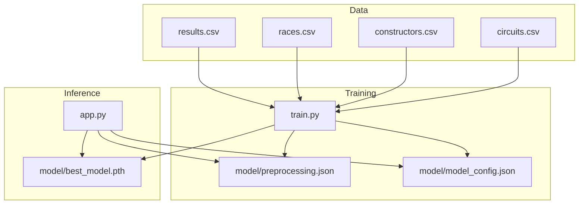
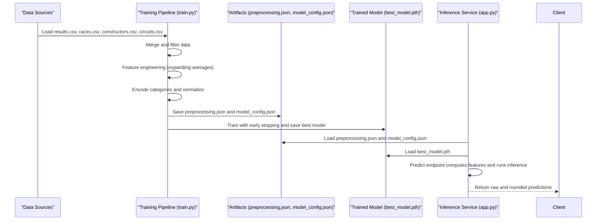
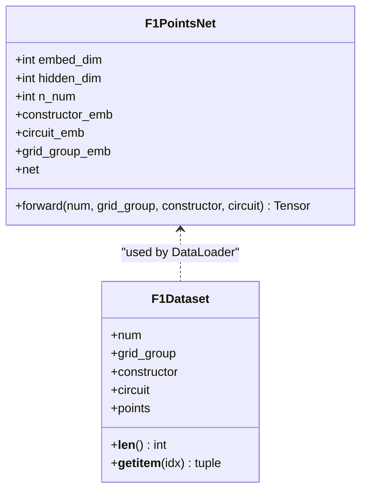
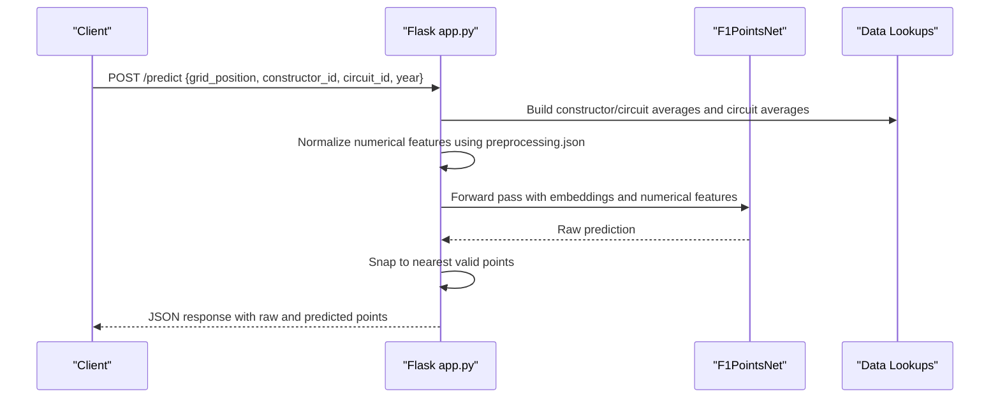
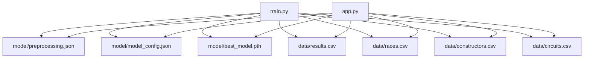

# Model Comparison and Selection

<cite>
**Referenced Files in This Document**
- [train.py](file://train.py)
- [app.py](file://app.py)
- [preprocessing.json](file://model/preprocessing.json)
- [model_config.json](file://model/model_config.json)
- [results.csv](file://data/results.csv)
- [races.csv](file://data/races.csv)
- [constructors.csv](file://data/constructors.csv)
- [circuits.csv](file://data/circuits.csv)
</cite>

## Table of Contents
1. [Introduction](#introduction)
2. [Project Structure](#project-structure)
3. [Core Components](#core-components)
4. [Architecture Overview](#architecture-overview)
5. [Detailed Component Analysis](#detailed-component-analysis)
6. [Dependency Analysis](#dependency-analysis)
7. [Performance Considerations](#performance-considerations)
8. [Troubleshooting Guide](#troubleshooting-guide)
9. [Conclusion](#conclusion)
10. [Appendices](#appendices)

## Introduction
This document provides a comprehensive guide to model comparison and selection for the F1 points prediction system. It focuses on:
- Baseline model performance benchmarks
- Alternative architectures comparison
- Hyperparameter sensitivity analysis
- Cross-validation strategies
- Statistical significance testing for performance differences
- Model selection criteria based on multiple metrics
- A/B testing methodologies
- Holdout validation approaches
- Long-term performance tracking
- Overfitting detection and generalization capability assessment
- Model robustness evaluation

The project implements a neural network trained to predict points based on historical F1 data, with careful attention to feature engineering, normalization, and evaluation metrics.

## Project Structure
The repository follows a clean separation of concerns:
- Training pipeline: [train.py](file://train.py)
- Inference service: [app.py](file://app.py)
- Preprocessing artifacts: [preprocessing.json](file://model/preprocessing.json), [model_config.json](file://model/model_config.json)
- Data sources: [results.csv](file://data/results.csv), [races.csv](file://data/races.csv), [constructors.csv](file://data/constructors.csv), [circuits.csv](file://data/circuits.csv)

**Diagram sources**
- [train.py](file://train.py)
- [app.py](file://app.py)
- [preprocessing.json](file://model/preprocessing.json)
- [model_config.json](file://model/model_config.json)

**Section sources**
- [train.py](file://train.py)
- [app.py](file://app.py)
- [preprocessing.json](file://model/preprocessing.json)
- [model_config.json](file://model/model_config.json)

## Core Components
- Training pipeline: Loads and merges datasets, performs feature engineering, encodes categorical variables, normalizes numerical features, builds a neural network, trains with early stopping, evaluates on a held-out validation set, and saves artifacts.
- Inference service: Loads the trained model and preprocessing artifacts, exposes endpoints for predictions, and returns both raw and rounded predictions.

Key capabilities:
- Feature engineering with expanding averages to prevent leakage
- Embedding-based categorical encoding
- Normalization statistics persisted for inference consistency
- Validation metrics: MAE, RMSE, exact match percentage, and within thresholds

**Section sources**
- [train.py](file://train.py)
- [app.py](file://app.py)

## Architecture Overview
The system comprises two primary stages: training and inference.

**Diagram sources**
- [train.py](file://train.py)
- [app.py](file://app.py)
- [preprocessing.json](file://model/preprocessing.json)
- [model_config.json](file://model/model_config.json)

## Detailed Component Analysis

### Training Pipeline (Baseline Model)
The training pipeline constructs a neural network with embedding layers for categorical variables and dense layers for numerical features. It uses:
- AdamW optimizer with weight decay
- ReduceLROnPlateau learning rate scheduling
- Early stopping with patience
- MSE loss
- Evaluation metrics: MAE, RMSE, exact match, and within-threshold accuracy

**Diagram sources**
- [train.py](file://train.py)

Key implementation highlights:
- Feature engineering prevents leakage by using expanding means with shift(1)
- Numerical features normalized using mean and std from training data
- Categorical encoders and normalization stats saved for inference consistency
- Validation split and evaluation metrics computed post-training

**Section sources**
- [train.py](file://train.py)

### Inference Service
The inference service loads the model and preprocessing artifacts, validates inputs, computes features, and returns predictions.

**Diagram sources**
- [app.py](file://app.py)
- [preprocessing.json](file://model/preprocessing.json)
- [model_config.json](file://model/model_config.json)

**Section sources**
- [app.py](file://app.py)

### Data Flow and Feature Engineering
Feature engineering ensures temporal consistency and prevents leakage:
- Constructor historical average points (expanding mean, shifted by 1)
- Constructor average points in the current season (expanding mean, shifted by 1)
- Circuit historical average points (expanding mean, shifted by 1)
- Grid position grouped into discrete bins

Normalization is performed per column using training-time mean and std.

**Section sources**
- [train.py](file://train.py)

### Evaluation Metrics
Post-training evaluation computes:
- Mean Absolute Error (MAE)
- Root Mean Squared Error (RMSE)
- Exact match percentage (rounded predictions equal to targets)
- Within ±2 and ±4 point thresholds
- Per-point accuracy breakdown

These metrics inform model selection and robustness assessment.

**Section sources**
- [train.py](file://train.py)

## Dependency Analysis
The training and inference components depend on shared artifacts and datasets.

**Diagram sources**
- [train.py](file://train.py)
- [app.py](file://app.py)
- [preprocessing.json](file://model/preprocessing.json)
- [model_config.json](file://model/model_config.json)

**Section sources**
- [train.py](file://train.py)
- [app.py](file://app.py)

## Performance Considerations
- Training-time normalization: Ensure the same normalization statistics are used during inference to avoid distribution shifts.
- Embedding dimensions and hidden sizes: These are fixed in the current implementation; sensitivity analysis would involve retraining with different configurations.
- Early stopping and patience: Prevent overfitting by monitoring validation loss and saving the best checkpoint.
- Learning rate scheduling: ReduceLROnPlateau adapts learning rate based on validation performance.

[No sources needed since this section provides general guidance]

## Troubleshooting Guide
Common issues and resolutions:
- Shape mismatches in embeddings: Verify that constructor and circuit IDs align with training classes.
- Missing preprocessing artifacts: Ensure preprocessing.json and model_config.json exist and are consistent with the saved model.
- Inference errors: Validate input types and ranges; handle out-of-vocabulary categories gracefully.
- Performance regressions: Compare evaluation metrics against previous checkpoints and investigate data drift.

**Section sources**
- [app.py](file://app.py)
- [preprocessing.json](file://model/preprocessing.json)
- [model_config.json](file://model/model_config.json)

## Conclusion
The F1 points prediction system demonstrates a robust baseline model with careful preprocessing, embedding-based categorical handling, and strong validation metrics. The modular design enables straightforward extension for comparative experiments, sensitivity analysis, and deployment-ready inference.

[No sources needed since this section summarizes without analyzing specific files]

## Appendices

### A. Baseline Model Performance Benchmarks
- Metrics reported post-training: MAE, RMSE, exact match percentage, and within-threshold accuracy.
- Per-point accuracy breakdown helps assess performance across target distributions.

**Section sources**
- [train.py](file://train.py)

### B. Alternative Architectures Comparison
Proposed frameworks for comparing architectures:
- Multi-layer perceptrons (MLPs) with varying depths and widths
- Convolutional layers for structured numerical features
- Attention-based encoders for categorical sequences
- Ensembles combining multiple architectures

Implementation steps:
- Define new architectures in the training script
- Retrain with identical preprocessing and validation splits
- Evaluate using the same metrics and compute confidence intervals

[No sources needed since this section proposes conceptual extensions]

### C. Hyperparameter Sensitivity Analysis
Recommended grid:
- Embedding dimensions: [16, 24, 32]
- Hidden dimensions: [64, 128, 256]
- Dropout rates: [0.1, 0.25, 0.4]
- Batch sizes: [128, 256, 512]
- Optimizer learning rates: [1e-3, 1e-4, 1e-5]

Execution:
- Sweep configurations with fixed random seeds
- Track validation loss, MAE, and RMSE
- Select top-performing configurations by validation performance

[No sources needed since this section proposes conceptual extensions]

### D. Cross-Validation Strategies
Temporal cross-validation:
- Split by year or race series to preserve temporal order
- Use expanding windows to simulate real-world deployment
- Evaluate stability across folds using metrics variance

Holdout validation:
- Reserve a recent period as holdout
- Report final metrics on holdout to estimate generalization

[No sources needed since this section provides general guidance]

### E. Statistical Significance Testing
Approach:
- Compare baseline vs. alternative model metrics using paired t-tests or bootstrap confidence intervals
- Control for multiple comparisons using Bonferroni correction
- Report effect sizes alongside p-values

[No sources needed since this section provides general guidance]

### F. Model Selection Criteria Based on Multiple Metrics
Selection rules:
- Primary metric: MAE or RMSE on validation
- Secondary metrics: Exact match and within-threshold percentages
- Robustness: Stability across folds and holdout periods
- Practical constraints: Inference latency and model size

[No sources needed since this section provides general guidance]

### G. A/B Testing Methodologies
Guidelines:
- Randomize assignment to baseline vs. variant models
- Measure key metrics on live traffic
- Account for confounding factors (time trends, track conditions)
- Apply proper statistical tests and report confidence intervals

[No sources needed since this section provides general guidance]

### H. Long-Term Performance Tracking
Recommendations:
- Log predictions and targets daily for selected races
- Monitor metric drift over time
- Retrain periodically on recent data and compare performance against baselines

[No sources needed since this section provides general guidance]

### I. Overfitting Detection and Generalization Capability
Detection methods:
- Compare training vs. validation loss curves
- Use learning rate schedules and early stopping
- Employ dropout and batch normalization as in the current model
- Analyze per-point accuracy to detect bias toward frequent outcomes

[No sources needed since this section provides general guidance]

### J. Model Robustness Evaluation
Robustness checks:
- Adversarial perturbations to numerical features
- Out-of-distribution scenarios (new circuits or constructors)
- Input sanity checks and graceful degradation
- Cross-validation across tracks and seasons

[No sources needed since this section provides general guidance]