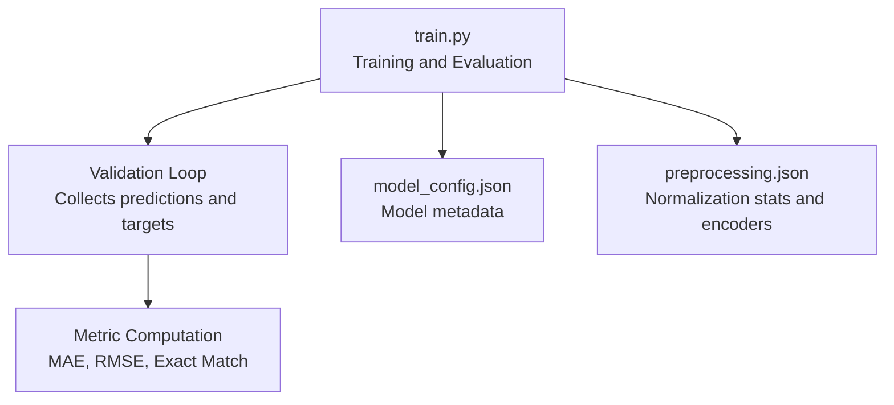
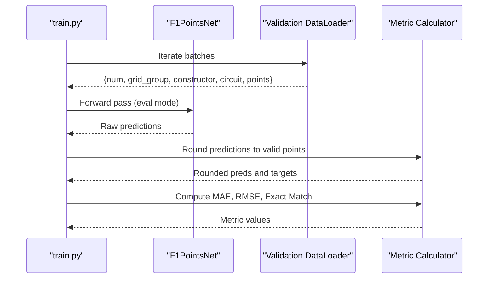
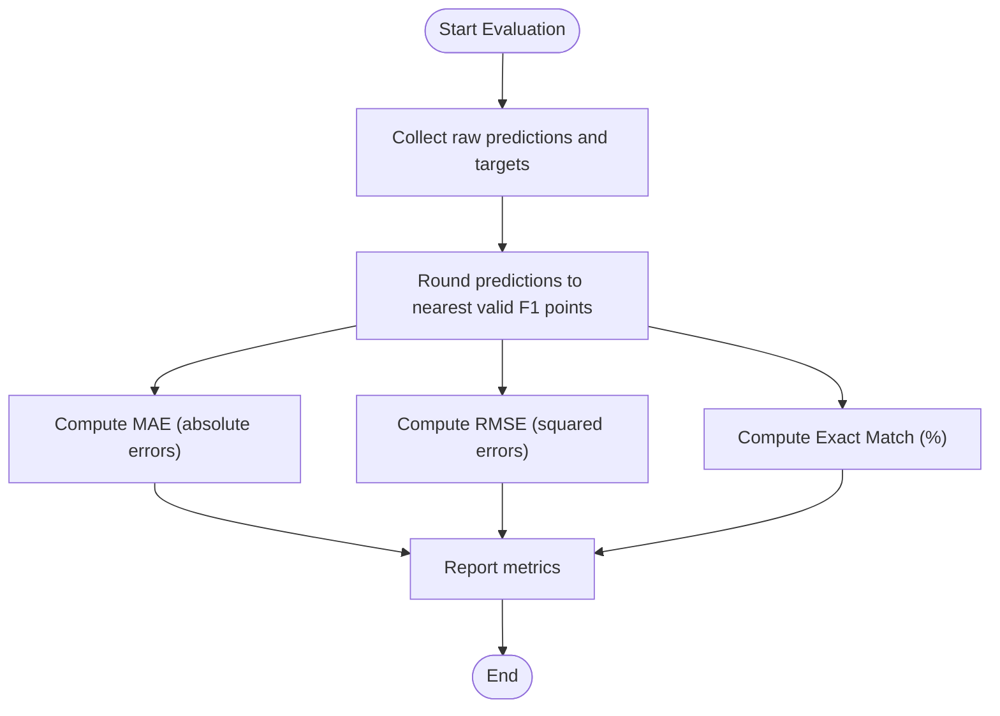
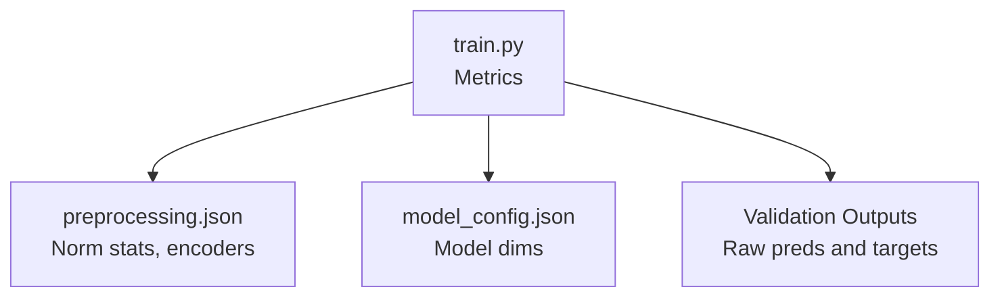

# Performance Metrics

<cite>
**Referenced Files in This Document**
- [train.py](file://train.py)
- [model_config.json](file://model/model_config.json)
- [preprocessing.json](file://model/preprocessing.json)
</cite>

## Table of Contents
1. [Introduction](#introduction)
2. [Project Structure](#project-structure)
3. [Core Components](#core-components)
4. [Architecture Overview](#architecture-overview)
5. [Detailed Component Analysis](#detailed-component-analysis)
6. [Dependency Analysis](#dependency-analysis)
7. [Performance Considerations](#performance-considerations)
8. [Troubleshooting Guide](#troubleshooting-guide)
9. [Conclusion](#conclusion)

## Introduction
This document explains the performance metrics used to evaluate the regression model that predicts Formula 1 points. It focuses on:
- Mean Absolute Error (MAE)
- Root Mean Square Error (RMSE)
- Exact match accuracy (rounded predictions)

It also covers how these metrics are calculated and interpreted in the training pipeline, how they complement each other, and practical guidance for benchmarking and prioritizing metrics in this domain.

## Project Structure
The evaluation logic resides in the training script and uses saved model metadata and preprocessing statistics.

**Diagram sources**
- [train.py:315-392](file://train.py#L315-L392)
- [model_config.json:1-1](file://model/model_config.json#L1-L1)
- [preprocessing.json:1-1](file://model/preprocessing.json#L1-L1)

**Section sources**
- [train.py:315-392](file://train.py#L315-L392)
- [model_config.json:1-1](file://model/model_config.json#L1-L1)
- [preprocessing.json:1-1](file://model/preprocessing.json#L1-L1)

## Core Components
- MAE (Mean Absolute Error): Average absolute difference between predicted and actual points.
- RMSE (Root Mean Square Error): Square root of the average squared differences; penalizes larger errors more heavily.
- Exact match accuracy: Percentage of predictions that, after rounding to the nearest valid F1 points value, match the actual target.

These metrics are computed on the validation set after model inference.

**Section sources**
- [train.py:349-351](file://train.py#L349-L351)

## Architecture Overview
The evaluation pipeline runs after training and validation. It collects raw predictions and targets, rounds predictions to valid F1 point values, and computes metrics.

**Diagram sources**
- [train.py:315-392](file://train.py#L315-L392)

## Detailed Component Analysis

### MAE (Mean Absolute Error)
- Purpose: Measures average magnitude of errors in predicted points.
- Interpretation: Lower MAE indicates smaller average deviations from true values.
- Calculation location: [train.py:349](file://train.py#L349)
- Notes:
  - Uses raw (unrounded) predictions and targets.
  - Sensitive to scale; useful for understanding typical error size.

### RMSE (Root Mean Square Error)
- Purpose: Emphasizes larger errors more than MAE due to squaring.
- Interpretation: Larger RMSE indicates more influence from outliers or large residuals.
- Calculation location: [train.py:350](file://train.py#L350)
- Notes:
  - Scale-sensitive; often paired with MAE to assess skewness of residuals.
  - Useful for detecting models that occasionally produce large mistakes.

### Exact Match Accuracy (Rounded Predictions)
- Purpose: Measures proportion of predictions that match actual targets after rounding to nearest valid F1 points value.
- Valid points in modern scoring: [0, 1, 2, 4, 6, 8, 10, 12, 15, 18, 25].
- Calculation location:
  - Rounding function: [train.py:343-345](file://train.py#L343-L345)
  - Exact match computation: [train.py:350-351](file://train.py#L350-L351)
- Notes:
  - Rounds raw predictions to the nearest valid point value before comparison.
  - Provides a classification-like perspective on regression performance.

### Additional Range-Based Metrics
- Within ±2 points and Within ±4 points percentages are also reported for contextual interpretation of prediction precision around valid point values.
- Calculation locations:
  - [train.py:352-353](file://train.py#L352-L353)

**Section sources**
- [train.py:343-353](file://train.py#L343-L353)

### Metric Computation Flow

**Diagram sources**
- [train.py:349-351](file://train.py#L349-L351)
- [train.py:343-345](file://train.py#L343-L345)

## Dependency Analysis
- Metrics depend on:
  - Raw predictions and targets collected during validation.
  - Preprocessing normalization statistics and label encoders (used during training/inference).
  - Model configuration (embedding sizes, hidden dimensions) for context.

**Diagram sources**
- [train.py:315-392](file://train.py#L315-L392)
- [preprocessing.json:1-1](file://model/preprocessing.json#L1-L1)
- [model_config.json:1-1](file://model/model_config.json#L1-L1)

**Section sources**
- [train.py:315-392](file://train.py#L315-L392)
- [preprocessing.json:1-1](file://model/preprocessing.json#L1-L1)
- [model_config.json:1-1](file://model/model_config.json#L1-L1)

## Performance Considerations
- Metric selection rationale:
  - MAE: Best for robustness to outliers and interpretable average error.
  - RMSE: Best for penalizing large errors; pairs well with MAE to detect heteroscedasticity or occasional large mistakes.
  - Exact match: Best for scenarios where predictions must align with discrete, valid outcomes (as in F1 scoring).
- Practical thresholds (context-dependent):
  - No universal thresholds apply; interpret based on target scale and domain needs.
  - For F1 points, consider whether small absolute errors are acceptable versus strict adherence to valid point values.
- Benchmarking and comparisons:
  - Compare MAE/RMSE across runs or datasets to track regression performance trends.
  - Track exact match percentage to assess alignment with discrete scoring rules.
- Statistical significance:
  - The training script does not implement formal significance tests for metrics. To assess significance, consider cross-validation or permutation tests outside this script.

[No sources needed since this section provides general guidance]

## Troubleshooting Guide
- Unexpectedly high RMSE:
  - Indicates presence of large residuals; inspect outliers and consider robust regression alternatives or residual analysis.
- Low exact match despite reasonable MAE:
  - Suggests predictions cluster near but do not hit valid point values; consider adjusting rounding strategy or adding calibration.
- Skewed distributions:
  - MAE and RMSE may differ substantially if targets are skewed; investigate target scaling or log transforms if appropriate.

[No sources needed since this section provides general guidance]

## Conclusion
The evaluation pipeline computes MAE, RMSE, and exact match accuracy on the validation set. MAE offers a robust measure of average error, RMSE highlights sensitivity to large errors, and exact match evaluates adherence to valid F1 point values. Together, they provide complementary insights for regression performance assessment in this domain.

[No sources needed since this section summarizes without analyzing specific files]