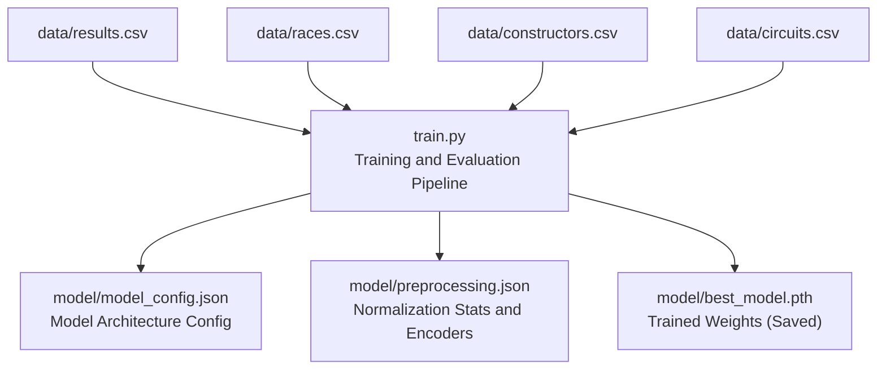
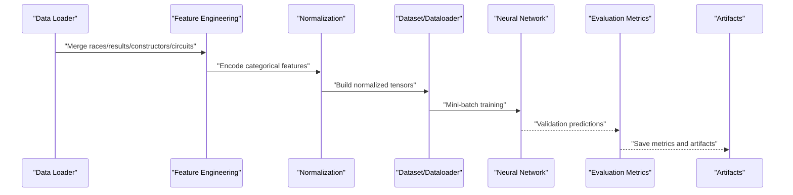
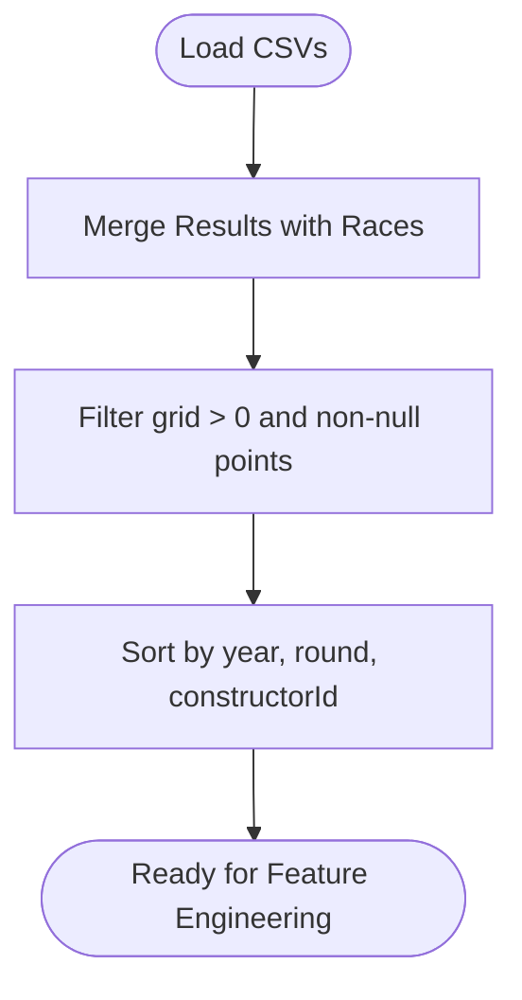
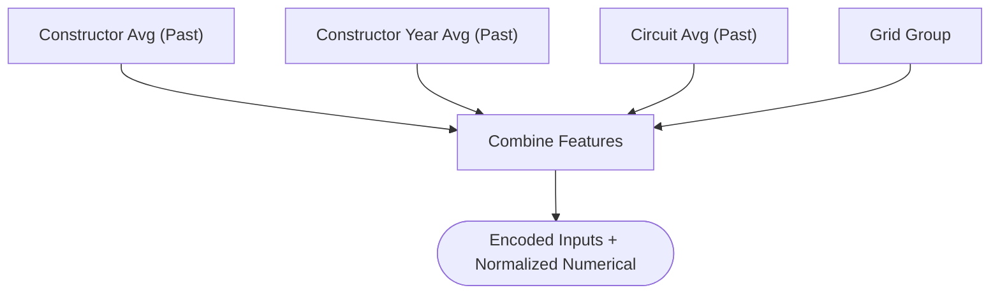
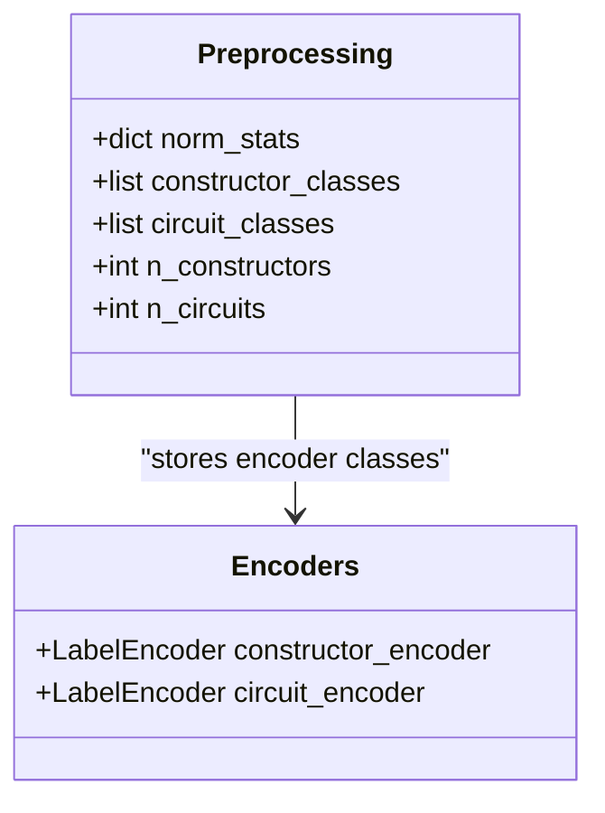
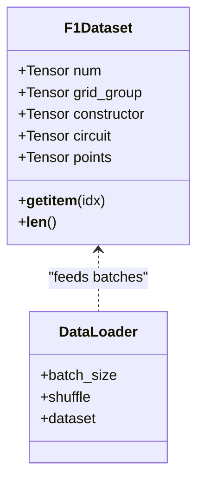
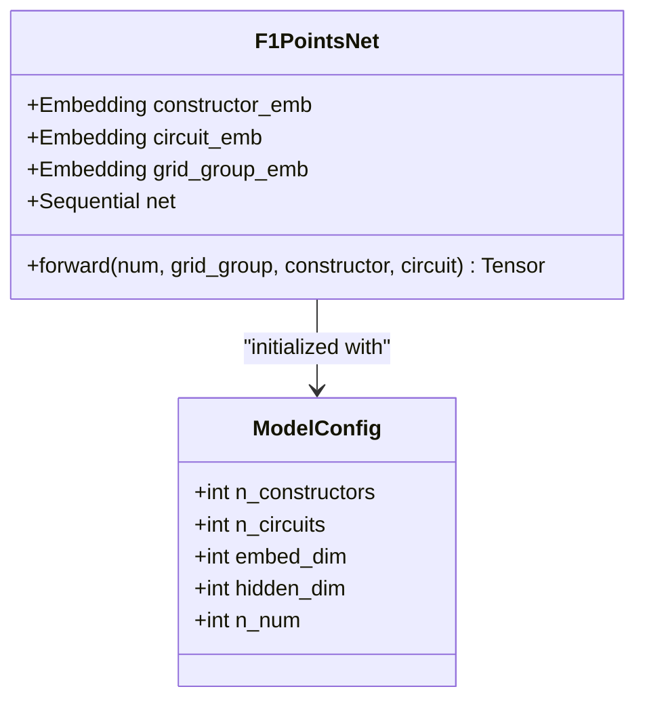
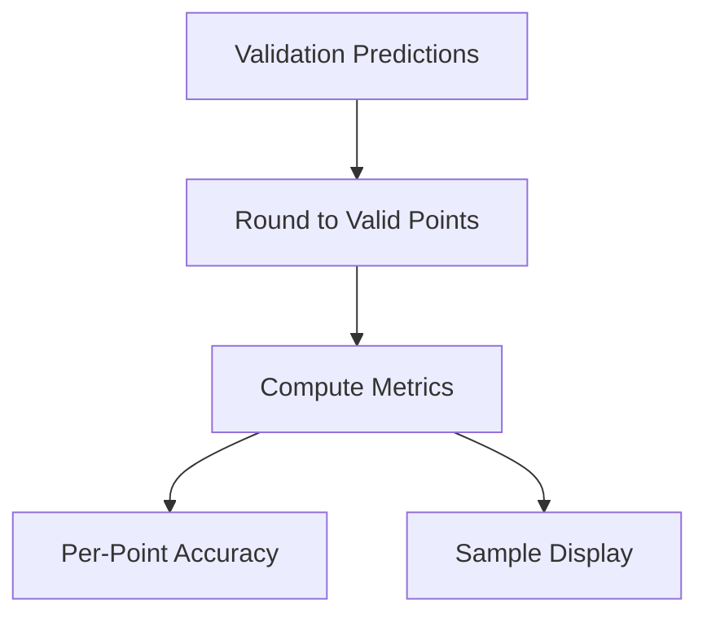
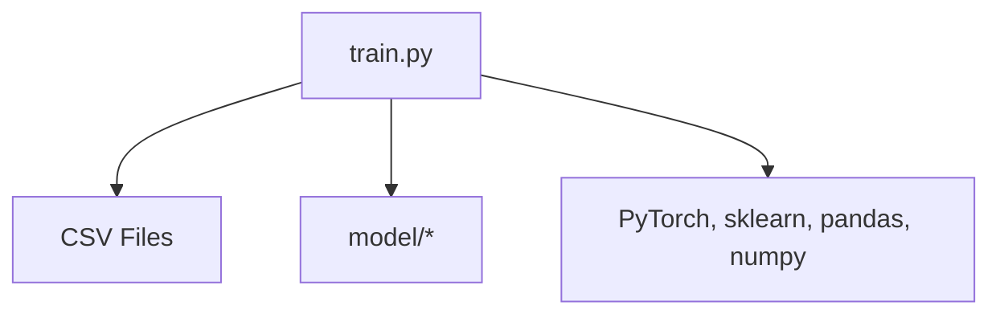

# Prediction Analysis and Interpretation

<cite>
**Referenced Files in This Document**
- [train.py](file://train.py)
- [app.py](file://app.py)
- [model_config.json](file://model/model_config.json)
- [preprocessing.json](file://model/preprocessing.json)
</cite>

## Table of Contents
1. [Introduction](#introduction)
2. [Project Structure](#project-structure)
3. [Core Components](#core-components)
4. [Architecture Overview](#architecture-overview)
5. [Detailed Component Analysis](#detailed-component-analysis)
6. [Dependency Analysis](#dependency-analysis)
7. [Performance Considerations](#performance-considerations)
8. [Troubleshooting Guide](#troubleshooting-guide)
9. [Conclusion](#conclusion)
10. [Appendices](#appendices)

## Introduction
This document explains how to analyze and interpret model predictions produced by a neural network trained to predict Formula 1 race points. It focuses on:
- Displaying sample predictions and comparing raw vs rounded outputs
- Performing error analysis (MAE, RMSE, accuracy thresholds)
- Identifying systematic biases and prediction ranges
- Correlation analysis between predicted and actual points
- Visualization approaches, residual analysis, and outlier detection strategies
- Confidence assessment, uncertainty quantification, and decision-making frameworks

The repository provides a complete training pipeline and evaluation metrics, enabling robust prediction interpretation workflows.

## Project Structure
The repository centers around a single training script that loads datasets, builds features, trains a neural network, evaluates performance, and saves artifacts. The model artifacts include configuration and preprocessing statistics.



**Diagram sources**
- [train.py:19-21](file://train.py#L19-L21)
- [train.py:106-108](file://train.py#L106-L108)
- [train.py:234](file://train.py#L234)
- [model_config.json:1](file://model/model_config.json#L1)
- [preprocessing.json:1](file://model/preprocessing.json#L1)

**Section sources**
- [train.py:19-311](file://train.py#L19-L311)
- [model_config.json:1](file://model/model_config.json#L1)
- [preprocessing.json:1](file://model/preprocessing.json#L1)

## Core Components
- Training and evaluation pipeline: Loads data, merges datasets, engineers features, normalizes numerical variables, encodes categorical variables, constructs a neural network, trains with early stopping, evaluates on a held-out set, and prints performance metrics.
- Model artifacts: Saved configuration and preprocessing metadata enable deployment and inference.
- Evaluation metrics: MAE, RMSE, exact match percentage, and thresholds within ±2 and ±4 points.

Key capabilities for prediction analysis:
- Raw predictions and rounded-to-valid-points outputs
- Per-point accuracy breakdown
- Sample prediction display

**Section sources**
- [train.py:19-311](file://train.py#L19-L311)
- [model_config.json:1](file://model/model_config.json#L1)
- [preprocessing.json:1](file://model/preprocessing.json#L1)

## Architecture Overview
The training pipeline follows a clear sequence: data ingestion, feature engineering, normalization, dataset construction, model definition, training with early stopping, and evaluation with metrics and sample displays.



**Diagram sources**
- [train.py:19-136](file://train.py#L19-L136)
- [train.py:141-178](file://train.py#L141-L178)
- [train.py:183-242](file://train.py#L183-L242)
- [train.py:247-311](file://train.py#L247-L311)

## Detailed Component Analysis

### Data Loading and Merging
- Loads results, races, constructors, and circuits CSVs.
- Merges results with race metadata (year, round, circuitId).
- Filters out rows with invalid grid positions and missing points.
- Sorts chronologically to prevent data leakage during expanding averages.



**Diagram sources**
- [train.py:19-26](file://train.py#L19-L26)
- [train.py:41-42](file://train.py#L41-L42)

**Section sources**
- [train.py:19-31](file://train.py#L19-L31)

### Feature Engineering
- Expanding average points per constructor (past-only).
- Seasonal expanding average per constructor.
- Circuit historical average (past-only).
- Grid position grouping into discrete bins.
- No leakage: sorting ensures future information does not leak into features.



**Diagram sources**
- [train.py:44-61](file://train.py#L44-L61)
- [train.py:62-71](file://train.py#L62-L71)

**Section sources**
- [train.py:44-71](file://train.py#L44-L71)

### Categorical Encoding and Normalization
- Label encoders transform constructorId and circuitId into integer indices.
- Normalization stats (means and stds) computed for numerical features and stored for reproducibility.



**Diagram sources**
- [train.py:78-104](file://train.py#L78-L104)
- [preprocessing.json:1](file://model/preprocessing.json#L1)

**Section sources**
- [train.py:78-104](file://train.py#L78-L104)
- [preprocessing.json:1](file://model/preprocessing.json#L1)

### Dataset and DataLoader
- F1Dataset stacks normalized numerical features, grid group embeddings, and encoded categorical indices.
- DataLoader splits data into train and validation sets.



**Diagram sources**
- [train.py:116-136](file://train.py#L116-L136)

**Section sources**
- [train.py:116-136](file://train.py#L116-L136)

### Neural Network Architecture
- Embeddings for constructors and circuits, plus a dedicated embedding for grid groups.
- Fully connected network with batch normalization, GELU activation, and dropout.
- Clamps outputs to non-negative values to align with point scoring.



**Diagram sources**
- [train.py:141-172](file://train.py#L141-L172)
- [model_config.json:1](file://model/model_config.json#L1)

**Section sources**
- [train.py:141-172](file://train.py#L141-L172)
- [model_config.json:1](file://model/model_config.json#L1)

### Training and Early Stopping
- Optimizer AdamW with learning rate scheduling.
- MSE loss with gradient clipping.
- Early stopping based on validation loss.

```mermaid
sequenceDiagram
participant Train as "Training Loop"
participant Opt as "Optimizer"
participant Sch as "LR Scheduler"
participant Val as "Validation"
Train->>Opt : "Forward + Backward"
Opt-->>Train : "Parameter Updates"
Train->>Sch : "Step by Validation Loss"
Train->>Val : "Evaluate"
Val-->>Train : "Loss"
alt Improvement
Train->>Train : "Save Best Model"
else No Improvement
Train->>Train : "Increment Counter"
end
```

**Diagram sources**
- [train.py:183-239](file://train.py#L183-L239)

**Section sources**
- [train.py:183-239](file://train.py#L183-L239)

### Evaluation and Metrics
- Collects raw predictions and targets from validation.
- Rounds predictions to nearest valid point value.
- Computes MAE, RMSE, exact match, and thresholds within ±2 and ±4 points.
- Prints per-point accuracy and a sample prediction table.



**Diagram sources**
- [train.py:251-296](file://train.py#L251-L296)

**Section sources**
- [train.py:251-296](file://train.py#L251-L296)

## Dependency Analysis
- Data dependencies: The training script depends on CSV files located under the data directory.
- Model artifacts: Saved configuration and preprocessing JSON files are generated during training.
- Runtime dependencies: PyTorch, scikit-learn, pandas, numpy, and JSON for artifact serialization.



**Diagram sources**
- [train.py:19-21](file://train.py#L19-L21)
- [train.py:106-108](file://train.py#L106-L108)
- [train.py:175-178](file://train.py#L175-L178)

**Section sources**
- [train.py:19-21](file://train.py#L19-L21)
- [train.py:106-108](file://train.py#L106-L108)
- [train.py:175-178](file://train.py#L175-L178)

## Performance Considerations
- Training stability: Batch normalization, dropout, and gradient clipping help reduce overfitting.
- Early stopping prevents overtraining and selects the best validation checkpoint.
- Clamping outputs to non-negative values aligns with point scoring semantics.

[No sources needed since this section provides general guidance]

## Troubleshooting Guide
- Missing data files: Ensure CSV files exist in the data directory referenced by the training script.
- Device compatibility: The model runs on CPU by default; adjust device selection if GPU is available.
- Artifact loading: Verify that model artifacts (configuration and preprocessing JSON) are present before inference.
- Data leakage prevention: Confirm chronological sorting occurs prior to computing expanding averages.

**Section sources**
- [train.py:19-21](file://train.py#L19-L21)
- [train.py:175](file://train.py#L175)
- [train.py:234](file://train.py#L234)

## Conclusion
The repository provides a robust training and evaluation pipeline for predicting Formula 1 points. The evaluation stage offers essential metrics and sample displays suitable for prediction analysis. To extend the analysis for deeper insights, consider adding visualization routines, residual plots, and uncertainty quantification methods.

[No sources needed since this section summarizes without analyzing specific files]

## Appendices

### Prediction Analysis Workflow
- Load validation predictions and targets from the evaluation stage.
- Round predictions to nearest valid point value for comparison.
- Compute residuals (raw and rounded) and analyze distributions.
- Identify systematic biases by comparing mean residuals per target point value.
- Visualize residuals against predicted values and actual categories.
- Detect outliers using residual thresholds and leverage influence measures.
- Assess confidence via prediction ranges and calibration plots.
- Apply decision-making frameworks based on risk tolerance and threshold windows.

[No sources needed since this section provides general guidance]

### Visualization Approaches
- Scatter plot of predicted vs actual points with trend line.
- Residual vs fitted values plot to detect heteroscedasticity.
- Histogram of residuals to assess normality.
- Boxplots of residuals by target point value to reveal systematic bias.
- Calibration curves to compare observed vs expected frequencies.

[No sources needed since this section provides general guidance]

### Residual Analysis Methods
- Compute raw and rounded residuals.
- Analyze mean and standard deviation of residuals by target category.
- Use rolling residuals to detect temporal shifts.
- Flag observations with large standardized residuals.

[No sources needed since this section provides general guidance]

### Outlier Detection Strategies
- Absolute residual threshold (e.g., beyond 2–3 standard deviations).
- Cook’s distance or leverage-based detection for influential points.
- Isolation Forest or Local Outlier Factor for multivariate outliers.

[No sources needed since this section provides general guidance]

### Confidence Assessment and Uncertainty Quantification
- Prediction intervals via bootstrap or quantile regression.
- Monte Carlo Dropout for Bayesian-style uncertainty estimates.
- Model ensembling to estimate predictive variance.
- Decision thresholds aligned with uncertainty bands for risk-aware decisions.

[No sources needed since this section provides general guidance]