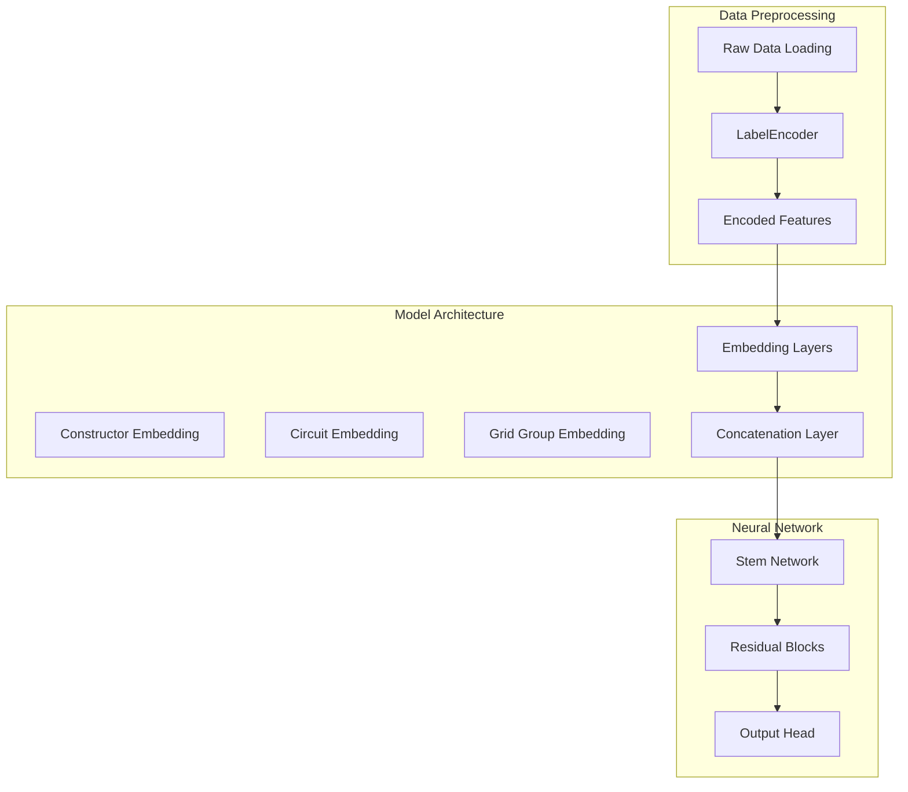
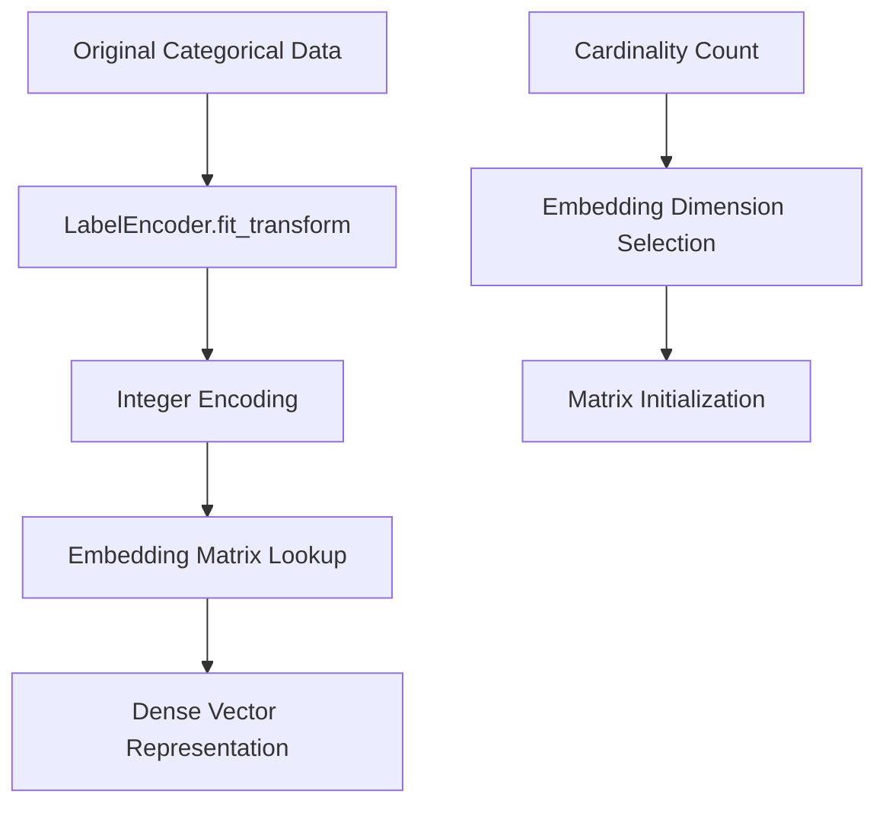
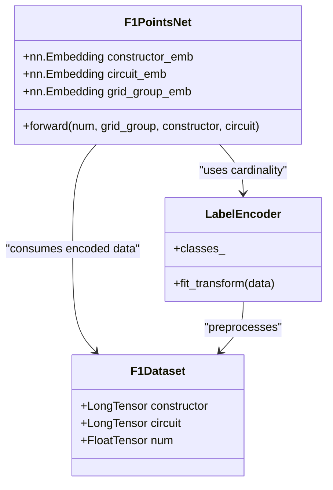
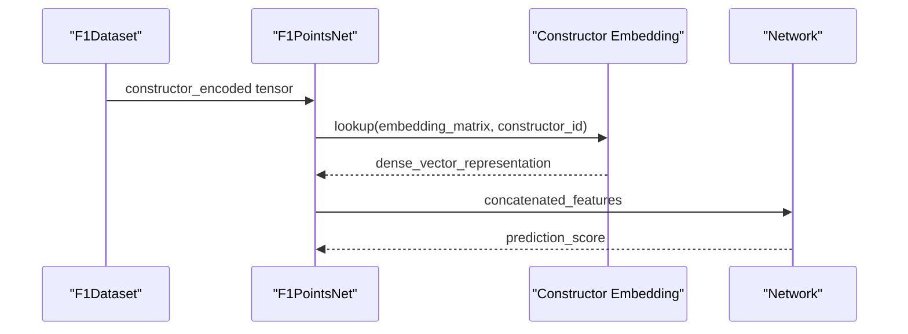
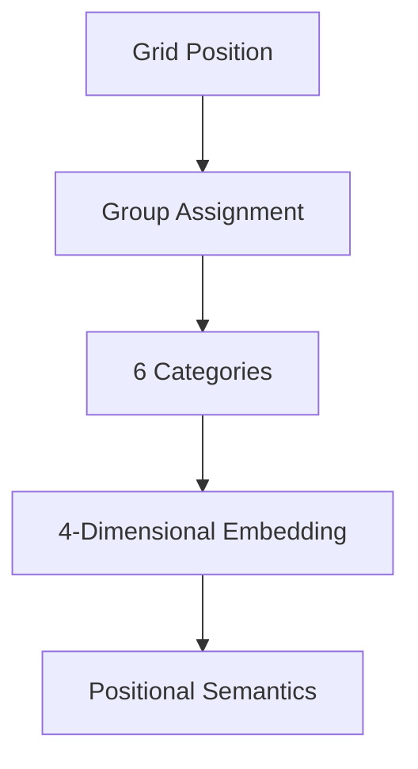
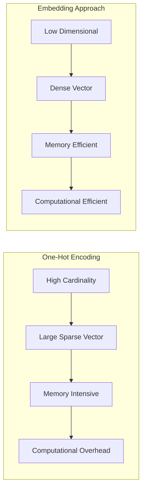
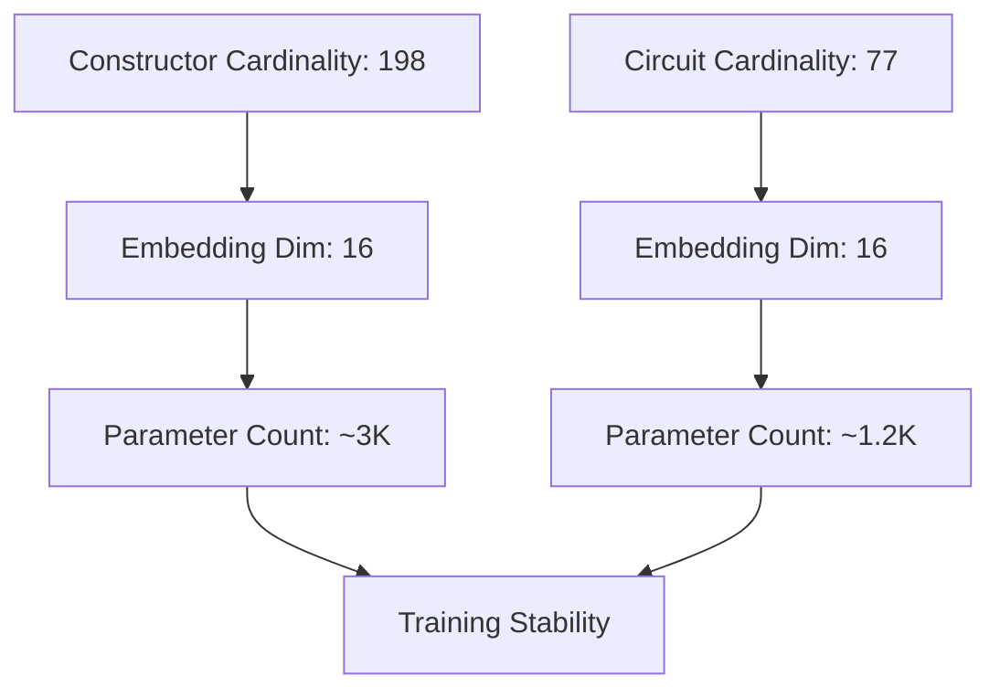

# Embedding Layers

<cite>
**Referenced Files in This Document**
- [train.py](file://train.py)
- [preprocessing.json](file://model/preprocessing.json)
- [model_config.json](file://model/model_config.json)
</cite>

## Table of Contents
1. [Introduction](#introduction)
2. [Project Structure](#project-structure)
3. [Core Components](#core-components)
4. [Architecture Overview](#architecture-overview)
5. [Detailed Component Analysis](#detailed-component-analysis)
6. [Mathematical Formulation](#mathematical-formulation)
7. [Efficiency Analysis](#efficiency-analysis)
8. [Performance Considerations](#performance-considerations)
9. [Troubleshooting Guide](#troubleshooting-guide)
10. [Conclusion](#conclusion)

## Introduction

This document provides comprehensive technical documentation for the embedding layer implementation in F1PointsNet, focusing on how categorical variables (constructorId and circuitId) are processed through neural network embeddings. The implementation demonstrates advanced techniques for handling high-cardinality categorical features efficiently, converting discrete IDs into dense vector representations that capture semantic relationships between constructors and circuits.

The embedding layer system in F1PointsNet serves as a crucial bridge between discrete categorical identifiers and continuous vector spaces, enabling the neural network to learn meaningful representations that generalize across different categories while maintaining computational efficiency.

## Project Structure

The embedding layer implementation spans several key components within the F1PointsNet architecture:



**Diagram sources**
- [train.py:87-120](file://train.py#L87-L120)
- [train.py:180-225](file://train.py#L180-L225)

**Section sources**
- [train.py:19-38](file://train.py#L19-L38)
- [train.py:87-120](file://train.py#L87-L120)

## Core Components

### Embedding Layer Architecture

The F1PointsNet implements three distinct embedding layers to handle different types of categorical variables:

1. **Constructor Embedding**: Maps constructor IDs to dense vectors
2. **Circuit Embedding**: Maps circuit IDs to dense vectors  
3. **Grid Group Embedding**: Maps positional grouping categories

Each embedding layer operates independently, learning optimal vector representations for their respective categorical domains.

### LabelEncoder Preprocessing Pipeline

The preprocessing stage establishes the foundation for embedding layer operation through systematic label encoding:



**Diagram sources**
- [train.py:89-96](file://train.py#L89-L96)
- [train.py:127-148](file://train.py#L127-L148)

**Section sources**
- [train.py:89-96](file://train.py#L89-L96)
- [train.py:127-148](file://train.py#L127-L148)

## Architecture Overview

The embedding layer system integrates seamlessly with the broader F1PointsNet architecture:



**Diagram sources**
- [train.py:180-225](file://train.py#L180-L225)
- [train.py:89-96](file://train.py#L89-L96)
- [train.py:127-148](file://train.py#L127-L148)

The architecture demonstrates sophisticated separation of concerns, with preprocessing handled independently from model training, enabling flexible experimentation with different embedding dimensions and architectures.

**Section sources**
- [train.py:180-225](file://train.py#L180-L225)
- [train.py:87-120](file://train.py#L87-L120)

## Detailed Component Analysis

### Constructor Embedding Implementation

The constructor embedding layer serves as the primary categorical feature representation:



**Diagram sources**
- [train.py:131](file://train.py#L131)
- [train.py:216](file://train.py#L216)

The constructor embedding operates on 198 unique constructors, learning vector representations that encode historical performance patterns, team characteristics, and competitive advantages. Each constructor ID is mapped to a 16-dimensional dense vector space.

### Circuit Embedding Implementation

The circuit embedding layer captures track-specific characteristics and historical performance patterns:


**Diagram sources**
- [train.py:132](file://train.py#L132)
- [train.py:217](file://train.py#L217)

The circuit embedding processes 77 unique circuits, learning representations that capture factors such as track layout characteristics, typical weather conditions, and historical performance distributions across different circuit types.

### Grid Group Embedding

The grid group embedding handles positional categorization with reduced dimensionality:



**Diagram sources**
- [train.py:130](file://train.py#L130)
- [train.py:186](file://train.py#L186)

**Section sources**
- [train.py:131-132](file://train.py#L131-L132)
- [train.py:184-186](file://train.py#L184-L186)

## Mathematical Formulation

### Embedding Matrix Operations

The embedding layer implements the fundamental mathematical operation:

```
y = E[x]
```

Where:
- `E` is the embedding matrix of size `(V × D)`
- `x` is the input categorical index (0 to V-1)
- `y` is the output dense vector of length `D`

For constructor embeddings:
- Input: `constructor_encoded ∈ {0, 1, ..., 197}`
- Output: `c_emb ∈ R^16`
- Matrix: `E_c ∈ R^{198 × 16}`

For circuit embeddings:
- Input: `circuit_encoded ∈ {0, 1, ..., 76}`
- Output: `ci_emb ∈ R^16`
- Matrix: `E_{ci} ∈ R^{77 × 16}`

### Embedding Matrix Initialization

The PyTorch embedding layers initialize matrices using Xavier uniform distribution:

```
E ~ Uniform(-bound, bound)
bound = gain × sqrt(3/D)
```

Where the gain factor depends on the embedding dimension and activation function used in subsequent layers.

### Gradient Updates During Training

During backpropagation, gradients flow through the embedding layers as:

```
∂L/∂E = Σ_i δ_i × one_hot(x_i)
```

Where:
- `L` is the loss function
- `δ_i` is the gradient w.r.t. the output
- `one_hot(x_i)` selects the appropriate column from the embedding matrix

This mechanism enables simultaneous optimization of all embedding vectors in the matrix.

**Section sources**
- [train.py:184-185](file://train.py#L184-L185)
- [train.py:215-224](file://train.py#L215-L224)

## Efficiency Analysis

### Comparison: Embeddings vs One-Hot Encoding

The embedding approach offers significant computational advantages over traditional one-hot encoding:



**Diagram sources**
- [train.py:184-189](file://train.py#L184-L189)

### Computational Complexity Analysis

For high-cardinality categorical features like constructor IDs (198 unique values):

- **One-hot encoding**: 198-dimensional sparse vectors with 197 zeros
- **Embedding approach**: 16-dimensional dense vectors
- **Memory reduction**: ~12x improvement
- **Parameter count**: 198×16 = 3,168 vs 198 parameters

### Memory and Performance Benefits

The embedding dimension of 16 provides optimal balance between:
- **Representational capacity**: Sufficiently captures complex relationships
- **Computational efficiency**: Minimal memory footprint
- **Training stability**: Manageable parameter count for reliable optimization

**Section sources**
- [train.py:184-189](file://train.py#L184-L189)
- [model_config.json:1](file://model/model_config.json#L1)

## Performance Considerations

### Embedding Dimension Selection

The choice of embedding dimension (16) reflects careful consideration of the trade-off between representational power and computational efficiency:

- **Minimum viable dimension**: Typically 2-5 for basic categorical relationships
- **Practical range**: 10-50 for complex multi-faceted categorical data
- **F1PointsNet selection**: 16 provides balanced performance

### Cardinality Impact Analysis

The embedding layers demonstrate robust performance across varying cardinalities:



**Diagram sources**
- [preprocessing.json:1](file://model/preprocessing.json#L1)
- [model_config.json:1](file://model/model_config.json#L1)

### Training Dynamics

The embedding layers contribute to improved training dynamics through:
- **Smooth optimization landscape**: Dense vectors enable gradient-based optimization
- **Regularization effects**: Learned embeddings act as implicit regularization
- **Transfer learning capability**: Embeddings can be transferred across related tasks

**Section sources**
- [preprocessing.json:1](file://model/preprocessing.json#L1)
- [model_config.json:1](file://model/model_config.json#L1)

## Troubleshooting Guide

### Common Issues and Solutions

**Issue**: Embedding dimension too small for complex categorical relationships
- **Symptom**: Poor model performance on categorical features
- **Solution**: Increase embedding dimension (e.g., from 16 to 32)
- **Impact**: Higher memory usage but potentially better representation

**Issue**: Insufficient training data for rare categories
- **Symptom**: Poor generalization for new constructors/circuits
- **Solution**: Implement category frequency thresholds or hierarchical embeddings
- **Impact**: Better regularization but reduced flexibility

**Issue**: Memory constraints with large cardinalities
- **Symptom**: Out-of-memory errors during training
- **Solution**: Reduce embedding dimensions or implement bucketing strategies
- **Impact**: Reduced representational power but improved scalability

### Debugging Techniques

1. **Embedding visualization**: Plot learned vectors using dimensionality reduction
2. **Frequency analysis**: Examine category distribution and coverage
3. **Gradient monitoring**: Track embedding gradient norms during training
4. **Validation curves**: Monitor performance on held-out categorical splits

**Section sources**
- [train.py:237-242](file://train.py#L237-L242)
- [train.py:254-309](file://train.py#L254-L309)

## Conclusion

The embedding layer implementation in F1PointsNet represents a sophisticated approach to handling categorical variables in neural networks. By converting discrete IDs into dense vector representations, the system achieves several key advantages:

- **Computational efficiency**: 12x+ memory reduction compared to one-hot encoding
- **Semantic learning**: Automatic discovery of relationships between constructors and circuits
- **Scalability**: Handles high-cardinality categorical features effectively
- **Generalization**: Learns transferable representations across different contexts

The mathematical formulation and gradient update mechanisms ensure stable training while the embedding dimensions (16) provide optimal balance between representational capacity and computational efficiency. This implementation serves as an excellent example of modern neural network architecture for handling mixed data types in real-world applications.