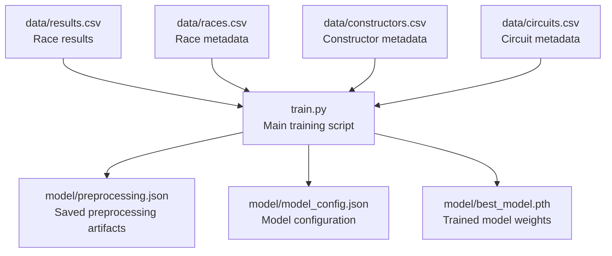
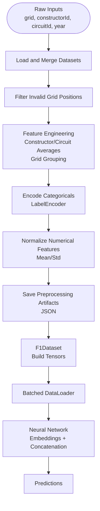
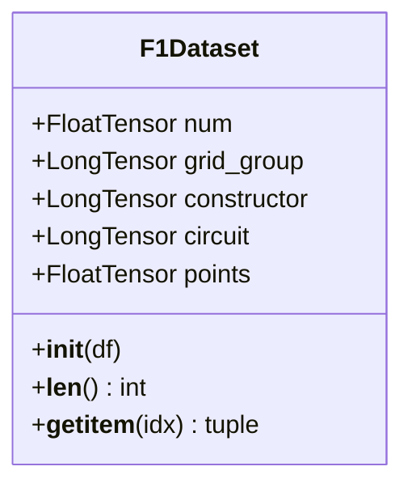
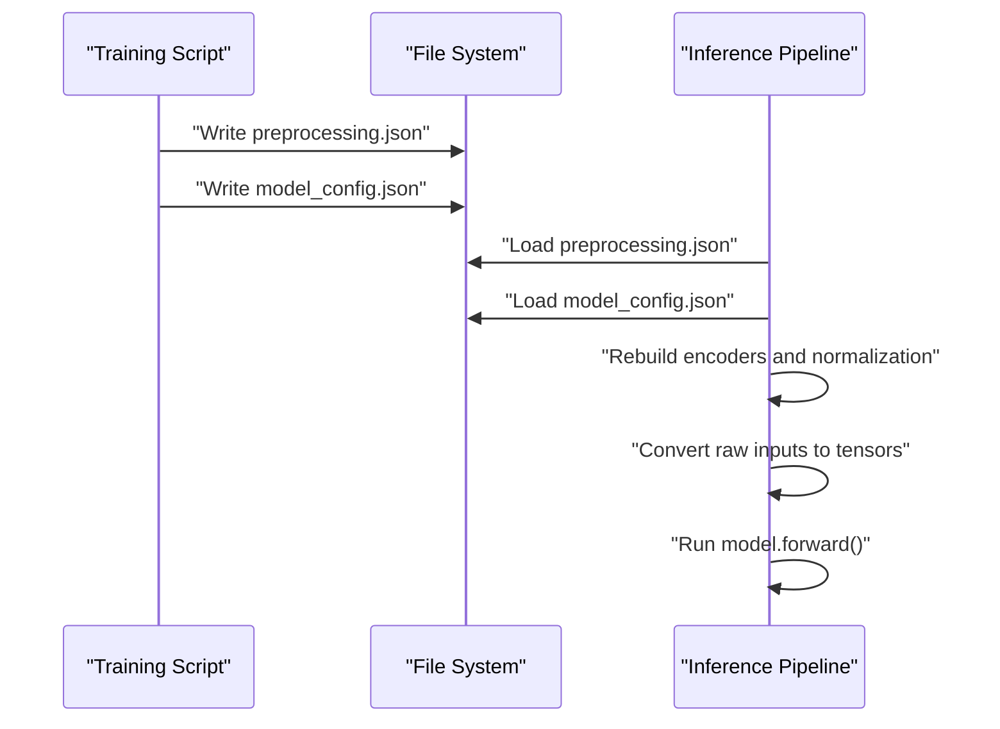
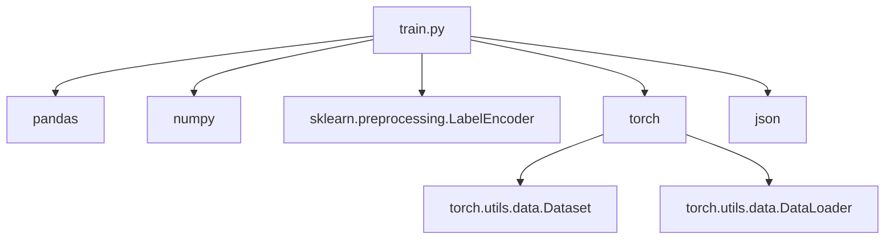

# Input Processing

<cite>
**Referenced Files in This Document**
- [train.py](file://train.py)
- [preprocessing.json](file://model/preprocessing.json)
- [model_config.json](file://model/model_config.json)
</cite>

## Table of Contents
1. [Introduction](#introduction)
2. [Project Structure](#project-structure)
3. [Core Components](#core-components)
4. [Architecture Overview](#architecture-overview)
5. [Detailed Component Analysis](#detailed-component-analysis)
6. [Dependency Analysis](#dependency-analysis)
7. [Performance Considerations](#performance-considerations)
8. [Troubleshooting Guide](#troubleshooting-guide)
9. [Conclusion](#conclusion)

## Introduction
This document explains the input feature processing pipeline used to transform raw race inputs (grid position, constructorId, circuitId, year) into model-ready tensors for training and inference. It covers:
- Numerical feature normalization using mean and standard deviation statistics
- Categorical feature encoding with LabelEncoder
- Tensor conversion and batching via a custom dataset class
- Preprocessing artifact saving and loading for inference consistency
- Shape transformations and concatenation strategy for mixed input types

## Project Structure
The pipeline is implemented in a single training script that loads and merges datasets, performs feature engineering, saves preprocessing artifacts, defines a dataset class, and trains a neural network.

**Diagram sources**
- [train.py](file://train.py)
- [preprocessing.json](file://model/preprocessing.json)
- [model_config.json](file://model/model_config.json)

**Section sources**
- [train.py](file://train.py)

## Core Components
- Data loading and merging: Loads results and races, merges on race identifiers, filters invalid grid positions, and ensures numeric dtypes.
- Feature engineering: Creates lagged and grouped averages for constructors and circuits, and bins grid positions into groups.
- Categorical encoding: Applies LabelEncoder to constructorId and circuitId to produce integer-encoded categories.
- Numerical normalization: Computes mean and standard deviation per column and normalizes features; saves normalization stats.
- Preprocessing artifacts: Saves encoder classes, normalization stats, and counts to JSON for inference consistency.
- Dataset class: Defines F1Dataset to convert engineered features into PyTorch tensors and expose batches.
- Model integration: The model consumes normalized numerical features concatenated with embedded categorical features and grid group embeddings.

**Section sources**
- [train.py](file://train.py)

## Architecture Overview
The input processing pipeline transforms raw inputs into tensors consumed by the neural network. The process is summarized below.

**Diagram sources**
- [train.py](file://train.py)
- [preprocessing.json](file://model/preprocessing.json)

## Detailed Component Analysis

### Data Loading and Merging
- Loads results and races datasets, merges on race identifiers, and retains only rows with positive grid positions.
- Drops rows where target points are missing.
- Casts relevant columns to integers and floats to ensure consistent dtypes for downstream processing.

Key behaviors:
- Filters out grid <= 0 to avoid invalid inputs.
- Ensures dtype consistency for grid, year, round, constructorId, circuitId, and points.

**Section sources**
- [train.py](file://train.py)

### Feature Engineering
- Chronological sorting prevents data leakage during expanding mean computations.
- Expanding averages:
  - Constructor average points up to the previous race.
  - Constructor average points within the current season up to the previous race.
  - Circuit average points up to the previous race.
- Grid position grouping into discrete buckets to reduce cardinality and improve embedding learning.

These engineered features become part of the input set for normalization and modeling.

**Section sources**
- [train.py](file://train.py)

### Categorical Encoding with LabelEncoder
- Applies LabelEncoder to constructorId and circuitId to produce integer-encoded categories.
- Stores the original class labels and counts for later use during inference.

Outputs:
- Two new encoded columns: constructor_encoded and circuit_encoded.
- Counts of unique constructors and circuits.

**Section sources**
- [train.py](file://train.py)

### Numerical Feature Normalization
- Selects numerical columns for normalization: grid, year, constructor_avg_pts, constructor_year_avg_pts, circuit_avg_pts.
- Computes mean and standard deviation per column and stores them in a dictionary.
- Applies z-score normalization to each selected column; uses a small epsilon to avoid division by zero.
- Saves normalization stats alongside encoder classes and counts.

Normalization strategy:
- Mean subtraction and standard deviation scaling.
- Robustness against zero variance by substituting a minimal std when needed.

**Section sources**
- [train.py](file://train.py)

### Preprocessing Artifacts
- Saves a JSON artifact containing:
  - Encoder class lists for constructors and circuits.
  - Normalization statistics (means and stds).
  - Counts of unique constructors and circuits.
- Also saves model configuration (counts, embedding dimension, hidden sizes) for runtime model construction.

Artifacts enable consistent preprocessing during inference.

**Section sources**
- [train.py](file://train.py)
- [preprocessing.json](file://model/preprocessing.json)
- [model_config.json](file://model/model_config.json)

### F1Dataset Class Implementation
The dataset class builds tensors from the preprocessed DataFrame and exposes batches for training.

Key attributes built in __init__:
- num: FloatTensor of shape (N, 5) containing normalized numerical features.
- grid_group: LongTensor of shape (N,) for grid group embeddings.
- constructor: LongTensor of shape (N,) for constructor embeddings.
- circuit: LongTensor of shape (N,) for circuit embeddings.
- points: FloatTensor of shape (N, 1) for targets.

Batching:
- __getitem__ returns a tuple of tensors for a single sample.
- DataLoader batches these tuples with configurable batch sizes.

**Diagram sources**
- [train.py](file://train.py)

**Section sources**
- [train.py](file://train.py)

### Tensor Conversion and Concatenation Strategy
- Numerical features are stacked horizontally into a single matrix and converted to FloatTensor.
- Categorical features are converted to LongTensor for embedding indices.
- During model forward pass, embeddings for constructors and circuits are concatenated with a grid group embedding and the normalized numerical features along the channel dimension.

Concatenation order:
- constructor_embedding
- circuit_embedding
- grid_group_embedding
- normalized_numerical_features

This produces a single input vector per sample for the fully connected head.

**Section sources**
- [train.py](file://train.py)

### Preprocessing Artifact Saving and Loading for Inference Consistency
- Training script saves preprocessing.json with encoder classes, normalization stats, and counts.
- Model configuration is saved to model_config.json.
- These artifacts are used during inference to:
  - Recreate encoders with the same label sets.
  - Apply identical normalization using stored means and stds.
  - Construct the model with matching embedding dimensions and input sizes.

**Diagram sources**
- [train.py](file://train.py)
- [preprocessing.json](file://model/preprocessing.json)
- [model_config.json](file://model/model_config.json)

**Section sources**
- [train.py](file://train.py)

## Dependency Analysis
The pipeline depends on:
- Pandas and NumPy for data manipulation and tensor creation.
- Scikit-learn’s LabelEncoder for categorical encoding.
- PyTorch for tensor operations, embeddings, and DataLoader batching.
- JSON for persisting preprocessing artifacts.

**Diagram sources**
- [train.py](file://train.py)

**Section sources**
- [train.py](file://train.py)

## Performance Considerations
- Vectorized operations: Normalization and stacking leverage NumPy and PyTorch for efficient computation.
- Embedding dimensions: Embedding sizes are chosen to balance representational capacity and computational cost.
- Batch sizes: Larger validation batches reduce overhead during evaluation while keeping memory usage manageable.
- Early stopping and learning rate scheduling help prevent overfitting and stabilize training.

## Troubleshooting Guide
Common issues and resolutions:
- Zero variance in normalization: The pipeline substitutes a minimal std when standard deviation is near zero, preventing division errors.
- Label mismatch during inference: Ensure encoder classes in preprocessing.json match the training-time classes; re-run training if new categories appear.
- Shape mismatches: Verify that the number of normalized numerical columns aligns with the model’s n_num configuration.
- Data leakage: Confirm chronological sorting and expanding mean shifts occur after sorting to avoid future information leakage.

**Section sources**
- [train.py](file://train.py)

## Conclusion
The input processing pipeline converts raw race inputs into model-ready tensors by engineering meaningful features, encoding categoricals, normalizing numerical values, and persisting preprocessing artifacts. The F1Dataset class efficiently constructs tensors and batches them for training, while the saved artifacts ensure consistent preprocessing during inference.