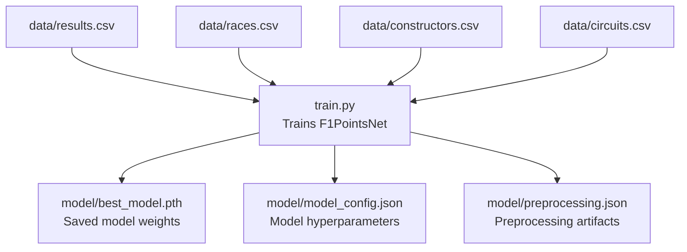
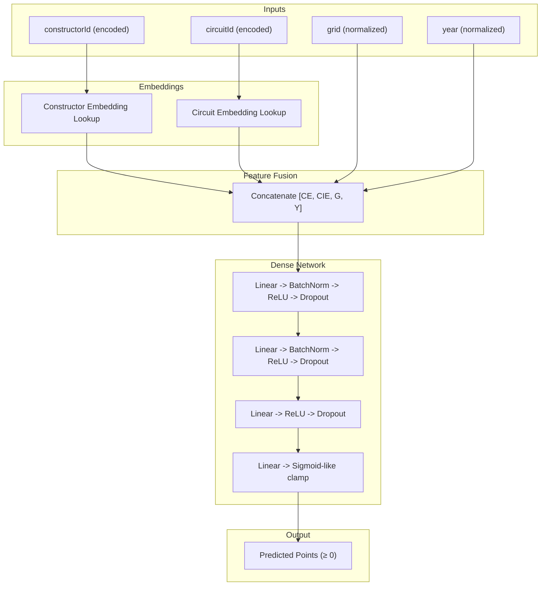
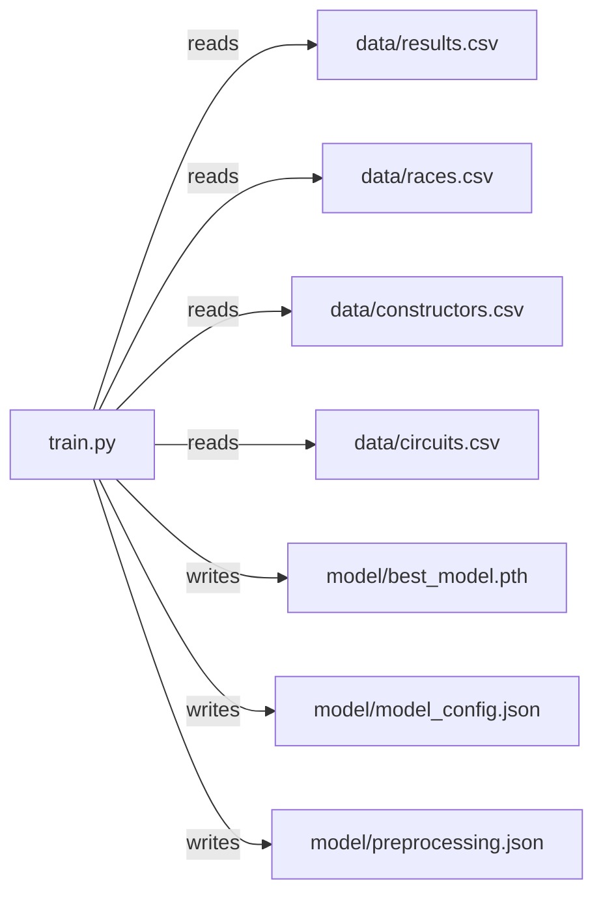

# Model Architecture

<cite>
**Referenced Files in This Document**
- [train.py](file://train.py)
- [model_config.json](file://model/model_config.json)
- [preprocessing.json](file://model/preprocessing.json)
- [best_model.pth](file://model/best_model.pth)
</cite>

## Table of Contents
1. [Introduction](#introduction)
2. [Project Structure](#project-structure)
3. [Core Components](#core-components)
4. [Architecture Overview](#architecture-overview)
5. [Detailed Component Analysis](#detailed-component-analysis)
6. [Dependency Analysis](#dependency-analysis)
7. [Performance Considerations](#performance-considerations)
8. [Troubleshooting Guide](#troubleshooting-guide)
9. [Conclusion](#conclusion)

## Introduction
This document provides a comprehensive model architecture specification for the F1PointsNet neural network designed to predict Formula 1 race points. It explains the design rationale for combining embedding layers for categorical variables (constructor and circuit identifiers) with dense network layers for numerical features, and the output processing pipeline that ensures non-negative continuous point predictions. The document covers input feature engineering, embedding dimension selection, network topology, activation functions, regularization, and practical considerations for model capacity, computational efficiency, and scalability.

## Project Structure
The training script orchestrates data loading, preprocessing, dataset creation, model definition, training, evaluation, and artifact saving. Pretrained weights and configuration are persisted under the model directory for inference.



**Diagram sources**
- [train.py:19-40](file://train.py#L19-L40)
- [train.py:83-85](file://train.py#L83-L85)
- [train.py:238-240](file://train.py#L238-L240)
- [train.py:293-301](file://train.py#L293-L301)

**Section sources**
- [train.py:19-40](file://train.py#L19-L40)
- [train.py:83-85](file://train.py#L83-L85)
- [train.py:238-240](file://train.py#L238-L240)
- [train.py:293-301](file://train.py#L293-L301)

## Core Components
- Input Features
  - Numerical: grid (normalized start position), year (normalized season)
  - Categorical: constructorId (encoded to contiguous indices), circuitId (encoded to contiguous indices)
- Embedding Layers
  - One embedding lookup per categorical variable with shared embedding dimension
- Dense Network
  - Multi-layer perceptron with batch normalization, ReLU activations, and dropout regularization
- Output Processing
  - Clamped output to ensure non-negative predictions suitable for point totals

Key implementation references:
- Feature engineering and encoding: [train.py:48-86](file://train.py#L48-L86)
- Dataset wrapper: [train.py:90-109](file://train.py#L90-L109)
- Model definition: [train.py:124-162](file://train.py#L124-L162)
- Output clamping: [train.py:160-161](file://train.py#L160-L161)

**Section sources**
- [train.py:48-86](file://train.py#L48-L86)
- [train.py:90-109](file://train.py#L90-L109)
- [train.py:124-162](file://train.py#L124-L162)
- [train.py:160-161](file://train.py#L160-L161)

## Architecture Overview
The F1PointsNet architecture integrates categorical embeddings with numerical features through concatenation, followed by a feed-forward dense network to produce a scalar continuous prediction. The network is optimized via mean-squared error loss with adaptive learning rate scheduling and early stopping.



**Diagram sources**
- [train.py:127-132](file://train.py#L127-L132)
- [train.py:134-148](file://train.py#L134-L148)
- [train.py:150-161](file://train.py#L150-L161)

## Detailed Component Analysis

### Input Feature Engineering
- Categorical Encoding
  - LabelEncoder transforms raw IDs into contiguous indices suitable for embedding layers
  - Encoded features are stored as LongTensor indices for embedding lookups
- Numerical Normalization
  - Mean and standard deviation computed on training set and applied to normalize grid and year
  - Normalized features are stored as FloatTensor
- Data Splitting and Batching
  - Stratified split for train/validation
  - DataLoader configured with fixed batch size and shuffling for training

References:
- Encoding and normalization: [train.py:51-69](file://train.py#L51-L69)
- Artifact persistence: [train.py:71-85](file://train.py#L71-L85)
- Dataset construction: [train.py:90-109](file://train.py#L90-L109)
- DataLoader setup: [train.py:118-119](file://train.py#L118-L119)

**Section sources**
- [train.py:51-69](file://train.py#L51-L69)
- [train.py:71-85](file://train.py#L71-L85)
- [train.py:90-109](file://train.py#L90-L109)
- [train.py:118-119](file://train.py#L118-L119)

### Embedding Layer Design
- Purpose
  - Map discrete categorical identifiers to dense vector representations capturing implicit relationships
- Dimensions
  - Shared embedding dimension chosen as a hyperparameter
- Implementation
  - Separate embedding matrices for constructor and circuit
  - Lookups performed during forward pass using encoded indices

References:
- Embedding initialization: [train.py:127-129](file://train.py#L127-L129)
- Input dimension calculation: [train.py:131-132](file://train.py#L131-L132)

**Section sources**
- [train.py:127-129](file://train.py#L127-L129)
- [train.py:131-132](file://train.py#L131-L132)

### Dense Network Topology and Regularization
- Input Dimension
  - Sum of embedding outputs plus normalized numerical features
- Layers
  - Hidden layers progressively reduce width with batch normalization and ReLU
  - Dropout applied after selected layers to mitigate overfitting
- Output
  - Single linear layer producing a scalar prediction
  - Non-negativity enforced post-hoc

References:
- Network definition: [train.py:134-148](file://train.py#L134-L148)
- Forward pass and clamping: [train.py:150-161](file://train.py#L150-L161)

**Section sources**
- [train.py:134-148](file://train.py#L134-L148)
- [train.py:150-161](file://train.py#L150-L161)

### Mathematical Formulation
- Inputs
  - Numerical: g ∈ R, y ∈ R (normalized)
  - Categorical: c ∈ N (constructor index), ci ∈ N (circuit index)
- Embeddings
  - Constructor embedding: E_c ∈ R^{d}
  - Circuit embedding: E_{ci} ∈ R^{d}
- Feature Fusion
  - Concatenation: z = [E_c; E_{ci}; g; y] ∈ R^{2d+2}
- Dense Network
  - Hidden layers with batch normalization and ReLU activations
  - Dropout controls overfitting
- Output
  - Linear head producing prediction p ∈ R
  - Clamped output: p = max(0, p)

References:
- Embedding and fusion: [train.py:151-156](file://train.py#L151-L156)
- Network layers: [train.py:134-148](file://train.py#L134-L148)
- Clamping: [train.py:160-161](file://train.py#L160-L161)

**Section sources**
- [train.py:151-156](file://train.py#L151-L156)
- [train.py:134-148](file://train.py#L134-L148)
- [train.py:160-161](file://train.py#L160-L161)

### Activation Functions and Regularization
- Activations
  - ReLU applied after batch-normalized linear layers
- Regularization
  - Dropout rates: 0.3, 0.2, 0.1 at selected layers
  - Batch normalization for stabilized training
  - Weight decay in optimizer

References:
- Activations and dropout: [train.py:137-146](file://train.py#L137-L146)
- Optimizer with weight decay: [train.py:173](file://train.py#L173)

**Section sources**
- [train.py:137-146](file://train.py#L137-L146)
- [train.py:173](file://train.py#L173)

### Output Processing and Point Discretization
- Continuous Prediction
  - Raw model output is clamped to non-negative values
- Discrete Mapping for Evaluation
  - Predictions snapped to nearest valid F1 points value for accuracy metrics

References:
- Clamping: [train.py:160-161](file://train.py#L160-L161)
- Discretization function: [train.py:269-271](file://train.py#L269-L271)

**Section sources**
- [train.py:160-161](file://train.py#L160-L161)
- [train.py:269-271](file://train.py#L269-L271)

### Training and Evaluation Workflow
```mermaid
sequenceDiagram
participant Loader as "DataLoader"
participant Model as "F1PointsNet"
participant Opt as "Optimizer"
participant Sch as "LR Scheduler"
Loader->>Model : "Forward(batch)"
Model-->>Loader : "Predictions"
Loader->>Opt : "Loss.backward()"
Opt->>Model : "Step (update weights)"
Sch->>Opt : "ReduceLROnPlateau(val_loss)"
```

**Diagram sources**
- [train.py:185-236](file://train.py#L185-L236)
- [train.py:196-200](file://train.py#L196-L200)
- [train.py:173-174](file://train.py#L173-L174)

**Section sources**
- [train.py:185-236](file://train.py#L185-L236)
- [train.py:196-200](file://train.py#L196-L200)
- [train.py:173-174](file://train.py#L173-L174)

## Dependency Analysis
- Data Dependencies
  - Training depends on race results and metadata tables
  - Preprocessing artifacts persist encoder classes and normalization statistics
- Model Dependencies
  - Embedding sizes and hidden widths are captured in model configuration
  - Best model weights are saved for inference



**Diagram sources**
- [train.py:19-22](file://train.py#L19-L22)
- [train.py:83-85](file://train.py#L83-L85)
- [train.py:293-301](file://train.py#L293-L301)

**Section sources**
- [train.py:19-22](file://train.py#L19-L22)
- [train.py:83-85](file://train.py#L83-L85)
- [train.py:293-301](file://train.py#L293-L301)

## Performance Considerations
- Model Capacity
  - Embedding dimension and hidden layer widths balance representational power against overfitting
  - Progressive width reduction reduces parameter count while maintaining expressive capacity
- Computational Efficiency
  - Fixed batch size and CPU device target limit GPU memory footprint
  - Normalized numerical inputs improve convergence speed
- Scalability
  - Embedding lookups are efficient for moderate cardinalities
  - Training loop supports early stopping and learning rate scheduling to stabilize long runs

[No sources needed since this section provides general guidance]

## Troubleshooting Guide
- Shape Mismatches
  - Ensure categorical inputs are LongTensor indices and numerical inputs are FloatTensor
  - Verify concatenated dimension equals sum of embedding outputs plus numerical features
- Non-Negative Outputs
  - Confirm clamping is applied to avoid negative predictions
- Overfitting Symptoms
  - Monitor validation loss and adjust dropout or hidden widths
  - Consider lower learning rate or earlier stopping threshold
- Data Leakage
  - Ensure preprocessing statistics (means/stds) are computed only on training data

**Section sources**
- [train.py:94-95](file://train.py#L94-L95)
- [train.py:156](file://train.py#L156)
- [train.py:160-161](file://train.py#L160-L161)
- [train.py:64-69](file://train.py#L64-L69)

## Conclusion
F1PointsNet combines categorical embeddings with normalized numerical features in a compact dense network to predict continuous F1 points. The architecture emphasizes interpretability and stability through batch normalization, dropout, and clamped outputs. Hyperparameters such as embedding dimension and hidden widths are configurable and persisted for reproducibility. The training pipeline incorporates robust monitoring and early stopping to ensure reliable convergence.