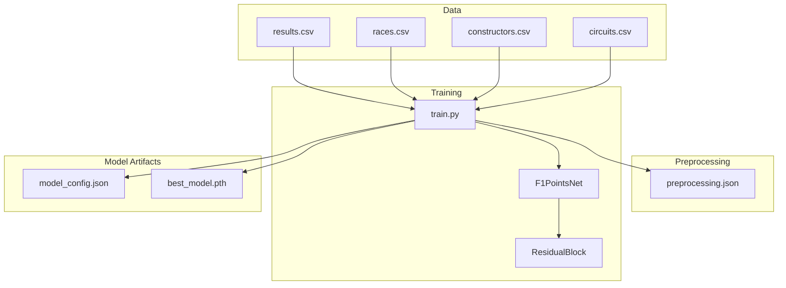
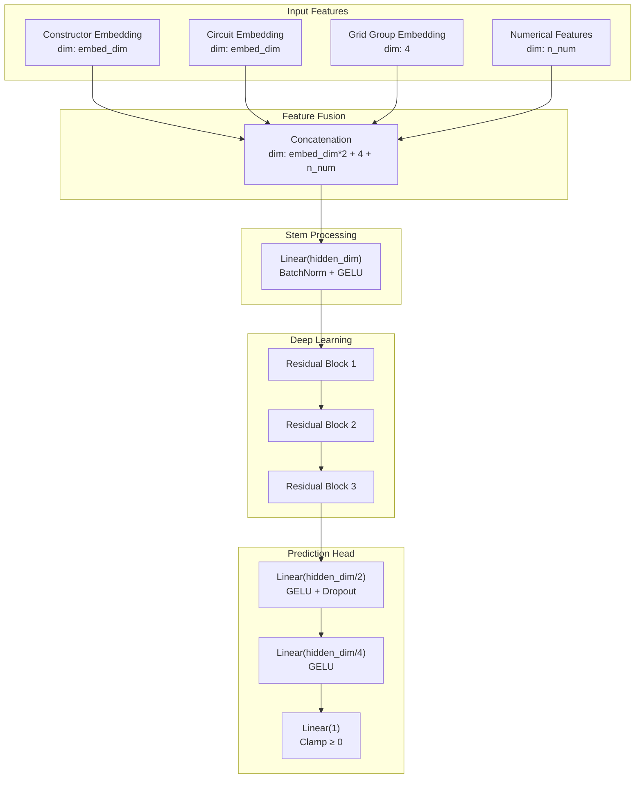
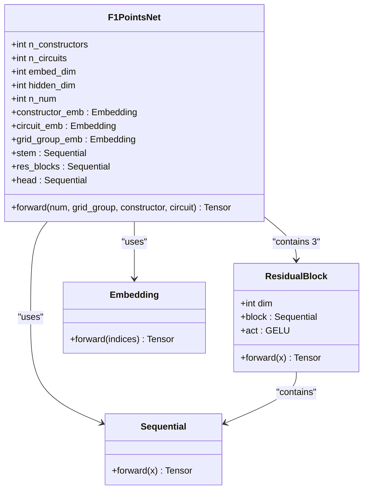
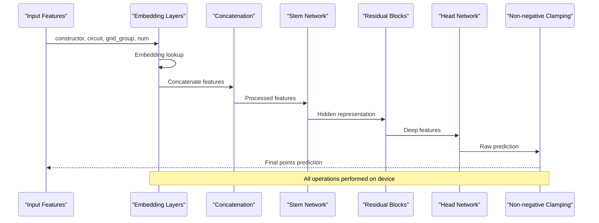
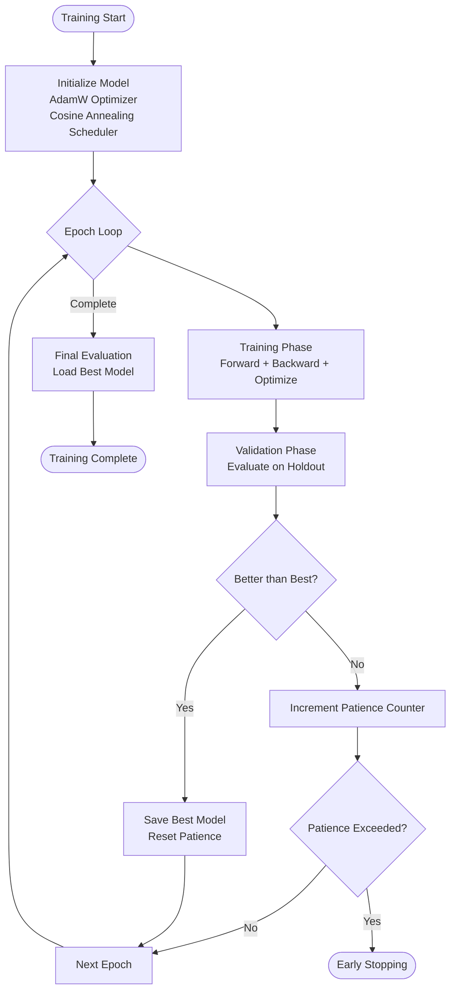
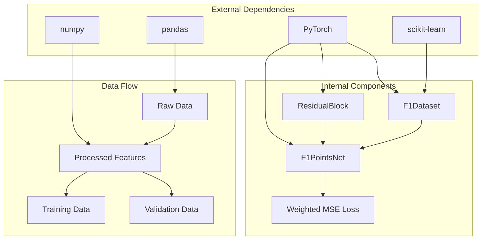

# Network Topology

<cite>
**Referenced Files in This Document**
- [train.py](file://train.py)
- [preprocessing.json](file://model/preprocessing.json)
</cite>

## Table of Contents
1. [Introduction](#introduction)
2. [Project Structure](#project-structure)
3. [Core Components](#core-components)
4. [Architecture Overview](#architecture-overview)
5. [Detailed Component Analysis](#detailed-component-analysis)
6. [Dependency Analysis](#dependency-analysis)
7. [Performance Considerations](#performance-considerations)
8. [Troubleshooting Guide](#troubleshooting-guide)
9. [Conclusion](#conclusion)

## Introduction
This document provides comprehensive documentation for the F1PointsNet neural network architecture used for predicting Formula 1 race points. The model is designed as a hybrid neural network that combines categorical embeddings with normalized numerical features, followed by a residual-stem-head topology with progressive dimension reduction and non-negative output clamping.

## Project Structure
The project follows a modular structure with training orchestration, dataset definition, and evaluation metrics. The core model resides in the training script alongside preprocessing artifacts.

**Diagram sources**
- [train.py:19-393](file://train.py#L19-L393)
- [preprocessing.json:1-1](file://model/preprocessing.json#L1-L1)

**Section sources**
- [train.py:19-393](file://train.py#L19-L393)
- [preprocessing.json:1-1](file://model/preprocessing.json#L1-L1)

## Core Components
The F1PointsNet architecture consists of three primary components: embedding layers for categorical features, a stem network for initial processing, residual blocks for deep feature learning, and a head network for final prediction.

### Embedding Layers
The model uses three embedding layers to encode categorical features:
- Constructor embeddings: maps constructor IDs to dense vectors
- Circuit embeddings: maps circuit IDs to dense vectors  
- Grid group embeddings: encodes qualitative grid position categories

Each embedding is configured with specific dimensionalities optimized for the cardinality of the respective feature spaces.

### Stem Network
The stem serves as the initial processing layer that:
- Concatenates all feature representations
- Applies linear transformation with batch normalization
- Uses GELU activation for smooth non-linearity
- Produces the base hidden representation

### Residual Blocks
Three identical residual blocks provide deep feature learning with:
- Skip connections for gradient stability
- Internal linear layers with batch normalization
- GELU activations and dropout regularization
- Dimension preservation within blocks

### Head Network
The head performs progressive dimension reduction:
- First stage: hidden_dim → hidden_dim/2 with dropout
- Second stage: hidden_dim/2 → hidden_dim/4 without dropout
- Final stage: hidden_dim/4 → 1 output neuron
- Non-negative clamping ensures physically meaningful predictions

**Section sources**
- [train.py:180-225](file://train.py#L180-L225)

## Architecture Overview
The F1PointsNet implements a sophisticated hybrid architecture that seamlessly integrates categorical embeddings with numerical features through a carefully designed multi-stage processing pipeline.

**Diagram sources**
- [train.py:180-225](file://train.py#L180-L225)

## Detailed Component Analysis

### F1PointsNet Class Implementation
The F1PointsNet class defines the complete network architecture with explicit parameterization for flexibility and reproducibility.

#### Input Dimension Calculation
The total input dimension is computed as:
- Constructor embedding: embed_dim
- Circuit embedding: embed_dim  
- Grid group embedding: 4
- Numerical features: n_num

This results in input_dim = embed_dim * 2 + 4 + n_num, where n_num = 5 based on the five normalized numerical features.

#### Embedding Layer Design
Each embedding layer is optimized for its feature cardinality:
- Constructor embeddings: 198 unique constructors mapped to 32-dimensional vectors
- Circuit embeddings: 77 unique circuits mapped to 32-dimensional vectors
- Grid group embeddings: 6 categories mapped to 4-dimensional vectors

#### Stem Network Architecture
The stem network establishes the foundation for subsequent processing:
- Linear layer transforms concatenated features to hidden_dim (256)
- Batch normalization stabilizes training dynamics
- GELU activation introduces smooth non-linearity
- No dropout at this stage maintains gradient flow

#### Residual Block Structure
Each residual block implements the residual learning pattern:
- Two linear layers with internal batch normalization
- GELU activation and 15% dropout for regularization
- Skip connection adds original input to transformed features
- Output maintains the same dimensionality

#### Head Network Configuration
The head network performs progressive dimension reduction:
- Stage 1: 256 → 128 with dropout (10%)
- Stage 2: 128 → 64 with GELU activation
- Stage 3: 64 → 1 with final linear layer
- Output clamped to non-negative values

**Diagram sources**
- [train.py:180-225](file://train.py#L180-L225)
- [train.py:163-178](file://train.py#L163-L178)

**Section sources**
- [train.py:180-225](file://train.py#L180-L225)
- [train.py:163-178](file://train.py#L163-L178)

### Forward Pass Execution
The forward pass demonstrates the complete data flow through the network architecture.

**Diagram sources**
- [train.py:215-224](file://train.py#L215-L224)

**Section sources**
- [train.py:215-224](file://train.py#L215-L224)

### Training Pipeline
The training process incorporates weighted loss, learning rate scheduling, and early stopping mechanisms.

**Diagram sources**
- [train.py:254-313](file://train.py#L254-L313)

**Section sources**
- [train.py:254-313](file://train.py#L254-L313)

## Dependency Analysis
The model exhibits strong internal cohesion with clear separation of concerns across embedding, processing, and prediction stages.

**Diagram sources**
- [train.py:1-10](file://train.py#L1-L10)
- [train.py:127-148](file://train.py#L127-L148)

**Section sources**
- [train.py:1-10](file://train.py#L1-L10)
- [train.py:127-148](file://train.py#L127-L148)

## Performance Considerations

### Computational Complexity
The model demonstrates efficient scaling characteristics:
- **Forward pass complexity**: O(N × (input_dim × hidden_dim + hidden_dim^2 + hidden_dim/2))
- **Memory usage**: Primarily dominated by embedding matrices and hidden activations
- **Parameter count**: Approximately 100K parameters for the configured architecture

### Memory Requirements
Based on the model configuration:
- **Embedding memory**: ~198 × 32 + 77 × 32 + 6 × 4 = ~8,000 parameters
- **Hidden layer memory**: ~256 × 256 + 128 × 64 + 64 × 1 = ~70K parameters
- **Total memory**: ~78K parameters with modest GPU/CPU memory footprint

### Model Capacity
The architecture balances expressiveness with generalization:
- **Capacity**: Sufficient for capturing complex relationships between constructor performance, circuit characteristics, and starting position
- **Regularization**: Dropout and batch normalization prevent overfitting
- **Scalability**: Modular design allows easy adjustment of embedding dimensions and hidden sizes

## Troubleshooting Guide

### Common Issues and Solutions
- **NaN losses**: Check for exploding gradients and adjust learning rate or gradient clipping
- **Poor convergence**: Verify embedding dimensions are appropriate for feature cardinality
- **Overfitting symptoms**: Monitor validation loss and consider increasing dropout rates
- **Memory errors**: Reduce batch size or embedding dimensions if training on constrained hardware

### Monitoring Training Progress
Key indicators to track during training:
- Training/validation loss ratio
- Early stopping patience counter
- Learning rate schedule progression
- Parameter gradients magnitude

**Section sources**
- [train.py:244-313](file://train.py#L244-L313)

## Conclusion
The F1PointsNet architecture represents a well-engineered solution for Formula 1 points prediction that effectively combines categorical embeddings with numerical features through a robust residual-stem-head design. The progressive dimension reduction strategy, combined with careful regularization and non-negative output constraints, enables reliable point predictions while maintaining computational efficiency. The modular architecture facilitates experimentation with different embedding dimensions and hidden configurations, supporting continued model improvement and adaptation to evolving racing conditions.