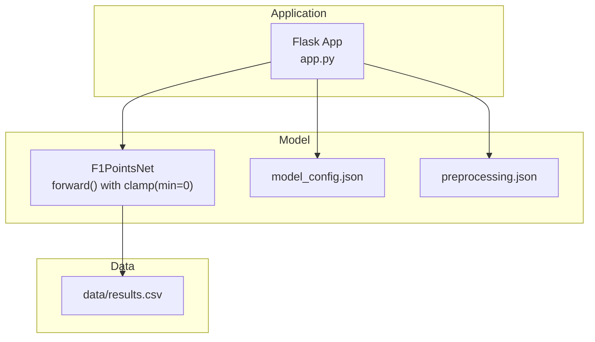
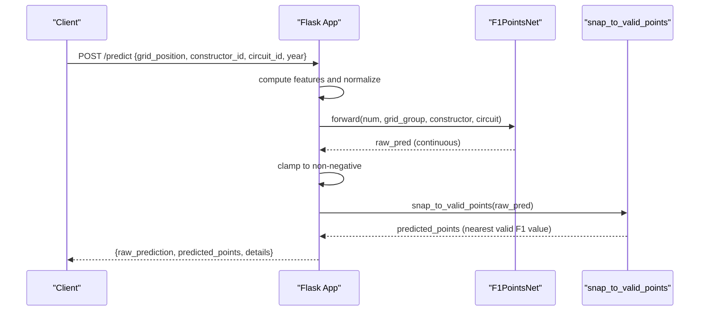
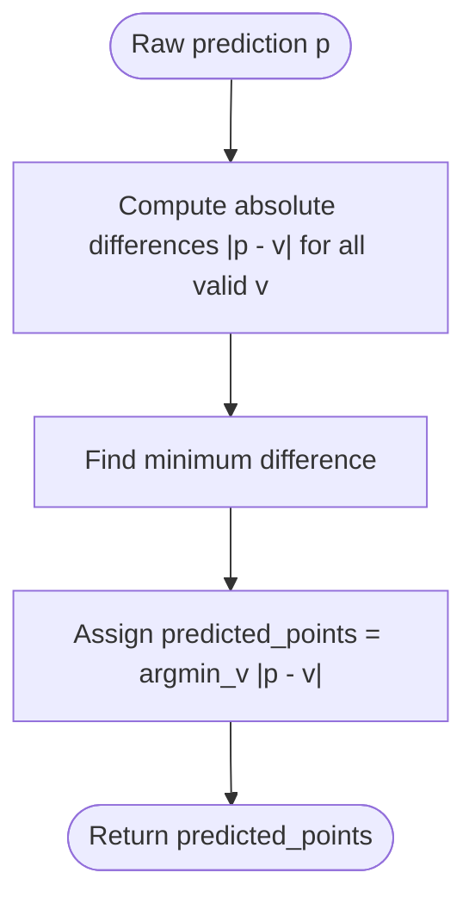
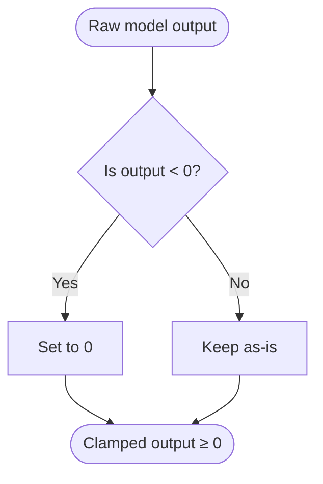
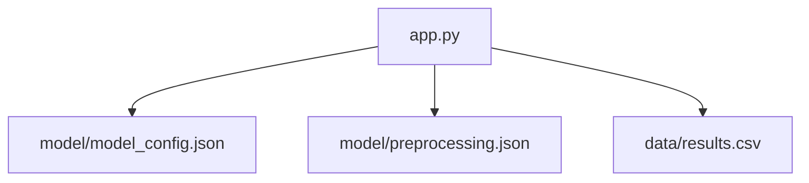

# Output Processing

<cite>
**Referenced Files in This Document**
- [app.py](file://app.py)
- [train.py](file://train.py)
- [model_config.json](file://model/model_config.json)
- [preprocessing.json](file://model/preprocessing.json)
- [results.csv](file://data/results.csv)
</cite>

## Table of Contents
1. [Introduction](#introduction)
2. [Project Structure](#project-structure)
3. [Core Components](#core-components)
4. [Architecture Overview](#architecture-overview)
5. [Detailed Component Analysis](#detailed-component-analysis)
6. [Dependency Analysis](#dependency-analysis)
7. [Performance Considerations](#performance-considerations)
8. [Troubleshooting Guide](#troubleshooting-guide)
9. [Conclusion](#conclusion)

## Introduction
This document explains the output processing and validation mechanisms used to transform raw neural network predictions into F1-compliant point allocations. It covers:
- Continuous point prediction outputs from the trained model
- The snapping mechanism that rounds predictions to valid F1 point values
- The clamping mechanism ensuring non-negative predictions
- The transformation pipeline from raw model outputs to discrete, official-scoring-aligned point allocations
- The mathematical formulation behind point assignment and validation against Formula 1 official scoring regulations

## Project Structure
The repository contains:
- A Flask web application that serves predictions via an API
- A trained PyTorch model and associated configuration
- Data assets used for preprocessing and evaluation
- Training script that builds the model, prepares features, and validates outputs

**Diagram sources**
- [app.py:53-95](file://app.py#L53-L95)
- [model_config.json:1-1](file://model/model_config.json#L1-L1)
- [preprocessing.json:1-1](file://model/preprocessing.json#L1-L1)
- [results.csv:1-50](file://data/results.csv#L1-L50)

**Section sources**
- [app.py:1-237](file://app.py#L1-L237)
- [train.py:1-312](file://train.py#L1-L312)
- [model_config.json:1-1](file://model/model_config.json#L1-L1)
- [preprocessing.json:1-1](file://model/preprocessing.json#L1-L1)
- [results.csv:1-50](file://data/results.csv#L1-L50)

## Core Components
- Neural network model: A feedforward network that outputs a single continuous score per input sample. The forward pass applies a clamp to ensure non-negative outputs.
- Validation set evaluation: During training, predictions are snapped to the nearest valid F1 point value for accuracy metrics.
- Application inference pipeline: The Flask app loads the model and preprocessing artifacts, computes normalized features, runs inference, snaps to valid points, and returns structured results.

Key implementation references:
- Model definition and clamping: [app.py:53-84](file://app.py#L53-L84)
- Snapping function: [app.py:100-103](file://app.py#L100-L103)
- Evaluation-time snapping: [train.py:265-270](file://train.py#L265-L270)
- Inference pipeline: [app.py:145-199](file://app.py#L145-L199)

**Section sources**
- [app.py:53-84](file://app.py#L53-L84)
- [app.py:100-103](file://app.py#L100-L103)
- [train.py:265-270](file://train.py#L265-L270)
- [app.py:145-199](file://app.py#L145-L199)

## Architecture Overview
The output processing pipeline transforms raw model outputs into F1-compliant point allocations through three stages:
1. Raw prediction: The model produces a continuous score.
2. Clamping: Negative predictions are forced to zero.
3. Snapping: The continuous score is mapped to the nearest valid F1 point value.

**Diagram sources**
- [app.py:145-199](file://app.py#L145-L199)
- [app.py:53-84](file://app.py#L53-L84)
- [app.py:100-103](file://app.py#L100-L103)

## Detailed Component Analysis

### Continuous Point Prediction Output
- The model’s final layer outputs a single scalar representing predicted points.
- The forward method concatenates embeddings and numeric features, passes them through a stack of linear layers, and clamps the output to be non-negative.
- This ensures that even if the model predicts negative points, the final output is zero or positive.

Implementation references:
- Forward pass with clamp: [app.py:76-83](file://app.py#L76-L83)
- Clamp applied in forward: [app.py:83](file://app.py#L83)

Validation references:
- Training-time clamp during evaluation: [train.py:165-172](file://train.py#L165-L172)

**Section sources**
- [app.py:76-83](file://app.py#L76-L83)
- [train.py:165-172](file://train.py#L165-L172)

### Snapping to Valid Points Values
- The valid F1 point values are defined as [0, 1, 2, 4, 6, 8, 10, 12, 15, 18, 25].
- The snapping function selects the nearest value by minimizing absolute difference between the raw prediction and valid values.
- This ensures predictions align with official F1 scoring rules.

Implementation references:
- Valid points list: [app.py:100](file://app.py#L100)
- Snapping function: [app.py:102-103](file://app.py#L102-L103)
- Training-time snapping for evaluation: [train.py:265-270](file://train.py#L265-L270)

**Diagram sources**
- [app.py:100-103](file://app.py#L100-L103)
- [train.py:265-270](file://train.py#L265-L270)

**Section sources**
- [app.py:100-103](file://app.py#L100-L103)
- [train.py:265-270](file://train.py#L265-L270)

### Clamping Mechanism
- The model enforces non-negativity by clamping the raw output to a minimum value of zero.
- This prevents negative point allocations and aligns with the requirement that points cannot be negative.

Implementation references:
- Clamp in forward pass: [app.py:83](file://app.py#L83)
- Training-time clamp: [train.py:172](file://train.py#L172)

**Diagram sources**
- [app.py:83](file://app.py#L83)
- [train.py:172](file://train.py#L172)

**Section sources**
- [app.py:83](file://app.py#L83)
- [train.py:172](file://train.py#L172)

### Transformation Pipeline from Raw Output to F1-Compliant Allocation
- Features are computed and normalized using stored statistics.
- The model produces a continuous score, which is clamped to zero or above.
- The snapped value is the nearest valid F1 point value.

Implementation references:
- Feature normalization and inference: [app.py:168-185](file://app.py#L168-L185)
- Snapping and response construction: [app.py:186-199](file://app.py#L186-L199)

**Section sources**
- [app.py:168-185](file://app.py#L168-L185)
- [app.py:186-199](file://app.py#L186-L199)

### Mathematical Formulation and Scoring Compliance
- Objective: Minimize distance to nearest valid F1 point value.
- Decision rule: For a raw prediction p, choose v* = argmin_v∈V |p − v|, where V = {0, 1, 2, 4, 6, 8, 10, 12, 15, 18, 25}.
- Non-negativity constraint: p_clamped = max(0, p).
- Combined process: v* = argmin_v∈V |max(0, p) − v|.

References:
- Snapping function definition: [app.py:102-103](file://app.py#L102-L103)
- Valid points set: [app.py:100](file://app.py#L100)
- Clamp enforcement: [app.py:83](file://app.py#L83)

**Section sources**
- [app.py:100-103](file://app.py#L100-L103)
- [app.py:83](file://app.py#L83)

## Dependency Analysis
The application depends on:
- Model configuration and preprocessing artifacts
- Historical results for computing averages and validating distributions
- The trained model weights

**Diagram sources**
- [app.py:24-25](file://app.py#L24-L25)
- [app.py:21-22](file://app.py#L21-L22)
- [model_config.json:1-1](file://model/model_config.json#L1-L1)
- [preprocessing.json:1-1](file://model/preprocessing.json#L1-L1)
- [results.csv:1-50](file://data/results.csv#L1-L50)

**Section sources**
- [app.py:21-25](file://app.py#L21-L25)
- [model_config.json:1-1](file://model/model_config.json#L1-L1)
- [preprocessing.json:1-1](file://model/preprocessing.json#L1-L1)
- [results.csv:1-50](file://data/results.csv#L1-L50)

## Performance Considerations
- The snapping operation is O(k) over the fixed set of valid points k=11, which is negligible.
- Clamping is O(1) and occurs once per prediction.
- Normalization uses precomputed means and standard deviations, enabling fast inference.
- The model’s inference is vectorized and executed on CPU; GPU acceleration could reduce latency for batched requests.

## Troubleshooting Guide
Common issues and resolutions:
- Unexpected negative predictions: Verify that the model’s forward pass clamps outputs to zero. Check the clamp implementation in the model’s forward method.
  - Reference: [app.py:83](file://app.py#L83)
- Predictions not matching valid F1 values: Confirm that the snapping function is invoked after clamping and that the valid points list matches official values.
  - Reference: [app.py:100-103](file://app.py#L100-L103)
- Incorrect feature normalization: Ensure preprocessing statistics are loaded and used consistently for grid position, year, and average points features.
  - Reference: [app.py:113-115](file://app.py#L113-L115)
- Inconsistent historical averages: Validate that constructor and circuit averages are computed up to the requested year and handle missing data gracefully.
  - Reference: [app.py:117-143](file://app.py#L117-L143)

**Section sources**
- [app.py:83](file://app.py#L83)
- [app.py:100-103](file://app.py#L100-L103)
- [app.py:113-115](file://app.py#L113-L115)
- [app.py:117-143](file://app.py#L117-L143)

## Conclusion
The output processing pipeline ensures that model predictions are transformed into F1-compliant point allocations by:
- Producing continuous scores via a neural network
- Enforcing non-negativity through clamping
- Mapping scores to the nearest valid F1 point value via snapping

This approach maintains alignment with Formula 1’s official scoring while providing a robust, deterministic transformation from raw model outputs to discrete, validated point allocations.