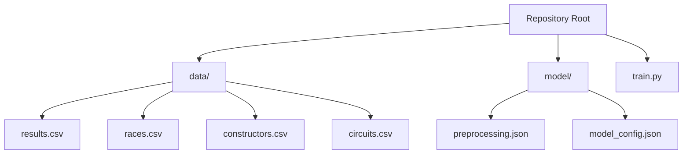
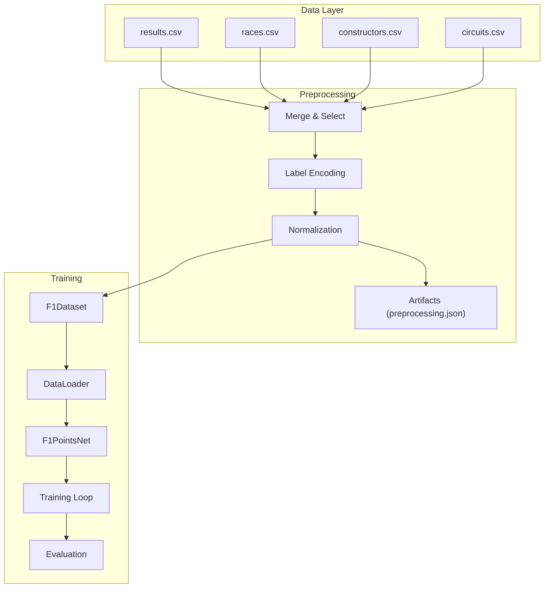
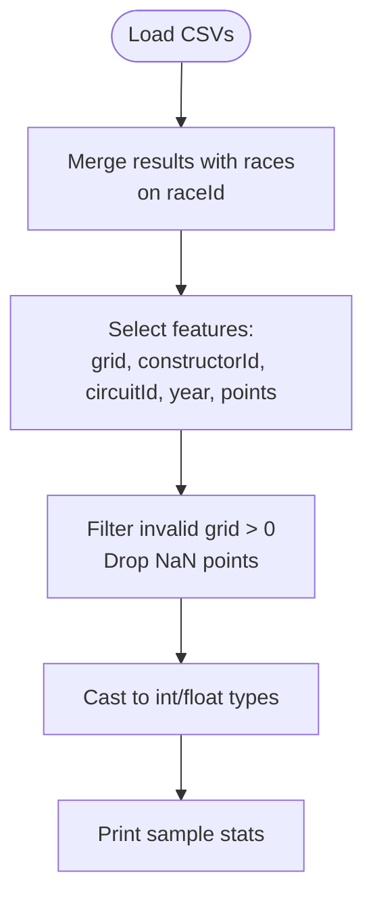
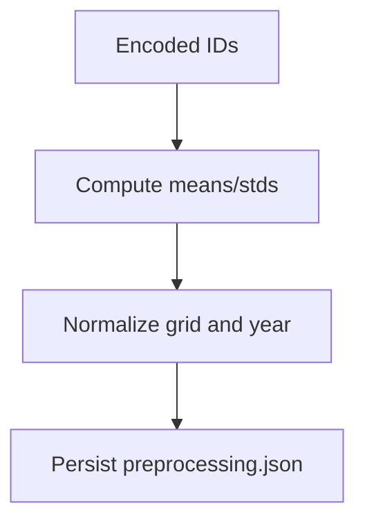
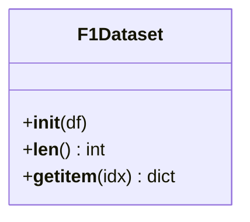
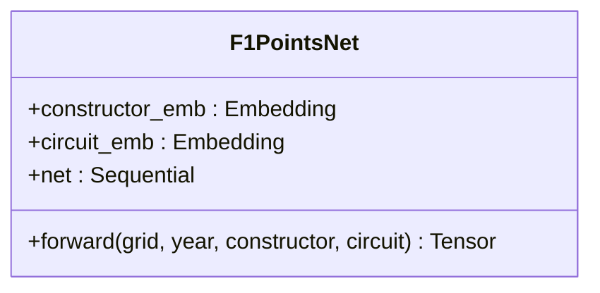
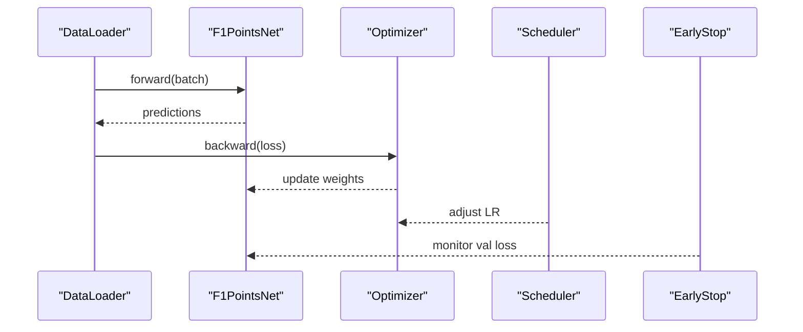
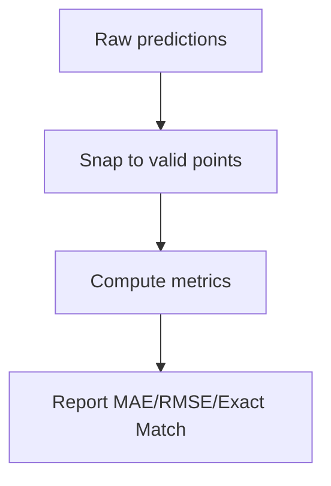
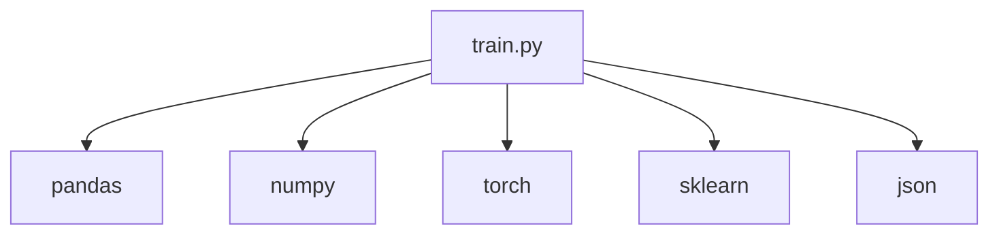

# Project Overview

<cite>
**Referenced Files in This Document**
- [train.py](file://train.py)
- [model/preprocessing.json](file://model/preprocessing.json)
- [model/model_config.json](file://model/model_config.json)
</cite>

## Table of Contents
1. [Introduction](#introduction)
2. [Project Structure](#project-structure)
3. [Core Components](#core-components)
4. [Architecture Overview](#architecture-overview)
5. [Detailed Component Analysis](#detailed-component-analysis)
6. [Dependency Analysis](#dependency-analysis)
7. [Performance Considerations](#performance-considerations)
8. [Troubleshooting Guide](#troubleshooting-guide)
9. [Conclusion](#conclusion)
10. [Appendices](#appendices)

## Introduction
This project implements a neural network-based system for predicting Formula 1 driver points using race characteristics. The system ingests historical F1 datasets, preprocesses features, trains a deep learning model, and evaluates its performance against real-world scoring systems. It targets data scientists, machine learning engineers, and F1 analysts who want to understand driver performance patterns and forecast points outcomes.

Key capabilities:
- Loads and merges race, results, constructors, and circuits datasets
- Encodes categorical features and normalizes numerical features
- Builds an embedding-based neural network for regression
- Trains with early stopping and learning rate scheduling
- Evaluates using standard metrics and snaps predictions to valid F1 point values

## Project Structure
The repository follows a minimal, focused layout:
- Data ingestion and training pipeline in a single script
- Preprocessed artifacts and model metadata stored under a dedicated folder
- No separate application server or web interface in this snapshot

**Diagram sources**
- [train.py:19-22](file://train.py#L19-L22)
- [model/preprocessing.json:1](file://model/preprocessing.json#L1)
- [model/model_config.json:1](file://model/model_config.json#L1)

**Section sources**
- [train.py:19-22](file://train.py#L19-L22)
- [model/preprocessing.json:1](file://model/preprocessing.json#L1)
- [model/model_config.json:1](file://model/model_config.json#L1)

## Core Components
- Data Loading and Merging: Reads results, races, constructors, and circuits CSVs; merges to form a unified training set with race year, circuit ID, and driver grid position.
- Feature Encoding and Normalization: Applies label encoding for categorical IDs and z-score normalization for numerical features; persists preprocessing artifacts.
- Dataset and DataLoader: Implements a PyTorch Dataset wrapper and batching for efficient training.
- Neural Network Model: Embedding layers for constructors and circuits plus dense layers for regression with clamped non-negative outputs.
- Training Loop: Uses mean squared error loss, Adam optimizer, ReduceLROnPlateau scheduler, early stopping, and saves the best model.
- Evaluation: Computes MAE/RMSE on raw predictions and exact-match accuracy after snapping to valid F1 point values.

Practical examples of predictions:
- Given a driver’s grid position, constructor, and circuit for a specific season, the model predicts a continuous points score. The evaluation pipeline rounds this to the nearest valid F1 point value (e.g., 0, 1, 2, 4, 6, 8, 10, 12, 15, 18, 25).

**Section sources**
- [train.py:19-46](file://train.py#L19-L46)
- [train.py:48-86](file://train.py#L48-L86)
- [train.py:88-120](file://train.py#L88-L120)
- [train.py:121-162](file://train.py#L121-L162)
- [train.py:169-237](file://train.py#L169-L237)
- [train.py:241-292](file://train.py#L241-L292)

## Architecture Overview
The system follows a linear pipeline: load → merge → encode → normalize → build dataset → train → evaluate. The model architecture combines embeddings for categorical features with dense layers for regression.

**Diagram sources**
- [train.py:19-46](file://train.py#L19-L46)
- [train.py:48-86](file://train.py#L48-L86)
- [train.py:88-120](file://train.py#L88-L120)
- [train.py:121-162](file://train.py#L121-L162)
- [train.py:169-237](file://train.py#L169-L237)
- [train.py:241-292](file://train.py#L241-L292)
- [model/preprocessing.json:1](file://model/preprocessing.json#L1)

## Detailed Component Analysis

### Data Loading and Merging
- Loads results, races, constructors, and circuits CSVs.
- Merges results with race year and circuitId to enrich each result row.
- Selects relevant features: grid position, constructorId, circuitId, year, and points.
- Filters out invalid grid positions and missing point values.
- Converts types to ensure numeric consistency.

**Diagram sources**
- [train.py:19-46](file://train.py#L19-L46)

**Section sources**
- [train.py:19-46](file://train.py#L19-L46)

### Feature Encoding and Normalization
- Applies label encoding to convert constructorId and circuitId into contiguous indices suitable for embedding layers.
- Computes and stores means and standard deviations for grid and year normalization.
- Saves preprocessing artifacts (classes, means, stds, counts) to JSON for inference.

**Diagram sources**
- [train.py:52-86](file://train.py#L52-L86)
- [model/preprocessing.json:1](file://model/preprocessing.json#L1)

**Section sources**
- [train.py:52-86](file://train.py#L52-L86)
- [model/preprocessing.json:1](file://model/preprocessing.json#L1)

### Dataset and DataLoader
- Defines a PyTorch Dataset that exposes tensors for grid, year, constructor, circuit, and points.
- Splits data into training and validation sets.
- Creates DataLoader instances with batching and shuffling.

**Diagram sources**
- [train.py:90-108](file://train.py#L90-L108)

**Section sources**
- [train.py:90-108](file://train.py#L90-L108)
- [train.py:111-119](file://train.py#L111-L119)

### Neural Network Model
- Embedding layers for constructors and circuits.
- Concatenates embeddings with normalized grid and year.
- Dense network with batch normalization, ReLU activations, and dropout.
- Clamps outputs to non-negative values to align with points semantics.

**Diagram sources**
- [train.py:124-162](file://train.py#L124-L162)

**Section sources**
- [train.py:124-162](file://train.py#L124-L162)
- [model/model_config.json:1](file://model/model_config.json#L1)

### Training Pipeline
- Optimizer: Adam with weight decay.
- Scheduler: ReduceLROnPlateau on validation loss.
- Early stopping: Stops training if validation loss does not improve for a fixed patience.
- Best model checkpointing: Saves the model state dict during training.

**Diagram sources**
- [train.py:169-237](file://train.py#L169-L237)

**Section sources**
- [train.py:169-237](file://train.py#L169-L237)

### Evaluation and Metrics
- Computes MAE and RMSE on raw predictions.
- Rounds predictions to nearest valid F1 point value and measures exact-match percentage.
- Prints sample predictions for quick inspection.

**Diagram sources**
- [train.py:241-292](file://train.py#L241-L292)

**Section sources**
- [train.py:241-292](file://train.py#L241-L292)

## Dependency Analysis
The training script depends on:
- Pandas/Numpy for data manipulation
- PyTorch for neural networks and training utilities
- Scikit-learn for train/test splitting and label encoding
- JSON for artifact persistence

**Diagram sources**
- [train.py:1-11](file://train.py#L1-L11)

**Section sources**
- [train.py:1-11](file://train.py#L1-L11)

## Performance Considerations
- Embedding dimension and hidden sizes are configurable; larger values increase capacity but also compute cost.
- Dropout rates reduce overfitting; validation loss monitoring with early stopping prevents unnecessary training.
- Batch size balances memory usage and gradient stability.
- Normalization improves convergence speed and stability.

[No sources needed since this section provides general guidance]

## Troubleshooting Guide
Common issues and resolutions:
- Missing data files: Ensure CSVs are placed under the data/ directory as referenced by the script.
- Device errors: The model runs on CPU by default; if GPU is desired, update device selection accordingly.
- Shape mismatches: Verify tensor shapes in the dataset and model forward pass.
- Metric interpretation: The evaluation pipeline snaps predictions to valid F1 point values; interpret rounded vs raw metrics accordingly.

**Section sources**
- [train.py:164](file://train.py#L164)
- [train.py:266-274](file://train.py#L266-L274)

## Conclusion
This project demonstrates a streamlined pipeline for F1 points prediction using embeddings and dense layers. It emphasizes reproducible preprocessing, robust training with early stopping, and meaningful evaluation aligned with F1 scoring rules. While the current snapshot focuses on training, the persisted artifacts enable straightforward deployment for inference.

[No sources needed since this section summarizes without analyzing specific files]

## Appendices

### Target Audience and Use Cases
- Data scientists: Explore feature importance, experiment with architectures, and tune hyperparameters.
- ML engineers: Integrate preprocessing and model artifacts into production pipelines.
- F1 analysts: Use predictions to simulate scenarios, assess driver/constructor trends, and benchmark strategies.

### Scope and Limitations
- Scope: Predicts points based on grid position, constructor, circuit, and season; designed for historical data and basic regression.
- Limitations: Does not incorporate driver-specific features, weather conditions, pit strategies, or real-time updates; assumes static race characteristics.

[No sources needed since this section provides general guidance]