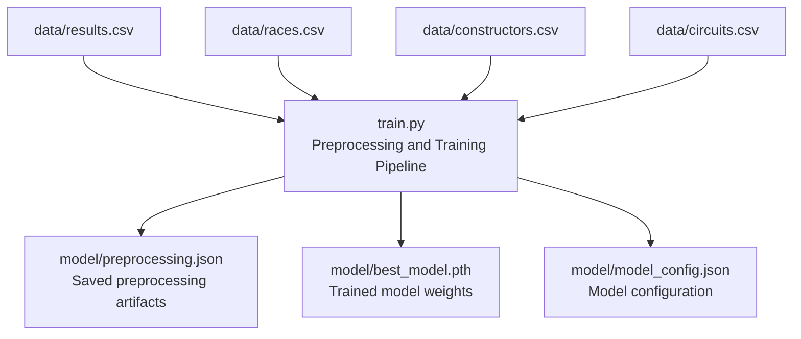
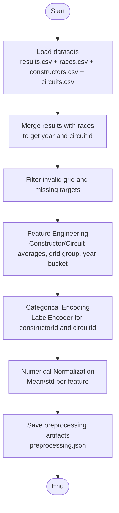
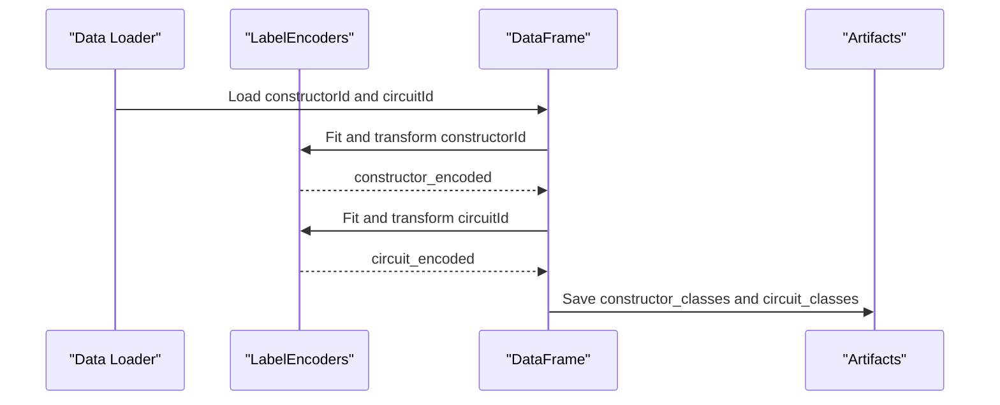
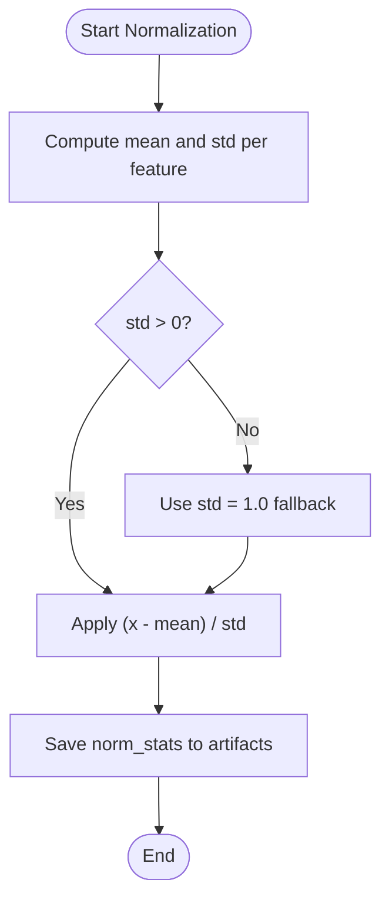
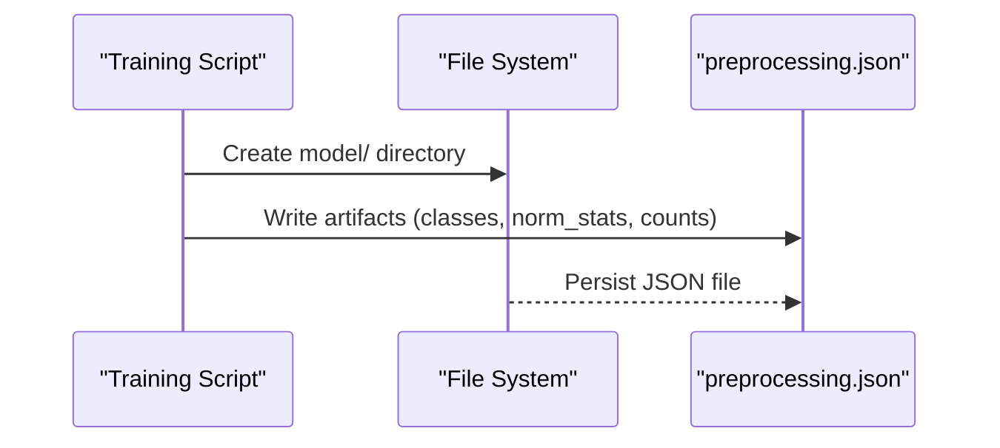
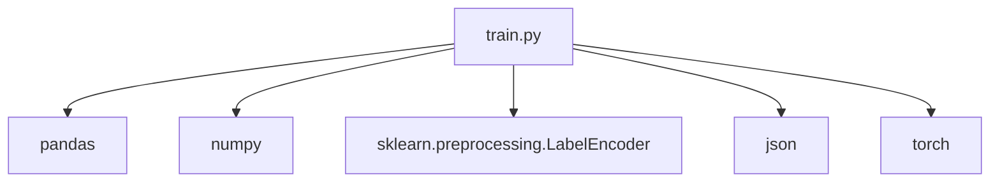

# Data Preprocessing

<cite>
**Referenced Files in This Document**
- [train.py](file://train.py)
- [preprocessing.json](file://model/preprocessing.json)
</cite>

## Table of Contents
1. [Introduction](#introduction)
2. [Project Structure](#project-structure)
3. [Core Components](#core-components)
4. [Architecture Overview](#architecture-overview)
5. [Detailed Component Analysis](#detailed-component-analysis)
6. [Dependency Analysis](#dependency-analysis)
7. [Performance Considerations](#performance-considerations)
8. [Troubleshooting Guide](#troubleshooting-guide)
9. [Conclusion](#conclusion)

## Introduction
This document explains the data preprocessing pipeline used in the F1 points prediction system. It focuses on:
- Categorical feature encoding using LabelEncoder for constructorId and circuitId, and how the resulting encodings are re-indexed to contiguous 0-based indices suitable for embedding layers.
- Numerical feature normalization using mean and standard deviation for grid position and year features, along with derived statistics for other numerical features.
- The preprocessing artifacts saving mechanism and how these configurations are used during training and inference.
- Data filtering strategies for invalid grid positions and missing values.

## Project Structure
The preprocessing logic is implemented in a single training script that loads datasets, performs feature engineering, applies categorical encoding and normalization, saves preprocessing artifacts, and prepares datasets for model training.

**Diagram sources**
- [train.py:19-38](file://train.py#L19-L38)
- [train.py:108-119](file://train.py#L108-L119)
- [train.py:380-388](file://train.py#L380-L388)

**Section sources**
- [train.py:19-38](file://train.py#L19-L38)
- [train.py:108-119](file://train.py#L108-L119)
- [train.py:380-388](file://train.py#L380-L388)

## Core Components
- Data loading and merging: Results are merged with races to obtain year and circuitId for each race result.
- Data filtering: Invalid grid positions and missing target values are removed.
- Feature engineering: Historical averages for constructors and circuits, grid grouping, and decade bucketing.
- Categorical encoding: LabelEncoder transforms constructorId and circuitId into contiguous 0-based indices for embedding layers.
- Numerical normalization: Mean and standard deviation computed per feature and applied to normalize numerical columns.
- Artifacts saving: Encoders’ class lists, normalization statistics, and counts are persisted to JSON for later use.

**Section sources**
- [train.py:24-37](file://train.py#L24-L37)
- [train.py:48-84](file://train.py#L48-L84)
- [train.py:89-107](file://train.py#L89-L107)
- [train.py:108-119](file://train.py#L108-L119)

## Architecture Overview
The preprocessing pipeline follows a linear workflow: load data, merge, filter, engineer features, encode categories, normalize numerics, save artifacts, and construct datasets for training.

**Diagram sources**
- [train.py:19-37](file://train.py#L19-L37)
- [train.py:48-84](file://train.py#L48-L84)
- [train.py:89-107](file://train.py#L89-L107)
- [train.py:108-119](file://train.py#L108-L119)

## Detailed Component Analysis

### Data Filtering Strategies
- Invalid grid positions: Rows where grid is less than or equal to zero are excluded.
- Missing target values: Rows with NaN in the points column are dropped.
- Type conversions: Ensures integer types for discrete features and float for continuous targets.

These steps ensure clean, valid inputs for downstream modeling.

**Section sources**
- [train.py:27-37](file://train.py#L27-L37)

### Categorical Feature Encoding with LabelEncoder
- Two LabelEncoders are initialized: one for constructorId and one for circuitId.
- fit_transform is applied to produce encoded columns for both features.
- The number of unique categories is recorded for embedding layer construction.

Key outcomes:
- Encoded values are contiguous integers starting at 0.
- The original class labels are preserved in the artifacts for future decoding or validation.

**Diagram sources**
- [train.py:89-96](file://train.py#L89-L96)
- [train.py:108-115](file://train.py#L108-L115)

**Section sources**
- [train.py:89-96](file://train.py#L89-L96)
- [train.py:108-115](file://train.py#L108-L115)

### Numerical Feature Normalization
Normalization is performed per feature using mean and standard deviation:
- Features normalized: grid, year, constructor_avg_pts, constructor_year_avg_pts, circuit_avg_pts.
- If standard deviation is zero, a small value is used to avoid division by zero.
- Normalized columns are appended to the DataFrame for model input.

Statistics are saved alongside encoder classes and counts in preprocessing artifacts.

**Diagram sources**
- [train.py:101-107](file://train.py#L101-L107)
- [train.py:108-115](file://train.py#L108-L115)

**Section sources**
- [train.py:101-107](file://train.py#L101-L107)
- [train.py:108-115](file://train.py#L108-L115)

### Preprocessing Artifacts Saving Mechanism
The preprocessing artifacts capture:
- constructor_classes: Original class labels for constructorId.
- circuit_classes: Original class labels for circuitId.
- norm_stats: Mean and std for each normalized feature.
- n_constructors: Number of unique constructors.
- n_circuits: Number of unique circuits.

These artifacts are written to model/preprocessing.json and are intended to be reused during inference to ensure consistent preprocessing.

**Diagram sources**
- [train.py:108-119](file://train.py#L108-L119)

**Section sources**
- [train.py:108-119](file://train.py#L108-L119)

### Using Artifacts During Inference
During inference, the saved preprocessing artifacts are loaded to:
- Reconstruct encoders using constructor_classes and circuit_classes.
- Apply the same normalization using stored mean and std values.
- Ensure consistent feature vectors for model prediction.

The artifacts file is structured as follows:
- constructor_classes: List of original constructor identifiers.
- circuit_classes: List of original circuit identifiers.
- norm_stats: Dictionary mapping each normalized feature to its mean and std.
- n_constructors: Total number of constructors.
- n_circuits: Total number of circuits.

**Section sources**
- [preprocessing.json:1-1](file://model/preprocessing.json#L1-L1)

## Dependency Analysis
The preprocessing pipeline depends on:
- Pandas for data manipulation and merges.
- NumPy for numerical operations.
- Scikit-learn’s LabelEncoder for categorical encoding.
- JSON for persisting preprocessing artifacts.
- Torch for dataset creation and model training.

**Diagram sources**
- [train.py:1-11](file://train.py#L1-L11)

**Section sources**
- [train.py:1-11](file://train.py#L1-L11)

## Performance Considerations
- LabelEncoder produces contiguous indices efficiently suited for embedding layers, minimizing memory overhead.
- Normalization avoids extreme scales, aiding convergence and stability in neural networks.
- Saving artifacts enables fast reuse without recomputation during inference.

## Troubleshooting Guide
Common issues and resolutions:
- Zero standard deviation encountered during normalization: The pipeline uses a fallback std of 1.0 to prevent division errors.
- Mismatched categories during inference: Ensure constructor_classes and circuit_classes match the training set; otherwise, new categories will cause errors.
- Missing preprocessing.json: Recreate artifacts by running the training script to regenerate model/preprocessing.json.

**Section sources**
- [train.py:104-106](file://train.py#L104-L106)
- [train.py:108-119](file://train.py#L108-L119)

## Conclusion
The preprocessing pipeline ensures consistent, reproducible transformations for categorical and numerical features. By saving encoders’ class lists and normalization statistics, it enables reliable inference with the trained model while maintaining compatibility with embedding layers that require contiguous 0-based indices.