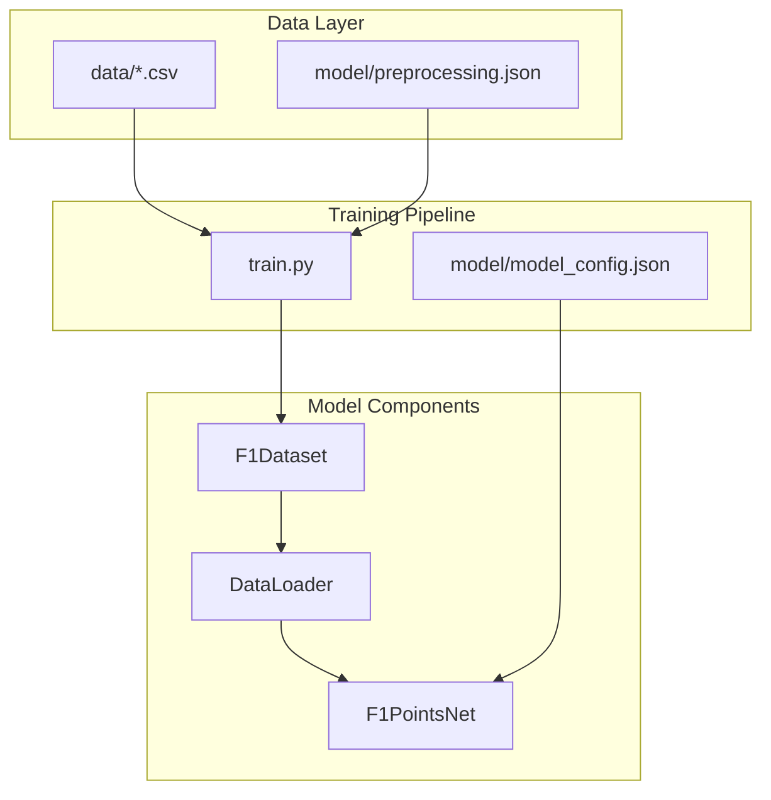
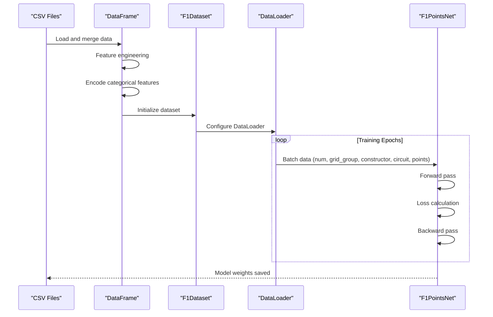
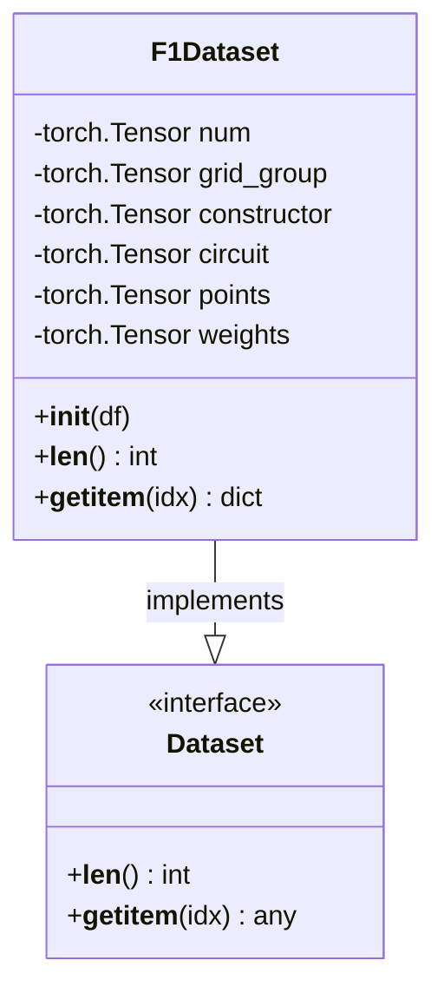
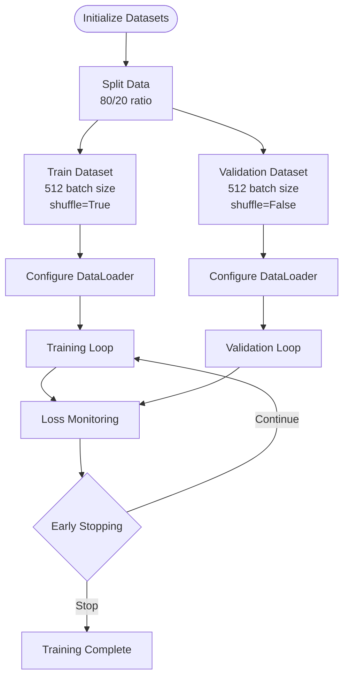
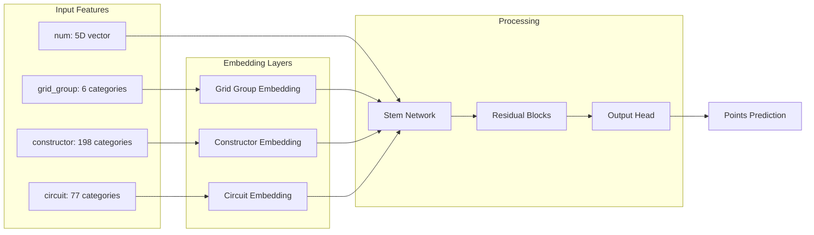
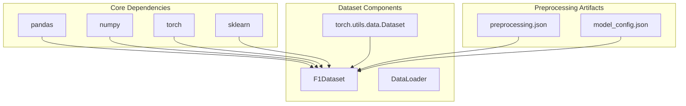

# Dataset and DataLoader

<cite>
**Referenced Files in This Document**
- [train.py](file://train.py)
- [preprocessing.json](file://model/preprocessing.json)
- [model_config.json](file://model/model_config.json)
</cite>

## Table of Contents
1. [Introduction](#introduction)
2. [Project Structure](#project-structure)
3. [Core Components](#core-components)
4. [Architecture Overview](#architecture-overview)
5. [Detailed Component Analysis](#detailed-component-analysis)
6. [Dependency Analysis](#dependency-analysis)
7. [Performance Considerations](#performance-considerations)
8. [Troubleshooting Guide](#troubleshooting-guide)
9. [Conclusion](#conclusion)

## Introduction
This document provides comprehensive documentation for the custom F1Dataset implementation and data loading mechanisms used in the F1 Points Prediction neural network. The implementation demonstrates a complete pipeline for preparing Formula 1 racing data, building a PyTorch Dataset, configuring DataLoaders, and training a deep learning model for points prediction.

The system processes historical F1 data to predict points awarded to drivers based on various factors including grid position, constructor performance, circuit characteristics, and temporal patterns. The dataset implementation showcases efficient tensor conversion, categorical encoding, and balanced sampling strategies.

## Project Structure
The project follows a clean separation of concerns with distinct modules for data processing, model definition, training, and evaluation:

**Diagram sources**
- [train.py:127-158](file://train.py#L127-L158)
- [preprocessing.json:1-1](file://model/preprocessing.json#L1-L1)
- [model_config.json:1-1](file://model/model_config.json#L1-L1)

**Section sources**
- [train.py:1-393](file://train.py#L1-L393)

## Core Components
The F1Dataset implementation consists of several key components that work together to provide efficient data loading for neural network training:

### F1Dataset Class Structure
The F1Dataset class implements the PyTorch Dataset interface with specialized tensor conversion and feature preparation:

- **Numerical Features**: Five normalized continuous variables including grid position, year, and historical averages
- **Categorical Features**: Encoded constructor and circuit identifiers
- **Ordinal Features**: Grid position grouping system
- **Target Variable**: Points scored (continuous target)
- **Sample Weights**: Balanced weighting for zero vs non-zero points

### Tensor Conversion Strategy
The dataset employs efficient NumPy-to-PyTorch conversion:
- Numerical features combined using column_stack for vectorized operations
- Categorical features converted to LongTensor for embedding layers
- Target variables stored as FloatTensor with explicit shape maintenance
- Sample weights computed using vectorized NumPy operations

### Data Indexing Implementation
The `__getitem__` method provides flexible indexing with dictionary-based returns, enabling batch processing while maintaining data integrity.

**Section sources**
- [train.py:127-148](file://train.py#L127-L148)

## Architecture Overview
The data loading architecture follows a structured pipeline from raw CSV data to trained model:

**Diagram sources**
- [train.py:19-41](file://train.py#L19-L41)
- [train.py:127-158](file://train.py#L127-L158)
- [train.py:254-309](file://train.py#L254-L309)

## Detailed Component Analysis

### F1Dataset Implementation
The F1Dataset class provides a complete PyTorch Dataset implementation with optimized tensor operations:

**Diagram sources**
- [train.py:127-148](file://train.py#L127-L148)

#### Tensor Conversion Details
The dataset performs vectorized tensor conversions for optimal performance:
- **Numerical Stack**: Uses `np.column_stack` to combine five normalized features efficiently
- **Categorical Encoding**: Converts encoded integers to LongTensor for embedding compatibility
- **Target Expansion**: Adds dimension to points tensor using `unsqueeze(1)`
- **Weight Calculation**: Vectorized conditional operation for sample balancing

#### Feature Preparation Pipeline
The dataset integrates preprocessed features from the training pipeline:
- Normalized continuous features: grid_norm, year_norm, constructor averages
- Categorical encodings: constructor_encoded, circuit_encoded
- Ordinal grouping: grid_group (6 categories)
- Target variable: points (continuous)

**Section sources**
- [train.py:127-148](file://train.py#L127-L148)

### DataLoader Configuration
The DataLoader setup demonstrates production-ready configuration:

**Diagram sources**
- [train.py:150-158](file://train.py#L150-L158)

#### Batch Size Strategy
- **Batch Size**: 512 samples per batch for efficient GPU utilization
- **Memory Efficiency**: Large batch size requires careful memory management
- **Training Stability**: Balances gradient computation accuracy with memory constraints

#### Shuffling Strategies
- **Training DataLoader**: Enabled shuffling for randomized batch composition
- **Validation DataLoader**: Disabled shuffling for reproducible evaluation
- **Random State**: Fixed seed ensures consistent train/validation splits

**Section sources**
- [train.py:150-158](file://train.py#L150-L158)

### Model Integration
The dataset seamlessly integrates with the F1PointsNet model:

**Diagram sources**
- [train.py:180-224](file://train.py#L180-L224)

**Section sources**
- [train.py:180-224](file://train.py#L180-L224)

## Dependency Analysis
The dataset implementation relies on several key dependencies and external libraries:

**Diagram sources**
- [train.py:1-10](file://train.py#L1-L10)
- [preprocessing.json:1-1](file://model/preprocessing.json#L1-L1)
- [model_config.json:1-1](file://model/model_config.json#L1-L1)

### External Dependencies
- **pandas**: Data manipulation and merging operations
- **numpy**: Efficient numerical computations and tensor conversions
- **torch**: PyTorch framework for neural networks and tensors
- **scikit-learn**: Train/validation split and preprocessing utilities

### Internal Dependencies
- **preprocessing.json**: Contains normalization statistics and label encoders
- **model_config.json**: Specifies model architecture parameters
- **F1Dataset**: Depends on preprocessing artifacts for proper feature scaling

**Section sources**
- [train.py:1-10](file://train.py#L1-L10)

## Performance Considerations

### Memory Management
The dataset implementation employs several strategies for efficient memory usage:

- **Vectorized Operations**: NumPy operations minimize Python overhead
- **In-place Conversions**: Direct tensor creation avoids intermediate copies
- **Batch Processing**: 512-sample batches balance throughput and memory
- **CPU Training**: Model runs on CPU to maximize memory availability

### Computational Efficiency
- **Column-wise Operations**: Efficient stacking of numerical features
- **Vectorized Weighting**: Single-line condition for sample balancing
- **Precomputed Statistics**: Normalization constants cached in JSON

### Scalability Factors
- **Dataset Size**: ~100,000+ samples require careful batching
- **Feature Dimensionality**: 5 numerical + 3 categorical features
- **Embedding Dimensions**: 32-dimensional embeddings for 198 constructors

## Troubleshooting Guide

### Common Issues and Solutions

#### Data Loading Problems
- **Missing Preprocessing Files**: Ensure `model/preprocessing.json` exists
- **Incorrect Column Names**: Verify feature engineering completed successfully
- **Memory Errors**: Reduce batch size if encountering OOM errors

#### Training Issues
- **NaN Loss Values**: Check for infinite values in normalized features
- **Slow Training**: Monitor batch processing time and adjust batch size
- **Overfitting**: Validate with separate test set and adjust regularization

#### Data Validation
- **Shape Mismatches**: Verify tensor shapes match model expectations
- **Index Errors**: Ensure proper indexing bounds checking
- **Type Conversions**: Confirm correct tensor types for each feature

**Section sources**
- [train.py:101-119](file://train.py#L101-L119)

## Conclusion
The F1Dataset implementation demonstrates a robust and efficient approach to building custom datasets for deep learning applications. The implementation successfully combines:

- **Efficient Tensor Operations**: Vectorized conversions and batch processing
- **Proper Data Preprocessing**: Normalization and encoding strategies
- **Balanced Sampling**: Weighted loss functions for imbalanced targets
- **Production-Ready Configuration**: Optimized DataLoader settings

The modular design allows for easy extension and modification while maintaining performance and reliability. The dataset serves as an excellent foundation for similar regression tasks requiring mixed-type feature processing and categorical encoding.

Key strengths include the comprehensive feature engineering pipeline, efficient memory management through vectorized operations, and thoughtful balancing of training dynamics through weighted loss functions. The implementation provides a solid template for similar sports analytics applications and machine learning projects requiring custom dataset implementations.