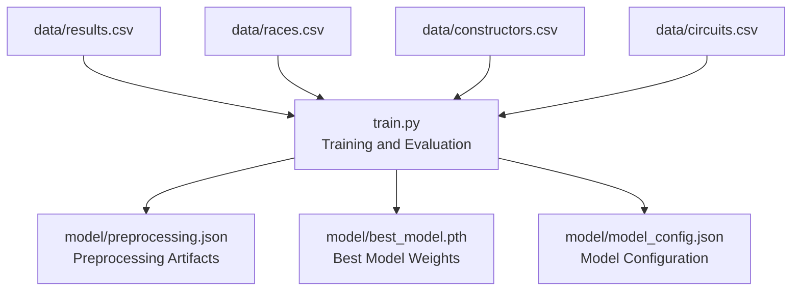
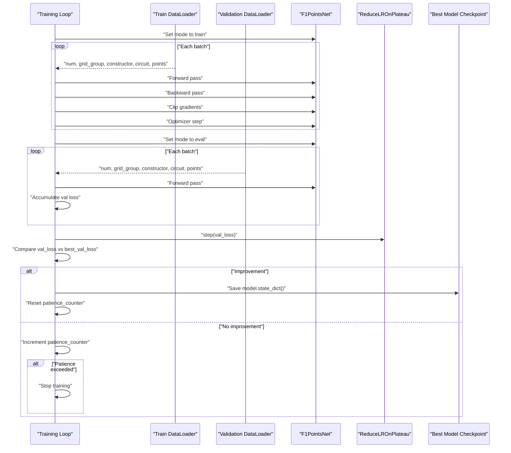
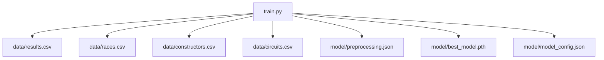

# Early Stopping and Training Control

<cite>
**Referenced Files in This Document**
- [train.py](file://train.py)
- [preprocessing.json](file://model/preprocessing.json)
</cite>

## Table of Contents
1. [Introduction](#introduction)
2. [Project Structure](#project-structure)
3. [Core Components](#core-components)
4. [Architecture Overview](#architecture-overview)
5. [Detailed Component Analysis](#detailed-component-analysis)
6. [Dependency Analysis](#dependency-analysis)
7. [Performance Considerations](#performance-considerations)
8. [Troubleshooting Guide](#troubleshooting-guide)
9. [Conclusion](#conclusion)

## Introduction
This document explains the early stopping mechanism and training control strategies used in the F1 points prediction model. It covers patience-based stopping criteria, validation loss monitoring, best model checkpointing, and the training loop structure including epoch management, loss accumulation, and performance evaluation. It also documents the model saving and loading process for best performing weights, provides examples of training progress logs, convergence analysis, and training duration optimization, and addresses common training issues such as overfitting, underfitting, and training instability with practical solutions.

## Project Structure
The project consists of:
- A training script that loads and preprocesses data, builds a neural network, trains the model with early stopping and learning rate scheduling, evaluates performance, and saves artifacts.
- A preprocessing artifact file containing encoder classes, normalization statistics, and counts for categorical features.
- A model directory intended for saving the best model weights and configuration.

**Diagram sources**
- [train.py:19-312](file://train.py#L19-L312)
- [preprocessing.json:1-1](file://model/preprocessing.json#L1-L1)

**Section sources**
- [train.py:19-312](file://train.py#L19-L312)
- [preprocessing.json:1-1](file://model/preprocessing.json#L1-L1)

## Core Components
- Dataset and DataLoader: The training and validation sets are constructed from preprocessed data and loaded via PyTorch DataLoader instances.
- Neural Network: A feedforward network with embeddings for categorical features and dense layers for numerical features.
- Training Loop: Epoch-based training with gradient accumulation, clipping, and validation loss computation.
- Early Stopping: Patience-based stopping triggered when validation loss does not improve for a fixed number of epochs.
- Learning Rate Scheduling: ReduceLROnPlateau reduces the learning rate when validation loss plateaus.
- Best Model Checkpointing: Saves the model weights when validation loss improves.
- Evaluation: Computes metrics and prints per-point accuracy breakdown.

**Section sources**
- [train.py:116-136](file://train.py#L116-L136)
- [train.py:141-173](file://train.py#L141-L173)
- [train.py:183-242](file://train.py#L183-L242)
- [train.py:244-312](file://train.py#L244-L312)

## Architecture Overview
The training pipeline follows a standard supervised learning workflow with explicit early stopping and checkpointing.

**Diagram sources**
- [train.py:197-242](file://train.py#L197-L242)

## Detailed Component Analysis

### Early Stopping Mechanism
- Patience-based stopping: The training stops if validation loss does not improve for a fixed number of consecutive epochs.
- Monitoring: Validation loss is computed at the end of each epoch.
- Trigger condition: If validation loss does not decrease, the patience counter increments; if it reaches the patience threshold, training terminates.
- Best model checkpointing: On each validation loss improvement, the current model weights are saved to disk.

Key implementation references:
- Initialization of best validation loss, patience counter, and patience threshold.
- Validation loss computation and comparison against best.
- Saving and loading of best model weights.

**Section sources**
- [train.py:187-192](file://train.py#L187-L192)
- [train.py:224-242](file://train.py#L224-L242)

### Validation Loss Monitoring and Learning Rate Scheduling
- Validation loss is computed over the validation set at the end of each epoch.
- ReduceLROnPlateau reduces the learning rate when validation loss plateaus for a given number of epochs.
- Logging: Training progress is printed periodically, including epoch number, training loss, validation loss, and current learning rate.

Key implementation references:
- Validation loop and loss accumulation.
- Scheduler step call with validation loss.
- Periodic logging of metrics.

**Section sources**
- [train.py:213-228](file://train.py#L213-L228)
- [train.py:184](file://train.py#L184)

### Best Model Checkpointing
- Checkpointing occurs when validation loss improves.
- The model’s state dictionary is saved to a persistent file.
- At the end of training, the best model weights are loaded back into memory for evaluation.

Key implementation references:
- Saving best model weights.
- Loading best model weights for evaluation.

**Section sources**
- [train.py:233-242](file://train.py#L233-L242)

### Training Loop Structure
- Epoch management: Iterates up to a maximum number of epochs.
- Loss accumulation: Tracks total training loss across batches and computes average per epoch.
- Gradient updates: Applies gradient clipping and optimizer steps during training.
- Evaluation: Runs a separate validation phase after each training epoch.

Key implementation references:
- Training loop with gradient accumulation and clipping.
- Validation loop with no gradient computation.
- Logging and early stopping checks.

**Section sources**
- [train.py:197-242](file://train.py#L197-L242)

### Model Saving and Loading Process
- Best model weights: Saved to a file path and later loaded for evaluation.
- Preprocessing artifacts: Saved to JSON for downstream inference.
- Model configuration: Saved to JSON for reproducibility.

Key implementation references:
- Saving best model weights.
- Loading best model weights.
- Saving preprocessing artifacts and model configuration.

**Section sources**
- [train.py:233-242](file://train.py#L233-L242)
- [train.py:107-108](file://train.py#L107-L108)
- [train.py:306-307](file://train.py#L306-L307)

### Training Progress Logs and Convergence Analysis
- Example log entries show epoch number, training loss, validation loss, and learning rate.
- Convergence analysis can be performed by observing the validation loss trend and patience counter behavior.

Example log entry references:
- Periodic printing of training progress including losses and learning rate.

**Section sources**
- [train.py:226-228](file://train.py#L226-L228)

### Training Duration Optimization
- Early stopping prevents unnecessary training beyond the optimal point.
- ReduceLROnPlateau adapts the learning rate to recover from plateaus, potentially accelerating convergence.
- Gradient clipping stabilizes updates and can prevent divergence.

Key implementation references:
- Early stopping and patience logic.
- Learning rate scheduling.
- Gradient norm clipping.

**Section sources**
- [train.py:189-192](file://train.py#L189-L192)
- [train.py:184](file://train.py#L184)
- [train.py:208](file://train.py#L208)

### Practical Solutions for Common Training Issues
- Overfitting:
  - Use dropout and batch normalization already present in the model.
  - Monitor validation loss and rely on early stopping to halt training when validation loss begins to rise.
  - Reduce model capacity or increase regularization if overfitting persists.
- Underfitting:
  - Increase model capacity or train for more epochs if validation loss still improves at a slow rate.
  - Adjust learning rate or reduce weight decay to allow larger steps.
- Training Instability:
  - Apply gradient clipping to bound gradients.
  - Reduce learning rate or enable learning rate scheduling.
  - Verify data normalization and label encoding consistency.

Key implementation references:
- Dropout and batch normalization in the model.
- Gradient clipping.
- ReduceLROnPlateau scheduling.

**Section sources**
- [train.py:150-163](file://train.py#L150-L163)
- [train.py:208](file://train.py#L208)
- [train.py:184](file://train.py#L184)

## Dependency Analysis
The training script orchestrates data loading, model construction, training, evaluation, and artifact saving. The preprocessing artifacts are consumed by downstream inference components.

**Diagram sources**
- [train.py:19-312](file://train.py#L19-L312)
- [preprocessing.json:1-1](file://model/preprocessing.json#L1-L1)

**Section sources**
- [train.py:19-312](file://train.py#L19-L312)
- [preprocessing.json:1-1](file://model/preprocessing.json#L1-L1)

## Performance Considerations
- Early stopping reduces training time by halting when validation loss stops improving.
- ReduceLROnPlateau helps escape local minima by decreasing the learning rate when progress stalls.
- Gradient clipping prevents exploding gradients and improves stability.
- Proper normalization and categorical encoding ensure consistent feature scaling and embedding initialization.

[No sources needed since this section provides general guidance]

## Troubleshooting Guide
- Validation loss increases while training continues:
  - Confirm early stopping is functioning and patience threshold is appropriate.
  - Consider reducing learning rate or enabling scheduled decay.
- Poor convergence:
  - Inspect periodic logs for consistent improvements in validation loss.
  - Adjust model capacity or regularization hyperparameters.
- Memory issues:
  - Verify batch sizes and device settings.
  - Ensure tensors are moved to the intended device before training.
- Artifact loading errors:
  - Ensure preprocessing artifacts and model weights are saved and loaded from the correct paths.

**Section sources**
- [train.py:189-192](file://train.py#L189-L192)
- [train.py:226-228](file://train.py#L226-L228)
- [train.py:233-242](file://train.py#L233-L242)

## Conclusion
The training pipeline implements robust early stopping with patience-based criteria, validation loss monitoring, and best model checkpointing. The training loop manages epochs, accumulates losses, and evaluates performance, while ReduceLROnPlateau and gradient clipping contribute to stable and efficient convergence. The model artifacts are saved for reproducible inference, and the evaluation metrics provide insights into prediction accuracy across point values.

[No sources needed since this section summarizes without analyzing specific files]