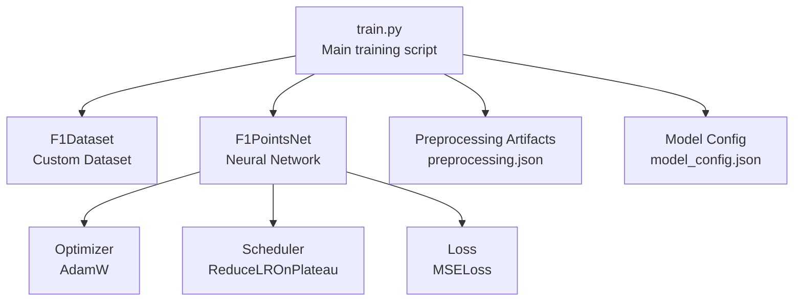
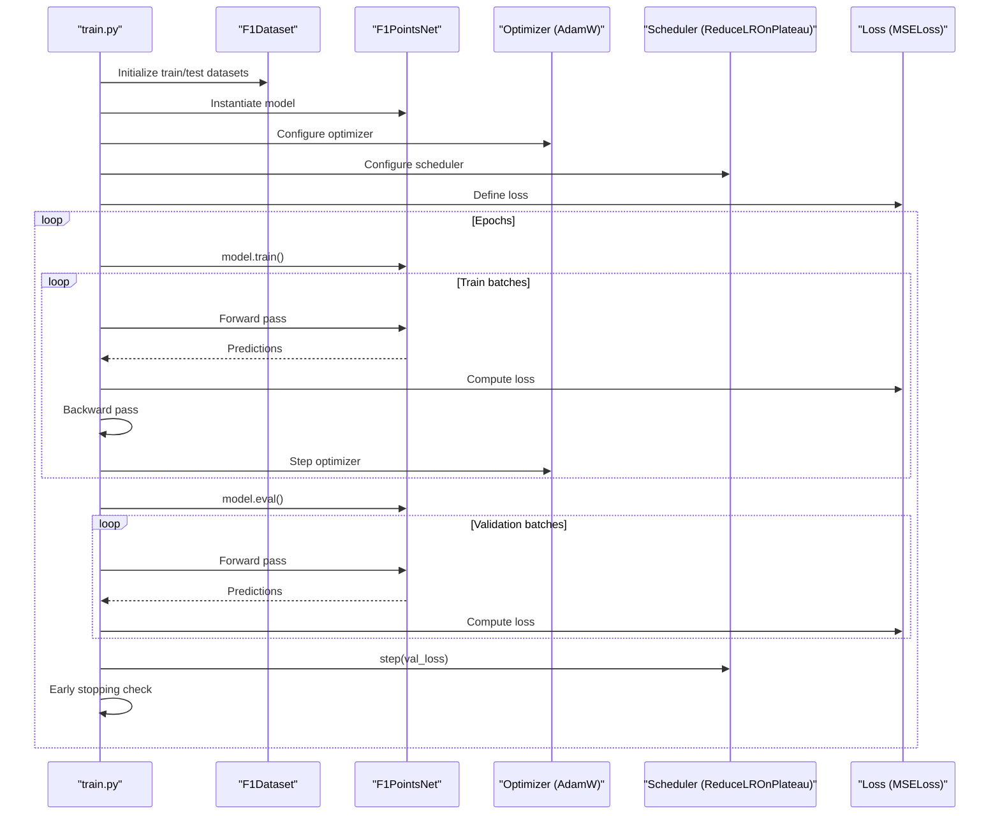
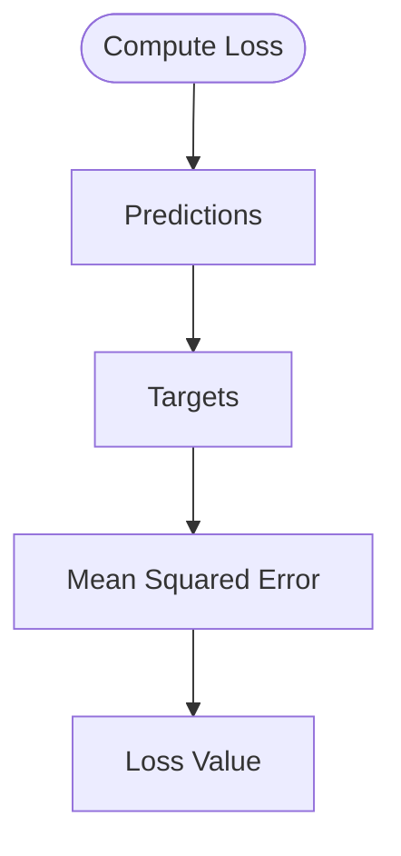
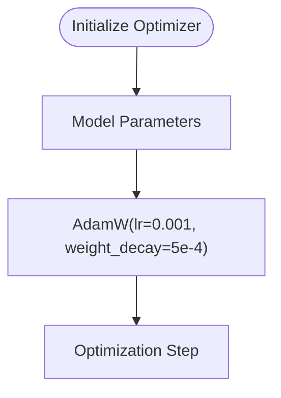
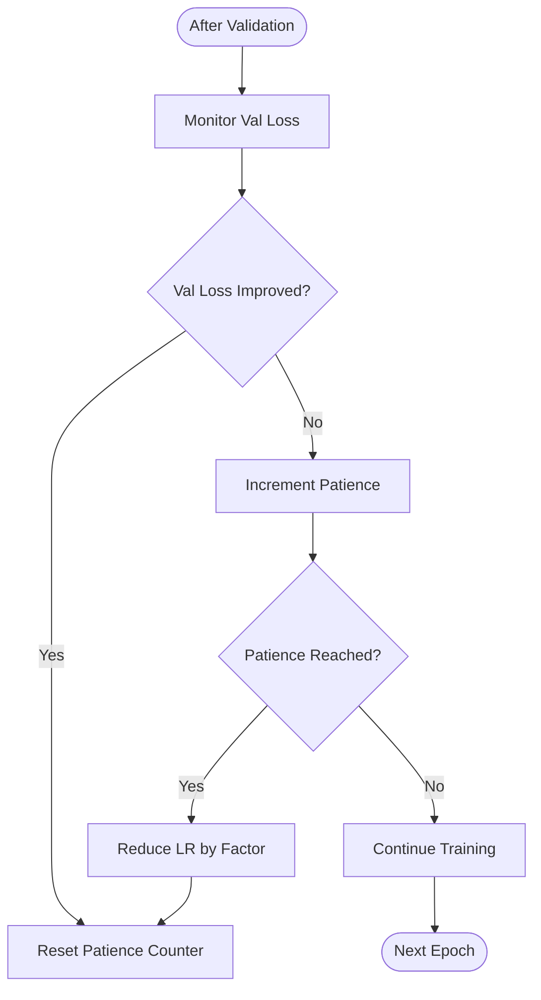
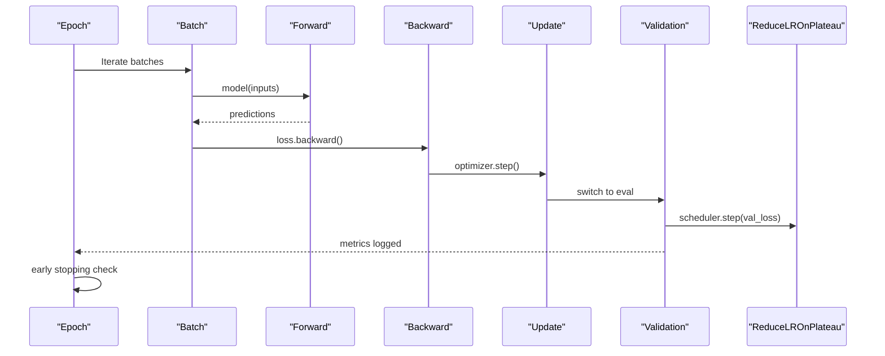
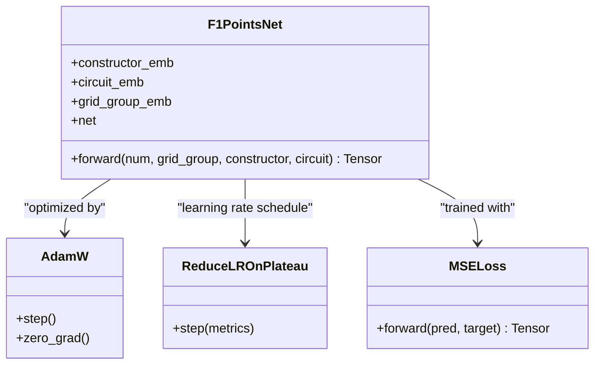
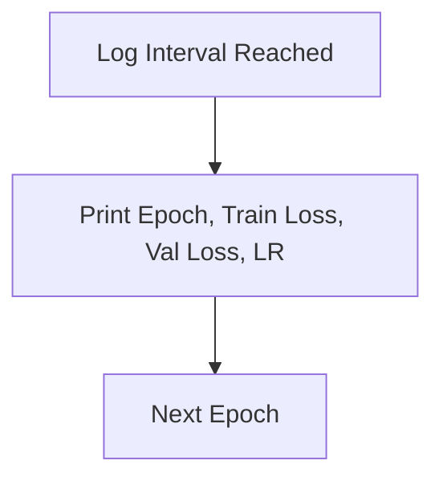
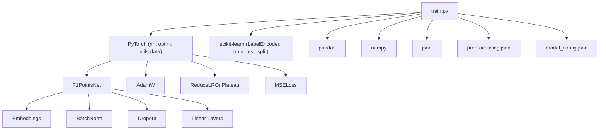

# Model Optimization

<cite>
**Referenced Files in This Document**
- [train.py](file://train.py)
- [preprocessing.json](file://model/preprocessing.json)
- [model_config.json](file://model/model_config.json)
</cite>

## Table of Contents
1. [Introduction](#introduction)
2. [Project Structure](#project-structure)
3. [Core Components](#core-components)
4. [Architecture Overview](#architecture-overview)
5. [Detailed Component Analysis](#detailed-component-analysis)
6. [Dependency Analysis](#dependency-analysis)
7. [Performance Considerations](#performance-considerations)
8. [Troubleshooting Guide](#troubleshooting-guide)
9. [Conclusion](#conclusion)

## Introduction
This document explains the model optimization setup used for training a neural network to predict Formula 1 race points. It covers the loss function selection, optimizer configuration, learning rate scheduling, and the training loop implementation. It also documents performance monitoring, early stopping, and regularization strategies designed to prevent overfitting.

## Project Structure
The training pipeline is implemented in a single script that orchestrates data loading, feature engineering, dataset preparation, model definition, training, evaluation, and artifact saving. Supporting artifacts include preprocessing metadata and model configuration.

**Diagram sources**
- [train.py:116-136](file://train.py#L116-L136)
- [train.py:141-172](file://train.py#L141-L172)
- [train.py:183-185](file://train.py#L183-L185)
- [preprocessing.json:1-1](file://model/preprocessing.json#L1-L1)
- [model_config.json:1-1](file://model/model_config.json#L1-L1)

**Section sources**
- [train.py:116-136](file://train.py#L116-L136)
- [train.py:141-172](file://train.py#L141-L172)
- [train.py:183-185](file://train.py#L183-L185)
- [preprocessing.json:1-1](file://model/preprocessing.json#L1-L1)
- [model_config.json:1-1](file://model/model_config.json#L1-L1)

## Core Components
- Loss function: Mean Squared Error (MSELoss) for regression prediction of continuous point values.
- Optimizer: AdamW with weight decay for stable optimization and implicit L2 regularization.
- Learning rate scheduler: ReduceLROnPlateau configured with patience and factor parameters.
- Training loop: Forward pass, loss computation, backward propagation, gradient clipping, optimizer step, and validation cycle with early stopping.
- Regularization: Dropout, Batch Normalization, gradient norm clipping, and early stopping.

**Section sources**
- [train.py:183-185](file://train.py#L183-L185)
- [train.py:197-242](file://train.py#L197-L242)

## Architecture Overview
The training architecture integrates data preparation, model definition, optimization, and evaluation into a cohesive pipeline. The model predicts continuous point values and is constrained to non-negative outputs.

**Diagram sources**
- [train.py:116-136](file://train.py#L116-L136)
- [train.py:141-172](file://train.py#L141-L172)
- [train.py:183-185](file://train.py#L183-L185)
- [train.py:197-242](file://train.py#L197-L242)

## Detailed Component Analysis

### Loss Function: Mean Squared Error (MSE)
- Purpose: Regression loss suitable for continuous target values (points).
- Behavior: Penalizes larger errors more heavily, encouraging precise numeric predictions.
- Implementation: Defined as the mean of squared differences between predicted and actual points.

**Diagram sources**
- [train.py:185](file://train.py#L185)
- [train.py:206](file://train.py#L206)
- [train.py:221](file://train.py#L221)

**Section sources**
- [train.py:185](file://train.py#L185)
- [train.py:206](file://train.py#L206)
- [train.py:221](file://train.py#L221)

### Optimizer: AdamW with Weight Decay
- Choice rationale: AdamW combines adaptive moment estimation with decoupled weight decay, providing robust convergence and improved generalization compared to vanilla Adam.
- Configuration: Learning rate set to a moderate value; weight decay controls L2 regularization strength.
- Impact: Helps stabilize training and reduce overfitting by penalizing large weights.

**Diagram sources**
- [train.py:183](file://train.py#L183)

**Section sources**
- [train.py:183](file://train.py#L183)

### Learning Rate Scheduler: ReduceLROnPlateau
- Purpose: Automatically reduces the learning rate when validation loss stops improving.
- Configuration:
  - Patience: Number of epochs with no improvement before reducing LR.
  - Factor: Multiplicative factor by which the learning rate is reduced.
- Effect: Encourages fine-tuning when progress stalls and helps escape poor local minima.

**Diagram sources**
- [train.py:184](file://train.py#L184)
- [train.py:224](file://train.py#L224)

**Section sources**
- [train.py:184](file://train.py#L184)
- [train.py:224](file://train.py#L224)

### Training Loop Implementation
- Forward Pass: Inputs are moved to device, model is called in train mode, and predictions are computed.
- Loss Computation: MSELoss compares predictions to targets.
- Backward Propagation: Gradients are computed via autograd.
- Gradient Clipping: Norm-based clipping prevents exploding gradients.
- Optimizer Step: Updates parameters using AdamW.
- Validation Cycle: Switches to eval mode, computes validation loss without gradients, and triggers scheduler step.
- Logging: Periodic reporting of epoch, train loss, val loss, and current learning rate.
- Early Stopping: Saves best model by validation loss and halts training after a fixed patience threshold.

**Diagram sources**
- [train.py:197-242](file://train.py#L197-L242)

**Section sources**
- [train.py:197-242](file://train.py#L197-L242)

### Model Architecture and Regularization
- Embeddings: Separate embeddings for constructors, circuits, and grid groups.
- Dense Layers: Multi-layer perceptron with batch normalization and GELU activation.
- Dropout: Applied at multiple layers to reduce overfitting.
- Output Clamping: Predictions are clamped to non-negative values to align with point semantics.
- Weight Decay: Provided by AdamW optimizer configuration.

**Diagram sources**
- [train.py:141-172](file://train.py#L141-L172)
- [train.py:183-185](file://train.py#L183-L185)

**Section sources**
- [train.py:141-172](file://train.py#L141-L172)
- [train.py:183-185](file://train.py#L183-L185)

### Performance Monitoring and Convergence Criteria
- Metrics: Train and validation loss tracked per epoch.
- Logging Frequency: Every 20 epochs plus initial epoch.
- Convergence Indicators:
  - Stable or decreasing validation loss.
  - Scheduler-triggered learning rate reduction.
  - Early stopping upon sustained lack of improvement.

**Diagram sources**
- [train.py:226-228](file://train.py#L226-L228)

**Section sources**
- [train.py:226-228](file://train.py#L226-L228)

### Overfitting Prevention and Regularization Strategies
- Dropout: Applied at multiple layers to randomly deactivate neurons during training.
- Batch Normalization: Normalizes activations to stabilize training.
- Gradient Clipping: Limits gradient magnitude to improve stability.
- Early Stopping: Halts training when validation loss does not improve for a fixed number of epochs.
- Weight Decay: Implicit L2 regularization via AdamW weight decay parameter.
- Output Clamping: Ensures non-negative predictions aligned with point semantics.

**Section sources**
- [train.py:150-163](file://train.py#L150-L163)
- [train.py:208](file://train.py#L208)
- [train.py:230-239](file://train.py#L230-L239)
- [train.py:183](file://train.py#L183)
- [train.py:172](file://train.py#L172)

## Dependency Analysis
The training script composes several PyTorch components and utilities. The model depends on embedding layers, dense layers, normalization, and dropout. The optimizer and scheduler depend on the model’s parameter groups. Preprocessing artifacts are used by downstream inference scripts.

**Diagram sources**
- [train.py:1-11](file://train.py#L1-L11)
- [train.py:141-172](file://train.py#L141-L172)
- [train.py:183-185](file://train.py#L183-L185)
- [preprocessing.json:1-1](file://model/preprocessing.json#L1-L1)
- [model_config.json:1-1](file://model/model_config.json#L1-L1)

**Section sources**
- [train.py:1-11](file://train.py#L1-L11)
- [train.py:141-172](file://train.py#L141-L172)
- [train.py:183-185](file://train.py#L183-L185)
- [preprocessing.json:1-1](file://model/preprocessing.json#L1-L1)
- [model_config.json:1-1](file://model/model_config.json#L1-L1)

## Performance Considerations
- Batch Sizes: Larger training batch size improves throughput; validation batch size balances speed and memory.
- Learning Rate: Moderate starting LR with scheduled decay often yields stable convergence.
- Gradient Clipping: Prevents unstable updates and improves robustness.
- Early Stopping Patience: Should be tuned to dataset size and noise level.
- Model Capacity: Balanced depth and width with sufficient regularization to avoid overfitting.

## Troubleshooting Guide
- Excessive Validation Loss Increase: Indicates potential overfitting; consider increasing dropout, adding more regularization, or reducing model capacity.
- Slow Convergence: Check learning rate and scheduler settings; ensure gradient clipping is active.
- Memory Issues: Reduce batch sizes or enable CPU-only device usage.
- NaN or Inf Loss: Verify input scaling and clamp outputs; inspect gradient norms.
- Poor Generalization: Evaluate feature engineering and ensure no data leakage; confirm early stopping thresholds.

## Conclusion
The optimization setup employs MSE loss, AdamW with weight decay, and ReduceLROnPlateau with carefully chosen patience and factor parameters. The training loop implements forward/backward passes, gradient clipping, and validation cycles with early stopping. Regularization through dropout, batch normalization, gradient clipping, and early stopping helps mitigate overfitting and achieve robust convergence.