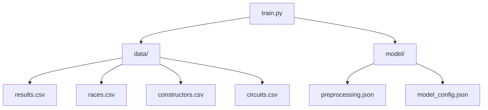
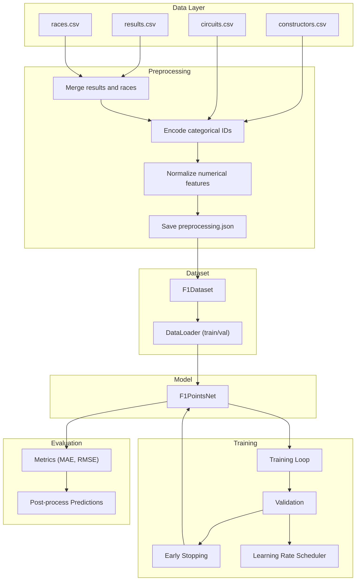
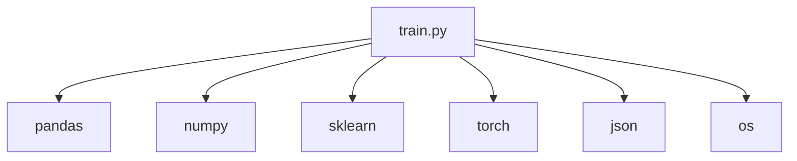

# Training Pipeline

<cite>
**Referenced Files in This Document**
- [train.py](file://train.py)
- [preprocessing.json](file://model/preprocessing.json)
- [model_config.json](file://model/model_config.json)
- [results.csv](file://data/results.csv)
- [races.csv](file://data/races.csv)
- [constructors.csv](file://data/constructors.csv)
- [circuits.csv](file://data/circuits.csv)
</cite>

## Table of Contents
1. [Introduction](#introduction)
2. [Project Structure](#project-structure)
3. [Core Components](#core-components)
4. [Architecture Overview](#architecture-overview)
5. [Detailed Component Analysis](#detailed-component-analysis)
6. [Dependency Analysis](#dependency-analysis)
7. [Performance Considerations](#performance-considerations)
8. [Troubleshooting Guide](#troubleshooting-guide)
9. [Conclusion](#conclusion)

## Introduction
This document describes the complete machine learning training pipeline for predicting Formula 1 points using neural networks. It covers the end-to-end workflow from raw data ingestion to model training, evaluation, and saving artifacts. The pipeline includes data loading and merging, preprocessing and encoding, dataset construction, model definition, training loop, validation, and post-processing of predictions.

## Project Structure
The repository follows a straightforward layout:
- data/: Contains CSV datasets used for training and validation
- model/: Stores preprocessing artifacts and model configuration
- train.py: Implements the full training pipeline

**Diagram sources**
- [train.py:19-22](file://train.py#L19-L22)
- [preprocessing.json:1-1](file://model/preprocessing.json#L1-L1)
- [model_config.json:1-1](file://model/model_config.json#L1-L1)

**Section sources**
- [train.py:19-22](file://train.py#L19-L22)
- [preprocessing.json:1-1](file://model/preprocessing.json#L1-L1)
- [model_config.json:1-1](file://model/model_config.json#L1-L1)

## Core Components
- Data Loading and Merging: Loads results, races, constructors, and circuits CSVs; merges to form a unified dataset with race year and circuit metadata.
- Preprocessing and Encoding: Applies label encoding to categorical IDs and normalization to numerical features; saves preprocessing artifacts for inference.
- Dataset and DataLoader: Defines a custom dataset and creates train/validation loaders with configurable batch size.
- Neural Network Model: Implements an embedding-based feedforward network for regression.
- Training Loop: Executes epochs with training and validation phases, logging metrics and applying early stopping.
- Evaluation and Post-processing: Computes metrics and rounds predictions to valid F1 points values.

**Section sources**
- [train.py:19-46](file://train.py#L19-L46)
- [train.py:48-86](file://train.py#L48-L86)
- [train.py:87-120](file://train.py#L87-L120)
- [train.py:121-167](file://train.py#L121-L167)
- [train.py:169-240](file://train.py#L169-L240)
- [train.py:241-306](file://train.py#L241-L306)

## Architecture Overview
The training pipeline is implemented as a single script with modular stages. The model is CPU-based and uses PyTorch tensors for computation. Artifacts for preprocessing and model configuration are persisted to disk for later use during inference.

**Diagram sources**
- [train.py:19-46](file://train.py#L19-L46)
- [train.py:48-86](file://train.py#L48-L86)
- [train.py:87-120](file://train.py#L87-L120)
- [train.py:121-167](file://train.py#L121-L167)
- [train.py:169-240](file://train.py#L169-L240)
- [train.py:241-306](file://train.py#L241-L306)

## Detailed Component Analysis

### Data Loading and Merging
- Loads results, races, constructors, and circuits CSVs.
- Merges results with races to attach year and circuitId.
- Selects relevant columns and filters invalid grid positions and missing target values.
- Converts types appropriately and prints descriptive statistics.

Key behaviors:
- Filters rows where grid equals zero and drops rows with missing points.
- Normalizes grid and year features using mean and std computed from training data.

**Section sources**
- [train.py:19-46](file://train.py#L19-L46)
- [results.csv:1-20](file://data/results.csv#L1-L20)
- [races.csv:1-20](file://data/races.csv#L1-L20)

### Preprocessing and Encoding
- Applies LabelEncoder to constructorId and circuitId to produce contiguous indices suitable for embedding layers.
- Saves preprocessing artifacts (encoder classes, normalization stats, counts) to model/preprocessing.json for inference reuse.
- Normalizes grid and year features using computed means and standard deviations.

Artifacts saved:
- constructor_classes, circuit_classes
- grid_mean, grid_std, year_mean, year_std
- n_constructors, n_circuits

**Section sources**
- [train.py:48-86](file://train.py#L48-L86)
- [preprocessing.json:1-1](file://model/preprocessing.json#L1-L1)

### Dataset and DataLoader
- Defines F1Dataset to convert selected DataFrame columns into PyTorch tensors.
- Splits data into train and validation sets with a fixed random seed.
- Creates DataLoader instances with batch_size=256, shuffle=True for training and shuffle=False for validation.

Batch composition:
- grid: normalized float tensor
- year: normalized float tensor
- constructor: long tensor (encoded constructor index)
- circuit: long tensor (encoded circuit index)
- points: float tensor (target)

**Section sources**
- [train.py:87-120](file://train.py#L87-L120)
- [F1Dataset:90-108](file://train.py#L90-L108)

### Neural Network Model
- F1PointsNet architecture:
  - Embedding layers for constructor and circuit with embed_dim=16.
  - Concatenates embeddings with normalized grid and year features.
  - Feedforward network with BatchNorm, ReLU, Dropout, and linear layers.
  - Clamps output to non-negative values to ensure valid point predictions.

Model configuration:
- Embedding dimension: 16
- Hidden dimension: 128
- Number of categories: n_constructors=198, n_circuits=77

**Section sources**
- [train.py:121-167](file://train.py#L121-L167)
- [model_config.json:1-1](file://model/model_config.json#L1-L1)

### Training Loop and Hyperparameters
- Loss function: Mean Squared Error (MSE).
- Optimizer: Adam with learning rate lr=0.001 and weight decay=1e-4.
- Learning rate scheduling: ReduceLROnPlateau with patience=10 and factor=0.5.
- Early stopping: Stops training if validation loss does not improve for patience=25 epochs.
- Training parameters:
  - n_epochs=150
  - batch_size=256
  - device=cpu

Training flow:
- model.train() during training batches; accumulates total training loss.
- model.eval() during validation; disables gradients; computes validation loss.
- scheduler.step(val_loss) after each epoch.
- Saves best model checkpoint when validation loss improves.

**Section sources**
- [train.py:169-240](file://train.py#L169-L240)

### Evaluation and Post-processing
- Evaluates on the validation set and collects predictions and targets.
- Computes MAE and RMSE on raw predictions.
- Rounds predictions to nearest valid F1 points values [0, 1, 2, 4, 6, 8, 10, 12, 15, 18, 25].
- Calculates exact match percentage after rounding.

**Section sources**
- [train.py:241-306](file://train.py#L241-L306)

## Dependency Analysis
The training script depends on:
- Pandas and NumPy for data manipulation and numerical operations.
- Scikit-learn for train_test_split and LabelEncoder.
- PyTorch for neural networks, optimizers, schedulers, and data loading.
- JSON for persisting preprocessing artifacts and model configuration.

**Diagram sources**
- [train.py:1-11](file://train.py#L1-L11)

**Section sources**
- [train.py:1-11](file://train.py#L1-L11)

## Performance Considerations
- Device: The model runs on CPU by default. For GPU acceleration, update the device assignment to CUDA and ensure GPU availability.
- Batch Size: Current batch size is 256. Larger batches can improve throughput but require more memory; smaller batches reduce memory usage at the cost of slower convergence.
- Data Types: Ensures proper casting to float32 and long tensors to minimize memory overhead.
- Gradient Computation: Uses torch.no_grad() during validation to disable autograd and save memory.
- Early Stopping: Prevents unnecessary training and reduces overfitting risk.
- Learning Rate Scheduling: ReduceLROnPlateau adapts learning rate based on validation performance.

[No sources needed since this section provides general guidance]

## Troubleshooting Guide
Common issues and resolutions:
- Memory errors during training:
  - Reduce batch_size or switch to CPU if GPU memory is insufficient.
  - Ensure torch.no_grad() is used during validation.
- Poor convergence:
  - Adjust learning rate or enable GPU training.
  - Verify label encoding and normalization steps are consistent between training and inference.
- Data mismatches:
  - Confirm preprocessing.json and model_config.json are present and match training-time artifacts.
  - Ensure constructorId and circuitId values fall within the expected ranges encoded during training.
- Output not in valid F1 points:
  - Post-processing rounds predictions to nearest valid values; verify the rounding function aligns with expected scoring.

**Section sources**
- [train.py:169-240](file://train.py#L169-L240)
- [train.py:241-306](file://train.py#L241-L306)

## Conclusion
This training pipeline provides a robust foundation for predicting Formula 1 points using embeddings for categorical features and a simple feedforward network. It includes preprocessing, validation, early stopping, and evaluation metrics. Extending the pipeline could involve GPU training, mixed precision, advanced schedulers, and distributed training strategies.