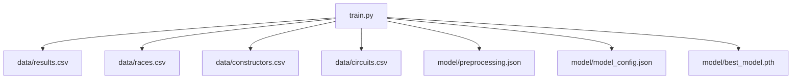
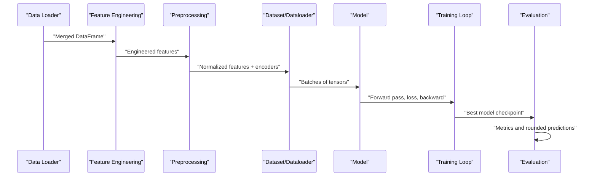
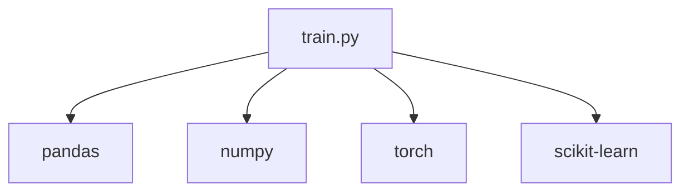

# Troubleshooting and FAQ

<cite>
**Referenced Files in This Document**
- [train.py](file://train.py)
- [preprocessing.json](file://model/preprocessing.json)
- [model_config.json](file://model/model_config.json)
</cite>

## Table of Contents
1. [Introduction](#introduction)
2. [Project Structure](#project-structure)
3. [Core Components](#core-components)
4. [Architecture Overview](#architecture-overview)
5. [Detailed Component Analysis](#detailed-component-analysis)
6. [Dependency Analysis](#dependency-analysis)
7. [Performance Considerations](#performance-considerations)
8. [Troubleshooting Guide](#troubleshooting-guide)
9. [Conclusion](#conclusion)
10. [Appendices](#appendices)

## Introduction
This document provides comprehensive troubleshooting guidance for the F1 Points Prediction neural network training pipeline. It focuses on diagnosing and resolving common issues such as data loading errors, memory-related problems during training, training convergence difficulties, and prediction accuracy concerns. It also covers performance optimization, environment-specific pitfalls, model stability, numerical stability, and frequently asked questions about installation, runtime errors, and configuration.

## Project Structure
The project consists of:
- A single training script that loads datasets, performs feature engineering, builds a neural network, trains the model, evaluates performance, and saves artifacts.
- A model directory containing preprocessing metadata and model configuration.

**Diagram sources**
- [train.py:19-22](file://train.py#L19-L22)
- [train.py:117-119](file://train.py#L117-L119)
- [train.py:380-388](file://train.py#L380-L388)
- [train.py:304](file://train.py#L304)

**Section sources**
- [train.py:19-22](file://train.py#L19-L22)
- [train.py:117-119](file://train.py#L117-L119)
- [train.py:380-388](file://train.py#L380-L388)
- [train.py:304](file://train.py#L304)

## Core Components
- Data loading and merging: Loads results, races, constructors, and circuits CSV files and merges them to build a unified dataset.
- Feature engineering: Computes constructor and circuit historical averages, creates grid position groups, and adds decade-based categorical features.
- Preprocessing: Normalizes numerical features and saves preprocessing artifacts.
- Dataset and dataloader: Implements a custom dataset and batching for training and validation.
- Neural network: Defines residual blocks and an embedding-based model with a head that clamps outputs to non-negative values.
- Training loop: Uses weighted MSE loss, gradient clipping, cosine annealing warm restarts learning rate scheduling, early stopping, and saves the best model.
- Evaluation: Computes metrics and rounds predictions to valid F1 point values.

Key implementation references:
- Data loading and merging: [train.py:19-25](file://train.py#L19-L25)
- Feature engineering: [train.py:48-84](file://train.py#L48-L84)
- Normalization and preprocessing artifacts: [train.py:101-119](file://train.py#L101-L119)
- Dataset and dataloader: [train.py:127-158](file://train.py#L127-L158)
- Model definition: [train.py:163-224](file://train.py#L163-L224)
- Training loop and early stopping: [train.py:254-313](file://train.py#L254-L313)
- Evaluation and rounding: [train.py:322-377](file://train.py#L322-L377)

**Section sources**
- [train.py:19-25](file://train.py#L19-L25)
- [train.py:48-84](file://train.py#L48-L84)
- [train.py:101-119](file://train.py#L101-L119)
- [train.py:127-158](file://train.py#L127-L158)
- [train.py:163-224](file://train.py#L163-L224)
- [train.py:254-313](file://train.py#L254-L313)
- [train.py:322-377](file://train.py#L322-L377)

## Architecture Overview
The training pipeline follows a standard machine learning workflow: load and merge data → feature engineering → normalization and save artifacts → dataset construction → model definition → training with early stopping → evaluation and metric reporting.

**Diagram sources**
- [train.py:19-25](file://train.py#L19-L25)
- [train.py:48-84](file://train.py#L48-L84)
- [train.py:101-119](file://train.py#L101-L119)
- [train.py:127-158](file://train.py#L127-L158)
- [train.py:254-313](file://train.py#L254-L313)
- [train.py:322-377](file://train.py#L322-L377)

## Detailed Component Analysis

### Data Loading and Merging
Common issues:
- Missing CSV files or incorrect paths.
- Schema mismatches between joined tables (e.g., raceId not present).
- Invalid grid positions or missing point values leading to unexpected filtering.

Debugging steps:
- Verify that data/results.csv, data/races.csv, data/constructors.csv, and data/circuits.csv exist and are readable.
- Confirm that raceId exists in results and races and that merging keys align.
- Inspect filtered rows after grid filtering and dropping NaN points.

Relevant references:
- [train.py:19-25](file://train.py#L19-L25)
- [train.py:27-29](file://train.py#L27-L29)

**Section sources**
- [train.py:19-25](file://train.py#L19-L25)
- [train.py:27-29](file://train.py#L27-L29)

### Feature Engineering
Common issues:
- Incorrect grouping thresholds for grid positions.
- Missing values in computed rolling averages causing unexpected NaN propagation.
- Inconsistent sorting order affecting expanding mean computations.

Debugging steps:
- Review grid grouping logic and adjust thresholds if needed.
- Ensure data is sorted by constructorId, year, and round before computing expanding means.
- Validate that computed averages fill appropriately for initial races.

Relevant references:
- [train.py:71-78](file://train.py#L71-L78)
- [train.py:50](file://train.py#L50)
- [train.py:53-62](file://train.py#L53-L62)
- [train.py:65-68](file://train.py#L65-L68)

**Section sources**
- [train.py:71-78](file://train.py#L71-L78)
- [train.py:50](file://train.py#L50)
- [train.py:53-62](file://train.py#L53-L62)
- [train.py:65-68](file://train.py#L65-L68)

### Preprocessing and Normalization
Common issues:
- Zero or near-zero standard deviations causing division by very small numbers.
- Mismatch between saved normalization statistics and new data.
- Encoder class mismatch between training and inference.

Debugging steps:
- Inspect normalization stats and handle zero std gracefully.
- Compare saved encoder classes with actual unique IDs in the dataset.
- Ensure preprocessing.json and model_config.json are generated and consistent.

Relevant references:
- [train.py:101-106](file://train.py#L101-L106)
- [train.py:109-119](file://train.py#L109-L119)
- [preprocessing.json:1-1](file://model/preprocessing.json#L1-L1)
- [model_config.json:1-1](file://model/model_config.json#L1-L1)

**Section sources**
- [train.py:101-106](file://train.py#L101-L106)
- [train.py:109-119](file://train.py#L109-L119)
- [preprocessing.json:1-1](file://model/preprocessing.json#L1-L1)
- [model_config.json:1-1](file://model/model_config.json#L1-L1)

### Dataset and Dataloader
Common issues:
- Shape mismatches between numerical and categorical tensors.
- Incorrect tensor types for embeddings.
- Batch size too large for available memory.

Debugging steps:
- Verify shapes of numerical and categorical tensors and ensure correct dtypes.
- Confirm embedding indices fit within vocabulary sizes.
- Reduce batch size if encountering out-of-memory errors.

Relevant references:
- [train.py:127-148](file://train.py#L127-L148)
- [train.py:157-158](file://train.py#L157-L158)

**Section sources**
- [train.py:127-148](file://train.py#L127-L148)
- [train.py:157-158](file://train.py#L157-L158)

### Model Definition and Forward Pass
Common issues:
- Embedding index out of bounds due to unseen categories.
- Output becoming negative despite clamping; check input ranges and gradients.
- Overfitting or underfitting due to insufficient capacity or regularization.

Debugging steps:
- Validate that constructor and circuit IDs are within the expected ranges.
- Monitor gradients and activation magnitudes during training.
- Adjust embedding dimensions, hidden dimensions, or regularization.

Relevant references:
- [train.py:180-224](file://train.py#L180-L224)
- [train.py:224](file://train.py#L224)

**Section sources**
- [train.py:180-224](file://train.py#L180-L224)
- [train.py:224](file://train.py#L224)

### Training Loop and Early Stopping
Common issues:
- Learning rate schedule not adapting to plateaued validation loss.
- Excessive patience leading to premature stopping.
- Gradient explosion or vanishing gradients.

Debugging steps:
- Inspect validation loss trends and adjust patience or learning rate schedule.
- Enable gradient norm clipping and monitor gradient norms.
- Consider reducing learning rate or adjusting weight decay.

Relevant references:
- [train.py:237-242](file://train.py#L237-L242)
- [train.py:254-313](file://train.py#L254-L313)
- [train.py:270](file://train.py#L270)

**Section sources**
- [train.py:237-242](file://train.py#L237-L242)
- [train.py:254-313](file://train.py#L254-L313)
- [train.py:270](file://train.py#L270)

### Evaluation and Metric Reporting
Common issues:
- Rounding to nearest valid F1 points yields unexpected distributions.
- Metrics skewed by extreme outliers or rare point values.

Debugging steps:
- Validate rounding logic and ensure valid_points covers expected outcomes.
- Analyze per-class accuracy and investigate imbalances.
- Consider alternative rounding strategies if needed.

Relevant references:
- [train.py:340-347](file://train.py#L340-L347)
- [train.py:349-368](file://train.py#L349-L368)

**Section sources**
- [train.py:340-347](file://train.py#L340-L347)
- [train.py:349-368](file://train.py#L349-L368)

## Dependency Analysis
The training script imports standard libraries and ML frameworks. Ensure the following packages are installed and compatible:
- pandas, numpy
- torch, torchvision
- scikit-learn

Potential conflicts:
- PyTorch version differences affecting tensor operations or optimizers.
- NumPy version compatibility with pandas operations.
- Scikit-learn version affecting LabelEncoder behavior.

Environment-specific issues:
- CUDA availability affects device selection; the current code runs on CPU.
- Virtual environment isolation prevents conflicting package versions.

**Diagram sources**
- [train.py:1-10](file://train.py#L1-L10)

**Section sources**
- [train.py:1-10](file://train.py#L1-L10)

## Performance Considerations
- Device utilization: The model currently runs on CPU. For GPU acceleration, update device selection and ensure CUDA-compatible drivers and PyTorch build.
- Batch size tuning: Large batches increase memory usage; reduce batch size if encountering out-of-memory errors.
- Gradient clipping: Already enabled; monitor gradient norms to ensure stability.
- Learning rate scheduling: CosineAnnealingWarmRestarts helps avoid local minima; adjust T_0 and T_mult if convergence stalls.
- Early stopping: Tune patience to balance overfitting prevention and training duration.

[No sources needed since this section provides general guidance]

## Troubleshooting Guide

### Data Loading Errors
Symptoms:
- FileNotFoundError for CSV files.
- KeyError due to missing raceId during merge.
- Unexpected filtering removing most rows.

Resolutions:
- Confirm data directory contains results.csv, races.csv, constructors.csv, circuits.csv.
- Validate that raceId exists in both results and races and that merging keys match.
- After filtering, inspect remaining rows and adjust thresholds if necessary.

References:
- [train.py:19-25](file://train.py#L19-L25)
- [train.py:27-29](file://train.py#L27-L29)

**Section sources**
- [train.py:19-25](file://train.py#L19-L25)
- [train.py:27-29](file://train.py#L27-L29)

### Memory Issues
Symptoms:
- Out-of-memory errors during training.
- Slow training due to excessive batch size.

Resolutions:
- Reduce DataLoader batch size.
- Disable shuffling temporarily to diagnose memory spikes.
- Move model to GPU if available; otherwise, optimize data types.

References:
- [train.py:157-158](file://train.py#L157-L158)

**Section sources**
- [train.py:157-158](file://train.py#L157-L158)

### Training Convergence Problems
Symptoms:
- Validation loss not decreasing or oscillating.
- Training loss remains high.
- Early stopping triggers prematurely.

Resolutions:
- Inspect learning rate schedule and reduce learning rate if stuck.
- Increase patience or adjust scheduler parameters.
- Add gradient norm monitoring and reduce learning rate if gradients explode.

References:
- [train.py:241-242](file://train.py#L241-L242)
- [train.py:254-313](file://train.py#L254-L313)
- [train.py:270](file://train.py#L270)

**Section sources**
- [train.py:241-242](file://train.py#L241-L242)
- [train.py:254-313](file://train.py#L254-L313)
- [train.py:270](file://train.py#L270)

### Prediction Accuracy Concerns
Symptoms:
- Predictions consistently outside valid F1 point values.
- Poor per-class accuracy for key point values.

Resolutions:
- Ensure rounding logic maps predictions to nearest valid F1 points.
- Investigate per-class accuracy and consider rebalancing or threshold adjustments.
- Validate that evaluation uses the saved best model checkpoint.

References:
- [train.py:340-347](file://train.py#L340-L347)
- [train.py:349-368](file://train.py#L349-L368)
- [train.py:312](file://train.py#L312)

**Section sources**
- [train.py:340-347](file://train.py#L340-L347)
- [train.py:349-368](file://train.py#L349-L368)
- [train.py:312](file://train.py#L312)

### Model Stability and Numerical Instabilities
Symptoms:
- Outputs become negative despite clamping.
- Exploding or vanishing gradients.

Resolutions:
- Verify input ranges and normalize numerical features carefully.
- Keep gradient norm clipping and monitor gradients.
- Consider lower learning rates or improved initialization.

References:
- [train.py:224](file://train.py#L224)
- [train.py:270](file://train.py#L270)

**Section sources**
- [train.py:224](file://train.py#L224)
- [train.py:270](file://train.py#L270)

### Data Quality Issues
Symptoms:
- Missing categorical IDs in test/inference data.
- Inconsistent label encoders between training and deployment.

Resolutions:
- Ensure preprocessing.json includes all expected constructor and circuit classes.
- Validate that model_config.json matches training hyperparameters.
- On inference, reconstruct encoders and normalization stats from saved artifacts.

References:
- [preprocessing.json:1-1](file://model/preprocessing.json#L1-L1)
- [model_config.json:1-1](file://model/model_config.json#L1-L1)

**Section sources**
- [preprocessing.json:1-1](file://model/preprocessing.json#L1-L1)
- [model_config.json:1-1](file://model/model_config.json#L1-L1)

### Environment and Installation Problems
Symptoms:
- ModuleNotFoundError for pandas/numpy/torch/sklearn.
- Runtime errors related to tensor operations or optimizer compatibility.

Resolutions:
- Install required packages in a clean virtual environment.
- Pin compatible versions of dependencies.
- Rebuild PyTorch with appropriate CUDA support if using GPU.

References:
- [train.py:1-10](file://train.py#L1-L10)

**Section sources**
- [train.py:1-10](file://train.py#L1-L10)

### Configuration Challenges
Symptoms:
- Mismatch between training and inference configurations.
- Incorrect embedding dimensions or hidden dimensions.

Resolutions:
- Use model/model_config.json to ensure consistent hyperparameters.
- Recreate preprocessing artifacts with the latest data to keep normalization stats current.

References:
- [train.py:380-388](file://train.py#L380-L388)
- [model_config.json:1-1](file://model/model_config.json#L1-L1)

**Section sources**
- [train.py:380-388](file://train.py#L380-L388)
- [model_config.json:1-1](file://model/model_config.json#L1-L1)

## Conclusion
This guide consolidates actionable troubleshooting steps for the F1 Points Prediction training pipeline. By systematically validating data integrity, normalizing features correctly, tuning training hyperparameters, and ensuring consistent preprocessing and model configurations, most issues can be resolved efficiently. Regular monitoring of metrics, gradient behavior, and artifact consistency will improve model stability and accuracy.

[No sources needed since this section summarizes without analyzing specific files]

## Appendices

### FAQ

Q1: How do I fix “FileNotFoundError” for CSV files?
- Ensure the data directory contains results.csv, races.csv, constructors.csv, and circuits.csv. Verify working directory and file paths.

Q2: Why does my model fail to load on GPU?
- The current code runs on CPU. Update device selection to CUDA if a compatible GPU and drivers are available.

Q3: How can I reduce memory usage during training?
- Lower the DataLoader batch size and disable shuffling temporarily to isolate memory spikes.

Q4: My validation loss does not improve—what should I check?
- Inspect learning rate schedule, consider reducing learning rate, and monitor gradient norms.

Q5: Predictions are outside valid F1 point values—how to fix?
- Ensure rounding logic maps to nearest valid points and validate evaluation uses the saved best model.

Q6: How do I ensure preprocessing consistency between training and inference?
- Use preprocessing.json and model_config.json to reconstruct encoders and normalization stats on inference.

[No sources needed since this section provides general guidance]